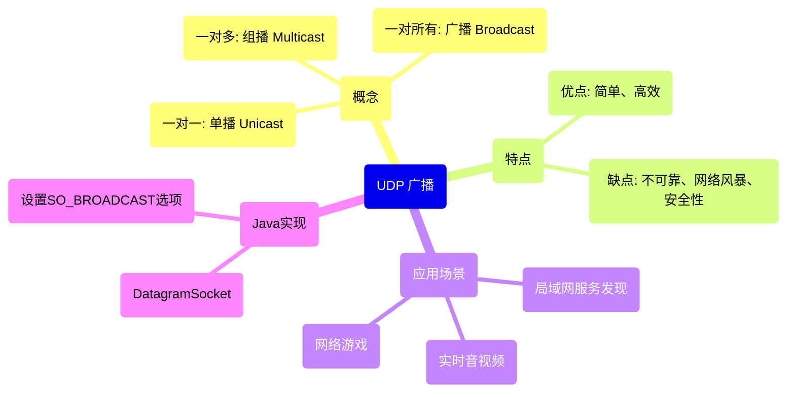

好的，没问题。作为你的Java后端导师，我将为你详细拆解并回答这份美团二面的面经。我会按照“**思维导图 -> 深度解析 -> 广度扩展 -> 面试话术 -> 实例代码**”的模式，帮你打造一份高质量的面试参考答案。

---

### 1. JDK 8 升级到 JDK 21 出现的问题

**💡 思维导图/核心思路：**
```mermaid
mindmap
  root(JDK 8 → JDK 21 升级问题)
    (移除的功能)
      ::icon(fa fa-exclamation-triangle)
      (JMC 不再捆绑)
      (Nashorn JavaScript 引擎)
      (Sun.misc.Unsafe 部分方法)
    (废弃的功能)
      ::icon(fa fa-flag)
      (安全管理器 Security Manager)
      (Applet API)
    (模块系统 (JPMS))
      ::icon(fa fa-puzzle-piece)
      (显式模块声明)
      (非法反射访问警告/错误)
    (行为变更)
      ::icon(fa fa-random)
      (GC 组合变更)
      (默认垃圾收集器变更)
      (UCD编码器行为)
    (新语言特性)
      ::icon(fa fa-magic)
      (密封类、Record等新关键字)
```

**📚 深度解析与广度扩展：**
这是一个考察你对Java生态和技术演进了解程度的经典问题。升级过程中的问题主要来自**已移除/废弃的功能**、**模块系统 (JPMS)** 和**运行时行为变更**。

1.  **模块系统 (JPMS - Java Platform Module System) - 最常见的问题源**
    *   **问题**： JDK 9引入的模块化系统，默认禁止程序访问内部API（如`sun.misc.*`）。许多老库（如一些字节码操作库、Spring/Lombok旧版本）通过“非法反射访问”来使用它们。在JDK 8上只有警告，但在高版本JDK（9+）上，默认会抛出`InaccessibleObjectException`。
    *   **解决方案**：
        *   **短期**： 使用启动参数`--add-opens`或`--add-exports`显式打开这些模块。例如，为解决Lombok问题：`--add-opens java.base/java.lang=ALL-UNNAMED`。
        *   **长期**： 升级相关库到支持JDK 21的版本，这是最根本的解决方案。

2.  **已移除的功能**
    *   **Nashorn JavaScript 引擎**： 如果你的项目中用到了`jjs`或`ScriptEngine`来执行JS代码，升级后需要迁移到GraalVM的JavaScript实现或其他引擎。
    *   **Java Mission Control (JMC)**： 不再随JDK捆绑，需要单独下载。

3.  **废弃的功能**
    *   **Security Manager**： 这是一个重大的弃用。如果你的应用（或使用的框架）依赖它做安全沙箱，需要寻找替代方案，因为它在未来版本中会被移除。

4.  **行为变更**
    *   **垃圾收集器 (GC)**：
        *   JDK 9默认GC改为G1。
        *   JDK 17弃用了`-XX:+UseConcMarkSweepGC`（CMS GC），JDK 21中已移除。
        *   JDK 21中将ZGC和Shenandoah设为生产就绪。
        *   **影响**： 升级后需要监控GC日志，可能需要重新调整GC参数（如`-Xmx`, `-XX:MaxGCPauseMillis`）以获得最佳性能。
    *   **默认源编码器**： 从JDK 18开始，`UTF-8`成为所有Java API的默认字符集，这可能影响文件读写等操作，如果之前系统默认编码不是UTF-8，可能会有乱码风险。

**🎙️ 面试话术：**
“面试官您好，关于JDK 8升级到21，我们团队在之前的技术预研中确实遇到过一些典型问题。最主要的是**模块化系统带来的非法反射访问问题**。比如我们项目里用了Lombok，在老版本JDK上运行正常，但在JDK 17+上启动就会报错，这是因为Lombok需要通过反射去修改字节码。我们的临时解决方案是在启动脚本中加入`--add-opens`参数来打开相应的模块。当然，长期来看，我们第一时间将Lombok升级到了最新版，从根源上解决了兼容性问题。

其次，我们也关注了**GC方面的变化**，JDK 21推荐使用ZGC来获得极低的停顿时间。我们从G1切换到ZGC后，通过GC日志确认了停顿时间确实有显著下降。另外，像Nashorn引擎这类已经被移除的功能，因为我们项目中没有使用，所以没有受到影响。总体而言，升级过程需要仔细阅读官方的发行说明，并对核心依赖库的兼容性进行充分评估和测试。”

---

### 2. UDP 广播

**💡 思维导图/核心思路：**


**📚 深度解析与广度扩展：**
广播（Broadcast）是UDP提供的一种一对所有的通信方式，数据包会被发送到同一广播域内的所有主机。

*   **优点**： 实现简单，无需维护组员关系。
*   **缺点**：
    1.  **不可靠**： 基于UDP，不保证送达和顺序。
    2.  **网络风暴**： 大量广播包会占用整个网络带宽，影响性能，因此在大型网络中路由器通常会隔离广播域。
    3.  **安全性**： 任何主机都可以接收，缺乏安全性。

**Java代码示例：**
```java
// 发送端 - 广播服务器
public class BroadcastSender {
    public static void main(String[] args) throws IOException {
        // 1. 创建DatagramSocket，无需绑定特定端口
        DatagramSocket socket = new DatagramSocket();
        // 2. 必须设置广播标志！
        socket.setBroadcast(true);

        String message = "Hello, Broadcast World!";
        InetAddress broadcastAddress = InetAddress.getByName("255.255.255.255"); // 有限广播地址
        // 或者使用子网定向广播地址，如：192.168.1.255

        byte[] buffer = message.getBytes();
        // 3. 构建目标地址为广播地址的数据包
        DatagramPacket packet = new DatagramPacket(buffer, buffer.length, broadcastAddress, 8888);

        // 4. 发送
        socket.send(packet);
        System.out.println("广播消息已发送: " + message);
        socket.close();
    }
}

// 接收端 - 客户端
public class BroadcastReceiver {
    public static void main(String[] args) throws IOException {
        // 1. 创建DatagramSocket并绑定到广播端口
        DatagramSocket socket = new DatagramSocket(8888);

        byte[] buffer = new byte[1024];
        DatagramPacket packet = new DatagramPacket(buffer, buffer.length);

        System.out.println("等待接收广播...");
        // 2. 阻塞等待接收数据
        socket.receive(packet);

        String received = new String(packet.getData(), 0, packet.getLength());
        System.out.println("接收到来自 " + packet.getAddress() + " 的广播消息: " + received);
        socket.close();
    }
}
```

**🎙️ 面试话术：**
“UDP广播是一种在局域网内一对所有的高效通信机制。它的优点是实现简单，比如常用于DHCP获取IP地址或者局域网服务发现。但它的缺点也很明显，就是不可靠且容易引起网络风暴。在实际生产中，我们更倾向于使用**UDP组播 (Multicast)**，因为它可以跨越路由器，并且只将数据发送给加入特定组播组的主机，能更好地控制网络流量。广播更多是用于一些非常轻量级且范围可控的局域网场景。”

---

### 3. 场景题：微博大V发帖用户量大咋优化

**💡 思维导图/核心思路：**
```mermaid
mindmap
  root(微博大V发帖优化)
    (核心挑战: 写扩散 vs 读扩散)
      (写扩散 (推模式))
        (优点: 读性能极佳)
        (缺点: 发帖时写压力巨大)
      (读扩散 (拉模式))
        (优点: 发帖轻松)
        (缺点: 读压力大，延迟高)
    (优化方案: 推拉结合)
      (在线粉丝: 推模式 - 写 inbox)
      (离线粉丝: 拉模式 - 异步聚合)
    (其他优化点)
      (缓存策略)
        (发帖: 异步写入MQ)
        (读帖: 多级缓存)
      (数据库优化)
        (分库分表)
        (读写分离)
      (流量削峰)
        (MQ消峰填谷)
```

**📚 深度解析与广度扩展：**
这是一个经典的“Feed流”设计问题，核心在于**推拉结合 (Hybrid)** 的模式。

1.  **推模式 (Write Fan-out / Push)**：
    *   **过程**： 大V发微博时，系统立即将这条微博写入他所有粉丝的“收件箱”（如一个Timeline表或缓存）。
    *   **优点**： 粉丝读取自己的时间线时非常快，一次查询即可，体验好。
    *   **缺点**： 大V发帖瞬间，如果粉丝量巨大（千万级），会导致海量的数据库写入操作，数据库压力极大，发帖延迟很高。

2.  **拉模式 (Read Fan-out / Pull)**：
    *   **过程**： 大V发微博时，只写入自己的微博表。粉丝读取时间线时，系统去查找所有关注人的微博，然后进行聚合、排序。
    *   **优点**： 发帖操作非常轻量，只写一次。
    *   **缺点**： 读操作是灾难性的，每个粉丝读Feed都需要巨大的查询和计算，延迟无法接受。

3.  **推拉结合模式 (Hybrid)** - **最优解**：
    *   将粉丝分为两类：
        *   **活跃/在线粉丝**： 采用**推模式**。大V发帖时，消息被放入消息队列（如Kafka）。消费者服务并行地将微博推送到这些活跃粉丝的收件箱（存储在Redis Sorted Set中，以发布时间为Score）。这样可以异步化，减轻瞬时压力。
        *   **非活跃/离线粉丝**： 采用**拉模式**。当他们下次登录时，系统再根据需要去拉取大V的微博，并与自己收件箱的内容进行合并。

**🎙️ 面试话术：**
“面试官您好，对于微博大V发帖这个高并发写的场景，我认为优化的核心思路是采用**推拉结合的模式**，而不是单纯的推或拉。

具体来说，我们会根据用户的活跃状态进行区分。对于**在线活跃的粉丝**，我们采用**推模式**。当大V发帖时，帖子内容先被快速写入消息队列（比如Kafka）中，然后由后端的消费者服务异步地、并行地推送到这些活跃粉丝的收件箱里，这个收件箱可以放在Redis等高性能缓存中，用Sorted Set结构存储以便按时间排序。这样就解决了直接写数据库带来的瞬时高压问题。

而对于**离线的粉丝**，则采用**拉模式**。他们登录时，系统再去拉取他们关注的大V在离线期间发布的内容，做一个合并。这样保证了发帖请求的快速响应，也保证了活跃用户读取Feed的实时性和性能。

此外，我们还会配套使用**数据库分库分表**、**读写分离**来提升存储能力，使用**多级缓存**来提升读性能，整个系统通过MQ进行解耦和削峰，形成一个稳健的高并发架构。”

---

### 4. 分布式事务

**💡 思维导图/核心思路：**
```mermaid
mindmap
  root(分布式事务)
    (强一致性方案)
      (XA协议 (2PC/3PC))
        (角色: AP/TM/RM)
        (阶段: 准备阶段、提交阶段)
        (缺点: 同步阻塞、性能差)
    (最终一致性方案 (主流))
      (TCC (Try-Confirm-Cancel))
        (优点: 性能好、可控性强)
        (缺点: 业务侵入性高、开发复杂)
      (可靠消息最终一致性 (MQ))
        (核心: 本地事务表 + 消息队列)
        (过程: 事务发起方 -> MQ -> 事务参与方)
      (Saga模式)
        (适用于长事务)
        (通过事件/命令协调)
```

**📚 深度解析与广度扩展：**
分布式事务是在微服务架构下保证数据一致性的难题。没有银弹，需要根据业务场景权衡。

1.  **2PC (两阶段提交)**：
    *   数据库层面的一致性方案，如JTA。TM（事务管理器）协调所有RM（资源管理器）。
    *   **阶段一（准备）**： TM询问所有RM“是否可以提交？”。RM执行事务，但不提交，并锁定资源，然后回复“Ready”。
    *   **阶段二（提交/回滚）**： 如果所有RM都回复“Ready”，TM发送提交命令；否则发送回滚命令。
    *   **缺点**： **同步阻塞**（资源在准备阶段后就锁定了）、**单点问题**（TM宕机导致资源一直锁定）、**数据不一致**（第二阶段部分参与者收不到命令）。

2.  **TCC (Try-Confirm-Cancel)** - **业务层面2PC**：
    *   将一个业务逻辑拆分为三个操作：
        *   **Try**： 资源检查与预留。例如，冻结账户中的资金，而不是直接扣款。
        *   **Confirm**： 确认执行。真正扣减Try阶段预留的资源。只要Try成功，Confirm必须成功。
        *   **Cancel**： 取消执行。释放Try阶段预留的资源。
    *   **优点**： 资源锁定时间短，性能比2PC好。
    *   **缺点**： 对业务侵入性强，需要为每个操作实现三个接口，开发复杂。

3.  **可靠消息最终一致性 (基于MQ)** - **最常用**：
    *   **核心**： 依靠消息队列的重试机制和事务消息来保证数据最终一致。
    *   **过程**（以阿里RocketMQ事务消息为例）：
        1.  生产者发送一个“半消息”到MQ，此消息对消费者不可见。
        2.  MQ回复“半消息”发送成功。
        3.  生产者执行本地事务（如扣减库存）。
        4.  根据本地事务执行结果，向MQ发送**Commit**或**Rollback**指令。
        5.  如果MQ收到Commit，则将“半消息”变为正式消息，供消费者消费；如果收到Rollback，则丢弃消息。
        6.  MQ提供**回查机制**：如果长时间没收到生产者的Commit/Rollback指令，会主动回查生产者本地事务的状态，据此决定消息的最终状态。
        7.  消费者消费消息，执行另一个本地事务（如更新订单状态）。如果失败，消息会重试投递。

**🎙️ 面试话术：**
“在分布式系统中，我们通常不会追求强一致性，而是采用最终一致性方案来平衡性能和一致性。在我们之前的项目中，最常用的是**基于消息队列的可靠消息最终一致性方案**。

比如在一个下单流程中，订单服务和库存服务是分开的。创建订单时，订单服务先向RocketMQ发送一个半事务消息，然后执行本地事务（生成订单，状态为‘待支付’）。如果本地事务成功，就通知MQ提交消息；如果失败，就回滚消息。库存服务会订阅这个消息，消费时执行扣减库存的操作。如果消费失败，MQ的重试机制会保证消息被再次投递，直到成功为止，这样就实现了最终一致性。

对于资金等要求强一致的场景，我们会考虑使用**TCC模式**，虽然开发复杂一些，但能保证更強的一致性。而像2PC/XA协议，因为性能瓶颈和复杂性，在实际的互联网业务中我们很少采用。”

---

### 5. 拥塞控制

**💡 思维导图/核心思路：**
```mermaid
mindmap
  root(TCP 拥塞控制)
    (目的: 避免网络过载，保证整体效率)
    (核心算法)
      (慢启动 (Slow Start))
        (cwnd指数增长)
      (拥塞避免 (Congestion Avoidance))
        (cwnd线性增长)
      (快重传 (Fast Retransmit))
        (收到3个重复ACK立即重传)
      (快恢复 (Fast Recovery))
        (cwnd减半，进入拥塞避免)
```

**📚 深度解析与广度扩展：**
拥塞控制是TCP为了防止网络过载而设计的一套机制。发送方维护一个**拥塞窗口 (cwnd)**，其大小代表了网络能承受的传输量。

1.  **慢启动 (Slow Start)**：
    *   连接开始时，cwnd = 1 MSS（最大报文段长度）。
    *   每收到一个ACK，cwnd就翻倍（指数增长）。
    *   直到cwnd超过**慢启动门限 (ssthresh)** 或发生网络拥塞（超时）。

2.  **拥塞避免 (Congestion Avoidance)**：
    *   当cwnd >= ssthresh时，进入拥塞避免阶段。
    *   每收到一个ACK，cwnd只增加 1/cwnd（线性增长），变得非常谨慎。

3.  **网络拥塞后的行为**：
    *   **发生超时 (Timeout)**： 认为网络非常拥堵。ssthresh设为当前cwnd的一半，cwnd被重置为1，重新开始慢启动。反应强烈。
    *   **收到3个重复ACK (Dup ACK)**： 认为只是丢失了个别包，网络可能还好。触发**快重传**和**快恢复**。
        *   **快重传 (Fast Retransmit)**： 收到3个Dup ACK后，立即重传对方期望的那个数据包，而不必等待超时。
        *   **快恢复 (Fast Recovery)**： ssthresh设为当前cwnd的一半，但cwnd不是重置为1，而是设为新的ssthresh（有的实现是ssthresh+3），然后直接进入**拥塞避免**阶段。这是对“超时”处理的一种优化，避免了连接吞吐量断崖式下跌。

**🎙️ 面试话术：**
“TCP的拥塞控制机制就像一个聪明的司机在拥堵的高速公路上开车。它主要通过**慢启动**、**拥塞避免**、**快重传**和**快恢复**四个算法来协同工作。

一开始连接建立，TCP会进入**慢启动**，拥塞窗口指数级扩大，相当于司机刚上高速猛踩油门。当窗口达到阈值后，进入**拥塞避免**，变为线性增加，相当于司机看到车流变大，开始轻踩油门，谨慎前行。

如果发生**超时**，TCP认为网络严重拥堵，会立刻把窗口降到最低，重启慢启动，相当于司机发现前面完全堵死，只好停车等待。而如果只是收到**3个重复ACK**，TCP会触发**快重传**立即重发数据，并进入**快恢复**阶段，窗口只降到之前的一半然后线性增长，这相当于司机只是看到旁边车道有点慢，稍微点下刹车就能继续行驶，避免了性能的剧烈抖动。这套机制很好地保证了网络整体的稳定和高效。”

---

### 6. 怎么去塞满元空间 (Metaspace)

**📚 深度解析与广度扩展：**
元空间（JDK 8+）取代了永久代（PermGen），它存储类的元数据（如类名、方法信息、字节码等）。塞满元空间通常意味着发生了**元空间内存泄漏**。

**方法：**
1.  **动态生成大量类**： 使用字节码技术（如CGLib、ASM、Javassist）在运行时不断创建新的类。
2.  **部署重复的类**： 在Tomcat等容器中，如果多个应用使用同一个库的不同版本，或者应用被重复热部署且旧类的加载器无法被GC，也会导致元空间膨胀。
3.  **不配置元空间大小**： 默认元空间只受本地内存限制，如果不使用`-XX:MaxMetaspaceSize`参数限制其上限，它会一直增长直到耗尽系统内存。

**Java代码示例 (使用CGLib)：**
```java
import net.sf.cglib.proxy.Enhancer;
import net.sf.cglib.proxy.MethodInterceptor;

public class MetaspaceOOMDemo {
    public static void main(String[] args) {
        // 模拟: 通过CGLib动态生成大量代理类，从而塞满元空间
        while (true) {
            Enhancer enhancer = new Enhancer();
            enhancer.setSuperclass(MetaspaceOOMDemo.class);
            enhancer.setUseCache(false); // 关键: 禁用缓存，否则只会生成一个代理类
            enhancer.setCallback((MethodInterceptor) (obj, method, args1, proxy) -> proxy.invokeSuper(obj, args1));
            enhancer.create(); // 创建代理类实例，其Class对象会被加载到元空间
        }
    }
}
// 运行参数: -XX:MaxMetaspaceSize=50m -XX:+PrintGCDetails
// 会很快抛出: java.lang.OutOfMemoryError: Metaspace
```

**🎙️ 面试话术：**
“要让元空间塞满，最常见的方法是在运行时**动态生成大量的类**。比如，我们可以用CGLib这样的字节码增强库，在循环中不断创建新的代理类，并且**关键是要关闭它的类缓存**，这样每次都会生成一个新的Class对象并加载到元空间中。如果不通过`-XX:MaxMetaspaceSize`参数限制元空间的上限，这些类会持续占用 native memory，最终导致`OutOfMemoryError: Metaspace`。

在实际生产中，这通常意味着发生了类加载器泄漏，比如在OSGi容器或者频繁热部署的Web容器（如Tomcat）中，如果一个应用被重新部署，但旧的类加载器因为某些静态引用无法被垃圾回收，那么它加载的所有类也就无法被卸载，元空间占用就会只增不减。我们的排查思路通常是使用`jstat -gc <pid>`监控元空间使用情况，或者用MAT等工具分析内存转储，找到残留的类加载器。”

---

### 7. Docker 细节

**💡 思维导图/核心思路：**
```mermaid
mindmark
  root(Docker 细节)
    (核心概念)
      (镜像 (Image): 只读模板)
      (容器 (Container): 镜像的运行实例)
      (仓库 (Registry): 存放镜像的地方)
    (实现原理)
      (Namespace: 资源隔离)
      (Cgroups: 资源限制)
      (Union File System: 分层镜像)
    (常用命令)
      (docker build/pull/run)
      (docker ps/logs/inspect)
    (Dockerfile)
      (FROM, COPY, RUN, CMD, ENTRYPOINT)
```

**📚 深度解析与广度扩展：**
面试官想考察你是否真正理解Docker的原理而不仅仅是会用命令。

1.  **Namespace (命名空间)**： 实现**隔离**的技术。Linux内核提供了UTS、IPC、PID、Network、Mount、User等Namespace，Docker利用它们让每个容器拥有独立的主机名、进程ID、网络栈、文件系统等，看起来像一个个独立的系统。
2.  **Cgroups (控制组)**： 实现**资源限制**的技术。它可以限制一个进程组使用的资源上限，包括CPU、内存、磁盘I/O、网络带宽等。防止某个容器耗尽宿主机的资源。
3.  **Union File System (联合文件系统)**： 实现**镜像分层**的技术。它允许将多个目录（称为层）挂载到同一个虚拟文件系统下。Docker镜像的每一层都是只读的，容器层在最上面，是可读写的。所有修改都发生在容器层，实现了写时复制（Copy-on-Write），这使得镜像非常轻量和高效。

**Dockerfile 示例：**
```dockerfile
# 基础镜像层
FROM openjdk:11-jre-slim

# 元数据层
LABEL maintainer="your.name@email.com"

# 构建上下文文件拷贝到镜像中
COPY target/my-app.jar /app/my-app.jar

# 声明运行时暴露的端口
EXPOSE 8080

# 设置环境变量
ENV JAVA_OPTS=""

# 指定容器启动命令 (容器进程)
ENTRYPOINT ["sh", "-c", "java $JAVA_OPTS -jar /app/my-app.jar"]
```

**🎙️ 面试话术：**
“Docker的核心是实现应用的**隔离**和**资源限制**。它底层依赖Linux的**Namespace**技术来实现环境隔离，比如让每个容器有自己的进程树(PID Namespace)和网络接口(Network Namespace)。同时，使用**Cgroups**来限制容器能使用的CPU和内存资源，避免了容器间的相互干扰。

另一个重要概念是**镜像分层**，它基于UnionFS实现。我们的镜像由一系列只读层组成，而容器是在镜像之上添加的一个可写层。当我们启动多个容器时，它们共享底层的只读镜像，这极大地节省了磁盘空间和加速了部署。通过`docker inspect`命令可以看到容器的分层信息以及Cgroups的配置细节，这对排查容器资源问题非常有帮助。”

---

### 8. 垃圾处理器 (Garbage Collector)

**💡 思维导图/核心思路：**
```mermaid
mindmap
  root(Java Garbage Collectors)
    (串行收集器)
      (Serial / Serial Old)
      (适用: 单CPU、Client模式、小堆)
    (并行收集器 (吞吐量优先))
      (Parallel Scavenge / Parallel Old)
      (适用: 多CPU、后台运算、科学计算)
    (并发收集器 (低延迟优先))
      (CMS (Concurrent Mark Sweep)) 
        (JDK9 deprecated, JDK14 removed)
      (G1 (Garbage-First)) 
        (JDK9+ 默认)
      (ZGC & Shenandoah (超低延迟))
        (目标: 停顿 < 10ms)
        (适用: 大堆内存应用)
```

**📚 深度解析与广度扩展：**
选择GC是在**吞吐量**和**延迟**之间做权衡。

*   **Serial GC**： 单线程，GC时会“Stop-The-World”，适用于几百MB的堆内存。
*   **Parallel GC (JDK 8默认)**： 多线程进行GC，追求高吞吐量（单位时间内处理更多的请求），但STW时间依然较长。
*   **CMS GC**： 目标是降低STW时间。它的大部分GC工作（标记）可以和应用程序线程并发执行。但会产生**内存碎片**，且在高并发下表现不佳，已被废弃。
*   **G1 GC (JDK 9+ 默认)**： 面向服务端，将堆划分为多个Region。采用**标记-整理**算法，避免了内存碎片。它可以预测停顿时间（`-XX:MaxGCPauseMillis`），在指定的时间内，优先回收垃圾最多的Region（Garbage-First名字由来）。
*   **ZGC / Shenandoah (JDK 11+)**： 革命性的GC，目标是将STW停顿时间控制在**10ms**以下，甚至不到1ms，适用于超大堆（TB级别）。它们使用了**染色指针**等黑科技，几乎全部GC过程都是并发的。

**🎙️ 面试话术：**
“垃圾收集器的选择取决于我们的应用需求。在JDK 8时代，我们如果追求吞吐量，会使用Parallel GC；如果追求低延迟，会选择CMS。但CMS有碎片化等问题。

从JDK 9开始，**G1成为了默认收集器**，它在延迟和吞吐量之间取得了很好的平衡，是我们目前线上服务的标配。对于超大规模、对延迟极其敏感的应用，比如金融交易系统，我们会考虑使用更前沿的**ZGC**，它能够将GC停顿时间稳定地控制在10毫秒以内，几乎对业务无感知。我们通过`-Xmx`设置堆大小，通过`-XX:+UseG1GC`或`-XX:+UseZGC`来选择收集器，并通过GC日志`-Xlog:gc*`来持续监控和调优性能。”

---

### 9. 咋用大模型的

**📚 深度解析与广度扩展：**
这个问题考察你的技术视野和学习能力。作为后端，我们通常不是去训练模型，而是**如何集成和调用大模型的API**来赋能业务。

**使用方式：**
1.  **API 调用**： 这是最直接的方式。后端服务通过HTTP请求调用OpenAI、文心一言、通义千问等提供的API。
2.  **提示词工程 (Prompt Engineering)**： 设计高质量的提示词（Prompt），让模型能更准确理解我们的意图，生成符合要求的文本、代码或数据。
3.  **Function Calling**： 一种更高级的API使用模式。让大模型根据用户请求，输出一个结构化的JSON对象，告诉我们的程序应该去调用哪个函数、参数是什么。我们的程序再根据这个结果去执行具体的业务逻辑（如查询数据库、调用外部API），最后把结果返回给模型或用户。这极大地增强了AI与现有系统的联动能力。
4.  **RAG (检索增强生成)**： 将大模型的外部知识与你私有的知识库（如公司文档、数据库）结合起来。用户提问时，先从你的知识库中检索相关文档片段，再连同问题和文档一起发给大模型，让它基于这些上下文生成更精准、更专业的回答。这是解决大模型“幻觉”和知识陈旧问题的有效手段。
5.  **微调 (Fine-Tuning)**： 使用自有数据对开源大模型（如LLaMA）进行微调，让它更擅长某个特定领域的任务。成本较高，但效果可能更好。

**Java代码示例 (调用OpenAI API)：**
```java
// 示例：使用Spring的WebClient调用OpenAI ChatCompletion API
public class OpenAIService {

    private final WebClient webClient;
    private final String apiKey;

    public OpenAIService(String apiKey) {
        this.apiKey = apiKey;
        this.webClient = WebClient.builder()
                .baseUrl("https://api.openai.com")
                .defaultHeader("Authorization", "Bearer " + apiKey)
                .build();
    }

    public String chat(String userMessage) {
        // 1. 构建请求体 (Prompt Engineering在这里体现)
        Map<String, Object> requestBody = Map.of(
                "model", "gpt-3.5-turbo",
                "messages", List.of(
                        Map.of("role", "system", "content", "你是一个有帮助的助手。"),
                        Map.of("role", "user", "content", userMessage)
                ),
                "max_tokens", 1000
        );

        // 2. 发送异步POST请求
        return webClient.post()
                .uri("/v1/chat/completions")
                .contentType(MediaType.APPLICATION_JSON)
                .bodyValue(requestBody)
                .retrieve()
                .bodyToMono(String.class) // 3. 接收响应
                .block(); // 4. 在实际应用中，为了性能，我们可能不会用block，而是返回Mono<String>
    }
}

// 使用
// OpenAIService service = new OpenAIService("your-api-key");
// String response = service.chat("请用Java写一个Hello World程序。");
// System.out.println(response);
```

**🎙️ 面试话术：**
“在我的个人学习和项目探索中，我主要通过**API集成**的方式来使用大模型。比如，我会用Java的HTTP客户端（如WebClient）去调用OpenAI或者国内大模型的API。

这不仅仅是简单的调用，更重要的是**提示词工程**。我需要精心设计Prompt，让模型能扮演特定的角色、遵循严格的输出格式，从而更好地为我的应用服务。例如，我可以让它将用户的自然语言查询转换成结构化的SQL查询条件。

更进一步，我了解到**Function Calling**和**RAG**这两种强大的模式。Function Calling可以让AI来决定调用我的后端哪个函数，从而实现更复杂的业务流程。而RAG则能结合我们内部的文档和知识库，让AI生成更专业、更准确的答案，避免‘胡说八道’。我认为作为后端工程师，我们的价值在于如何将这些AI能力稳定、高效、安全地集成到现有的系统中，并解决随之而来的性能、成本和安全问题。”

---

### 10. 手撕：合并两个有序数组

**📚 题目描述：**
给你两个按 **非递减顺序** 排列的整数数组 `nums1` 和 `nums2`，另有两个整数 `m` 和 `n` ，分别表示 `nums1` 和 `nums2` 中的元素数目。
请你 **合并** `nums2` 到 `nums1` 中，使合并后的数组同样按 **非递减顺序** 排列。
注意：最终，合并后数组不应由函数返回，而是存储在数组 `nums1` 中。为了应对这种情况，`nums1` 的初始长度为 `m + n`，其中前 `m` 个元素表示应合并的元素，后 `n` 个元素为 0，应忽略。`nums2` 的长度为 `n` 。

**💡 最优思路：**
**从后向前** 双指针遍历。
1.  因为 `nums1` 的后半部分是空的，我们可以从两个数组的**有效末尾**（即 `nums1[m-1]` 和 `nums2[n-1]`）开始比较。
2.  将较大的那个数，放到 `nums1` 的**最终末尾**（初始位置为 `m+n-1`）。
3.  这样避免了从前往后遍历需要挪动元素的麻烦，不会覆盖 `nums1` 中还未被比较的元素。**时间复杂度 O(m+n)**，**空间复杂度 O(1)**。

**Java代码实现 (带详细注释)：**
```java
class Solution {
    public void merge(int[] nums1, int m, int[] nums2, int n) {
        // 初始化三个指针：
        // i: 指向nums1有效元素的末尾 (m-1)
        // j: 指向nums2有效元素的末尾 (n-1)
        // k: 指向nums1最终结果的末尾 (m+n-1)
        int i = m - 1;
        int j = n - 1;
        int k = m + n - 1;

        // 从后向前遍历，直到其中一个数组被遍历完
        while (i >= 0 && j >= 0) {
            // 比较nums1和nums2当前指针所指的元素
            if (nums1[i] > nums2[j]) {
                // 如果nums1的元素更大，将其放到k位置
                nums1[k] = nums1[i];
                i--; // nums1指针前移
            } else {
                // 如果nums2的元素更大或相等，将nums2的元素放到k位置
                nums1[k] = nums2[j];
                j--; // nums2指针前移
            }
            k--; // 结果数组指针前移
        }

        // 如果nums2还有剩余元素（意味着这些元素都比nums1最小的还小）
        // 直接将它们拷贝到nums1的前面
        while (j >= 0) {
            nums1[k] = nums2[j];
            j--;
            k--;
        }
        // 如果nums1还有剩余元素，它们已经就在正确的位置了，无需操作。
    }
}
```

**🎙️ 面试话术：**
“这道题我的思路是使用**三指针法，从后往前进行合并**。因为nums1数组后面有足够的空间，这样做可以避免从前往后合并时需要额外移动元素的 overhead。

我定义三个指针：`i` 指向nums1的有效末尾，`j` 指向nums2的有效末尾，`k` 指向最终结果的末尾。然后比较`i`和`j`指针所指的元素，将较大的那个放入`k`的位置，然后相应的指针前移。这样一直循环直到其中一个数组遍历完。

最后，如果nums2还有剩余元素，说明这些都是最小的元素，直接按顺序拷贝到nums1的前端即可。这个算法的时间复杂度是O(m+n)，空间复杂度是O(1)，是最优的解法。”

---

希望这份详尽的解答能帮助你充分准备！祝你面试顺利，拿到心仪的Offer！
