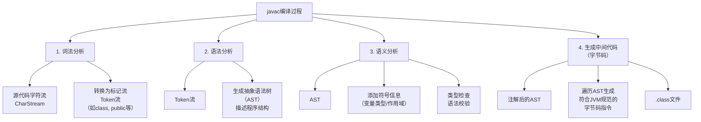
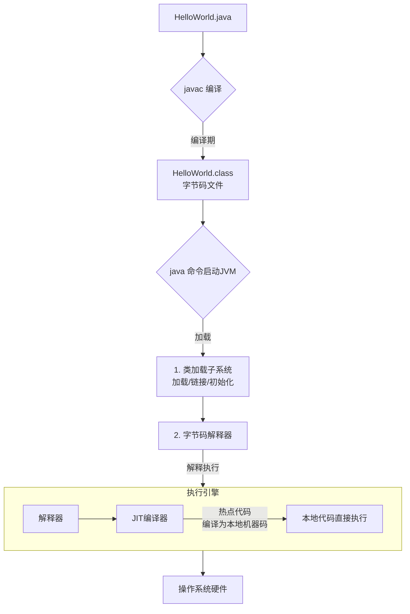
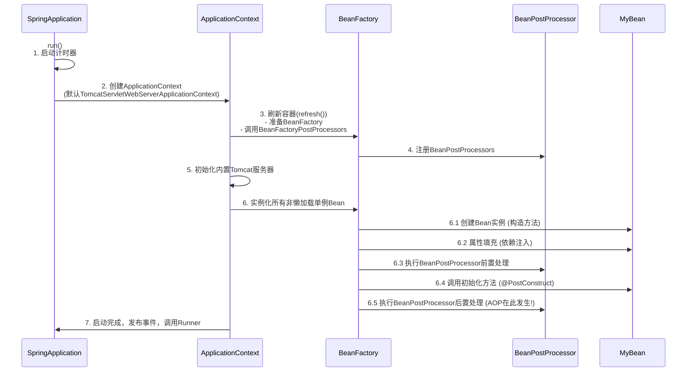
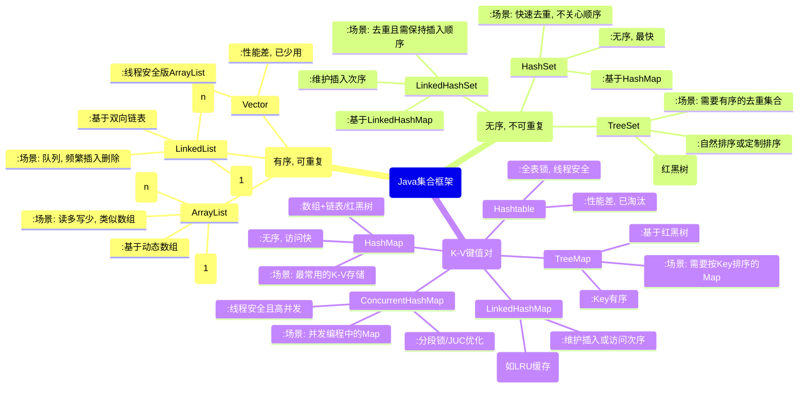

https://www.nowcoder.com/feed/main/detail/bfe321b71f5e4e0ca0aca7b0183f6543?sourceSSR=search


好的，同学。美团的这场面试考察点非常全面，从Java基础、JVM原理、Spring框架、数据结构、并发编程、SQL到算法乃至前沿的大模型知识都有涉及。这正是一线大厂的特点：**既要你有扎实的工程基础，又要你有快速学习新技术的能力**。

我们来逐一拆解和回答这些问题，我会按照你要求的模式，用“思路图+详细讲解+代码示例”的方式为你呈现。

---

### 3. 讲讲javac过程，结合编译原理的东西详细分析



**详细回答与扩展：**

面试官您好，`javac`的编译过程本质上遵循了现代编译器经典的“编译前端”设计，其目标是将符合Java语言规范的源代码转换成JVM能够理解的字节码指令。这个过程主要分为四个阶段：

1.  **词法分析 (Lexical Analysis)**：
    *   **任务**：将源代码的字符流（CharStream）转换为标记（Token）流。可以把它理解为“单词化”的过程。
    *   **实例**：比如遇到 `public class HelloWorld {`，词法分析器会识别出关键字 `public`、`class`，标识符 `HelloWorld`，以及分隔符 `{`，并为它们生成不同类型的Token。
    *   **编译原理术语**：由扫描器（Scanner）完成，使用有限状态机（Finite State Machine）的算法来识别Token。

2.  **语法分析 (Syntax Analysis)**：
    *   **任务**：根据Java语法规范（Grammar），将Token流组装成一棵抽象语法树（Abstract Syntax Tree, AST）。这棵树描述了程序的语法结构。
    *   **实例**：`int a = b + c;` 这行代码会被解析成一个根节点是“=”（赋值表达式），左子树是变量`a`，右子树是“+”（加法表达式），“+”的左右子树又是变量`b`和`c`。
    *   **编译原理术语**：由语法分析器（Parser）完成。如果Token序列不符合语法规则，就会抛出语法错误，比如缺少分号、括号不匹配等。

3.  **语义分析 (Semantic Analysis)**：
    *   **任务**：对AST进行上下文相关性的审查，确保程序在逻辑上是正确的。这是编译过程最复杂的一步。
    *   **主要工作**：
        *   **标注**：将变量、方法、类的类型等信息标注到AST对应的节点上。
        *   **权限检查**：比如检查是否访问了类的私有成员。
        *   **类型检查**：确保运算的类型是匹配的，比如 `int a = "hello";` 就会在这个阶段报错“不兼容的类型”。
    *   **编译原理术语**：由属性文法、符号表（Symbol Table）管理等技术实现。

4.  **生成字节码 (Code Generation)**：
    *   **任务**：遍历注解后的AST，生成符合JVM规范的字节码文件（.class文件）。
    *   **实例**：JVM的操作是基于栈的，所以 `b + c` 会被转换成几条指令：将变量b的值压入操作数栈（`iload_1`），将变量c的值压入操作数栈（`iload_2`），执行加法指令（`iadd`），最后将栈顶的结果弹出并赋值给a（`istore_0`）。
    *   **编译原理术语**：属于编译后端，但JVM的字节码仍然是中间表示（Intermediate Representation, IR），并非最终的机器码。

**面试话术点睛**：“面试官，我认为`javac`是一个相对‘保守’的编译器，它只做了少量确保程序正确的编译期优化（如常量折叠 `final int a = 10 + 20;`），而将大量的性能优化工作留给了JIT编译器在运行时进行，这是一种非常聪明的设计哲学。”

---

### 4. 讲讲你写的一个java代码跑起来的过程，例如编译运行和解释运行



**详细回答与扩展：**

面试官您好，我写的一个Java程序，例如`HelloWorld.java`，从源代码到运行出结果，主要经历了“编译”和“运行”两个大阶段，而运行阶段又体现了Java“半编译半解释”的特点。

1.  **编译期 (Compile Time)**：
    *   我们使用 `javac HelloWorld.java` 命令。
    *   正如上一题所讲，`javac`编译器会完成词法、语法、语义分析，最终将源代码编译成与平台无关的字节码（Bytecode）文件 `HelloWorld.class`。字节码不是任何特定CPU的机器码，它是JVM的指令集。

2.  **运行期 (Runtime)** - **JVM负责**：
    *   我们使用 `java HelloWorld` 命令。这条命令会启动一个Java虚拟机（JVM）进程。
    *   **步骤一：类加载（Loading）**：JVM的类加载子系统（ClassLoader）会从磁盘、网络或其他来源找到`HelloWorld.class`文件，并将其二进制数据读入JVM内存的方法区（Metaspace）。同时在堆区创建一个代表这个类的`java.lang.Class`对象，作为方法区数据的访问入口。
    *   **步骤二：链接（Linking）**：包含验证（确保字节码安全合法）、准备（为类静态变量分配内存并赋默认值，如`int`默认为0）、解析（将符号引用转换为直接引用）三个阶段。
    *   **步骤三：初始化（Initialization）**：执行类构造器`<clinit>()`方法，为类的静态变量赋予程序中指定的初始值（如 `static int a = 100;`），并执行静态代码块。
    *   **步骤四：解释执行（Interpretation）**：JVM的**解释器（Interpreter）** 逐条读取字节码文件中的指令，将其“翻译”成当前宿主机的本地机器码（Native Code）并执行。这个过程是“读一条，翻译一条，执行一条”，启动快但执行慢。
    *   **步骤五：即时编译（JIT Compilation）** - **性能提升的关键**：JVM会监控方法的执行频率。如果一个方法或代码块被频繁执行（称为“热点代码”），**即时编译器（Just-In-Time Compiler, JIT）** 就会介入，将整段热点代码的字节码一次性**编译成本地机器码**，并缓存起来（这个区域叫Code Cache）。下次再执行这段代码时，就直接执行优化后的本地机器码，无需再解释，极大提升了运行效率。HotSpot VM的名字正来源于此。

**面试话术点睛**：“所以，Java程序的运行是‘半编译半解释’的，并且结合了‘解释执行’的高启动速度和‘JIT编译执行’的高运行期性能，这是一种很好的权衡（Trade-off）。现代JVM（如HotSpot）的JIT技术非常强大，会进行逃逸分析、方法内联等深度优化，其性能在很多场景下已经堪比C++。”

---

### 5. 面向对象的几个特性和举例子说明

```mermaid
mindmap
root((面向对象特性))
    封装(封装 (Encapsulation))
      :隐藏内部实现细节
      :对外提供访问接口
      :例子: POJO类与Getter/Setter
    继承(继承 (Inheritance))
      :子类继承父类特征和行为
      :实现代码复用, 扩展功能
      :例子: Manager extends Employee
    多态(多态 (Polymorphism))
      :同一行为具有不同表现形式
        (编译时多态 (重载))
        (运行时多态 (重写))
      :例子: 方法重载; 接口指向实现类
    抽象(抽象 (Abstraction))
      :提取关键特征, 忽略不重要细节
      :核心思想: 关注是什么, 而不是怎么做
      :例子: 抽象类与接口
```

**详细回答与扩展：**

面试官您好，面向对象编程（OOP）有四大基本特性，我结合例子说一下我的理解。

1.  **封装 (Encapsulation)**：
    *   **核心思想**：将对象的属性和实现细节隐藏起来，仅对外提供公共的访问方式（通常是方法）。控制外部对内部状态的访问权限，保证了数据的安全性和系统的可维护性。
    *   **例子**：我们定义一个`Person`类，将`name`和`age`属性设置为`private`。外部代码不能直接 `p.age = -100;`（因为这不合法）。我们必须通过公共的`setAge(int age)`方法来进行修改，在这个方法里我们可以加入逻辑验证，比如 if (age > 0 && age < 150) this.age = age;`。
    *   **Java实现**：通过`private`, `protected`, `public`等访问修饰符来实现。

2.  **继承 (Inheritance)**：
    *   **核心思想**：允许一个新类（子类/派生类）继承现有类（父类/基类）的特征和行为。子类会自动拥有父类的非私有属性和方法，从而实现代码的复用和扩展。
    *   **例子**：我们有一个`Employee`（员工）类，它有`name`、`salary`属性和`work()`方法。现在我们需要一个`Manager`（经理）类，经理也是员工，但有额外的`bonus`（奖金）属性和`manage()`方法。我们可以让`Manager extends Employee`，这样`Manager`就复用了`Employee`的代码，只需专注于扩展新功能。
    *   **注意**：Java是单继承，一个类只能有一个直接父类。

3.  **多态 (Polymorphism)**：
    *   **核心思想**：同一操作作用于不同的对象，可以有不同的解释，产生不同的执行结果。主要分为编译时多态（重载）和运行时多态（重写）。
    *   **运行时多态（重写）例子**：这是OOP最精髓的部分。我们有一个父类`Animal`有`makeSound()`方法，子类`Dog`和`Cat`分别重写（Override）了这个方法。
        ```java
        Animal animal1 = new Dog(); // 父类引用指向子类对象
        Animal animal2 = new Cat();

        animal1.makeSound(); // 输出 "Woof!" (实际调用的是Dog类的方法)
        animal2.makeSound(); // 输出 "Meow!" (实际调用的是Cat类的方法)
        ```
        在编译时，`animal1.makeSound()`被认为是`Animal`的方法。但在运行时，JVM会根据`animal1`实际指向的对象类型（`Dog`）来调用对应的方法。这使得程序非常灵活和可扩展。
    *   **编译时多态（重载）例子**：在同一个类中，多个同名方法根据参数列表的不同（类型、数量、顺序）而共存。`System.out.println()`可以打印整数、字符串、对象等，就是因为有多个重载的`println`方法。

4.  **抽象 (Abstraction)**：
    *   **核心思想**：只关注对象的核心属性和行为，而忽略其非本质的细节。简单说就是“关注是什么（what），而不是怎么做（how）”。
    *   **例子**：`JDBC`就是最好的例子。我们写Java代码时，只需要关心`Connection`、`Statement`、`ResultSet`这些接口（抽象），而不用关心底层数据库到底是MySQL、Oracle还是PostgreSQL（具体实现）。驱动厂商会提供这些接口的具体实现类（JDBC Driver）。
    *   **Java实现**：主要通过**接口（Interface）** 和**抽象类（Abstract Class）** 来实现。接口定义“能做什么”，抽象类可以定义部分“怎么做”。

**面试话术点睛**：“我认为这四个特性最终都是为了实现一个核心目标：**高内聚、低耦合**。封装让类的内部更内聚；继承和多态建立了类与类之间清晰的层次和协作关系，降低了耦合；而抽象则是定义耦合契约的关键手段，是设计模式和应用框架的基础。”

---

### 6. SpringBoot容器启动过程



**详细回答与扩展：**

面试官您好，SpringBoot的启动过程看似简单，只是一个`SpringApplication.run()`，但其内部是一个非常复杂和精致的流程，核心是**初始化IoC容器，并刷新它**。这个过程在Spring中称为`refresh()`。

1.  **启动准备与上下文创建**：
    *   `SpringApplication.run()`方法会创建一个`SpringApplication`实例，并进行一些准备工作，比如推断应用类型（Web/非Web）、初始化应用上下文初始化器（ApplicationContextInitializer）和监听器（ApplicationListener）。
    *   随后，它会**创建并刷新一个`ApplicationContext`**（应用上下文，即IoC容器）。对于Web应用，默认是`AnnotationConfigServletWebServerApplicationContext`。

2.  **容器的刷新（`refresh()`方法）** - **最核心的步骤**：
    这是一个模板方法，定义了容器启动的完整流程，其中关键步骤包括：
    *   `prepareRefresh()`：准备工作，如设置启动时间、激活环境配置文件（`application.properties`）。
    *   `obtainFreshBeanFactory()`：获取一个纯净的`BeanFactory`（Bean工厂，是容器的底层核心）。
    *   `prepareBeanFactory(beanFactory)`：配置BeanFactory的标准上下文特性，如设置类加载器、注册几个内置的`BeanPostProcessor`。
    *   `postProcessBeanFactory(beanFactory)`：这是一个空方法，子类可以重写，用于在Bean定义加载完成后、Bean实例化之前，对BeanFactory进行后置处理。
    *   `invokeBeanFactoryPostProcessors(beanFactory)`：**非常重要！** 实例化并调用所有`BeanFactoryPostProcessor`。这些处理器可以修改Bean的定义（BeanDefinition）。**我们的`@Configuration`、`@ComponentScan`、`@PropertySource`等注解就是在这一步被解析的**，它们会扫描指定路径，将符合条件的类解析为BeanDefinition并注册到BeanFactory中。
    *   `registerBeanPostProcessors(beanFactory)`：注册所有的`BeanPostProcessor`。这些处理器会在Bean**实例化**的各个阶段进行干预。**AOP、`@Autowired`、`@PostConstruct`等功能都是通过内置的BeanPostProcessor实现的**。
    *   `initMessageSource()`：初始化国际化相关功能。
    *   `onRefresh()`：一个模板方法，子类可以在此初始化特殊的Bean。对于SpringBoot Web应用，**这一步会创建内嵌的Web服务器（如Tomcat、Jetty）**。
    *   `registerListeners()`：注册监听器。
    *   `finishBeanFactoryInitialization(beanFactory)`：**另一个核心步骤！** 初始化所有剩余的非懒加载单例Bean。容器会根据BeanDefinition，通过反射创建Bean实例，并解决其依赖关系（依赖注入），然后执行初始化回调（如`@PostConstruct`），最后应用BeanPostProcessor进行后置处理（AOP代理就在此时生成）。至此，所有单例Bean都被创建并放入单例池中。
    *   `finishRefresh()`：完成刷新过程，发布上下文刷新完成事件，启动完成。同时也会启动Web服务器。

**面试话术点睛**：“SpringBoot通过自动配置（`@EnableAutoConfiguration`）极大地简化了传统的Spring应用配置。其核心原理是`spring-boot-autoconfigure`jar包下的`META-INF/spring.factories`文件，它定义了大量`AutoConfiguration`类。这些类通过`@Conditional`系列注解（如`@ConditionalOnClass`）进行条件判断，只有在类路径下存在特定类时，对应的配置（如DataSource、MVC）才会生效，从而实现‘智能’的‘约定大于配置’。”

---

### 7. 讲讲list，map，set几种基本数据结构和使用场景



**详细回答与扩展：**

面试官您好，`List`, `Map`, `Set`是Java集合框架中最核心的三个接口，它们分别用于存储不同特性的数据。

1.  **List (列表)**：
    *   **特点**：**有序（Ordered）、可重复（Allow duplicates）、有索引**。
    *   **实现类与场景**：
        *   **`ArrayList`**：底层是**动态数组**。因为它有索引，所以**随机访问（get/set）效率极高，时间复杂度是O(1)**。但在列表中间**插入或删除元素需要移动后续所有元素，效率较低，是O(n)**。
            *   **使用场景**：**读多写少**的场景，例如存储需要频繁通过索引访问的数据集合。
        *   **`LinkedList`**：底层是**双向链表**。**在链表头尾进行插入和删除操作非常高效，时间复杂度是O(1)**。但**随机访问性能差，需要从头遍历，是O(n)**。
            *   **使用场景**：**写多读少**，特别是需要频繁在头部和尾部进行操作的场景。它同样实现了`Deque`接口，可以作为队列（Queue）或栈（Stack）来使用。
        *   **`Vector`**：一个古老的、线程安全的动态数组实现。通过在方法上添加`synchronized`关键字实现同步，**性能较差，现在基本已被`Collections.synchronizedList`或`CopyOnWriteArrayList`替代**。

2.  **Set (集合)**：
    *   **特点**：**不允许重复元素（Unique），最多包含一个null元素**。`Set`其实就是`Map`的马甲（大部分Set的实现都是基于一个相同特性的Map，元素作为Map的Key）。
    *   **实现类与场景**：
        *   **`HashSet`**：基于`HashMap`实现。**性能最好，元素是无序的**。判断元素是否存在的效率很高（O(1)）。
            *   **使用场景**：**快速去重**，并且不关心元素顺序的场景。
        *   **`LinkedHashSet`**：基于`LinkedHashMap`实现。**除了保证元素唯一性，还维护了元素的插入顺序（或访问顺序）**。
            *   **使用场景**：既需要去重，又需要保持元素插入顺序的场景。
        *   **`TreeSet`**：基于`TreeMap`（红黑树）实现。**元素会自动根据自然顺序或提供的Comparator进行排序**。增删查的时间复杂度是O(log n)。
            *   **使用场景**：**需要得到一个去重且有序**的元素集合。

3.  **Map (映射)**：
    *   **特点**：存储**键值对（Key-Value pairs）**，Key不允许重复，Value可以重复。
    *   **实现类与场景**：
        *   **`HashMap`**：**最常用的Map**。基于数组+链表/红黑树（JDK8后，链表过长会树化）。**允许null键和null值，元素无序**。在理想情况下，get和put操作的时间复杂度是O(1)。
            *   **使用场景**：**绝大多数K-V存储场景**。如果需要线程安全，请使用`ConcurrentHashMap`。
        *   **`LinkedHashMap`**：是`HashMap`的子类。**维护着一个运行于所有条目的双向链表，从而保证了元素的迭代顺序（可以是插入顺序或访问顺序-LRU）**。
            *   **使用场景**：**需要保持元素put进去的顺序，或者用来实现LRU缓存**。
        *   **`TreeMap`**：基于**红黑树**实现。**Key是有序的**（自然顺序或定制顺序）。增删查的时间复杂度是O(log n)。
            *   **使用场景**：**需要根据Key进行排序**的场景。
        *   **`ConcurrentHashMap`**：**高并发环境下首选的线程安全Map**。在JDK8中，它放弃了分段锁，转而采用`synchronized` + `CAS`对单个数组元素（桶）进行加锁，大大提高了并发度。
            *   **使用场景**：**任何并发编程中需要K-V存储的场景**。性能远优于古老的`Hashtable`。

---

### 8. 假如你用一个arraylist，你已经知道里面会存1w条数据了，那该怎么办

**回答：**

面试官您好，这是一个非常经典的性能优化问题。如果我已经预先知道一个`ArrayList`将会存储大约10000条数据，那么我**一定会使用它的带参构造器，在创建时就指定一个足够的初始容量（initial capacity）**。

**原因与分析：**
`ArrayList`的底层是一个动态数组。如果我们使用无参构造器，它会默认创建一个容量非常小（通常是10）的空数组。当我们不断调用`add()`方法添加元素时，一旦当前数组被填满，它就会触发一次昂贵的**扩容（resize）操作**。扩容的逻辑大致是：创建一个原数组1.5倍大小的新数组，然后将旧数组的所有数据拷贝到新数组中。如果我们要添加10000个元素，这个扩容过程会发生多次（大约14次），每次拷贝的数据量会越来越大，造成大量的性能开销和内存碎片。

**解决方案与代码：**
```java
// 不好的做法：默认初始化，会导致多次扩容
List<Object> list1 = new ArrayList<>(); // 初始容量10

// 好的做法：根据业务预估，指定初始容量
int estimatedSize = 10000;
List<Object> list2 = new ArrayList<>(estimatedSize); // 初始容量10000
```
通过`new ArrayList<>(10000)`，我们一次性分配了足够容纳10000个元素的数组空间。在添加前10000个元素的过程中，完全不会发生任何扩容和数组拷贝操作，性能得到极大提升。

**面试话术点睛**：“这是一个‘防患于未然’的优化思路。虽然不这样做程序也能正常运行，但在高性能要求的场景下，这种不必要的开销是可以且应该避免的。这体现了我们对底层实现原理的理解，也是编程中一种良好的习惯。”

---

### 9. collections下的加锁和数据结构本身例如chw的加锁操作有什么区别

**回答：**

面试官您好，`Collections.synchronizedList()`和`CopyOnWriteArrayList`（CHW）虽然都是提供线程安全的List，但它们的实现原理和适用场景有巨大差异，可以概括为 **“粗粒度锁” vs “写时复制”**。

1.  **`Collections.synchronizedList(List<T> list)`**：
    *   **实现原理**：这是一个**装饰器模式**的应用。它接收一个普通的List（如ArrayList），然后返回一个包装后的线程安全List。这个包装类**在所有方法上使用`synchronized`关键字进行同步，锁的是这个包装对象本身（this）**。
    *   **特点**：这是一个**非常粗粒度的锁**。无论是读、写还是迭代操作，都需要获取同一把锁。在高并发环境下，即使多个线程只是想并发读，也会被阻塞，**性能是很大的瓶颈**。
    *   **代码示例**：
        ```java
        List<String> syncList = Collections.synchronizedList(new ArrayList<>());
        // 所有操作都是线程安全的，但并发性能差
        syncList.add("item");
        String item = syncList.get(0);
        ```

2.  **`CopyOnWriteArrayList` (CHW)**：
    *   **实现原理**：它采用了一种“**写时复制（Copy-On-Write）**”的思想。
        *   **读操作**：**完全无锁**。所有读操作（get、遍历）都是基于当前不变的数组快照进行的，性能极高且安全。
        *   **写操作**（add, set, remove）：首先会**加锁（ReentrantLock）**，然后**将底层数组完整地拷贝一份**，在新的数组上进行修改操作。修改完成后，再将新的数组引用指向旧的变量，最后释放锁。
    *   **特点**：**读写分离，读操作极致快，写操作代价高昂**（因为要拷贝整个数组）。它保证了最终一致性，但读到的数据可能是旧的快照。
    *   **适用场景**：**非常适合读多写极少**的场景，比如事件监听器的列表、黑名单/白名单等。如果写操作非常频繁，CHW会因为频繁拷贝数组而导致性能急剧下降且内存占用大。

**对比总结：**

| 特性 | `Collections.synchronizedList()` | `CopyOnWriteArrayList` |
| :--- | :--- | :--- |
| **锁粒度** | 粗粒度，整个对象锁 | 写操作加锁，读操作无锁 |
| **读写性能** | 读写都阻塞，并发性能差 | **读极快，写慢** |
| **实现原理** | 方法同步（synchronized） | 写时复制（ReentrantLock） |
| **迭代器** | 迭代时需要手动同步，否则会 fail-fast | 使用快照，弱一致性，不会抛异常 |
| **适用场景** | 写操作较多，或并发竞争不激烈的场景 | **读多写极少**的场景 |

**面试话术点睛**：“所以，在选择线程安全容器时，我们一定要根据具体的业务场景，是‘读多写少’还是‘写多读少’，来做出的权衡。`ConcurrentHashMap`也是类似的思想，它通过分段锁等技术实现了更细粒度的锁，从而获得了更高的并发性能。JDK的并发容器包（JUC）提供了大量这种高性能的线程安全容器，是我们解决并发问题的首选工具。”

---

### 10. 手撕SQL: 员工编号-id，部门-dep，薪酬-salary。求找到所有薪酬大于部门平均工资的员工

**思路：**
这是一道典型的“基于聚合结果的查询”问题。核心难点在于，`WHERE`子句中不能直接使用聚合函数（如`AVG`）。我们需要先计算出每个部门的平均工资，然后再将原表与这个计算结果进行关联比较。

**解法一：使用关联子查询（Correlated Subquery）**
**思路**：对于员工表中的**每一行**，都用其部门dep去子查询里计算该部门的平均工资，然后比较其salary是否大于这个平均值。
```sql
SELECT id, dep, salary
FROM employee e1
WHERE salary > (
    SELECT AVG(salary)
    FROM employee e2
    WHERE e2.dep = e1.dep -- 关联条件，计算同部门的平均工资
);
```
*   **优点**：写法直观，容易理解。
*   **缺点**：**性能通常较差**。因为外层查询的每一条记录都会触发一次子查询的执行。

**解法二：使用派生表/内联视图（Derived Table / Inline View）**
**思路**：先通过一个子查询计算出每个部门的平均工资，生成一个临时派生表（dep, avg_salary）。然后将原员工表与这个派生表进行内连接，再筛选。
```sql
SELECT e.id, e.dep, e.salary
FROM employee e
INNER JOIN (
    SELECT dep, AVG(salary) AS avg_salary
    FROM employee
    GROUP BY dep
) AS dept_avg ON e.dep = dept_avg.dep
WHERE e.salary > dept_avg.avg_salary;
```
*   **优点**：**性能通常优于关联子查询**。因为子查询只执行一次，生成派生表，然后高效的连接操作。
*   **缺点**：写法稍复杂。

**解法三：使用窗口函数（Window Function）** - **现代SQL推荐写法**
**思路**：使用`AVG(salary) OVER (PARTITION BY dep)`为每一行数据都计算其所在部门的平均工资，直接作为一个新的字段展示。然后在外层查询中筛选即可。
```sql
SELECT id, dep, salary
FROM (
    SELECT
        id,
        dep,
        salary,
        AVG(salary) OVER (PARTITION BY dep) AS dept_avg_salary -- 核心：窗口函数
    FROM employee
) AS t
WHERE salary > dept_avg_salary;
```
*   **优点**：
    1.  **逻辑清晰**，更符合“为每行添加一个对比基准”的思考逻辑。
    2.  **性能优秀**。数据库通常对窗口函数有很好的优化，只需要一次表扫描即可完成计算。
    3.  功能强大，可以轻松获取更多信息（如部门排名等）。
*   **缺点**：需要数据库支持窗口函数（MySQL 8.0+， PostgreSQL, Hive等现代数据库都支持）。

**面试官想要的多种解法很可能就是以上三种。** 你可以补充说：“如果是在Hive或MySQL 8.0以上，我强烈推荐使用窗口函数的解法，因为它既高效又简洁。”

---

### 11. 手撕链表中删除重复元素

**题目**：给定一个排序链表，删除所有重复的元素，使得每个元素只出现一次。

**示例**：
输入: 1->1->2->3->3
输出: 1->2->3

**思路**：
由于链表是**已排序**的，所以所有重复元素必定是连续出现的。我们只需要遍历一次链表即可：
1.  初始化一个指针`current`，指向头节点`head`。
2.  只要`current`和`current.next`都不为空，就比较它们的值：
    *   如果值相等，说明需要删除`current.next`。删除操作就是：`current.next = current.next.next`。
    *   如果值不相等，说明`current`指向的是当前值的最后一个节点，我们将`current`向后移动一位：`current = current.next`。
3.  遍历完成后，返回`head`。

**Java代码实现（带详细注释）**：
```java
/**
 * Definition for singly-linked list.
 * public class ListNode {
 *     int val;
 *     ListNode next;
 *     ListNode() {}
 *     ListNode(int val) { this.val = val; }
 *     ListNode(int val, ListNode next) { this.val = val; this.next = next; }
 * }
 */
class Solution {
    public ListNode deleteDuplicates(ListNode head) {
        // 如果链表为空或只有一个节点，直接返回
        if (head == null || head.next == null) {
            return head;
        }

        // 初始化当前指针，从头节点开始
        ListNode current = head;

        // 遍历链表，直到当前节点是最后一个节点（current.next == null）
        while (current != null && current.next != null) {
            // 比较当前节点和下一个节点的值
            if (current.val == current.next.val) {
                // 值相等，删除下一个节点：将当前节点的next指针指向下下个节点
                current.next = current.next.next;
                // 注意：此时current指针不移动，因为新的next节点可能还是重复的
                // 例如：1->1->1，第一次比较后变为1->1，current仍在第一个1，需要再次比较
            } else {
                // 值不相等，说明当前节点不会再重复了，current指针正常后移
                current = current.next;
            }
        }

        // 返回处理后的头节点
        return head;
    }
}
```
**复杂度分析**：
*   **时间复杂度**：O(n)，n是链表的长度，我们只遍历了一次链表。
*   **空间复杂度**：O(1)，我们只使用了常数级别的额外空间（`current`指针）。

---

### 12. 讲讲大模型中的知识蒸馏是怎么做的

**回答：**

面试官您好，知识蒸馏（Knowledge Distillation）是大模型压缩领域的一种关键技术，其核心思想是**训练一个小的“学生模型”（Student Model）去模仿一个大的、预先训练好的“教师模型”（Teacher Model）的行为**，目的是让小模型在保持较小体积和较快速度的同时，获得接近大模型的性能。

这个过程非常像一位老师（大模型）将自己的知识和解题思路（输出概率分布）传授给学生（小模型）。

**主要步骤和核心概念：**

1.  **教师模型（Teacher）**：通常是一个庞大、复杂但性能强大的模型（如BERT、GPT），它已经在大规模数据上训练完成，并“掌握”了丰富的知识。它的任务是进行推理。

2.  **学生模型（Student）**：一个更小、更轻量的模型（如小型神经网络），我们需要训练它。

3.  **软标签（Soft Labels）与温度（Temperature）**：
    *   普通模型训练使用“硬标签”（Hard Labels），例如图片分类的标签是`[0, 1, 0]`（one-hot编码）。
    *   教师模型会输出“软标签”，即**每个类别的概率**，例如`[0.05, 0.9, 0.05]`。这包了更丰富的信息，比如“它非常像猫，但有一点点狗的特征”。
    *   为了产生“更软”、更平滑的概率分布，会引入一个**温度（T）参数**到Softmax函数中：$q_i = \frac{\exp(z_i / T)}{\sum_j \exp(z_j / T)}$。
        *   **T=1**：是标准的Softmax。
        *   **T > 1**：会放大那些概率较小的类别，使得输出分布更“软”，更能体现类别间的相似性（例如猫和豹猫）。这些隐藏的“暗知识”（Dark Knowledge）正是教师要传授给学生的精华。

4.  **蒸馏过程**：
    *   我们将相同的输入分别喂给教师模型和学生模型。
    *   学生模型的训练目标由两部分损失函数组成：
        *   **蒸馏损失（Distillation Loss）**：让学生模型的**软输出（使用高温度T）** 尽可能接近教师模型的软输出。常用KL散度（Kullback-Leibler Divergence）来衡量两个分布的差异。
        *   **学生损失（Student Loss）**：让学生模型的**硬输出（使用温度T=1）** 尽可能接近真实的真实标签（Ground Truth）。常用交叉熵损失（Cross-Entropy）。
    *   总损失是这两个损失的加权和。通过优化这个总损失，学生模型既学会了如何像老师一样思考（软标签），也学会了正确的答案（硬标签）。

**面试话术点睛**：“知识蒸馏的本质是一种‘模型压缩’和‘迁移学习’。它让我们能将大模型的‘能力’有效地下沉到端侧设备，是实现AI大模型落地应用的关键技术之一。除了输出层的知识，后续的研究还扩展到了中间层特征的蒸馏（Feature-based Distillation），让学生模型也能学习教师模型中间层的表征。”

---

### 13. 整体介绍介绍你对于agent，work flow，rag，mcp，a2a的理解

**回答：**

面试官您好，这些概念都是当前AI应用开发，特别是基于大语言模型（LLM）的应用开发中的核心范式和技术，它们共同的目标是让LLM能够更可靠、更强大地解决复杂现实问题。

1.  **RAG (Retrieval-Augmented Generation, 检索增强生成)**：
    *   **核心思想**：解决LLM的“幻觉”（编造信息）和知识陈旧问题。它**将外部知识库（如公司文档、数据库）与LLM的生成能力相结合**。
    *   **工作流程**：
        1.  **检索（Retrieval）**：当用户提出问题时，先从外部知识库中检索与之最相关的文档片段。
        2.  **增强（Augmentation）**：将检索到的文档片段和用户问题一起组合成一个增强的提示（Prompt），交给LLM。
        3.  **生成（Generation）**：LLM基于这个包含真实信息的提示来生成最终答案。
    *   **例子**：一个公司内部的智能客服机器人，其知识来源不是LLM本身的训练数据，而是公司的产品手册和FAQ文档，通过RAG技术来提供准确回答。

2.  **Agent (智能体)**：
    *   **核心思想**：将LLM作为一个“大脑”，让它具备**使用工具（Tools）、进行思考（Reasoning）、制定计划（Planning）和执行动作（Action）** 的能力，以完成复杂任务。
    *   **关键组件**：
        *   **规划（Planning）**：将复杂任务分解为子任务。
        *   **工具使用（Tool Use）**：可以调用外部API、数据库、函数等（如计算器、搜索引擎、代码执行器）。
        *   **记忆（Memory）**：保存对话历史和执行结果。
    *   **例子**：一个“旅游规划Agent”，用户说“我想去三亚度五天假”，Agent会自主规划：先调用搜索工具查机票和酒店 -> 再调用天气API查天气 -> 最后汇总信息生成一份详细的旅行计划书。

3.  **Workflow (工作流)**：
    *   **核心思想**：在Agent的基础上，**将复杂任务的处理过程固化、自动化**。它定义了一系列有顺序、有条件的执行步骤（Step），每个步骤可以由LLM、确定性函数或人工审核来完成。
    *   **与Agent的关系**：Agent更强调自主性和推理，Workflow更强调结构化和可靠性。一个复杂的Workflow中可能包含多个Agent协作。
    *   **例子**：一个“内容发布Workflow”：1. LLM生成初稿 -> 2. 自动调用图片生成API配图 -> 3. 将草稿发送给经理企业微信审批 -> 4. 审批通过后，自动调用API发布到博客平台。

4.  **MCP (Model Context Protocol, 模型上下文协议)**：
    *   **是什么**：由AWS、Anthropic等公司提出的一种**开放标准**，用于**规范LLM与外部工具、数据源（称为“资源”）之间的通信方式**。
    *   **解决什么问题**：在没有统一标准前，每个Agent框架、每个应用都要自己定义一套连接工具的方法，造成了生态割裂和开发效率低下。MCP旨在成为连接LLM和外部世界的“USB标准”。
    *   **核心概念**：
        *   **Server**：提供工具和数据资源的后端服务（如数据库服务器、搜索引擎服务器）。
        *   **Client**：使用这些资源的LLM应用端。
    *   **MCP定义了Client和Server之间统一的通信协议**，使得任何支持MCP的工具都可以轻松地被任何支持MCP的LLM应用（如Claude Desktop）所使用。

5.  **A2A (Agent to Agent, 智能体间通信)**：
    *   **核心思想**：**多个 specialized（专精的）Agent 通过协作来完成一个超复杂任务**。每个Agent扮演特定角色，它们之间通过通信（发送消息）来协调工作。
    *   **例子**：一个“软件公司模拟”A2A系统可能有：`ProductManagerAgent`（产品经理）、`ArchitectAgent`（架构师）、`CoderAgent`（程序员）、`TesterAgent`（测试员）。用户提出需求“开发一个登录功能”，PM Agent会先写PRD，然后发给Architect Agent设计架构，再交给Coder Agent写代码，最后由Tester Agent测试并报告结果。

**总结关系**：
*   **RAG** 为LLM提供了准确的知识来源，是基础。
*   **Agent** 赋予了LLM自主行动的大脑，是核心范式。
*   **Workflow** 固化了Agent的执行流程，使其稳定可靠。
*   **MCP** 为Agent调用工具提供了统一的标准，是“基础设施”。
*   **A2A** 是多个Agent的协同形态，旨在解决更宏大的问题。

这些技术共同构成了下一代AI应用的开发生态。

---

希望以上详细的解答能帮助你充分准备！每一道题都不仅回答了是什么，更解释了为什么和怎么用，并提供了面试中可以展示深度的“点睛”话术。祝你面试顺利！
