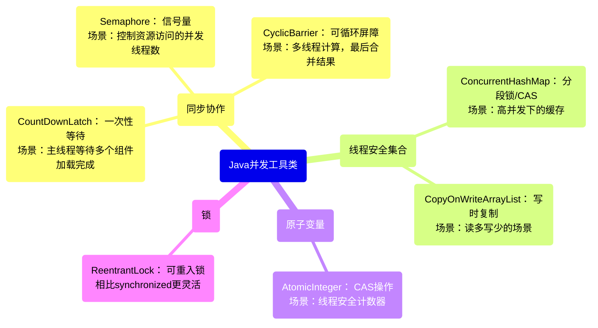
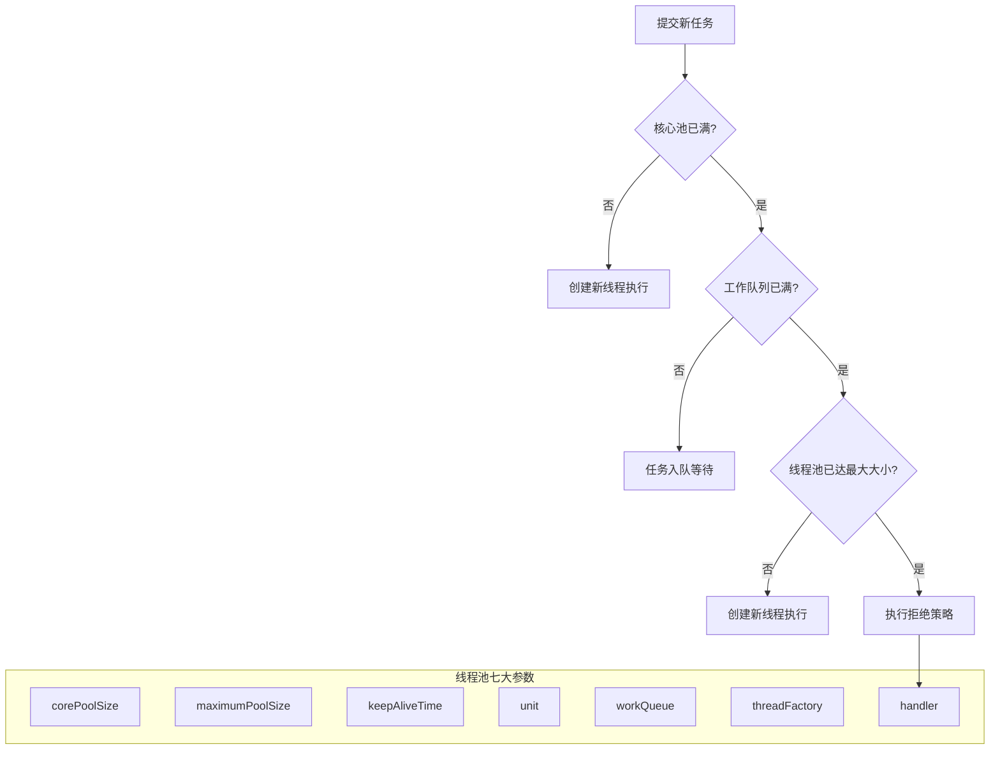

好的，没问题。作为一名专业的Java开发者，我会为你详细拆解和回答这些面试题目。我们将采用“**Mermaid思路图 -> 深度讲解 -> 广度扩展 -> 实例代码（如需）**”的模式，确保回答既专业又易于理解，符合面试场景。

---

### 1. 问实习内容

**面试官意图**：考察你的总结能力、项目参与深度、技术沉淀以及沟通表达能力。他们想听到的不是流水账，而是你遇到了什么问题、怎么解决的、学到了什么。

**回答话术示例**：
“在我上一段于[公司名]的实习中，我主要参与了[某某业务系统]的后端开发工作。这个系统主要负责[简要说明核心业务，如：商家的订单履约流程]。

我其中一项核心任务是**优化一个批量查询接口的响应速度**。这个接口在高峰期响应时间达到了1秒以上。我通过**阅读代码和Arthas工具定位**，发现瓶颈主要在于循环内部串行调用了多次数据库查询，产生了N+1问题。

我的解决方案是：
1.  **代码层面**：将串行查询改为批量查询，利用`MyBatis`的`<foreach>`标签实现`IN`查询，一次性取出所有数据。
2.  **缓存层面**：对于不常变更的基础数据，引入了`Redis`做缓存，减少了数据库的压力。

通过这次优化，该接口的TP99从**1.2秒降低到了150毫秒**左右，提升了近8倍。这个过程让我深刻体会到，**高性能不仅是架构设计，更来源于对代码细节的打磨**。”

---

### 2. 并发工具类



**深度讲解**：
JUC (`java.util.concurrent`) 包提供了强大且高效的并发工具，来替代`synchronized`和`wait/notify`这些底层的同步原语。

*   **CountDownLatch**：像一个倒计数器。初始化一个数值，`await()`方法阻塞等待，其他线程完成工作后调用`countDown()`将计数减1，减到0时，所有等待的线程被唤醒。**用于一个线程等待多个线程完成工作**。
*   **CyclicBarrier**：像一个栅栏。一组线程互相等待，都到达屏障点后，屏障才会打开，所有线程继续执行，并且屏障可以**重置复用**。**用于多线程相互等待，达到一个共同状态**。
*   **Semaphore**：像一张许可证。初始化一个许可数量，线程通过`acquire()`获取许可，没有许可则阻塞，执行完通过`release()`归还许可。**用于控制同时访问特定资源的线程数量**，如数据库连接池。

**广度扩展**：
*   **与`synchronized`的区别**：这些工具类提供了更高级、更灵活的控制手段，比如`Semaphore`可以控制并发数，`CountDownLatch`可以指定等待的线程数，这是`synchronized`无法直接做到的。
*   **核心思想**：它们的底层实现大多基于`AQS (AbstractQueuedSynchronizer)`，这是一个构建锁和同步器的框架，使用了一个FIFO队列和一个int状态变量，核心是**CAS (Compare-And-Swap)** 操作。

**实例代码（Semaphore）**：
```java
// 模拟数据库连接池，限制最多10个连接同时访问
public class ConnectionPool {
    private final Semaphore semaphore = new Semaphore(10); // 10个许可

    public Connection getConnection() throws InterruptedException {
        semaphore.acquire(); // 获取一个许可，如果没有则阻塞等待
        return createConnection(); // 假设这里返回一个连接
    }

    public void releaseConnection(Connection conn) {
        closeConnection(conn); // 关闭连接
        semaphore.release(); // 释放一个许可，允许其他线程获取
    }

    // ... createConnection和closeConnection的具体实现
}
```

---

### 3. 介绍项目背景 & 4. 项目框架设计

这两个问题通常一起问，用来考察你对整体项目的理解。

**回答话术示例（假设是一个电商项目）**：

**3. 项目背景**：
“我负责的项目是一个**面向高校的二手商品交易平台**。主要的业务场景包括用户发布商品、浏览商品列表、下单、支付和聊天等。它的核心挑战在于**活动期间（如毕业季）的瞬时高并发访问**。”

**4. 项目框架设计**：
“我们的系统采用了经典的**前后端分离的分布式架构**。
*   **前端**：Vue构建的SPA应用。
*   **网关层**：使用**Nginx**做反向代理、负载均衡和静态资源服务器。
*   **应用层**：使用**Spring Cloud Alibaba**微服务全家桶。将系统拆分为**用户服务、商品服务、订单服务、支付服务**等独立的微服务。
    *   服务注册与发现：**Nacos**。
    *   配置管理：**Nacos Config**。
    *   服务调用：**OpenFeign**。
    *   服务容错：**Sentinel**，实现熔断、降级和限流。
    *   网关：**Spring Cloud Gateway**，负责路由、鉴权、过滤。
*   **数据层**：
    *   缓存：**Redis集群**，缓存热点商品和数据，减轻数据库压力。
    *   数据库：**MySQL主从复制**，读写分离。使用**ShardingSphere**对订单表进行了分库分表。
*   **异步通信**：使用**RocketMQ**处理异步任务，比如下单成功后发送延迟消息检查订单是否支付，支付成功后通知物流系统等。”

---

### 5. 项目如何面对高并发场景 & 7. 项目接口和高并发

```mermaid
graph TD
    A[高并发冲击] --> B[网关层]
    subgraph B [第一道防线: 流量管控]
        B1[Nginx负载均衡]
        B2[网关限流/鉴权]
    end

    B --> C[应用层]
    subgraph C [第二道防线: 应用保护]
        C1[服务熔断降级-Sentinel]
        C2[线程池隔离]
        C3[异步处理-@Async/MQ]
    end

    C --> D[数据层]
    subgraph D [第三道防线: 数据缓存与加速]
        D1[多级缓存-Redis]
        D2[数据库读写分离]
        D3[分库分表]
    end

    E[具体接口优化] --> F1[减少锁竞争]
    E --> F2[缩短事务长度]
    E --> F3[使用批量操作]
    E --> F4[池化技术]
```

**深度讲解与话术**：
“面对高并发，我们的设计原则是：**横向扩展、加缓存、异步化、数据库保护**。

以最核心的**秒杀下单接口**为例：
1.  **流量过滤 (网关层)**：在**Spring Cloud Gateway**层面就做了初步的QPS限流，将大部分无效请求直接拒绝掉，保护后台服务。
2.  **读多写少，多用缓存 (数据层)**：
    *   商品详情等静态信息，直接缓存到**Redis**，设置较长的过期时间。
    *   库存信息这种高频更新的数据，我们也预热到Redis中，所有的库存扣减检查都在Redis中进行（使用`decrement`原子操作），大大减轻数据库压力。
3.  **业务逻辑异步化 (应用层)**：
    *   下单请求经过一系列校验（用户、库存等）后，会发送一个**RocketMQ**的延时消息。
    *   消息队列的消费者异步地从Redis中扣减库存，并生成订单数据**写入数据库**。
    *   这样做**极大地缩短了接口响应时间**，用户点击下单后立刻返回‘排队中’，后续结果通过MQ异步处理，再通过前端轮询或WebSocket通知用户。
4.  **数据库最终保护**：
    *   数据库层面，我们对订单表进行了**分库分表**。
    *   使用**MySQL主从架构**，读写分离，扣减库存的写操作走主库，读请求走从库。

通过这套组合拳，我们将一个原本同步的、对数据库压力巨大的下单流程，改造成了一个**异步化、池化、缓存化**的高可用流程。”

---

### 6. 线程池八股



**深度讲解**：
线程池的 workflow 和参数是绝对的重点。

1.  **核心参数 (7个)**：
    *   `corePoolSize`：核心线程数，即使空闲也不会被回收。
    *   `maximumPoolSize`：线程池能创建的最大线程数。
    *   `workQueue`：任务队列，用于存放提交后等待执行的任务。
    *   `keepAliveTime + unit`：非核心线程空闲后的存活时间。
    *   `threadFactory`：用于创建新线程的工厂。
    *   `handler`：拒绝策略。当线程池和队列都满了，如何处理新任务。常见策略有：抛出异常(`AbortPolicy`)、调用者自己运行(`CallerRunsPolicy`)、丢弃最早任务(`DiscardOldestPolicy`)、直接丢弃(`DiscardPolicy`)。

2.  **工作流程**：
    1.  提交任务。
    2.  若当前线程数 < `corePoolSize`，**创建新线程**执行。
    3.  若已达核心线程数，则将任务**放入工作队列**等待。
    4.  若队列**已满**，且线程数 < `maximumPoolSize`，则**创建新的非核心线程**执行。
    5.  若线程数也已达到最大值，则**触发拒绝策略**。

**广度扩展与面试话术**：
“在工作中，我们绝不会使用`Executors`提供的默认线程池（比如`newFixedThreadPool`或`newCachedThreadPool`），因为它们要么队列无界可能导致OOM，要么最大线程数无界可能创建大量线程导致OOM。

我们通常通过`ThreadPoolExecutor`的构造函数**手动创建线程池**，这样可以更精确地控制参数。需要根据**任务类型（CPU密集型、IO密集型）** 来设置参数：
*   **CPU密集型**：线程数 ≈ CPU核数 + 1，避免过多线程上下文切换。
*   **IO密集型**：线程数可以设置得多一些，如 2 * CPU核数，因为线程大部分时间在等待IO。

此外，我们还会给线程池设置一个有界队列，并配置一个合理的拒绝策略，比如记录日志或持久化到磁盘稍后重试，这是保证系统稳定性的重要一环。”

---

### 8. 手撕：合并两个有序数组

**题目**：给你两个按 **非递减顺序** 排列的整数数组 `nums1` 和 `nums2`，另有两个整数 `m` 和 `n` ，分别表示 `nums1` 和 `nums2` 中的元素数目。请你 **合并** `nums2` 到 `nums1` 中，使合并后的数组同样按 **非递减顺序** 排列。

**注意**：最终，合并后数组不应由函数返回，而是存储在数组 `nums1` 中。为了应对这种情况，`nums1` 的初始长度为 `m + n`，其中前 `m` 个元素表示应合并的元素，后 `n` 个元素为 0 ，应忽略。

**最优思路**：**从后向前**双指针遍历。因为`nums1`的后半部分是空的，从后往前放置元素，可以避免从前往后覆盖掉`nums1`中还未被比较的元素。

**完整代码与注释**：
```java
class Solution {
    public void merge(int[] nums1, int m, int[] nums2, int n) {
        // 初始化三个指针
        int p1 = m - 1; // 指向nums1有效元素的末尾
        int p2 = n - 1; // 指向nums2的末尾
        int p = m + n - 1; // 指向nums1整个数组的末尾

        // 从后往前遍历，直到nums2被全部合并
        while (p2 >= 0) {
            // 如果nums1还有元素，并且nums1当前元素大于nums2当前元素
            if (p1 >= 0 && nums1[p1] > nums2[p2]) {
                nums1[p] = nums1[p1]; // 将nums1的大元素放到最终位置
                p1--; // nums1指针前移
            } else {
                nums1[p] = nums2[p2]; // 否则，将nums2的元素放到最终位置
                p2--; // nums2指针前移
            }
            p--; // 总指针前移
        }
        // 循环结束后，如果nums1还有剩余元素，它们已经在正确的位置，无需处理
    }
}
```

---

### 9. MySQL日志

```mermaid
mindmap
  root(MySQL核心日志)
    (重做日志 Redo Log)
      (作用: 保证事务持久性<br>Crash-Safe)
      (特点: 物理日志<br>循环写<br>InnoDB引擎独有)
      (流程: WAL(Write-Ahead Logging)<br>先写日志再刷盘)
    (回滚日志 Undo Log)
      (作用: 保证事务原子性<br>用于回滚和MVCC)
      (特点: 逻辑日志<br>随机读写的段)
      (流程: 事务回滚时反向操作)
    (二进制日志 Binlog)
      (作用: 主从复制、数据恢复)
      (特点: 逻辑日志<br>Server层实现<br>追加写)
      (流程: 两阶段提交保证Redo/Binlog一致性)
```

**深度讲解与话术**：
“MySQL里有几种非常重要的日志，保证了数据库的持久性、原子性和数据恢复能力。

1.  **Redo Log (重做日志)**：
    *   **作用**：**保证事务的持久性**。即使发生宕机，已提交的事务所做的修改也不会丢失。
    *   **机制**：它记录了**物理级别**的修改，比如‘在某个数据页的某个偏移量处修改了几个字节的值’。采用**WAL (Write-Ahead Logging)** 技术，即事务提交时，先写redo log到磁盘（顺序IO，很快），再在合适的时间将脏页刷回磁盘（随机IO，慢）。即使刷盘前宕机，重启后也能根据redo log重做。
    *   **特点**：大小固定，循环写入。

2.  **Undo Log (回滚日志)**：
    *   **作用**：**保证事务的原子性**。用于事务回滚和实现**MVCC**。
    *   **机制**：它记录了**逻辑级别**的修改，比如‘事务A插入了一条id=1的记录’，回滚时就会生成一条对应的‘删除id=1的记录’的undo log。这些日志构成了数据的多个版本链，是MVCC的基础。

3.  **Binlog (二进制日志)**：
    *   **作用**：用于**主从复制**和**基于时间点的数据恢复**。它是Server层的日志，所有存储引擎都可以使用。
    *   **机制**：记录的是**逻辑操作**的SQL语句（Statement模式）或行的变更（Row模式）。是**追加写入**的，不会覆盖以前的日志。

**广度扩展**：
为了保证`redo log`和`binlog`的逻辑一致性，MySQL使用了**两阶段提交 (2PC)**。将写日志的过程分为`Prepare`和`Commit`两个阶段，这样即使在写日志的过程中宕机，重启后也能根据状态决定是提交还是回滚事务。”

---

### 10. MVCC (Multi-Version Concurrency Control)

**面试官意图**：考察你对数据库高并发下读写冲突处理的理解。

**回答话术**：
“MVCC是一种通过**数据多版本**来实现并发控制的方法。它使得**读操作不会阻塞写操作，写操作也不会阻塞读操作**，大大提高了并发性能。InnoDB的默认隔离级别`REPEATABLE READ`就是靠MVCC实现的。

它的核心实现依赖于**三个关键要素和一个核心数据结构**：
1.  **隐式字段**：InnoDB每行记录都有两个隐藏字段：`trx_id`（最后修改该行的事务ID）和`roll_pointer`（指向该行上一个版本的undo log的指针）。
2.  **Undo Log**：用于存储数据的历史版本。这些版本通过`roll_pointer`连接成一个**版本链**。
3.  **ReadView (一致性视图)**：事务在执行快照读时生成的当前系统的一个快照。它主要包含：
    *   `m_ids`：生成ReadView时，系统中活跃（未提交）的事务ID集合。
    *   `min_trx_id`：`m_ids`中的最小值。
    *   `max_trx_id`：生成ReadView时，系统下一个将要分配的事务ID。
    *   `creator_trx_id`：创建该ReadView的事务ID。

**判断可见性的规则**（可重复读隔离级别下）：
当一个事务要查询一条记录时，它会从最新的版本开始，顺着版本链依次判断每个版本的`trx_id`：
*   如果 `trx_id` < `min_trx_id`，说明该版本在ReadView创建前已提交，**可见**。
*   如果 `trx_id` >= `max_trx_id`，说明该版本在ReadView创建后才开启，**不可见**。
*   如果 `min_trx_id` <= `trx_id` < `max_trx_id`，则检查`trx_id`是否在`m_ids`中：
    *   如果在，说明该版本对应的事务在生成ReadView时还未提交，**不可见**。
    *   如果不在，说明该版本对应的事务在生成ReadView时已提交，**可见**。
如果当前版本不可见，就顺着版本链找到上一个版本，再次进行上述判断，直到找到可见的版本为止。

通过这种机制，每个事务读到的都是它开始那一刻的一个**一致性数据快照**，从而实现了可重复读。”

希望以上详细的解答能帮助你更好地准备面试！祝你面试顺利！
