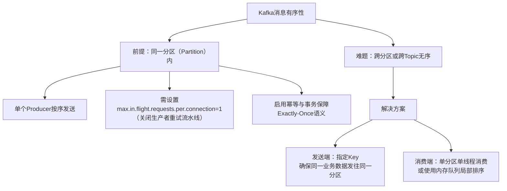
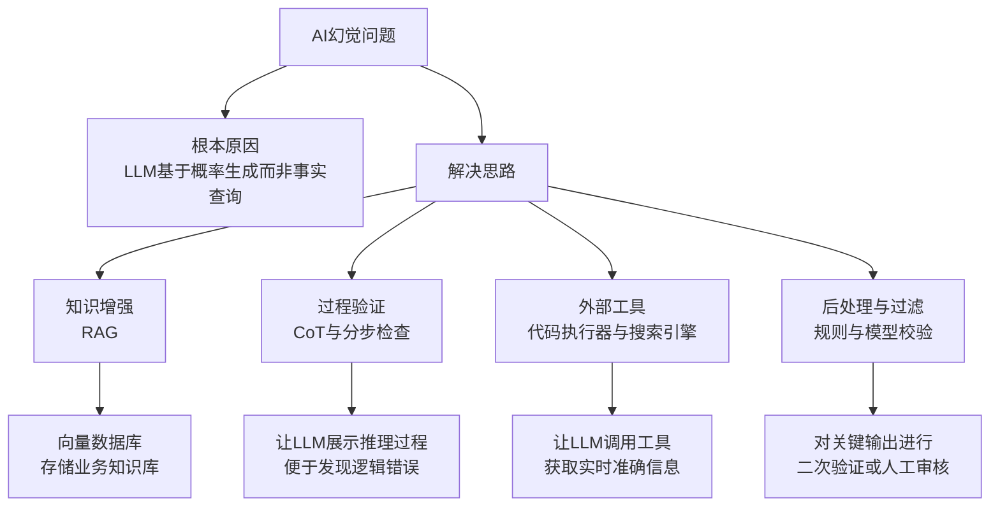

```mermaid
flowchart LR
    A[Client端] -->|1. 调用本地代理| B(Stub<br>代理存根)
    B -->|2. 方法序列化| C[序列化<br>Java对象 -> 二进制]
    C -->|3. 寻找服务地址| D[服务发现<br>查询注册中心]
    D -->|4. 网络传输| E[网络模块<br>TCP连接/连接池/IO模型]
    E -->|5. 发送至| F[Server端]
    
    F -->|6. 接收请求| G[IO线程<br>Netty等]
    G -->|7. 反序列化| H[反序列化<br>二进制 -> Java对象]
    H -->|8. 定位真实方法| I[Skeleton<br>骨架层]
    I -->|9. 调用业务实现| J[Service Impl<br>实际服务]
    J -->|10. 返回结果| I
    I -->|11. 序列化响应| H
    H -->|12. 返回响应| G
    G -->|13. 返回至| E
    E -->|14. 响应返回| B
    B -->|15. 返回给调用方| A
```

好的，同学。这场美团一面问得非常全面，从项目、中间件、RPC、AI应用到Java八股和算法，涵盖了后端工程师的核心知识栈。别担心，我们一起来逐一拆解，用最专业、最易懂的方式组织答案，让你不仅能应对这次面试，更能加深理解。

---

### 3. 用Kafka会不会有数据顺序的问题？

**思路图谱：**


**详细解答：**

“面试官您好，关于Kafka的数据顺序问题，我的理解是：**在同一个分区（Partition）内，Kafka是绝对可以保证消息的顺序性的**；但是**在不同分区或者不同Topic之间，Kafka是无法保证全局顺序的**。这是一个非常重要的概念。”

**深度剖析与解决方案：**

1.  **为何分区内有序**：Kafka的每个分区都是一个有序的、不可变的消息队列。生产者将消息发送到某个分区时，Broker会顺序追加消息。消费者消费时也是按偏移量顺序读取。
2.  **为何会乱序**：
    *   **生产者重试**：如果一条消息发送失败，生产者重试发送，而此时后续消息可能已经成功发送。这会导致失败的消息被重新插入到序列后面，造成乱序。
    *   **消费端多线程**：如果一个分区由多个线程并发消费，处理完成的顺序可能与拉取顺序不一致。

**如何保证有序（面试话术）：**

“在我的项目中，如果业务场景对顺序有严格要求（例如订单的状态流转：创建->支付->完成），我会从**生产端**和**消费端**两个层面来保障：

*   **生产端**：
    1.  **使用同一个Key**：将需要保证顺序的一类消息（如同一个订单号）设置为同一个Key。Kafka会根据Key的哈希值将其路由到同一个分区，从而天然保证这类消息在分区内有序。
    2.  **配置关键参数**：设置 `acks=all` 确保消息成功写入副本，同时为了避免重试导致的乱序，我会设置 `max.in.flight.requests.per.connection=1`。这表示生产者在上一个请求的响应收到之前，不会发送下一个请求，虽然会牺牲一些吞吐量，但换来了严格顺序。在更新版本的Kafka中，启用幂等（`enable.idempotence=true`）和事务也可以更好地解决这个问题。

*   **消费端**：
    *   **单线程消费**：确保一个分区始终只被一个消费者线程处理。这是最简单有效的方式。
    *   **局部排序**：如果追求更高吞吐，可以为每个分区使用一个线程池，但需要将同一Key的消息都路由到同一个工作线程中的内存队列进行处理，从而在消费端实现Key级别的顺序消费。”

---

### 7. 说一下RPC调用的过程

**思路图谱：**


**详细解答：**

“RPC（Remote Procedure Call）远程过程调用，它的核心目标是让调用远程服务像调用本地方法一样简单。其过程可以概括为**代理、序列化、传输、执行**这几个核心步骤。”

**详细过程（结合图）：**

1.  **客户端（Client）调用**：开发者调用本地接口方法。
2.  **客户端存根（Stub）**：这个接口的实际实现是一个代理对象（通常由动态代理技术生成）。它负责将调用的**方法名、参数列表（方法参数）** 等信息序列化成二进制消息体。这个过程也叫**编码（Encoding）** 或** marshalling**。
3.  **服务发现（Service Discovery）**：存根客户端需要知道服务端在哪里。它会查询注册中心（如ZooKeeper, Nacos, Consul），获取目标服务的可用地址列表。
4.  **网络传输（Transport）**：客户端的网络模块（如基于Netty）从连接池中获取一个到服务端的TCP连接，将序列化后的二进制数据发送出去。
5.  **服务端接收**：服务端的网络IO线程（同样基于Netty等高性能框架）监听端口，接收到请求数据。
6.  **服务端骨架（Skeleton）**：服务端将接收到的二进制数据**反序列化（解码/Unmarshalling）** 成原始的方法名和参数对象。
7.  **实际调用**：骨架根据方法名找到对应的本地服务实现类，利用反射机制调用该方法，并传入参数。
8.  **返回结果**：服务端方法执行完毕，将返回结果序列化，再通过网络送回给客户端。
9.  **客户端处理结果**：客户端的网络模块收到响应，将二进制结果反序列化成Java对象，由存根返回给最初的调用方。

**实例与技术选型：**

*   **序列化**：常用Protocol Buffers (Protobuf)、Kryo、Hessian、JSON。Protobuf效率高，跨语言，是主流选择。
*   **网络通信**：主流使用**Netty**框架，它提供了高性能的NIO异步通信能力和便捷的API。

```java
// 一个非常简化的伪代码概念，帮助理解动态代理在RPC中的作用
public class RpcProxy implements InvocationHandler {

    private String serviceAddress; // 从注册中心获取

    @Override
    public Object invoke(Object proxy, Method method, Object[] args) throws Throwable {
        // 1. 序列化：将方法名、参数类型、参数值序列化成二进制
        byte[] requestData = serialize(method.getName(), method.getParameterTypes(), args);

        // 2. 网络传输：通过Netty等客户端发送requestData到serviceAddress
        byte[] responseData = nettyClient.send(requestData, serviceAddress);

        // 3. 反序列化：将二进制响应结果反序列化成Java对象
        Object result = deserialize(responseData, method.getReturnType());
        return result;
    }

    public static <T> T createProxy(Class<T> interfaceClass) {
        return (T) Proxy.newProxyInstance(
                interfaceClass.getClassLoader(),
                new Class<?>[]{interfaceClass},
                new RpcProxy());
    }
}

// 用户使用起来就像调用本地接口一样
UserService userService = RpcProxy.createProxy(UserService.class);
User user = userService.getUserById(123); // 看似本地调用，实则发生了网络通信
```

---

### 8. 有些生产者节点异常了怎么办？ & 9. RPC的请求数比较高怎么办？

这两个问题都属于高可用和高性能范畴，可以联动回答。

**8. 生产者节点异常怎么办？**

“这是一个关于**服务高可用**和**故障容错**的重要问题。在我的设计中，我会通过以下几个机制来应对：

1.  **客户端负载均衡与故障剔除**：RPC客户端会从注册中心获取所有可用的服务端节点列表。客户端的负载均衡器（如RoundRobin, LeastActive）不会一次性将请求发往所有节点，而是会维护节点的健康状态。如果某个节点调用失败（超时或异常），负载均衡器会在一段时间内将其标记为‘不健康’或‘熔断’，后续的请求会自动避开故障节点，发给其他健康节点。
2.  **重试机制**：对于可重试的故障（如网络抖动），可以配置合理的**重试策略**和**重试次数**。但必须注意**幂等性**，确保重试不会导致业务逻辑错误（如重复扣款）。
3.  **服务注册中心的主动探测**：注册中心（如Nacos）会主动对服务实例进行健康检查（心跳检测）。如果发现某个生产者节点宕机，会主动将其从服务列表中剔除，并通知所有消费者客户端更新本地缓存的服务列表，实现故障的快速发现和扩散。
4.  **服务降级和熔断**：在极端情况下，如果大量生产者节点不可用，客户端熔断器（如Hystrix, Sentinel）会打开，直接快速失败或执行预设的**降级逻辑**（fallback），返回一个兜底结果，保护客户端系统不被拖垮，保证核心业务的可用性。”

**9. RPC的请求数比较高怎么办？（结合面试官提醒）**

“面对高并发请求，优化是全方位的。正如面试官您提醒的，我会从**序列化、IO模型、连接池**这三个核心点，以及更广的维度来考虑：

1.  **序列化压缩（您提到的点）**：
    *   **选择高效序列化协议**：这是性能提升的第一环。我会优先选择**Protobuf**或**Kryo**这种高性能、二进制、体积小的序列化方案，替代JSON/XML，极大减少网络传输数据量。
    *   **压缩**：对于大的数据包，可以配置压缩算法（如gzip, snappy），进一步减少带宽占用，**以CPU换网络IO**。

2.  **IO模型与网络通信（您提到的点）**：
    *   **使用NIO异步非阻塞模型**：这是高并发的基石。基于**Netty**这样的高性能NIO框架，可以用少数线程处理大量连接，避免BIO模式下线程数量随连接数线性增长的问题，大大提升并发能力和资源利用率。
    *   **零拷贝技术**：在Linux系统下，Netty等框架通过`FileRegion`封装了`sendfile`等零拷贝技术，在传输文件等大内容时，可以减少内核态与用户态之间的数据拷贝次数，显著提升性能。

3.  **连接池（您提到的点）**：
    *   为每个服务端地址维护一个**连接池**。避免每次RPC调用都经历昂贵的TCP三次握手和四次挥手过程。直接从池中获取长连接进行复用，极大降低延迟。

4.  **服务端业务处理**：
    *   **异步处理**：服务端接收到请求后，如果业务处理耗时，不要阻塞Netty的IO线程。应该将任务抛到独立的**业务线程池**中处理，处理完毕后再通过IO线程写回响应。确保IO线程的高效周转，只负责读写数据。
    *   **背压（Back Pressure）**：如果服务端处理能力达到瓶颈，需要通过线程池队列、熔断器等机制向客户端传递压力，拒绝过多请求，防止服务被压垮。

5.  **架构层面**：
    *   **服务治理**：对服务进行**分组、分版本、灰度发布**，平滑过渡。
    *   **扩容**：这是最直接的方式，通过增加生产者节点数量，水平扩展整个集群的处理能力。”

---

### 12. 怎么解决AI幻觉问题？

**思路图谱：**


**详细解答（面试话术）：**

“AI幻觉是指大模型生成的内容不准确、不真实或完全虚构。这是一个非常普遍且棘手的问题。在我的项目实践中，我认为**无法完全根除，但可以通过一系列工程和技术手段来有效缓解和控制风险**。”

**具体解决方案：**

1.  **RAG（检索增强生成）- 您提到的RGA应该是这个**：这是**最重要、最有效**的手段。LLM的内部知识可能过时或不包含特定领域知识。RAG的核心思想是，在让LLM回答问题之前，先从外部知识库（如公司内部的文档、数据库、向量数据库）中检索出相关的、准确的信息片段，然后将**“问题+检索到的知识”** 一起作为提示词（Prompt）交给LLM，让它基于这些事实依据来生成答案，而不是凭空想象。这大大提高了回答的准确性。

2.  **Prompt Engineering**：
    *   **在Prompt中明确限制**：指示模型“仅根据提供的内容回答”，对于不确定的内容要回答“我不知道”，而不是虚构。
    *   **Chain of Thought (CoT)**：要求模型**分步思考，展示其推理过程**。这样我们可以检查它的逻辑链条，更容易发现其中可能存在的幻觉点。

3.  **后处理与验证**：
    *   **关键信息校验**：对于模型生成结果中的关键数据、事实、代码，通过**规则引擎**、**二次查询**或**另一个轻量级模型**进行交叉验证。
    *   **人工审核闭环**：在高风险场景（如金融、医疗），必须引入人工审核环节，将模型的输出作为参考，由专家最终把关。

4.  **利用外部工具**：让大模型学会使用工具，比如调用**搜索引擎API**获取最新信息，调用**代码解释器**来执行数学计算或数据分析，确保结果的准确性。

“总之，解决幻觉问题需要**多管齐下**，目前业界的最佳实践是 **`RAG + Clear Prompt + 外部工具验证`** 的组合拳。”

---

### 算法题：轮转数组（LeetCode 189）

**题目：** 给定一个数组，将数组中的元素向右轮转 `k` 个位置，其中 `k` 是非负数。

**示例：**
输入: nums = [1,2,3,4,5,6,7], k = 3
输出: [5,6,7,1,2,3,4]

**思路：**
最优雅和高效的方法是 **“三次反转”**：
1.  如果 `k` 大于数组长度，取模 `k %= n` 避免无效旋转。
2.  **反转整个数组**： `[1,2,3,4,5,6,7]` -> `[7,6,5,4,3,2,1]`
3.  **反转前 `k` 个元素**： `[7,6,5,4,3,2,1]` -> `[5,6,7,4,3,2,1]`
4.  **反转后 `n-k` 个元素**： `[5,6,7,4,3,2,1]` -> `[5,6,7,1,2,3,4]`

**时间复杂度：** O(n)，遍历了3次数组。
**空间复杂度：** O(1)，原地操作，只用了常数额外空间。

**带详细注释的代码：**

```java
class Solution {
    public void rotate(int[] nums, int k) {
        int n = nums.length;
        // 关键步骤1：处理 k > n 的情况，避免无效旋转
        k %= n;

        // 如果k为0，不需要任何操作
        if (k == 0) return;

        // 步骤2：反转整个数组
        reverse(nums, 0, n - 1);
        // 步骤3：反转前k个元素
        reverse(nums, 0, k - 1);
        // 步骤4：反转后n-k个元素
        reverse(nums, k, n - 1);
    }

    // 辅助函数：反转数组中从start到end位置的元素
    private void reverse(int[] nums, int start, int end) {
        while (start < end) { // 双指针从两端向中间移动
            // 交换start和end位置的元素
            int temp = nums[start];
            nums[start] = nums[end];
            nums[end] = temp;
            // 移动指针
            start++;
            end--;
        }
    }
}
// 示例推导：nums = [1,2,3,4,5,6,7], k=3
// 反转整个: [7,6,5,4,3,2,1]
// 反转前3: [5,6,7,4,3,2,1]
// 反转后4: [5,6,7,1,2,3,4] -> 正确结果
```

---

### Java八股文部分

#### 1. Java内存模型（JMM） vs 运行时数据区

**回答：**
“面试官您好，这是一个非常容易混淆但核心的概念。您问的JMM和运行时数据区是看待Java内存的两个不同维度。

*   **运行时数据区（JVM内存结构）**：这是 **`JVM虚拟机`** 在**运行时**如何划分和管理其内存空间的**具体实现**，是一个物理概念。它包括了**方法区、堆、虚拟机栈、本地方法栈、程序计数器**。我们常说的‘堆内存’、‘栈内存’指的就是这个。
    *   **堆**：存放对象实例，是所有线程共享的。
    *   **虚拟机栈**：每个线程私有，存储局部变量表、操作数栈、动态链接、方法出口等信息。

*   **Java内存模型（JMM）**：这是一个**抽象的概念**，是一组**规则或规范**，定义了程序中各种变量（实例字段、静态字段）的访问方式。它**屏蔽了底层硬件内存结构的差异**，旨在解决**多线程环境下的内存可见性、原子性、有序性问题**。JMM的核心是围绕**主内存**和**工作内存**的交互来定义的。
    *   **主内存**：所有共享变量都存储在主内存中。
    *   **工作内存**：每个线程都有自己的工作内存，它保存了该线程使用到的变量的主内存副本。线程对所有变量的操作都必须在工作内存中进行，不能直接读写主内存。

**简单说，运行时数据区是`JVM怎么做的`，而JMM是`Java规范规定多线程该怎么和内存交互`。** JMM的‘主内存’大致对应运行时数据区的‘堆’，‘工作内存’大致对应‘虚拟机栈的部分区域’，但两者绝不是一一对应的关系。”

#### 2. Java有哪些类型的锁 & 3. 锁升级

**回答：**
“Java中的锁非常多，可以从不同维度划分：

1.  **乐观锁 vs 悲观锁**：
    *   **悲观锁**：认为并发冲突一定会发生，所以每次操作数据前先加锁。`synchronized`和`ReentrantLock`都是悲观锁。
    *   **乐观锁**：认为冲突不常发生，所以先直接操作数据，在更新时再检查是否有冲突。通常用**版本号**或**CAS操作**（如`AtomicInteger`）实现。

2.  **自旋锁**：线程在获取锁失败时，不会立即挂起，而是会循环尝试（自旋），避免了线程上下文切换的开销。适用于锁占用时间很短的场景。

3.  **可重入锁**：同一个线程可以多次获取同一把锁。`synchronized`和`ReentrantLock`都是可重入锁，防止了线程自己把自己锁死。

4.  **读写锁**：拆分为读锁和写锁，读读不互斥，读写、写写互斥。`ReentrantReadWriteLock`，非常适合读多写少的场景。

5.  **公平锁 vs 非公平锁**：
    *   **公平锁**：按照线程请求的顺序来获取锁。
    *   **非公平锁**：允许‘插队’，吞吐量通常更高。`synchronized`是非公平锁，`ReentrantLock`可以指定公平性。

**锁升级（synchronized的优化）**：
这是JVM对`synchronized`性能优化的关键过程，目的是减少直接使用重量级锁带来的性能开销。

1.  **无锁状态**：对象刚创建。
2.  **偏向锁**：第一个线程访问同步块时，会在对象头中记录这个线程的ID。之后该线程再进入时，无需任何CAS操作，直接检查线程ID是否是自己，效率极高。适用于**只有一个线程访问**的场景。
3.  **轻量级锁**：当有第二个线程尝试获取锁（发生竞争），偏向锁会升级为轻量级锁。线程会在自己的栈帧中创建锁记录（Lock Record），通过**CAS操作**尝试将对象头指向自己的锁记录。如果成功则获取锁；如果失败，则**自旋**尝试一定次数。
4.  **重量级锁**：如果轻量级锁自旋失败（竞争激烈），就会膨胀为重量级锁。此时未获取到锁的线程会**被挂起**，进入阻塞状态，等待操作系统调度唤醒。这个过程的开销最大。

**锁升级是不可逆的，目的是从低开销的锁开始，逐步适应竞争的激烈程度。**”

#### 4. MySQL的索引实现 & 5. 怎么避免查询回表？联合索引

**回答：**
“**4. MySQL的索引实现**：
MySQL的InnoDB存储引擎默认使用**B+树**数据结构来实现索引。之所以选B+树而不是B树或哈希，是因为：
*   **B+树非叶子节点只存键值，不存数据**，因此一个页（Page）能存放更多的键，树的高度更低，IO次数更少。
*   **叶子节点包含了所有数据**，并且通过指针串联成一个有序链表，非常适合**范围查询**和**全表扫描**。

对于**InnoDB**：
*   **聚簇索引**：表数据文件本身就是按B+树组织的一个索引结构。叶子节点保存了**完整的行数据**。一张表有且只有一个聚簇索引，通常就是主键索引。
*   **二级索引（辅助索引）**：叶子节点存储的不是完整数据，而是**对应记录的主键值**。查询时需要先查到主键，再回到聚簇索引中查找完整数据，这个过程就是‘回表’。

**5. 怎么避免回表？**
避免回表的核心是**让查询需要的数据都在索引里**，这样引擎就不用再回表查了。这被称为 **‘覆盖索引’**。

**联合索引**是实现覆盖索引的常用手段。
**例子**：有一张用户表`user`，有`id`(主键), `name`, `age`, `city`字段。
如果有一个高频查询：`SELECT name, age FROM user WHERE city = '上海' AND age = 25;`

*   **低效做法（可能回表）**：只在`city`上有索引。根据`city`索引找到主键id列表，再回表无数次去校验`age`是不是25，并取出`name`和`age`。
*   **高效做法（覆盖索引）**：建立一个**联合索引 `idx_city_age` (`city`, `age`)**。
    1.  这个索引的B+树先按`city`排序，`city`相同的再按`age`排序。
    2.  执行上面的查询时，引擎直接在`idx_city_age`这颗索引树上就能找到`city='上海' and age=25`的条目。
    3.  并且，这条目的叶子节点就包含了我们需要查询的`name`和`age`字段的值（以及主键id）！**所有需要的数据索引里都有了**，直接返回结果，完全避免了回表操作，性能极高。

**所以，设计索引时，不仅要考虑WHERE条件，还要考虑SELECT的字段，尽量实现覆盖索引。**”

#### 6. 隔离级别 具体是怎么解决的

“SQL标准定义了4个隔离级别，解决并发事务可能带来的脏读、不可重复读、幻读问题。InnoDB通过**MVCC（多版本并发控制）** 和**锁机制**来实现。”

| 隔离级别                 | 脏读 | 不可重复读 | 幻读 | 实现方式                                                                                              |
| :----------------------- | :--- | :--------- | :--- | :---------------------------------------------------------------------------------------------------- |
| **读未提交 (Read Uncommitted)** | 可能 | 可能       | 可能 | 直接读最新数据，无任何控制。                                                                          |
| **读已提交 (Read Committed)**   | 不可能 | 可能       | 可能 | **MVCC**：每次SELECT都生成一个**新的ReadView**，所以每次读到的都是最新提交的快照，可能两次读到的不同。 |
| **可重复读 (Repeatable Read)**  | 不可能 | 不可能     | 可能(*InnoDB已大部分解决*) | **MVCC**：**第一次SELECT时生成一个ReadView**，整个事务期间都使用这个快照，所以每次读到的都一样。对于幻读，InnoDB通过**Next-Key Lock**（临键锁）来防止。 |
| **串行化 (Serializable)**      | 不可能 | 不可能     | 不可能 | 纯粹的加锁实现，所有读操作都加共享锁，读写严重互斥，性能最低。                                        |

*   **MVCC工作原理**：每行数据都有两个隐藏字段：`trx_id`（最后修改它的事务ID）和`roll_pointer`（指向undo log中旧版本的指针）。SELECT操作会找一个**可见**的版本（通过比较`trx_id`和当前事务的ReadView来决定），而不是直接读最新数据。这就实现了非锁定读，提高了并发性能。
*   **Next-Key Lock**：是**记录锁（行锁）** 和**间隙锁**的结合。它不仅锁住一条记录，还锁住记录之前的范围，防止其他事务在这个范围内插入新数据，从而解决了幻读问题。”

---

希望这份超详细的解答能帮助你彻底吃透这些问题！祝你面试顺利，拿到心仪的Offer！
