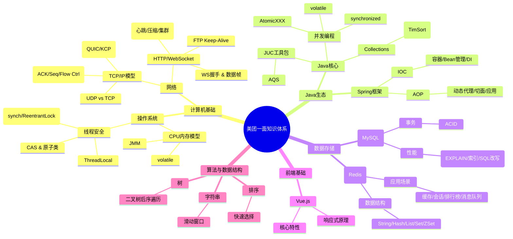

好的，请坐。作为一位资深Java开发工程师，我很高兴能为你系统性地解析这套美团一面的面试题。这套题目质量很高，覆盖面广，确实能很好地考察候选人的综合技术实力。挂掉一次并不可怕，关键在于深度复盘，将每次面试都视为一次学习和提升的机会。

下面我将遵循你的要求，对这些题目进行逐一剖析。

---

### 1. 核心知识点脑图 (Mermaid)

首先，我们用一张脑图来梳理所有问题涉及的核心知识体系，这有助于你构建系统性的理解，而不是孤立地记忆知识点。



这张图展示了面试官考察的知识维度及其内在关联。接下来，我们将对每个知识点进行深度解析。

---

### 2. 知识点详细讲解

#### **2. violate关键字作用**

*   **定义**：`volatile`是Java提供的一种**轻量级同步机制**。它用于修饰变量。
*   **工作原理**：它通过两个特性来保证线程安全：
    1.  **可见性**（核心作用）：当一个线程修改了一个`volatile`变量的值，这个新值会**立即被刷新回主内存**。同时，其他线程中关于这个变量的**缓存行会失效**，迫使它们必须从主内存重新读取最新的值。这通过**内存屏障**（Memory Barrier）实现，遵循了JMM的**happens-before原则**。
    2.  **禁止指令重排序**：通过插入内存屏障，防止JVM和处理器为了优化性能而对指令进行重排序，从而保证了代码的有序性。
*   **使用场景**：
    *   作为一个**状态标志**（如 `volatile boolean isRunning`），用于安全地终止线程。
    *   **DCL单例模式**（Double-Checked Locking）中，修饰`instance`变量，防止初始化对象时的重排序导致其他线程拿到一个未初始化完全的对象。
*   **注意事项**：
    *   `volatile` **不保证原子性**。复合操作（如 `count++`）即使有`volatile`修饰，在多线程下仍然是不安全的。如果需要原子性，请使用`synchronized`或`java.util.concurrent.atomic.*`包下的原子类。
    *   性能开销低于`synchronized`，但依然有（因为需要和主内存交互），不能滥用。

#### **3. 如何保证线程安全**

线程安全的本质是**保证对共享资源访问的原子性、可见性和有序性**。
1.  **互斥同步（阻塞同步）**：
    *   **`synchronized`关键字**：JVM原生支持，可修饰代码块、方法。在JDK 1.6后进行了大量优化（偏向锁、轻量级锁、锁粗化、锁消除等），性能已大幅提升。
    *   **`ReentrantLock`**：JDK提供的API级锁，相比`synchronized`功能更丰富，支持**公平锁、非公平锁**，提供`tryLock()`非阻塞获取锁、可中断的锁等待、多个条件变量（`Condition`）等。
2.  **非阻塞同步**：
    *   **CAS（Compare-And-Swap）**：一种乐观锁策略。底层通过CPU指令（如x86的`cmpxchg`）实现。Java中通过`Unsafe`类提供CAS操作，`AtomicInteger`等原子类是其典型应用。优点是无阻塞，高性能；缺点是存在**ABA问题**（可通过`AtomicStampedReference`带版本号解决）。
3.  **无同步方案**：
    *   **ThreadLocal**：为每个线程创建变量的独立副本，从根本上避免共享。常用于存储线程上下文信息（如Spring的事务管理、用户会话信息）。
    *   **不可变对象**（Immutable Objects）：使用`final`关键字修饰类和字段，使得对象一旦创建其状态就不可变（如`String`）。因为不可变，所以线程安全。

#### **4. 支持原子性操作的方法**

1.  **锁机制**：如`synchronized`和`ReentrantLock`，通过互斥保证临界区代码的原子性。
2.  **原子类**（`java.util.concurrent.atomic`）：
    *   如`AtomicInteger`, `AtomicLong`, `AtomicReference`等。
    *   它们内部通过**volatile value + CAS操作**来保证单个变量的读-写-改操作的原子性。
    *   提供`getAndIncrement()`, `compareAndSet()`等原子方法。
3.  **并发容器**：部分操作是原子的，如`ConcurrentHashMap`的`putIfAbsent()`, `replace()`。

#### **5. 简述Spring的IOC和AOP的核心思想**

*   **IOC（控制反转）**：
    *   **核心思想**：**将对象的创建、依赖装配的控制权从应用程序代码中反转（移交）给外部容器（Spring IOC Container）**。
    *   **工作方式**：以前是`new Class()`，现在是**定义Bean**（`@Component`）并**声明依赖**（`@Autowired`），容器负责在运行时**依赖注入**（DI）。这实现了对象之间的**解耦**，使得程序更灵活、更易于测试和维护。
*   **AOP（面向切面编程）**：
    *   **核心思想**：将那些**遍布在应用多处但功能相同的代码**（称为横切关注点，如日志、事务、安全）从业务逻辑中剥离出来，形成独立的模块（称为切面）。
    *   **工作方式**：通过**动态代理**（JDK基于接口或CGLIB基于类）技术在**运行时**将切面逻辑（Advice）“织入”到目标方法的特定连接点（Join Point）上。实现了**职责分离**，提高了代码的复用性和可维护性。

#### **6. MySQL的ACID特性**

这是事务的四个核心属性，用于保证数据库事务的可靠性。
*   **A（Atomicity）原子性**：事务是一个不可分割的工作单位，事务中的操作要么全部成功，要么全部失败（回滚）。通过**Undo Log**实现。
*   **C（Consistency）一致性**：事务执行的结果必须是使数据库从一个一致性状态变到另一个一致性状态。这是最终目的，由其他三个特性共同保障。
*   **I（Isolation）隔离性**：多个并发事务之间互不干扰。通过**锁机制**和**MVCC（多版本并发控制）** 实现。隔离级别（读未提交、读已提交、可重复读、串行化）定义了隔离性的严格程度。
*   **D（Durability）持久性**：事务一旦提交，它对数据库的改变就是永久性的。通过**Redo Log**实现，即使系统宕机，重启后也能恢复数据。

#### **7. 慢SQL如何优化**

这是一个系统性工程，遵循“排查-定位-优化”的思路。
1.  **定位慢SQL**：开启MySQL的**慢查询日志**（`slow_query_log`），设置阈值（`long_query_time`），使用`mysqldumpslow`等工具分析日志。
2.  **使用EXPLAIN分析**（见第8点）：这是最关键的一步，分析SQL的执行计划。
3.  **针对性优化**：
    *   **索引优化**：检查是否命中索引（`type`为`ref`, `range`等），避免全表扫描（`ALL`）。考虑为`WHERE`, `ORDER BY`, `GROUP BY`子句中的字段添加索引。注意避免索引失效（如对索引列进行函数操作、类型隐式转换、`!=`、`IS NULL`、`LIKE`以通配符开头等）。
    *   **SQL语句优化**：
        *   避免`SELECT *`，只取需要的列。
        *   优化`JOIN`，确保`ON`条件的字段有索引。
        *   分解大查询（如大表的`LIMIT`分页优化）。
    *   **表结构优化**：
        *   选择合适的数据类型（如用`INT`而非`VARCHAR`存储数字）。
        *   范式与反范式的权衡，有时适当冗余可以减少`JOIN`。
    *   **数据库架构优化**：如果数据量极大，考虑**读写分离**、**分库分表**。

#### **8. explain关键字解释**

`EXPLAIN`是模拟MySQL优化器如何执行SQL查询语句的强大工具。它的结果包含以下重要列：
*   **id**：查询的序列号。id越大，执行优先级越高；id相同，从上到下执行。
*   **select_type**：查询类型（SIMPLE, PRIMARY, SUBQUERY, DERIVED, UNION）。
*   **table**：正在访问的表。
*   **partitions**：匹配的分区。
*   **type（极其重要）**：访问类型，从好到坏：`system` > `const` > `eq_ref` > `ref` > `range` > `index` > `ALL`。至少要优化到`range`级别，最好能达到`ref`。
*   **possible_keys**：可能用到的索引。
*   **key**：实际使用的索引。
*   **key_len**：使用的索引长度（字节数）。可用于判断复合索引的使用情况。
*   **ref**：显示索引的哪一列被使用了。
*   **rows**：MySQL认为它必须检查的行数（估算值）。越小越好。
*   **filtered**：表示存储引擎返回的数据在server层过滤后，剩下的满足查询的记录数量的比例。
*   **Extra（非常重要）**：额外信息。出现`Using filesort`（需要额外排序）和`Using temporary`（需要创建临时表）通常意味着需要优化。

#### **9. Redis常用数据结构以及应用场景**

*   **String**：最简单的KV类型。**场景**：缓存、计数器（`INCR`）、分布式锁（`SETNX`）。
*   **Hash**： field-value 映射表。**场景**：存储对象（如用户信息），比String序列化更省空间，支持单独操作字段。
*   **List**：双向链表。**场景**：消息队列（`LPUSH`/`BRPOP`）、最新消息排行（`LTRIM`）、朋友圈点赞列表。
*   **Set**：无序、不重复的集合。**场景**：共同关注（`SINTER`）、抽奖（`SRANDMEMBER`、`SPOP`）、标签系统。
*   **ZSet (Sorted Set)**：带分值的有序集合。**场景**：排行榜（`ZREVRANGE`）、延时队列（用时间戳作为score）。
*   **其他**：Bitmaps（位图，用于大量布尔统计如日活）、HyperLogLog（基数统计，如UV）、GEO（地理信息，附近的人）。

#### **10. WebSocket的工作原理**

*   **定义**：HTML5的一种新协议，实现了**全双工通信**。
*   **工作原理**：
    1.  **握手（Handshake）**：客户端发起一个类似HTTP的握手请求，包含`Upgrade: websocket`和`Connection: Upgrade`等头部。服务端验证后返回`101 Switching Protocols`响应，完成HTTP到WebSocket协议的升级。
    2.  **数据传输**：握手成功后，连接保持打开，双方使用**WebSocket数据帧**（Frame）格式进行双向、低延迟的数据交换，不再需要HTTP的请求/响应模式。

#### **11. 如何优化你项目中使用的WebSocket的业务**

1.  **连接保活**：实现**心跳机制**（Ping/Pong），定期发送小数据包检测连接健康度并防止中间网络设备因空闲断开连接。
2.  **消息压缩**：如果消息体量大，可在应用层或使用WebSocket扩展进行压缩（如`permessage-deflate`）。
3.  **集群部署与状态同步**：单机WebSocket无法水平扩展。需使用**广播中间件**（如Redis Pub/Sub）或专用网关（如Netty集群）在多服务实例间同步连接状态和消息路由。
4.  **业务逻辑优化**：
    *   **减少广播**：精准推送，只推给需要接收消息的连接。
    *   **合并消息**：对高频低优先级消息进行缓冲合并后再发送（类似TCP Nagle算法）。
5.  **客户端优化**：实现自动重连、消息队列、ACK确认机制。

#### **12. FTP中的keep-alive**

*   **作用**：FTP协议使用**两个TCP连接**：控制连接（21端口）和数据连接（20端口或其他）。`Keep-Alive`机制（通常体现在控制连接上）用于在数据连接建立前或数据传输间隔期间，**保持控制连接的活动状态**，防止因网络空闲而被防火墙或路由器断开。
*   **实现**：通常通过定时发送`NOOP`（No Operation）命令来实现，告诉对端“我还活着”。

#### **13. TCP特性**

1.  **面向连接**：通信前必须通过**三次握手**建立连接，通信后通过**四次挥手**释放连接。
2.  **可靠传输**：通过**序号（Seq）**、**确认应答（ACK）**、**超时重传**机制保证数据不丢失、不重复。
3.  **流量控制**：通过**滑动窗口**机制，由接收方控制发送方的发送速率，防止接收方缓冲区溢出。
4.  **拥塞控制**：通过**慢启动**、**拥塞避免**、**快重传**、**快恢复**算法，根据网络状况动态调整发送窗口，避免网络拥塞。
5.  **基于字节流**：不保留消息边界，应用程序需要自己处理粘包/拆包问题。

#### **14. UDP和TCP应用场景，如何使得UDP可靠**

*   **TCP应用场景**：要求数据**可靠、完整**的场景，如文件传输（FTP/HTTP）、邮件（SMTP）、网页浏览（HTTP）。
*   **UDP应用场景**：要求**速度**高于可靠性的场景，如音视频通话、直播、实时游戏、DNS查询、VoIP。
*   **如何使UDP可靠（在应用层实现）**：参考TCP的思想，在UDP之上构建一套可靠性机制。这被称为**RUDP**。
    *   **添加序号**：为每个数据包添加序号，用于处理乱序和重复。
    *   **确认应答与重传**：接收方收到包后发送ACK确认。发送方超时未收到ACK则重传。
    *   **流量控制**：实现类似滑动窗口的机制。
    *   **拥塞控制**：实现类似的慢启动等算法。
    *   **现有协议**：**QUIC**（HTTP/3的底层协议）是Google推出的可靠UDP协议，集成了TLS加密并减少了握手延迟。

#### **15. 对前端的了解，对vue的认识**

（作为后端开发，需表现出合作意识和基本认知）
*   **了解**：前端主要负责用户界面和交互逻辑，通过浏览器与后端API进行数据交互。主流技术栈是HTML/CSS/JavaScript，现在盛行**组件化**、**模块化**开发模式，并有**React**、**Vue**、**Angular**等成熟框架。
*   **对Vue的认识**：
    *   它是一个**渐进式**的JavaScript框架，核心库只关注视图层，易于与其他库或现有项目集成。
    *   **核心特性**：
        1.  **响应式数据绑定**：通过`Object.defineProperty`（Vue 2）或`Proxy`（Vue 3）实现数据变化自动驱动视图更新。
        2.  **组件系统**：将UI拆分为独立、可复用的组件，每个组件包含自己的模板、逻辑和样式。
        3.  **虚拟DOM**：通过JS对象模拟DOM结构，在数据变化时先比较虚拟DOM的差异，再高效地更新真实DOM，提升性能。
    *   其生态包括Vue Router（路由）、Vuex/Pinia（状态管理）、Vite（构建工具）等。

#### **16. java中Sort的原理**

*   **`Arrays.sort()`**：
    *   对于**基本类型数组**（如`int[]`）：采用**Dual-Pivot Quicksort**（双轴快速排序）。它是一种优化的快排，平均时间复杂度O(n log n)，最坏O(n²)。因为稳定性对基本类型无意义，所以选择更快的快排。
    *   对于**对象数组**（如`Object[]`）：采用**TimSort**（归并排序的优化变种）。它是一种**稳定**的（Stable）排序算法，平均和最坏时间复杂度均为O(n log n)。TimSort善于处理现实世界中部分有序的数据集。
*   **`Collections.sort()`**：底层调用`List`自身的`sort()`方法，最终也是使用`Arrays.sort()`（即TimSort）。

---

### 3. 手撕算法题解答

#### **题1：数组中的前K个最大元素**

*   **原题**：215. 数组中的第K个最大元素
*   **变形**：返回前K个最大的元素（不要求顺序）
*   **解题思路**：
    *   **思路一（快速选择分区）**：借鉴快排的`partition`思想。每次随机选一个pivot，将数组分为大于pivot和小于pivot的两部分。如果大于pivot的个数`m`等于`k`，那这`m`个就是答案；如果`m > k`，就在左边再找`k`个最大的；如果`m < k`，左边全要，再去右边找`k - m`个最大的。**平均时间复杂度O(n)，最坏O(n²)，空间O(1)**。
    *   **思路二（最小堆）**：维护一个大小为`k`的**最小堆**。遍历数组，当堆大小小于`k`时直接加入；否则，如果当前数大于堆顶（堆中最小的数），则弹出堆顶，加入当前数。遍历结束后，堆中剩下的就是前K个最大的元素。**时间复杂度O(n log k)，空间O(k)**。此法更通用，且不会修改原数组。
*   **最优解法选择**：由于题目是“前K个”而非“第K个”，且不要求顺序，**最小堆**是更直观和稳定的选择，能避免快排分区法最坏情况的风险。

```java
import java.util.PriorityQueue;

public class TopKLargest {
    public int[] findTopKLargest(int[] nums, int k) {
        if (nums == null || nums.length == 0 || k <= 0 || k > nums.length) {
            return new int[0]; // 处理边界条件
        }

        // 使用一个最小堆（优先队列默认是最小堆）
        PriorityQueue<Integer> minHeap = new PriorityQueue<>(k);

        for (int num : nums) {
            if (minHeap.size() < k) {
                // 堆未满，直接加入
                minHeap.offer(num);
            } else {
                if (num > minHeap.peek()) {
                    // 当前数字大于堆顶（即堆中最小的数）
                    minHeap.poll();     // 移除堆顶（最小的）
                    minHeap.offer(num); // 加入当前数字
                }
                // 否则，忽略这个数字
            }
        }

        // 将堆中的元素导出到数组。题目不要求顺序，直接输出即可。
        int[] result = new int[k];
        int i = 0;
        for (int num : minHeap) {
            result[i++] = num;
        }
        return result;
    }
}
```

#### **题2：二叉树中的最大路径和**

*   **原题**：124. 二叉树中的最大路径和
*   **解题思路**：
    *   **问题分析**：一条路径可以被看作是从一个起点出发，向上、向左、向下走到某个终点。这个路径必然有一个**最高节点**（拐点）。对于任意节点，计算以它为最高节点的路径和：`node.val + max(0, leftGain) + max(0, rightGain)`。
    *   **算法选择**：使用**后序遍历（DFS）**。递归函数`maxGain(node)`返回的是以`node`为**起点**，向下走的最大路径和（即`node.val + max(maxLeft, maxRight)`），这个返回值用于父节点的计算。同时，在递归过程中，我们不断更新全局变量`maxSum`，记录遍历至今遇到的以各个节点为最高点的最大路径和。
    *   **复杂度**：时间复杂度O(n)，空间复杂度O(h)（递归栈空间，h是树高）。

```java
class Solution {
    private int maxSum = Integer.MIN_VALUE; // 全局变量，记录最终答案

    public int maxPathSum(TreeNode root) {
        maxGain(root);
        return maxSum;
    }

    /**
     * 递归辅助函数
     * @param node 当前节点
     * @return 以当前节点为起点，向下延伸的最大路径和（供父节点使用）
     */
    private int maxGain(TreeNode node) {
        if (node == null) {
            return 0;
        }

        // 递归计算左右子节点的最大贡献值
        // 只有在贡献值大于0时，才会选取对应子节点
        int leftGain = Math.max(maxGain(node.left), 0);
        int rightGain = Math.max(maxGain(node.right), 0);

        // 计算以当前节点为“最高点”的路径和
        int priceNewPath = node.val + leftGain + rightGain;

        // 更新全局最大路径和
        maxSum = Math.max(maxSum, priceNewPath);

        // 返回以当前节点为起点的最大路径和，只能选择左边或右边的一支
        return node.val + Math.max(leftGain, rightGain);
    }
}
```

#### **题3：最小覆盖子串**

*   **原题**：76. 最小覆盖子串
*   **解题思路**：
    *   **问题分析**：在字符串`s`中找到一个连续子串，包含字符串`t`的所有字符（包括数量），且是最短的。
    *   **算法选择**：**滑动窗口（Sliding Window）**。使用双指针`left`和`right`构成窗口`[left, right]`。
        1.  `right`指针向右扩张，直到窗口包含`t`的所有字符。
        2.  此时，`left`指针向右收缩，在保证窗口仍满足条件的前提下，尽可能缩小窗口，并更新最小子串的起始位置和长度。
        3.  重复1和2，直到`right`到达`s`的末尾。
    *   **关键技巧**：
        *   使用两个`HashMap`（或数组）`need`和`window`，分别记录`t`中字符的需求量和当前窗口中的字符数量。
        *   用一个变量`valid`来记录窗口中满足`need`要求的字符种类数。当`valid == need.size()`时，窗口满足条件。
    *   **复杂度**：时间复杂度O(|s| + |t|)，空间复杂度O(C)（C为字符集大小）。

```java
import java.util.HashMap;
import java.util.Map;

class Solution {
    public String minWindow(String s, String t) {
        // 记录t中字符需求的哈希表
        Map<Character, Integer> need = new HashMap<>();
        // 记录当前窗口中字符的哈希表
        Map<Character, Integer> window = new HashMap<>();
        
        // 初始化need
        for (char c : t.toCharArray()) {
            need.put(c, need.getOrDefault(c, 0) + 1);
        }

        int left = 0, right = 0;
        int valid = 0; // 窗口中满足need条件的字符种类数

        // 记录最小覆盖子串的起始索引和长度
        int start = 0, len = Integer.MAX_VALUE;

        while (right < s.length()) {
            // c 是将移入窗口的字符
            char c = s.charAt(right);
            // 扩大窗口
            right++;
            
            // 进行窗口内数据的一系列更新
            if (need.containsKey(c)) {
                window.put(c, window.getOrDefault(c, 0) + 1);
                // 如果窗口中c的数量刚好达到need要求的数量，则valid+1
                if (window.get(c).equals(need.get(c))) {
                    valid++;
                }
            }

            // 判断左侧窗口是否要收缩（当前窗口已覆盖t）
            while (valid == need.size()) {
                // 更新最小覆盖子串
                if (right - left < len) {
                    start = left;
                    len = right - left;
                }
                // d 是将移出窗口的字符
                char d = s.charAt(left);
                // 缩小窗口
                left++;
                
                // 进行窗口内数据的一系列更新
                if (need.containsKey(d)) {
                    // 如果移出前，d的数量刚好满足需求，移出后就不满足了，valid-1
                    if (window.get(d).equals(need.get(d))) {
                        valid--;
                    }
                    window.put(d, window.get(d) - 1);
                }
            }
        }
        // 返回最小覆盖子串
        return len == Integer.MAX_VALUE ? "" : s.substring(start, start + len);
    }
}
```

---

### 总结与建议

这次美团的面试考察非常全面，从项目经验到基础原理，再到算法实战，是典型的大厂面试风格。挂掉的原因可能在于算法题没有第一时间给出最优解（如二叉树最大路径和），或者在某些基础知识的深度上有所欠缺。

**给你的建议**：
1.  **深度复盘项目**：确保能清晰地阐述项目的架构、技术选型、自己负责的核心模块以及遇到的挑战和解决方案。这是面试的基础盘。
2.  **构建知识体系**：像上面的脑图一样，将分散的知识点串联起来，理解其背后的原理和关联（如volatile和JMM、IOC和DI、TCP和HTTP/WebSocket）。
3.  **算法刷题贵精不贵多**：针对高频题（如快排/堆、二叉树、滑动窗口、DFS/BFS），不仅要AC，更要追求一题多解和分析复杂度，做到融会贯通。面试时先和面试官沟通思路，再动手写。
4.  **保持自信与沟通**：面试是双向交流，即使一时卡壳，也要冷静思考，把思路说出来，展示你的解决问题的能力。

希望这份超详细的解析能帮助你更好地准备下一次面试。加油！
