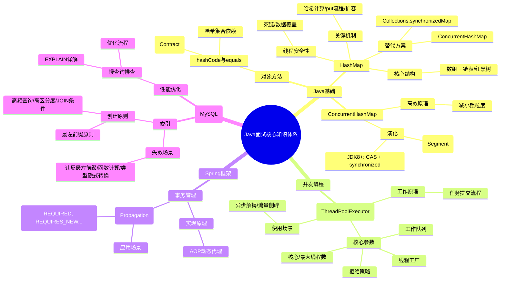

好的，面试官。非常感谢您提出这些高质量的Java核心问题，它们覆盖了集合、并发、Spring框架和数据库等核心领域。作为一名有着多年实战经验的Java开发工程师，我将结合理论深度和工程实践，为您逐一进行系统性的解答。

---

### 1. 核心知识点脑图 (Mermaid)

首先，我用一张思维导图来梳理所有问题涉及的知识体系，这有助于您看到它们之间的内在联系，而非孤立的点。



上图展示了问题的知识脉络，接下来我将对每个知识点进行深度解析。

---

### 2. 知识点详细讲解

#### **1. hashCode() 和 equals() 什么时候需要重写？**

这是一个非常经典的问题，考察对Java对象基础的理解。

*   **契约（Contract）**：
    *   **`equals()`**：用于判断两个对象在**逻辑上**是否相等。
    *   **`hashCode()`**：返回对象的哈希码，主要用于哈希表类集合（如`HashMap`, `HashSet`）的快速查找。

*   **重写时机**：**当您重写了`equals()`方法时，就必须重写`hashCode()`方法。**

*   **原因与原理**：
    1.  **`Object`类的默认实现**：`equals()`比较的是对象地址，`hashCode()`返回的是对象地址的转换值。
    2.  **哈希集合的依赖**：为了保障哈希集合（如`HashMap`）的正确性和高性能，它严重依赖以下规则：
        *   **规则一**：如果两个对象通过`equals()`比较是相等的，那么它们的`hashCode()`值**必须相同**。
        *   **规则二**：如果两个对象`equals()`不等，它们的`hashCode()`**尽量不同**（但不是强制要求，不过如果不同会提升哈希表性能）。
    3.  **违反规则的后果**：假设只重写了`equals()`（认为两个id相同的对象相等）但没有重写`hashCode()`。当把这两个对象作为`HashMap`的Key时，由于它们的默认`hashCode()`（基于地址）不同，它们可能会被放入哈希表的不同桶（bucket）中。这样，`map.get(new Key(id))`就无法找到之前存入的那个对象，因为查找时先比较hashCode，hashCode不同就直接认为不是同一个key，从而完全违背了期望的逻辑。

*   **最佳实践**：
    *   使用IDE（如IntelliJ IDEA）可以一键生成这两个方法，确保一致性。
    *   通常使用对象中参与`equals()`比较的那些字段来计算哈希码。

#### **2. HashMap原理**

*   **核心结构（JDK 8+）**：**数组 + 链表 + 红黑树**。
    *   **数组**（`Node<K,V>[] table`）：哈希桶数组，每个位置称为一个"桶"（bucket）。
    *   **链表**：当发生哈希冲突时，新的元素会以链表的形式挂在桶后面。
    *   **红黑树**：当链表的长度**超过阈值（默认为8）** 并且**当前数组长度大于等于64**时，链表会转换为红黑树，以提升极端情况下的查询效率（从O(n)提升到O(log n)）。

*   **工作原理（PUT流程）**：
    1.  **计算哈希**：调用key的`hashCode()`方法，并通过`(h = key.hashCode()) ^ (h >>> 16)`进行高位运算，让哈希值的高位也参与路由，减少哈希冲突。
    2.  **路由定位**：通过`(n - 1) & hash`计算得到数组下标。
    3.  **插入节点**：
        *   如果桶为空，直接新建节点放入。
        *   如果桶不为空，则比较桶中第一个节点的key：
            *   如果key相同（`hash`相等且`equals`为true），则覆盖value。
            *   如果是树节点，则调用红黑树的插入方法。
            *   否则，遍历链表。如果找到相同的key则覆盖；如果没找到，则在链表尾部追加。追加后判断是否满足树化条件。
    4.  **扩容（Resize）**：当元素数量超过`容量 * 负载因子(默认0.75)`时，数组会扩容为原来的2倍。然后对所有元素进行**rehash**，重新计算它们在新数组中的位置。这是一个非常耗性能的操作。

#### **3. HashMap是线程安全的吗？不安全的话用什么？他的原理是什么样的？**

*   **是否安全**：**不是线程安全的**。

*   **不安全的体现**：
    1.  **数据覆盖**：多线程同时执行`put`操作，可能导致一个线程的写入被另一个覆盖，造成数据丢失。
    2.  **死循环**（JDK 7及之前版本的经典问题）：在多线程同时进行扩容`resize()`时，链表上的元素可能会形成环形链表。之后在执行`get()`查询时，若查询的key正好位于这个环中，就会陷入死循环，导致CPU占用100%。JDK 8通过优化扩容时的节点插入顺序（采用尾插法）修复了死循环问题，但**数据覆盖等问题依然存在**，因此它仍然是线程不安全的。

*   **替代方案**：
    1.  **`ConcurrentHashMap`（首选）**：专为高并发设计的线程安全HashMap。
    2.  **`Collections.synchronizedMap(new HashMap())`**：会返回一个包装类，所有方法都用`synchronized`关键字加锁，性能较差，不推荐在高并发场景使用。

*   **`ConcurrentHashMap` 原理（JDK 8+）**：
    *   **摒弃了分段锁**，采用更为优化的实现。
    *   **核心思想**：**CAS + synchronized**，锁的粒度更细，只锁住当前需要操作的哈希桶（即数组的每个元素，在代码中体现为`Node`）。
    *   **工作流程**：
        *   **PUT操作**：首先通过CAS尝试无锁化地插入到空桶中。如果失败，说明发生冲突，则使用`synchronized`锁住当前桶的第一个节点（链表头或树根），然后在锁内进行插入或更新操作。
    *   **优点**：这种设计极大地减少了锁的竞争，保证了高并发下的读写性能。

#### **4. 线程池使用过吗？怎么用的？什么场景？**

*   **定义**：一种池化技术，用于统一管理线程的创建、执行和销毁，减少资源消耗，提高响应速度，并提供额外的功能如定时任务。

*   **如何创建（*Alibaba开发手册强制要求*）**：
    *   **不推荐**使用`Executors`的快捷方法（如`newFixedThreadPool`, `newCachedThreadPool`），因为它们隐藏了参数细节，容易造成OOM（如`newCachedThreadPool`的队列无限大，`newFixedThreadPool`的工作队列是`LinkedBlockingQueue`，默认容量为`Integer.MAX_VALUE`，也会堆积导致OOM）。
    *   **推荐**：通过`ThreadPoolExecutor`的构造函数手动创建，以便明确各个参数的意义。

    ```java
    new ThreadPoolExecutor(
        corePoolSize,     // 核心线程数：即使空闲也会保留的线程数
        maximumPoolSize,  // 最大线程数：允许创建的最大线程数
        keepAliveTime,    // 空闲线程存活时间（针对超过核心线程数的部分）
        unit,             // 时间单位
        workQueue,        // 工作队列（如ArrayBlockingQueue有界队列）
        threadFactory,    // 线程工厂（用于自定义线程名，便于排查问题）
        handler           // 拒绝策略（当线程和队列都满时如何处理新任务）
    );
    ```

*   **工作原理（任务提交流程）**：
    1.  提交一个新任务。
    2.  如果当前运行线程数 < `corePoolSize`，则立即创建新线程执行。
    3.  如果达到`corePoolSize`，则将任务放入`workQueue`等待。
    4.  如果队列已满，且运行线程数 < `maximumPoolSize`，则创建新的**救急线程**（非核心线程）执行。
    5.  如果线程数也达到`maximumPoolSize`，则触发**拒绝策略**。

*   **四大拒绝策略**：
    *   `AbortPolicy`（默认）：抛出`RejectedExecutionException`异常。
    *   `CallerRunsPolicy`：让提交任务的**调用者线程**自己去执行该任务。
    *   `DiscardPolicy`：直接静默丢弃任务。
    *   `DiscardOldestPolicy`：丢弃队列中最老的任务，然后尝试重新提交当前任务。

*   **使用场景**：
    *   **核心业务异步处理**：如订单创建成功后，异步发送短信、通知等。
    *   **流量削峰**：在秒杀等高并发场景，将请求放入线程池队列，后端根据自己的处理能力慢慢消费，防止后端服务被击垮。
    *   **批量处理**：并行处理大量数据，提升处理速度。

#### **5. Spring事务怎么做到的？**

*   **实现原理**：**AOP（面向切面编程） + 动态代理**。
    1.  **注解解析**：在Spring容器启动时，会解析`@Transactional`注解。
    2.  **生成代理**：对于被`@Transactional`标注的类或方法，Spring会为其生成一个**代理对象**（JDK动态代理或CGLIB代理）。我们注入的Bean实例实际上是这个代理对象，而非原始对象。
    3.  **拦截执行**：当我们调用代理对象的方法时，代理会先拦截调用。
    4.  **事务管理**：在方法调用前，代理会**开启事务**（获取数据库连接并设置`setAutoCommit(false)`）；在方法正常执行后**提交事务**；如果方法抛出异常，则**回滚事务**。

*   **关键**：事务的成功回滚依赖于**运行时异常**（`RuntimeException`及其子类）或`Error`。受检异常（Checked Exception）默认不会导致回滚，可以通过`@Transactional(rollbackFor = Exception.class)`来指定。

#### **6. Spring事务传播机制**

传播机制定义了在多个事务方法相互调用时，事务应该如何传播。

*   **常用传播行为**：
    *   **`REQUIRED`（默认）**：如果当前没有事务，就新建一个事务；如果已经存在一个事务，就加入这个事务。**适用于大多数场景**。
    *   **`REQUIRES_NEW`**：无论如何都会创建一个新事务。如果当前有事务，则将其挂起。**适用于需要独立事务的场景**，如日志记录，无论主事务成功与否，日志都必须被记录。
    *   **`SUPPORTS`**：支持当前事务。如果当前没有事务，就以非事务方式执行。
    *   **`NOT_SUPPORTED`**：以非事务方式执行操作。如果当前存在事务，就把当前事务挂起。
    *   **`MANDATORY`**：必须在一个已有的事务中执行，否则抛出异常。
    *   **`NEVER`**：必须在非事务环境下执行，如果当前存在事务，则抛出异常。
    *   **`NESTED`**：如果当前存在事务，则在嵌套事务内执行。嵌套事务可以独立于外部事务进行提交或回滚。如果外部事务回滚，嵌套事务也必须回滚。

#### **7. MySQL怎么建索引？怎么判断是否要建索引？**

*   **创建索引**：
    ```sql
    -- 单列索引
    CREATE INDEX idx_user_name ON user(name);
    -- 联合索引（复合索引）
    CREATE INDEX idx_user_age_city ON user(age, city);
    -- 唯一索引
    CREATE UNIQUE INDEX idx_user_email ON user(email);
    ```

*   **判断建索引的维度**：
    1.  **查询频率高**：经常出现在`WHERE`、`ORDER BY`、`GROUP BY`、`JOIN ... ON`子句中的字段。
    2.  **区分度高**（高选择性）：字段值的唯一性越高，索引的效果越好。例如，为`性别`这种只有两三个值的字段建索引，效果微乎其微；而为`手机号`、`身份证号`这种字段建索引，效果极佳。计算公式：`COUNT(DISTINCT column_name) / COUNT(*)`，越接近1越好。
    3.  **考虑联合索引**：如果多个字段经常一起作为查询条件，建立联合索引通常比多个单列索引更高效（遵循最左前缀原则）。

#### **8. MySQL索引失效？**

即使建立了索引，某些不当的写法也会导致索引失效，变成全表扫描：
1.  **违反最左前缀原则**：对于联合索引`(a, b, c)`，查询条件中没有`a`，只有`b`或`c`，则索引失效。
2.  **在索引列上做计算、函数或类型转换**：
    *   `WHERE YEAR(create_time) = 2023` （在`create_time`上使用函数）
    *   `WHERE amount * 2 > 100` （在`amount`上进行计算）
    *   `WHERE id = '123'` （`id`是整数，却用字符串查询，导致类型隐式转换）
3.  **使用`!=`或`<>`**：`WHERE status != 1`。
4.  **使用`IS NULL`或`IS NOT NULL`**：取决于数据的分布，有时优化器会认为全表扫描更快。
5.  **以通配符开头的`LIKE`**：`WHERE name LIKE '%伟'`。`LIKE '张%'`是可以使用索引的。
6.  **OR连接**：如果OR前后的条件并非都是索引列，则索引会失效。

#### **9. MySQL慢查询排查**

这是一个系统性的优化过程：
1.  **开启慢查询日志**：在MySQL配置文件中设置`slow_query_log=ON`，并指定阈值`long_query_time`（如0.1秒）。
2.  **分析慢日志**：使用`mysqldumpslow`或`pt-query-digest`等工具分析慢查询日志，找出最耗时的SQL。
3.  **使用`EXPLAIN`分析**：对找出的慢SQL执行`EXPLAIN`或`EXPLAIN FORMAT=JSON`，重点关注：
    *   **type**：访问类型，至少要是`range`级别，防止出现`ALL`（全表扫描）。
    *   **key**：实际使用的索引。
    *   **rows**：预估需要扫描的行数。
    *   **Extra**：额外信息，出现`Using filesort`（文件排序）或`Using temporary`（使用临时表）通常意味着需要优化。
4.  **针对性优化**：
    *   **优化索引**：根据`EXPLAIN`结果和查询条件，建立或调整索引。
    *   **优化SQL语句**：避免`SELECT *`，优化复杂的JOIN和子查询。
    *   **优化表结构**：考虑是否需要进行范式化或反范式化设计。
    *   **业务层面优化**：引入缓存（如Redis），减少数据库直接压力。

---

### 总结

面试官，以上是我对这些问题的理解和总结。可以看出，它们不仅仅是孤立的知识点，而是贯穿了Java开发中从基础到架构、从单机到并发、从应用到底层数据库的完整知识链。

*   **Java基础**（hashCode/equals/HashMap）是根基，理解不透彻就会写出隐藏bug的代码。
*   **并发安全**（线程安全容器/线程池）是构建高性能、高可用服务的核心。
*   **Spring框架**（事务）是现代化应用开发的标准，理解其原理才能用好它。
*   **数据库**（索引/慢查询）是大多数系统的性能瓶颈所在，优化能力直接体现工程师的经验和价值。

在我的项目实践中，正是通过这些知识的综合运用，解决了诸如库存超卖（通过CAS和分布式锁）、报表生成慢（通过线程池并行计算和SQL优化）等一系列实际问题。希望我的分享能对您有所启发。
