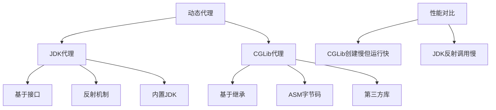
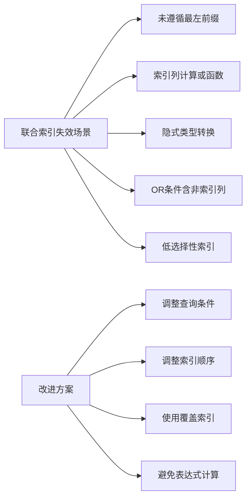
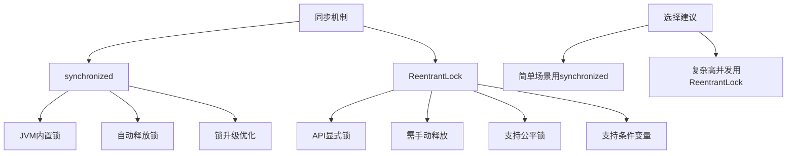
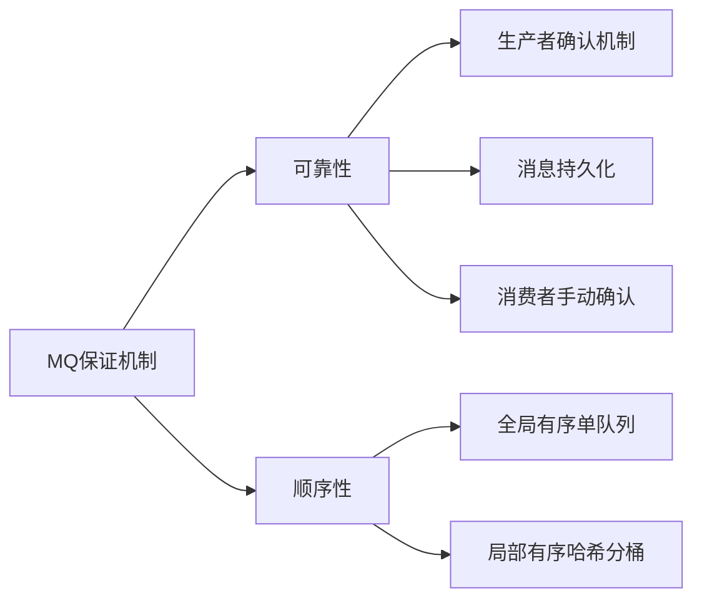
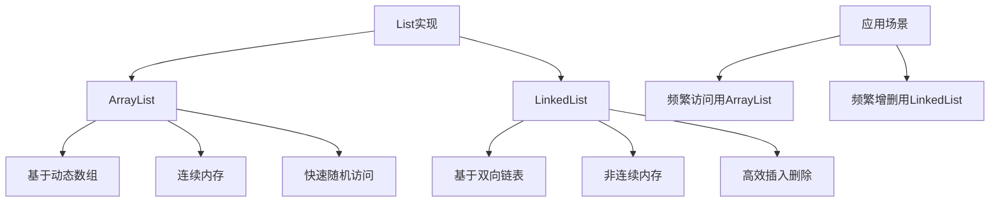
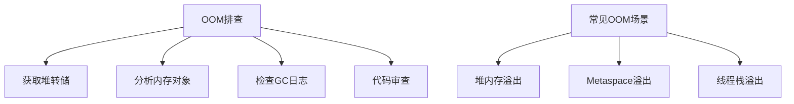
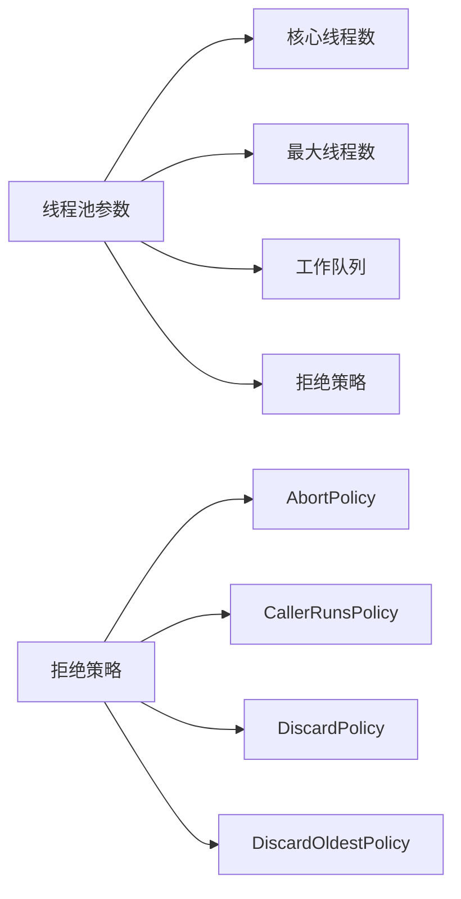
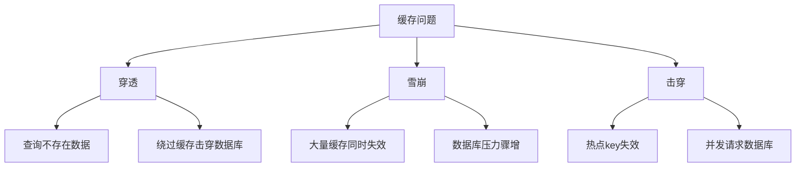
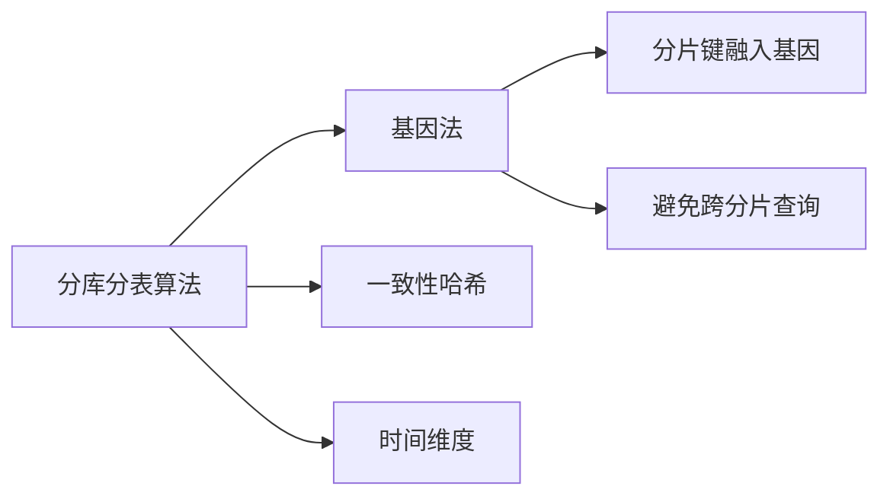
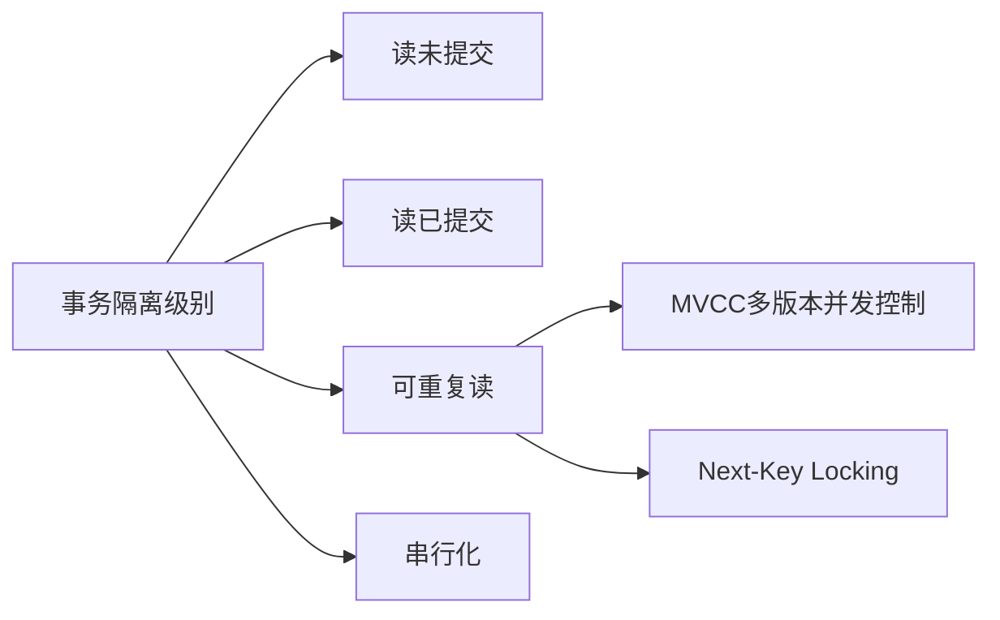

## Java面试题全面解答

作为资深Java开发工程师，我将针对您提出的面试题提供全面解答。每个问题的解答将包括核心知识点梳理、详细讲解、扩展内容及最佳实践。

---

### **1. HashMap如何解决哈希冲突？红黑树化为何阈值为8？**

**核心知识点梳理**：
```mermaid
flowchart TD
    A[HashMap冲突解决] --> B[链表法]
    A --> C[红黑树转换]
    
    B --> B1[哈希桶中存储链表]
    B --> B2[O(n)查找性能]
    
    C --> C1[链表长度阈值=8]
    C --> C2[退树化阈值=6]
    C --> C3[O(log n)查找性能]
    
    D[阈值8的原因] --> D1[泊松分布概率]
    D --> D2[性能权衡]
    D --> D3[空间成本权衡]
```

**详细解答**：
-   **哈希冲突解决**：HashMap使用**链表法**解决冲突（数组+链表结构）。当哈希冲突时，将元素添加到链表末尾。
-   **红黑树转换阈值**：
    -   链表长度阈值**8**选择基于**泊松分布**理论计算（哈希函数良好时，链表长度超过8的概率极低约0.000006%）。
    -   阈值**8**是性能与空间成本的权衡（红黑树维护成本高于链表，小链表时链表性能更好）。
    -   退树化阈值为**6**（避免频繁转换）。

**扩展内容**：
-   最佳实践：设置合理的初始容量（避免频繁resize）、重写hashCode()减少冲突。
-   常见问题：多线程扩容可能导致死链（应使用ConcurrentHashMap）。

---

### **2. CGLib和JDK动态代理区别，哪个性能好？**

**核心知识点梳理**：


**详细解答**：
-   **区别**：
    -   **JDK代理**：要求目标类实现接口，通过反射调用方法。
    -   **CGLib代理**：通过继承目标类生成子类（无需接口），使用ASM字节码技术直接调用方法。
-   **性能**：
    -   **CGLib运行性能更好**（直接调用非反射），但生成代理类较慢。
    -   JDK代理适用于接口场景，CGLib适用于无接口类（但无法代理final类/方法）。

**扩展内容**：
-   最佳实践：Spring默认使用JDK代理（有接口时），否则用CGLib。
-   常见问题：CGLib可能导致Metaspace内存溢出（需监控代理类生成）。

---

### **3. 联合索引失效如何改进？**

**核心知识点梳理**：


**详细解答**：
-   **失效场景及改进**：
    1.  **未遵循最左前缀**：查询条件缺少最左列（如索引`(a,b)`，查询仅用`b`）。
        -   改进：调整查询条件包含最左列，或调整索引顺序。
    2.  **索引列参与计算**：如`WHERE age+1>20`。
        -   改进：重构查询避免计算（如`WHERE age>19`）。
    3.  **隐式类型转换**：字段类型与查询值类型不一致（如字符串字段用数字查询）。
        -   改进：确保类型一致（如`id='10086'`而非`id=10086`）。
    4.  **OR连接非索引列**：如`WHERE a=1 OR b=2`（b无索引）。
        -   改进：为b建索引或使用UNION改写。
    5.  **低选择性索引**：区分度低的列（如性别）单独建索引。
        -   改进：结合高选择性列建组合索引或使用覆盖索引。

**扩展内容**：
-   最佳实践：使用`EXPLAIN`分析执行计划；定期更新统计信息（`ANALYZE TABLE`）。
-   常见问题：过度索引影响写性能（单表索引建议不超过5个）。

---

### **4. synchronized vs ReentrantLock区别**

**核心知识点梳理**：


**详细解答**：
-   **区别**：
    -   **实现机制**：synchronized是JVM内置锁（基于Monitor对象），ReentrantLock是API显式锁（基于AQS）。
    -   **功能特性**：
        -   ReentrantLock支持**公平锁**、**可中断锁**（`lockInterruptibly()`）、**超时尝试锁**（`tryLock()`）、**条件变量**（`Condition`）。
        -   synchronized仅支持非公平锁，无超时功能。
    -   **性能**：JDK1.6后synchronized性能接近（锁升级优化：无锁→偏向锁→轻量级锁→重量级锁）。

**扩展内容**：
-   最佳实践：简单同步用synchronized（代码简洁）；复杂场景（如需要条件变量）用ReentrantLock。
-   常见问题：ReentrantLock需在finally中unlock()，否则易死锁。

---

### **5. MQ如何保证可靠性、顺序性？**

**核心知识点梳理**：


**详细解答**：
-   **可靠性**：
    1.  **生产者确认**：Broker持久化后返回ACK（同步/异步重试）。
    2.  **消息持久化**：磁盘刷盘+副本同步（如RocketMQ多副本）。
    3.  **消费者确认**：业务处理成功后手动ACK（避免自动ACK丢失消息）。
-   **顺序性**：
    -   **全局有序**：单队列+单消费者（性能低）。
    -   **局部有序**：同一业务键（如订单ID）哈希到同一队列，单线程消费。

**扩展内容**：
-   最佳实践：配合幂等处理（如唯一键去重）避免重复消费。
-   常见问题：消息积压时扩容消费者（需同步增加队列数）。

---

### **6. ArrayList vs LinkedList区别**

**核心知识点梳理**：


**详细解答**：
-   **区别**：
    -   **底层结构**：ArrayList基于动态数组（内存连续）；LinkedList基于双向链表（指针连接）。
    -   **性能**：
        | 操作         | ArrayList       | LinkedList      |
        |--------------|-----------------|-----------------|
        | 随机访问     | O(1)（通过索引）| O(n)（需遍历）  |
        | 头部插入删除 | O(n)（需移位）  | O(1)            |
        | 内存占用     | 较少（无指针）  | 较多（两个指针）|
-   **使用场景**：
    -   ArrayList：频繁随机访问（如get/set）、元素数量稳定。
    -   LinkedList：频繁头部/尾部插入删除（如队列/栈）。

**扩展内容**：
-   最佳实践：多数场景用ArrayList（缓存友好）；LinkedList注意内存开销。
-   常见问题：ArrayList扩容成本高（建议设置初始容量）。

---

### **7. OOM怎么排查？**

**核心知识点梳理**：


**详细解答**：
-   **排查步骤**：
    1.  **获取堆转储**：OOM时通过`-XX:+HeapDumpOnOutOfMemoryError`生成dump文件，用MAT/JVisualVM分析。
    2.  **分析大对象**：查看对象占用空间（如内存泄漏的集合类）。
    3.  **检查GC日志**：`-Xlog:gc*`观察是否频繁GC但回收不足（可能内存泄漏）。
    4.  **代码审查**：常见泄漏场景（如静态集合、未关闭资源、类加载器泄漏）。
-   **常见OOM类型**：
    -   **Heap OOM**：对象过多（调整`-Xmx`，修复泄漏）。
    -   **Metaspace OOM**：类加载过多（调整`-XX:MaxMetaspaceSize`）。
    -   **Stack Overflow**：递归过深（调整`-Xss`）。

**扩展内容**：
-   最佳实践：监控堆内存/G频率；避免长时间持有大对象引用。
-   工具推荐：JProfiler、Arthas在线诊断。

---

### **8. 线程池核心参数、原理、四种拒绝策略**

**核心知识点梳理**：


**详细解答**：
-   **核心参数**：
    -   `corePoolSize`：核心线程数（常驻线程）。
    -   `maxPoolSize`：最大线程数（队列满后创建新线程）。
    -   `workQueue`：任务队列（如ArrayBlockingQueue）。
    -   `keepAliveTime`：非核心线程空闲存活时间。
-   **工作原理**：
    1.  任务提交→优先核心线程执行。
    2.  核心线程满→任务入队列。
    3.  队列满→创建非核心线程（直至maxPoolSize）。
    4.  线程达max且队列满→触发拒绝策略。
-   **拒绝策略**：
    1.  **AbortPolicy**（默认）：抛RejectedExecutionException。
    2.  **CallerRunsPolicy**：由提交任务的线程执行。
    3.  **DiscardPolicy**：静默丢弃任务。
    4.  **DiscardOldestPolicy**：丢弃队列最旧任务并重试。

**示例场景**：
-   电商下单服务：核心线程=CPU数，队列用有界队列（避免积压），拒绝策略用CallerRunsPolicy（保证订单不丢失）。

**扩展内容**：
-   最佳实践：禁止使用无界队列（可能导致OOM）；根据任务类型定制线程池（IO密集型可增大线程数）。
-   常见问题：线程池死锁（任务间相互等待）。

---

### **9. 缓存穿透、雪崩**

**核心知识点梳理**：


**详细解答**：
-   **缓存穿透**：查询**不存在的数据**（如恶意请求不存在的ID）。
    -   解决：① **布隆过滤器**（预检数据是否存在）；② 缓存空值（设置短过期时间）。
-   **缓存雪崩**：**大量缓存同时失效**（如缓存服务器重启）。
    -   解决：① 过期时间加随机值；② 集群高可用（Redis Cluster）；③ 熔断降级。
-   **缓存击穿**：**热点key突然失效**（如并发请求数据库）。
    -   解决：① 互斥锁（仅一个线程重建缓存）；② 热点数据永不过期。

**扩展内容**：
-   最佳实践：多层缓存（本地缓存+分布式缓存）；监控缓存命中率。
-   常见问题：布隆过滤器误判（可调整哈希函数）。

---

### **10. 分库分表：基因法优缺点**

**核心知识点梳理**：


**详细解答**：
-   **基因法**：将分片信息（如用户ID哈希值）融入业务ID（如订单ID），保证相同用户的数据落在同一分片。
    -   优点：① 避免跨分片查询（如查用户所有订单）；② 扩容方便（仅影响部分分片）。
    -   缺点：① ID生成复杂；② 基因选择不当可能导致数据倾斜。
-   **对比其他算法**：
    -   **一致性哈希**：扩容时仅重分布部分数据（但实现复杂）。
    -   **时间维度**：按时间分片（如每月一表），适合时序数据。

**扩展内容**：
-   最佳实践：分片键选择高选择性字段；逐步迁移数据。
-   常见问题：分布式ID生成（推荐雪花算法）。

---

### **11. MySQL隔离级别：可重复读如何避免幻读？**

**核心知识点梳理**：


**详细解答**：
-   **可重复读**（Repeatable Read）：事务内多次读取同一数据结果一致。
-   **避免幻读机制**：
    -   **MVCC**：通过undo日志创建数据快照，读操作基于快照（无幻读）。
    -   **Next-Key Lock**：锁住记录+间隙（如`WHERE age>20`会锁20~∞间隙），防止其他事务插入新数据。
-   **对比Oracle**：Oracle默认读已提交，通过回滚段实现多版本。

**扩展内容**：
-   最佳实践：高并发场景可用读已提交（减少锁竞争）。
-   常见问题：长事务导致undo日志膨胀。

---

### **12. G1如何避免内存碎片？**

**详细解答**：
-   **G1收集器设计**：将堆划分为多个Region（大小相等），避免全局碎片。
-   **避免碎片机制**：
    -   **并发标记**：识别空闲Region。
    -   **压缩回收**：将存活对象复制到空闲Region（整理内存）。
-   **对比CMS**：CMS仅标记清除（不压缩），易产生碎片。

**扩展内容**：
-   最佳实践：G1适合大堆应用（如堆>8GB）；设置最大暂停时间（`-XX:MaxGCPauseMillis`）。

---

### **13. MySQL vs Oracle区别**

**核心区别**：
| 特性         | MySQL                          | Oracle                      |
|--------------|--------------------------------|-----------------------------|
| 许可证       | 开源（GPL）                    | 商业收费                    |
| 性能         | 读优化（适合Web）              | 写优化、高并发              |
| 功能         | 基础ACID、分区表               | 高级功能（如物化视图）      |
| 适用场景     | 中小规模应用、互联网公司       | 大型企业、金融系统          |

**扩展**：MySQL更轻量、易部署；Oracle支持更复杂查询优化。

---

### **14. AI工具使用 & 代码BUG处理**

**AI工具使用**：
-   **用途**：① 代码生成（如GitHub Copilot）；② 漏洞扫描（如SonarQube）；③ 日志分析（如ELK）。
-   **处理他人BUG**：
    1.  定位问题：日志、调试、复现路径。
    2.  沟通协作：明确影响范围，提PR修复。
    3.  测试回归：避免引入新BUG。

---

### **15. 算法与SQL题**

#### **（1）二叉树层序遍历（LeetCode 102）**
**解题思路**：BFS广度优先，队列实现。
```java
public List<List<Integer>> levelOrder(TreeNode root) {
    List<List<Integer>> res = new ArrayList<>();
    if (root == null) return res;
    Queue<TreeNode> queue = new LinkedList<>();
    queue.offer(root);
    while (!queue.isEmpty()) {
        int size = queue.size();
        List<Integer> level = new ArrayList<>();
        for (int i = 0; i < size; i++) {
            TreeNode node = queue.poll();
            level.add(node.val);
            if (node.left != null) queue.offer(node.left);
            if (node.right != null) queue.offer(node.right);
        }
        res.add(level);
    }
    return res;
}
```
-   时间复杂度：O(n)；空间复杂度：O(n)。

#### **（2）最长重复子数组（LeetCode 718）**
**解题思路**：动态规划（dp[i][j]表示以A[i-1]和B[j-1]结尾的公共子数组长度）。
```java
public int findLength(int[] A, int[] B) {
    int m = A.length, n = B.length;
    int[][] dp = new int[m + 1][n + 1];
    int max = 0;
    for (int i = 1; i <= m; i++) {
        for (int j = 1; j <= n; j++) {
            if (A[i - 1] == B[j - 1]) {
                dp[i][j] = dp[i - 1][j - 1] + 1;
                max = Math.max(max, dp[i][j]);
            }
        }
    }
    return max;
}
```
-   时间复杂度：O(m*n)；空间复杂度：O(m*n)（可优化为O(n)）。

#### **（3）SQL两表联查求平均工资**
```sql
-- 示例：员工表employees和工资表salaries，求各部门平均工资
SELECT e.dept_id, AVG(s.salary) AS avg_salary
FROM employees e
JOIN salaries s ON e.id = s.employee_id
GROUP BY e.dept_id;
```

---

以上解答涵盖了面试深度与广度，希望对您的准备有所帮助！如有进一步问题，欢迎交流。
