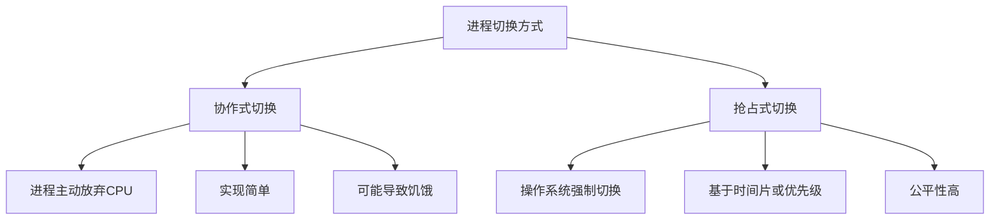
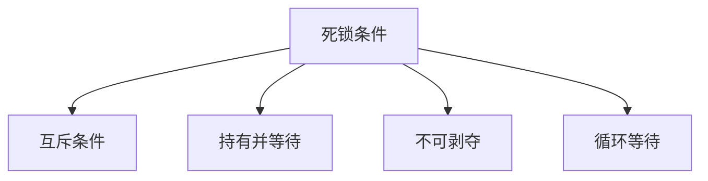
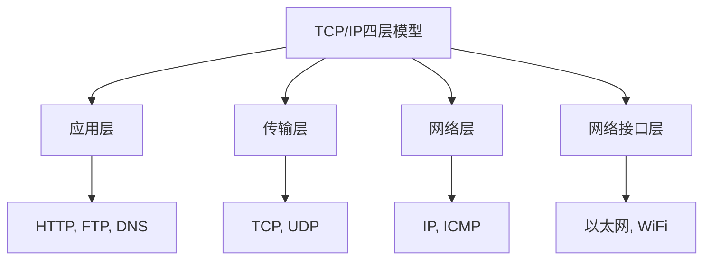
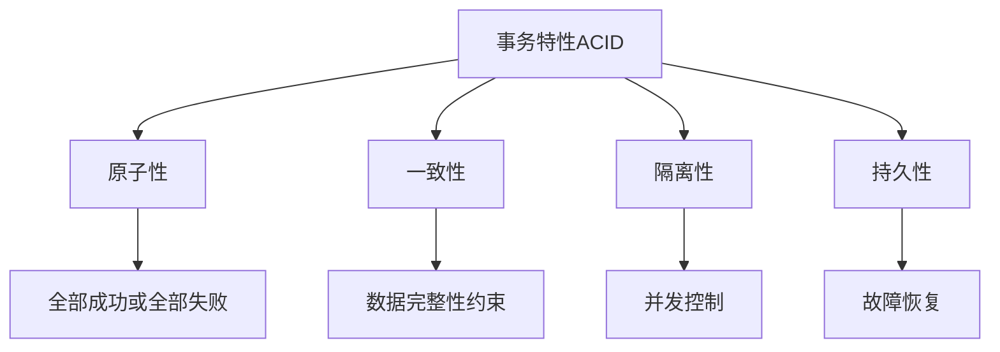
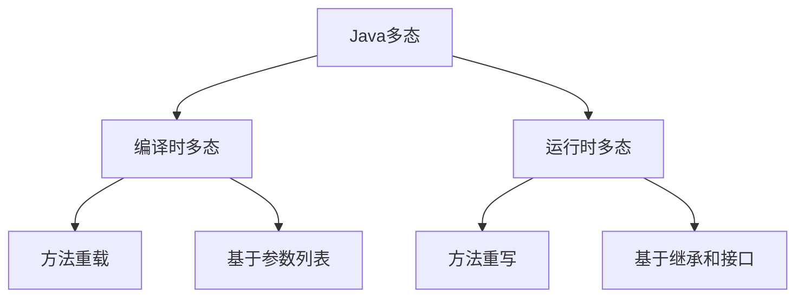
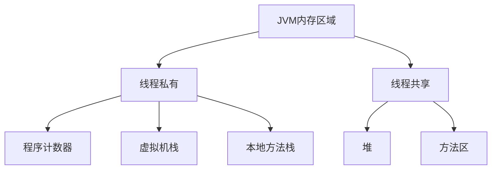

## 面试题全面解答

作为资深Java开发工程师，我将针对您提出的面试题提供全面解答。内容涵盖项目经验、操作系统、计算机网络、数据结构、数据库、Java核心知识及算法题。每个问题的解答将包括核心知识点梳理、详细讲解、扩展内容及最佳实践。

---

### **项目经验介绍**

在面试中，项目经验是评估候选人技术能力和实践经验的关键。我将以一个典型的分布式电商系统项目为例进行介绍。

**项目背景**：开发一个高可用、可扩展的电商平台，处理每日百万级用户访问和交易。

**我的角色**：后端核心开发工程师，负责订单模块和支付模块的设计与实现。

**技术栈**：
- 后端：Spring Boot、Spring Cloud微服务架构
- 数据库：MySQL分库分表、Redis缓存
- 消息队列：RocketMQ保证最终一致性
- 监控：ELK日志分析、Prometheus监控

**挑战与解决方案**：
1. **高并发订单处理**：使用Redis分布式锁防止超卖，通过消息队列异步处理订单创建，保证系统响应速度。
2. **分布式事务**：采用RocketMQ事务消息实现订单和库存的最终一致性，避免数据不一致。
3. **性能优化**：数据库分库分表（按用户ID哈希），使用Elasticsearch实现商品搜索，缓存热点数据。
4. **故障处理**：引入Hystrix熔断机制，防止服务雪崩，并设置降级策略。

**成果**：系统支持峰值10万QPS，订单处理延迟低于100ms，可用性99.99%。

通过项目经验，我展示了在分布式系统设计、性能优化和故障处理方面的能力。在面试中，我会详细描述具体场景、技术选型理由和团队协作方式。

---

### **1. 进程切换方式的区别和特点**

**核心知识点梳理**：


**详细解答**：
-   **协作式切换（Cooperative Multitasking）**：进程主动调用系统调用（如yield()）放弃CPU。优点是实现简单，但缺点是如果一个进程不放弃CPU，会导致整个系统阻塞。常见于早期操作系统如Windows 3.x。
-   **抢占式切换（Preemptive Multitasking）**：操作系统基于时间片或优先级强制暂停当前进程，切换其他进程。优点保证了公平性和响应性，现代操作系统（如Linux、Windows）均采用此方式。

**扩展内容**：
-   最佳实践：在实时系统中，优先级抢占可保证高优先级任务及时处理。
-   常见问题：抢占式切换需要更复杂的上下文保存（寄存器、堆栈等），开销较大。

---

### **2. 死锁条件**

**核心知识点梳理**：


**详细解答**：
死锁发生必须同时满足以下四个条件：
1.  **互斥条件（Mutual Exclusion）**：资源只能被一个进程独占使用。
2.  **持有并等待（Hold and Wait）**：进程持有资源的同时等待其他资源。
3.  **不可剥夺（No Preemption）**：资源不能被强制剥夺，只能由进程主动释放。
4.  **循环等待（Circular Wait）**：进程之间形成资源等待的环形链。

**扩展内容**：
-   死锁处理策略：
    -   **预防**：破坏其中一个条件（如资源一次性分配）。
    -   **避免**：银行家算法动态检测。
    -   **检测与恢复**：定期检测死锁并撤销进程。
-   最佳实践：在编程中避免嵌套锁、使用超时机制（如tryLock）。

---

### **3. TCP/IP四层模型**

**核心知识点梳理**：


**详细解答**：
TCP/IP模型分为四层：
1.  **应用层**：提供应用程序间的通信（如HTTP、FTP、DNS）。
2.  **传输层**：提供端到端的数据传输（如TCP可靠传输、UDP不可靠传输）。
3.  **网络层**：负责寻址和路由（如IP协议、ICMP）。
4.  **网络接口层**：处理物理网络访问（如以太网协议）。

**对比OSI七层模型**：TCP/IP更实用，OSI更理论化。

**扩展内容**：
-   最佳实践：Wireshark抓包分析各层协议。
-   常见问题：TCP粘包/拆包（通过定义消息边界解决）。

---

### **4. 常用排序复杂度比较**

**核心知识点梳理**：
```mermaid
flowchart TD
    A[排序算法] --> B[O(n²)算法]
    A --> C[O(n log n)算法]
    A --> D[线性算法]
    
    B --> B1[冒泡排序]
    B --> B2[选择排序]
    B --> B3[插入排序]
    
    C --> C1[快速排序]
    C --> C2[归并排序]
    C --> C3[堆排序]
    
    D --> D1[计数排序]
    D --> D2[桶排序]
    D --> D3[基数排序]
```

**详细解答**：
常见排序算法的时间复杂度和空间复杂度：

| 排序算法     | 平均时间复杂度 | 最坏时间复杂度 | 空间复杂度 | 稳定性 |
|--------------|----------------|----------------|------------|--------|
| 冒泡排序     | O(n²)          | O(n²)          | O(1)       | 稳定   |
| 选择排序     | O(n²)          | O(n²)          | O(1)       | 不稳定 |
| 插入排序     | O(n²)          | O(n²)          | O(1)       | 稳定   |
| 快速排序     | O(n log n)     | O(n²)          | O(log n)   | 不稳定 |
| 归并排序     | O(n log n)     | O(n log n)     | O(n)       | 稳定   |
| 堆排序       | O(n log n)     | O(n log n)     | O(1)       | 不稳定 |
| 计数排序     | O(n + k)       | O(n + k)       | O(k)       | 稳定   |
| 基数排序     | O(n * k)       | O(n * k)       | O(n + k)   | 稳定   |

**扩展内容**：
-   最佳实践：小数据量用插入排序，大数据量用快速排序或归并排序，非比较排序适用于特定范围数据。
-   常见问题：快速排序最坏情况优化（随机化pivot）。

---

### **5. 关系型数据库事务特性**

**核心知识点梳理**：


**详细解答**：
事务ACID特性：
-   **原子性（Atomicity）**：事务是一个不可分割的单位，要么全部执行，要么全部回滚（通过undo日志实现）。
-   **一致性（Consistency）**：事务使数据库从一个一致状态转换到另一个一致状态（如外键约束）。
-   **隔离性（Isolation）**：并发事务之间互不干扰（通过锁或MVCC实现）。
-   **持久性（Durability）**：事务提交后，修改永久保存（通过redo日志实现）。

**扩展内容**：
-   最佳实践：根据业务需求设置隔离级别（如读已提交）。
-   常见问题：幻读需可重复读隔离级别+Next-Key Lock解决。

---

### **6. Java多态及其使用场景**

**核心知识点梳理**：


**详细解答**：
-   **多态定义**：同一操作作用于不同对象，产生不同行为。Java中多态分为：
    -   **编译时多态**：方法重载（Overload），根据参数类型和数量在编译时确定调用方法。
    -   **运行时多态**：方法重写（Override），基于继承和接口，在运行时根据实际对象类型调用方法。
-   **使用场景**：
    -   **方法重载**：提供多种参数类型的便捷方法（如构造函数重载）。
    -   **方法重写**：实现接口和抽象类，提高代码扩展性（如策略模式）。

**示例**：
```java
// 运行时多态
interface Animal { void sound(); }
class Dog implements Animal { public void sound() { System.out.println("Woof"); } }
class Cat implements Animal { public void sound() { System.out.println("Meow"); } }

public class Test {
    public static void main(String[] args) {
        Animal a = new Dog();
        a.sound(); // 输出 Woof
        a = new Cat();
        a.sound(); // 输出 Meow
    }
}
```

**扩展内容**：
-   最佳实践：面向接口编程，降低耦合。
-   常见问题：重写方法访问权限不能比父类更严格。

---

### **7. JVM的内存区域**

**核心知识点梳理**：


**详细解答**：
JVM内存分为以下几个区域：
-   **线程私有区域**：
    -   **程序计数器**：当前线程执行的字节码行号指示器。
    -   **虚拟机栈**：存储方法调用的栈帧（局部变量表、操作数栈等）。
    -   **本地方法栈**：为Native方法服务。
-   **线程共享区域**：
    -   **堆**：存放对象实例，是GC主要区域（分新生代和老年代）。
    -   **方法区**：存储类信息、常量、静态变量（JDK8后为元空间）。

**扩展内容**：
-   最佳实践：监控堆内存使用，避免OOM；调整栈大小（-Xss）避免StackOverflow。
-   常见问题：方法区溢出（过多类加载）。

---

### **8. 手撕：LeetCode原题合并**

这里假设是合并两个有序链表（LeetCode 21）或合并区间（LeetCode 56）。我将提供两者解答。

#### **（1）合并两个有序链表（LeetCode 21）**

**解题思路**：使用迭代法，比较两个链表节点值，将较小节点加入新链表。
-   时间复杂度：O(m+n)
-   空间复杂度：O(1)

```java
/**
 * Definition for singly-linked list.
 * public class ListNode {
 *     int val;
 *     ListNode next;
 *     ListNode() {}
 *     ListNode(int val) { this.val = val; }
 *     ListNode(int val, ListNode next) { this.val = val; this.next = next; }
 * }
 */
class Solution {
    public ListNode mergeTwoLists(ListNode list1, ListNode list2) {
        ListNode dummy = new ListNode(-1); // 哑节点简化操作
        ListNode curr = dummy;
        while (list1 != null && list2 != null) {
            if (list1.val <= list2.val) {
                curr.next = list1;
                list1 = list1.next;
            } else {
                curr.next = list2;
                list2 = list2.next;
            }
            curr = curr.next;
        }
        // 连接剩余部分
        curr.next = list1 != null ? list1 : list2;
        return dummy.next;
    }
}
```

#### **（2）合并区间（LeetCode 56）**

**解题思路**：先按区间起点排序，然后遍历合并重叠区间。
-   时间复杂度：O(n log n)（排序）
-   空间复杂度：O(1)（不考虑输出）

```java
class Solution {
    public int[][] merge(int[][] intervals) {
        if (intervals.length == 0) return new int[0][];
        // 按起点排序
        Arrays.sort(intervals, (a, b) -> a[0] - b[0]);
        List<int[]> merged = new ArrayList<>();
        int[] current = intervals[0];
        for (int i = 1; i < intervals.length; i++) {
            if (current[1] >= intervals[i][0]) {
                // 合并区间
                current[1] = Math.max(current[1], intervals[i][1]);
            } else {
                merged.add(current);
                current = intervals[i];
            }
        }
        merged.add(current);
        return merged.toArray(new int[merged.size()][]);
    }
}
```

---

以上解答涵盖了面试的深度与广度，希望对您有所帮助。如果您有更多问题，欢迎继续交流！
