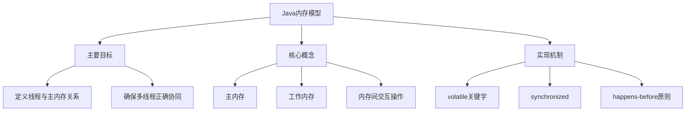
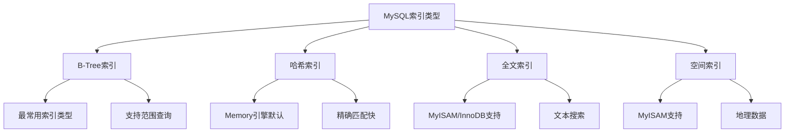
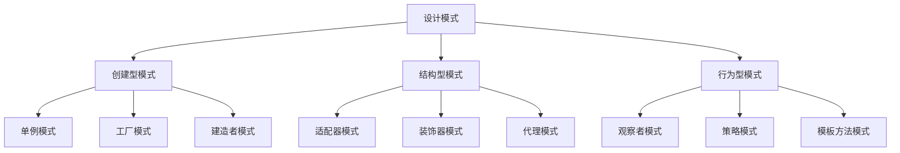
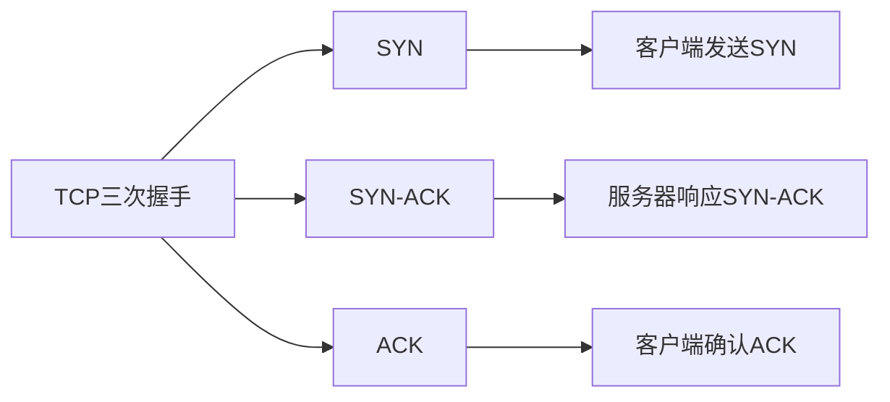
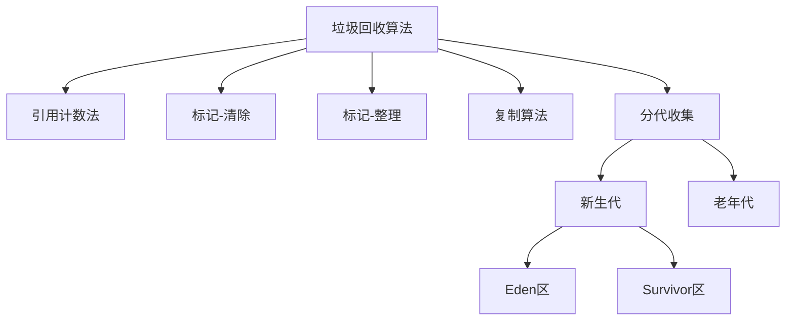
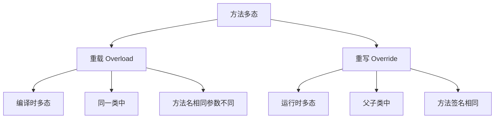

# 面试题全面解答

## 1. JMM Java内存模型

**核心知识点梳理**：


**详细解答**：

Java内存模型(Java Memory Model, JMM)定义了Java虚拟机在多线程环境中如何与计算机内存进行交互，规定了线程如何和何时可以看到其他线程修改过的共享变量，以及如何同步访问共享变量。

**主要组成部分**：
- **主内存**：所有共享变量都存储在主内存中
- **工作内存**：每个线程有自己的工作内存，保存了该线程使用到的变量的主内存副本

**内存间交互操作**：
- read：从主内存读取数据
- load：将read的值放入工作内存
- use：线程使用工作内存中的变量值
- assign：线程为工作内存中的变量赋值
- store：将工作内存中的变量传送到主内存
- write：将store得到的值写入主内存变量

**关键特性**：
- **原子性**：synchronized块保证原子性
- **可见性**：volatile保证可见性，修改立即刷新到主内存
- **有序性**：volatile和synchronized保证有序性，禁止指令重排序

**实现机制**：
```java
public class JMMExample {
    private volatile boolean flag = false; // 保证可见性
    private int count = 0;
    
    public void writer() {
        count = 42;    // 普通写操作
        flag = true;   // volatile写，之前的所有写操作对后续读可见
    }
    
    public void reader() {
        if (flag) {    // volatile读，之后的所有读操作能看到之前的所有写
            System.out.println(count); // 保证输出42
        }
    }
}
```

**扩展内容**：
- 最佳实践：正确使用volatile和synchronized，遵循happens-before原则
- 常见问题：错误的内存可见性假设导致线程安全问题

## 2. MySQL索引有哪些

**核心知识点梳理**：


**详细解答**：

**B-Tree索引**（实际是B+Tree）：
- 最常用的索引类型，适合全键值、键值范围或键前缀查找
- 支持=, >, >=, <, <=, BETWEEN, LIKE等操作
- InnoDB的聚簇索引使用B+Tree，数据存储在叶子节点

**哈希索引**：
- 基于哈希表实现，只有精确匹配所有列的查询才有效
- Memory引擎默认索引类型
- 检索速度非常快，但不支持范围查询和排序

**全文索引**：
- 用于文本内容的全文搜索
- MyISAM和InnoDB都支持
- 使用MATCH AGAINST语法

**空间索引**：
- 用于地理数据存储和查询
- MyISAM支持，InnoDB从5.7开始支持
- 使用R-Tree实现

**索引优缺点**：
- 优点：大大加快数据检索速度，加快表连接速度
- 缺点：占用磁盘空间，降低DML操作速度

**创建索引示例**：
```sql
-- 创建普通索引
CREATE INDEX idx_name ON users(name);

-- 创建唯一索引
CREATE UNIQUE INDEX idx_email ON users(email);

-- 创建全文索引
CREATE FULLTEXT INDEX idx_content ON articles(content);

-- 创建复合索引
CREATE INDEX idx_name_age ON users(name, age);
```

**扩展内容**：
- 最佳实践：为经常查询的列创建索引，避免过度索引
- 常见问题：索引失效场景（函数操作、类型转换、前导通配符等）

## 3. 排序算法有哪些

**核心知识点梳理**：
```mermaid
flowchart TD
    A[排序算法] --> B[比较排序]
    A --> C[非比较排序]
    
    B --> B1[O(n²)算法]
    B --> B2[O(n log n)算法]
    
    C --> C1[计数排序]
    C --> C2[桶排序]
    C --> C3[基数排序]
    
    B1 --> B11[冒泡排序]
    B1 --> B12[选择排序]
    B1 --> B13[插入排序]
    
    B2 --> B21[快速排序]
    B2 --> B22[归并排序]
    B2 --> B23[堆排序]
```

**详细解答**：

**O(n²)算法**：
- **冒泡排序**：相邻元素比较交换，稳定
- **选择排序**：每次选择最小元素放到已排序末尾，不稳定
- **插入排序**：将元素插入到已排序序列适当位置，稳定

**O(n log n)算法**：
- **快速排序**：分治思想，选取基准分区递归，不稳定
- **归并排序**：分治思想，合并已排序子序列，稳定
- **堆排序**：构建堆结构不断取堆顶，不稳定

**线性时间排序**：
- **计数排序**：统计元素出现次数，稳定
- **桶排序**：将数据分到有限数量的桶中，稳定
- **基数排序**：按位排序，稳定

**算法选择建议**：
- 小数据量：插入排序
- 大数据量：快速排序（平均性能好）
- 需要稳定：归并排序
- 数据范围已知且较小：计数/桶/基数排序

**快速排序Java实现**：
```java
public class QuickSort {
    public void sort(int[] arr) {
        quickSort(arr, 0, arr.length - 1);
    }
    
    private void quickSort(int[] arr, int low, int high) {
        if (low < high) {
            int pi = partition(arr, low, high); // 分区操作
            quickSort(arr, low, pi - 1);  // 递归左半部分
            quickSort(arr, pi + 1, high); // 递归右半部分
        }
    }
    
    private int partition(int[] arr, int low, int high) {
        int pivot = arr[high]; // 选择最右元素作为基准
        int i = low - 1; // 较小元素的索引
        
        for (int j = low; j < high; j++) {
            if (arr[j] < pivot) { // 当前元素小于基准
                i++;
                swap(arr, i, j); // 交换元素
            }
        }
        swap(arr, i + 1, high); // 将基准放到正确位置
        return i + 1;
    }
    
    private void swap(int[] arr, int i, int j) {
        int temp = arr[i];
        arr[i] = arr[j];
        arr[j] = temp;
    }
}
```

**扩展内容**：
- 最佳实践：根据数据特性和需求选择合适的排序算法
- 常见问题：快速排序最坏情况退化为O(n²)，可通过随机化基准避免

## 4. Linux命令

**详细解答**：

**查看进程信息命令**：
- `ps aux`：查看所有进程详细信息
- `ps -ef`：查看完整格式的进程信息
- `top`：实时显示进程状态和系统资源使用情况
- `htop`：top的增强版，交互性更好
- `pstree`：以树状图显示进程关系
- `pgrep <进程名>`：查找进程ID

**查看端口命令**：
- `netstat -tuln`：查看所有监听端口
- `netstat -tun`：查看所有已建立的连接
- `ss -tuln`：netstat的现代替代，更快
- `lsof -i :<端口号>`：查看指定端口被哪个进程占用
- `nmap -sT -O localhost`：扫描本地开放端口

**常用组合示例**：
```bash
# 查看Java相关进程
ps aux | grep java

# 查看8080端口占用情况
netstat -tuln | grep 8080
# 或
lsof -i :8080

# 实时监控系统进程
top

# 查看进程树
pstree -p

# 查找nginx进程ID
pgrep nginx
```

**扩展内容**：
- 最佳实践：熟练掌握常用进程和端口管理命令
- 常见问题：端口被占用时使用lsof查找并终止相应进程

## 5. 设计模式及举例说明

**核心知识点梳理**：


**详细解答**：

**创建型模式**：
1. **单例模式**：确保一个类只有一个实例
   ```java
   public class Singleton {
       private static Singleton instance;
       
       private Singleton() {} // 私有构造函数
       
       public static Singleton getInstance() {
           if (instance == null) {
               instance = new Singleton();
           }
           return instance;
       }
   }
   ```

2. **工厂模式**：创建对象而不暴露实例化逻辑
   ```java
   public interface Shape {
       void draw();
   }
   
   public class Circle implements Shape {
       public void draw() { System.out.println("画圆"); }
   }
   
   public class ShapeFactory {
       public Shape getShape(String type) {
           if ("CIRCLE".equals(type)) return new Circle();
           return null;
       }
   }
   ```

**结构型模式**：
1. **适配器模式**：使不兼容接口能一起工作
   ```java
   public interface MediaPlayer {
       void play(String audioType, String fileName);
   }
   
   public class MediaAdapter implements MediaPlayer {
       AdvancedMediaPlayer advancedPlayer;
       
       public MediaAdapter(String audioType) {
           if ("vlc".equals(audioType)) advancedPlayer = new VlcPlayer();
       }
       
       public void play(String audioType, String fileName) {
           if ("vlc".equals(audioType)) advancedPlayer.playVlc(fileName);
       }
   }
   ```

2. **装饰器模式**：动态添加功能
   ```java
   public interface Coffee {
       double getCost();
       String getDescription();
   }
   
   public class SimpleCoffee implements Coffee {
       public double getCost() { return 1.0; }
       public String getDescription() { return "简单咖啡"; }
   }
   
   public class MilkDecorator implements Coffee {
       protected Coffee decoratedCoffee;
       
       public MilkDecorator(Coffee coffee) {
           this.decoratedCoffee = coffee;
       }
       
       public double getCost() { return decoratedCoffee.getCost() + 0.5; }
       public String getDescription() { 
           return decoratedCoffee.getDescription() + ", 加牛奶"; 
       }
   }
   ```

**行为型模式**：
1. **观察者模式**：对象间的一对多依赖关系
   ```java
   public interface Observer {
       void update(String message);
   }
   
   public class ConcreteObserver implements Observer {
       public void update(String message) {
           System.out.println("收到消息: " + message);
       }
   }
   
   public class Subject {
       private List<Observer> observers = new ArrayList<>();
       
       public void addObserver(Observer observer) {
           observers.add(observer);
       }
       
       public void notifyObservers(String message) {
           for (Observer observer : observers) {
               observer.update(message);
           }
       }
   }
   ```

2. **策略模式**：定义算法族，封装并可互相替换
   ```java
   public interface PaymentStrategy {
       void pay(int amount);
   }
   
   public class CreditCardStrategy implements PaymentStrategy {
       public void pay(int amount) {
           System.out.println("信用卡支付: " + amount);
       }
   }
   
   public class ShoppingCart {
       private PaymentStrategy paymentStrategy;
       
       public void setPaymentStrategy(PaymentStrategy strategy) {
           this.paymentStrategy = strategy;
       }
       
       public void checkout(int amount) {
           paymentStrategy.pay(amount);
       }
   }
   ```

**扩展内容**：
- 最佳实践：根据具体场景选择合适的设计模式，不要过度设计
- 常见问题：滥用单例模式导致全局状态难以管理

## 6. 三次握手

**核心知识点梳理**：


**详细解答**：

TCP三次握手是建立连接的过程，确保双方都能发送和接收数据：

1. **第一次握手**：客户端发送SYN包(seq=x)到服务器，进入SYN_SENT状态
2. **第二次握手**：服务器收到SYN包，回应SYN+ACK包(seq=y, ack=x+1)，进入SYN_RCVD状态
3. **第三次握手**：客户端收到SYN+ACK包，发送ACK包(ack=y+1)，双方进入ESTABLISHED状态

**为什么需要三次握手**：
- 防止已失效的连接请求报文突然传送到服务器，导致错误
- 确保双方都知道对方能正常发送和接收数据
- 协商初始序列号，保证数据按序传输

**握手过程示例**：
```
客户端(Clinet)        服务器(Server)
    |------SYN----->|
    |<---SYN+ACK----|
    |------ACK----->|
```

**扩展内容**：
- 最佳实践：理解握手过程有助于排查网络连接问题
- 常见问题：SYN洪水攻击利用半开连接消耗服务器资源

## 7. 生产者消费者原理和过程

**详细解答**：

生产者消费者模式是多线程协作的经典模式，解决生产者和消费者速度不匹配问题。

**核心组件**：
- 生产者：产生数据的线程
- 消费者：处理数据的线程
- 缓冲区：存储数据的队列，解耦生产者和消费者

**实现方式**：
1. **使用wait()和notify()**：
   ```java
   public class ProducerConsumer {
       private final Queue<Integer> queue = new LinkedList<>();
       private final int CAPACITY = 5;
       
       public void produce() throws InterruptedException {
           int value = 0;
           while (true) {
               synchronized (queue) {
                   while (queue.size() == CAPACITY) {
                       queue.wait(); // 缓冲区满，等待
                   }
                   
                   queue.add(value);
                   System.out.println("生产: " + value);
                   value++;
                   
                   queue.notifyAll(); // 通知消费者
                   Thread.sleep(1000);
               }
           }
       }
       
       public void consume() throws InterruptedException {
           while (true) {
               synchronized (queue) {
                   while (queue.isEmpty()) {
                       queue.wait(); // 缓冲区空，等待
                   }
                   
                   int value = queue.poll();
                   System.out.println("消费: " + value);
                   
                   queue.notifyAll(); // 通知生产者
                   Thread.sleep(1000);
               }
           }
       }
   }
   ```

2. **使用BlockingQueue**（推荐）：
   ```java
   public class ProducerConsumer {
       private final BlockingQueue<Integer> queue = new LinkedBlockingQueue<>(5);
       
       public void produce() {
           int value = 0;
           while (true) {
               try {
                   queue.put(value); // 自动阻塞如果队列满
                   System.out.println("生产: " + value);
                   value++;
                   Thread.sleep(1000);
               } catch (InterruptedException e) {
                   Thread.currentThread().interrupt();
                   break;
               }
           }
       }
       
       public void consume() {
           while (true) {
               try {
                   int value = queue.take(); // 自动阻塞如果队列空
                   System.out.println("消费: " + value);
                   Thread.sleep(1000);
               } catch (InterruptedException e) {
                   Thread.currentThread().interrupt();
                   break;
               }
           }
       }
   }
   ```

**过程说明**：
1. 生产者检查缓冲区，如果满则等待，否则生产数据并放入缓冲区
2. 消费者检查缓冲区，如果空则等待，否则从缓冲区取出数据消费
3. 生产者和消费者通过wait/notify或阻塞队列机制协同工作

**扩展内容**：
- 最佳实践：使用BlockingQueue简化实现，避免手动同步
- 常见问题：死锁、活锁或资源竞争问题

## 8. 垃圾回收算法

**核心知识点梳理**：


**详细解答**：

**引用计数法**：
- 每个对象有一个引用计数器，被引用时加1，引用失效时减1
- 计数器为0时回收对象
- 优点：简单，实时性高
- 缺点：无法解决循环引用问题

**标记-清除算法**：
- 第一阶段：标记所有可达对象
- 第二阶段：清除未标记对象
- 优点：解决循环引用问题
- 缺点：产生内存碎片

**标记-整理算法**：
- 标记所有可达对象后，将存活对象向一端移动
- 然后清理边界外的内存
- 优点：避免内存碎片
- 缺点：移动对象成本高

**复制算法**：
- 将内存分为两块，每次只使用一块
- 垃圾回收时，将存活对象复制到另一块，然后清空当前块
- 优点：无碎片，简单高效
- 缺点：内存利用率只有50%

**分代收集算法**（现代JVM使用）：
- **新生代**：使用复制算法（Eden + 2个Survivor区）
- **老年代**：使用标记-清除或标记-整理算法

**GC过程示例**：
```java
public class GCDemo {
    public static void main(String[] args) {
        // 对象在Eden区分配
        Object obj1 = new Object();
        
        //  Minor GC后，存活对象移动到Survivor区
        System.gc();
        
        // 长期存活的对象最终进入老年代
        for (int i = 0; i < 15; i++) {
            System.gc();
        }
    }
}
```

**扩展内容**：
- 最佳实践：根据应用特性调整GC参数(-Xms, -Xmx, -XX:NewRatio等)
- 常见问题：Full GC频繁导致应用暂停时间过长

## 9. 抽象类、接口、普通类的区别

**详细解答**：

| 特性 | 普通类 | 抽象类 | 接口 |
|------|--------|--------|------|
| 实例化 | 可以直接实例化 | 不能实例化 | 不能实例化 |
| 方法实现 | 可以有完整实现 | 可以有抽象和具体方法 | Java8前只能有抽象方法 |
| 成员变量 | 无限制 | 无限制 | 默认public static final |
| 构造方法 | 可以有 | 可以有 | 不能有 |
| 继承 | 单继承 | 单继承 | 多实现 |
| 设计目的 | 具体实现 | 部分实现，部分规范 | 完全规范 |

**抽象类示例**：
```java
public abstract class Animal {
    protected String name;
    
    public Animal(String name) { // 抽象类可以有构造方法
        this.name = name;
    }
    
    public abstract void makeSound(); // 抽象方法
    
    public void sleep() { // 具体方法
        System.out.println(name + " is sleeping");
    }
}

public class Dog extends Animal {
    public Dog(String name) {
        super(name);
    }
    
    public void makeSound() { // 必须实现抽象方法
        System.out.println("Woof!");
    }
}
```

**接口示例**：
```java
public interface Flyable {
    int MAX_ALTITUDE = 10000; // 默认public static final
    
    void fly(); // 默认public abstract
    
    default void land() { // Java8默认方法
        System.out.println("Landing...");
    }
    
    static int getMaxAltitude() { // Java8静态方法
        return MAX_ALTITUDE;
    }
}

public class Bird implements Flyable {
    public void fly() {
        System.out.println("Bird is flying");
    }
}
```

**使用场景**：
- 普通类：完全确定的实现
- 抽象类：部分实现，需要子类完成剩余部分
- 接口：定义行为契约，不关心实现

**扩展内容**：
- 最佳实践：优先使用接口而非抽象类，提高灵活性
- 常见问题：过度使用继承导致类层次过深

## 10. 重载和重写

**核心知识点梳理**：


**详细解答**：

**重载(Overload)**：
- 在同一个类中，方法名相同但参数列表不同（参数类型、个数或顺序）
- 返回类型可以相同也可以不同
- 发生在编译时，是静态多态

**重写(Override)**：
- 在子类中重新定义父类的方法，方法签名必须相同
- 返回类型应该相同或是父类方法返回类型的子类型
- 访问权限不能比父类更严格
- 发生在运行时，是动态多态

**重载示例**：
```java
public class MathUtils {
    // 方法重载：方法名相同，参数列表不同
    public int add(int a, int b) {
        return a + b;
    }
    
    public double add(double a, double b) {
        return a + b;
    }
    
    public int add(int a, int b, int c) {
        return a + b + c;
    }
}
```

**重写示例**：
```java
public class Animal {
    public void makeSound() {
        System.out.println("Animal makes sound");
    }
    
    protected String getName() {
        return "Animal";
    }
}

public class Dog extends Animal {
    // 方法重写：方法签名相同
    @Override
    public void makeSound() {
        System.out.println("Dog barks");
    }
    
    // 正确：访问权限比父类更宽松
    @Override
    public String getName() {
        return "Dog";
    }
}
```

**区别总结**：
| 方面 | 重载 | 重写 |
|------|------|------|
| 发生位置 | 同一个类中 | 父子类中 |
| 参数列表 | 必须不同 | 必须相同 |
| 返回类型 | 可以不同 | 必须相同或是子类型 |
| 访问修饰符 | 无限制 | 不能更严格 |
| 异常声明 | 无限制 | 不能抛出更广泛异常 |
| 发生阶段 | 编译时 | 运行时 |

**扩展内容**：
- 最佳实践：使用@Override注解确保正确重写
- 常见问题：混淆重载和重写概念，错误认为返回类型不同就是重载

---

以上解答涵盖了面试的深度与广度，希望对您有所帮助。如果您有更多问题，欢迎继续交流！
