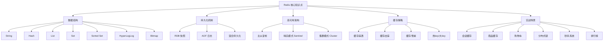

好的，针对你的面试经历和后续的深度技术考察要求，我将以你面试中涉及的**Redis**作为核心模块进行详细阐述。Redis作为美团闪购这类高并发、低延迟业务场景的核心组件，是面试官重点考察的技术点。

### 一、核心知识点图谱 (Redis)


---

### 二、Redis 详细讲解 (面向面试官)

面试官您好，接下来我重点阐述一下我对Redis的理解。在美团闪购这类**即时零售**业务中，Redis是保障高并发、低延迟和最终一致性的核心基础设施。

#### 1. 定义与角色定位
Redis (Remote Dictionary Server) 是一个基于内存的**键值数据库**。它提供了丰富的数据结构，支持持久化、事务、Pub/Sub等功能。在架构中，它通常作为：
- **缓存层 (Cache)**：加速热点数据访问，减轻后端数据库压力。
- **内存数据库 (In-Memory Database)**：存储临时或状态数据，如用户会话、购物车。
- **消息中间件 (Message Broker)**：利用List结构实现简单消息队列。

#### 2. 核心数据结构、工作原理及使用场景
Redis的价值很大程度上源于其丰富的数据结构，每种结构都对应着特定的业务场景。

| 数据结构 | 内部原理 | 美团闪购应用场景 | 注意事项 |
| :--- | :--- | :--- | :--- |
| **String** | 基于简单动态字符串(SDS)，可存文本、数字、二进制数据。 | 1. **商品库存**：`SET sku:1001:stock 100`<br>2. **分布式锁**：`SET lock:order NX EX 10`<br>3. **计数器**：`INCR user:1001:visits` | 1. 值过大时（>10KB）会浪费带宽和内存。<br>2. SETNX+EXPIRE非原子性，应用`SET key value NX EX seconds`。 |
| **Hash** | 底层是ziplist（元素少时）或hashtable。存储field-value对。 | 1. **商品信息缓存**：`HMSET sku:1001 name "iPhone" price 5999`<br>2. **用户属性会话**：`HSET user:1001 name "张三"` | 1. 不适合存储大量字段（如超过1000），因HGETALL会阻塞。<br>2. 可部分更新，节省网络开销。 |
| **List** | 底层是ziplist或linkedlist。双向链表，支持左右推送。 | 1. **秒杀排队**：`LPUSH seckill:queue user_id`<br>2. **消息队列**：`LPUSH task_queue, BRPOP task_queue 30`<br>3. **最新订单列表**：`LPUSH orders:1001 order_id` | 1. 生产者消费者模型需注意消息确认，避免消息丢失。<br>2. 大量元素时，LRANGE可能阻塞。 |
| **Sorted Set** | 底层是ziplist+skiplist。每个元素关联一个score用于排序。 | 1. **配送员距离排行榜**：`ZADD riders 1.2 "rider_a" 0.8 "rider_b"`<br>2. **热点商品TopN**：`ZINCRBY hot:goods 1 sku1001` | 1. 范围查询`ZRANGEBYSCORE`性能极高(O(logN))。<br>2. 注意ZSET的score是double类型，可能存在精度问题。 |

#### 3. 持久化机制：RDB与AOF
这是保证数据不丢失的关键。
- **RDB (快照)**：在指定时间间隔生成数据的二进制快照（dump.rdb）。
  - **工作原理**：fork一个子进程，子进程将数据写入临时RDB文件，写入完成后替换旧文件。
  - **优点**：文件紧凑，恢复速度快，适合灾难恢复。
  - **缺点**：会丢失最后一次快照后的所有数据。fork过程在数据量大时可能阻塞主线程。
  - **配置**：`save 900 1` # 900秒内至少1个key变化则触发保存。

- **AOF (追加日志)**：记录每一个写操作命令，重启时重新执行这些命令来恢复数据。
  - **工作原理**：将写命令追加到AOF缓冲区，根据策略（`appendfsync`）同步到磁盘。
    - `always`：每个命令都同步，数据最安全，性能最低。
    - `everysec`（**推荐**）：每秒同步一次，是性能和安全性的折衷。
    - `no`：由操作系统决定，性能最好，但可能丢失大量数据。
  - **优点**：数据安全性高，最多丢失1秒数据。
  - **缺点**：AOF文件通常比RDB大，恢复速度慢。

- **混合持久化 (Redis 4.0+)**：结合两者优点。在AOF重写时，先将当前数据以RDB格式写入AOF文件，再将重写缓冲区的增量命令以AOF格式追加。**重启时，先加载RDB内容，再重放增量AOF命令**，大幅提升了重启速度。这是目前的**最佳实践**。

#### 4. 高可用架构：主从、哨兵与集群
- **主从复制 (Replication)**：一个主节点(Master)，多个从节点(Slave)。主节点负责写，从节点负责读，实现读写分离和数据备份。
  - **工作原理**：从节点发送`PSYNC`命令进行全量或增量同步。全量同步使用RDB文件。
  - **问题**：主节点宕机需要手动切换，不具备自动故障转移能力。

- **哨兵模式 (Sentinel)**：在主从基础上，引入了**哨兵**进程来监控节点健康状态。当主节点宕机，哨兵会自动选举一个从节点提升为新的主节点，并通知客户端新的主节点地址。
  - **适用场景**：中小规模项目，需要自动容灾。
  - **最佳实践**：至少部署3个哨兵实例，形成集群，避免自身脑裂。

- **集群模式 (Cluster) (推荐)**：Redis官方提供的分布式方案。**数据分片**存储在多个节点上（默认16384个槽slot），每个节点负责一部分槽。支持节点的自动发现、故障转移和扩容缩容。
  - **美团闪购场景**：海量数据和高并发必须使用集群模式。例如，将不同商品ID哈希后分配到不同节点，实现负载均衡。
  - **优点**：无中心节点，性能和高可用性极佳。
  - **注意事项**：
    1.  key的事务操作仅限于同一slot的key，可使用`hash tag`（如`{order1001}.info`, `{order1001}.items`）来保证多个key分配到同一节点。
    2.  客户端需要支持集群协议（如JedisCluster）。

#### 5. 缓存经典问题及解决方案
1.  **缓存穿透**：**查询一个必定不存在的数据**（如不存在的商品ID），请求会穿透缓存直达DB。
    - **解决方案**：
        - **缓存空对象**：`SET null_key null 60`，设置一个较短的过期时间。
        - **布隆过滤器 (Bloom Filter)**：在缓存前加一层布隆过滤器，快速判断某个key是否**一定不存在**于数据库中。

2.  **缓存击穿**：**某个热点key过期瞬间**，大量并发请求这个key，击穿缓存，全部打到DB。
    - **解决方案**：
        - **互斥锁 (Mutex Lock)**：第一个请求发现缓存失效后，用`SETNX`获取一个分布式锁，然后去数据库加载数据，加载完毕后再写入缓存并释放锁；其他请求在此期间等待或重试。
        - **逻辑过期**：不给key设置TTL，而是在value中存储一个过期时间字段。业务线程发现逻辑时间过期时，获取锁并异步更新缓存，自己先返回旧数据。

3.  **缓存雪崩**：**同一时间大量key集中过期**或**缓存服务宕机**，导致所有请求涌向DB。
    - **解决方案**：
        - **差异化过期时间**：给key的TTL加上一个随机值（如`TTL + random(0, 300)`），避免同时过期。
        - **构建高可用集群**：采用Redis Cluster，避免单点故障。
        - **服务降级与熔断**：使用Hystrix等组件，当DB压力过大时，对非核心请求进行降级，直接返回默认值或错误页。

4.  **热Key与大Key**：
    - **热Key**：某个key访问量远超其他key，可能导致单个节点性能瓶颈。
        - **解决方案**：本地JVM缓存、使用`redis-cli --hotkeys`命令找出热key并将其复制到多个节点，通过客户端做负载。
    - **大Key**：一个key对应的value非常大（如超过500KB的Hash），会导致网络阻塞、内存不均、持久化困难。
        - **解决方案**：拆分（如一个大Hash拆成多个小Hash）、压缩、删除。使用`redis-cli --bigkeys`命令定期扫描。

### 三、算法题：二叉树中满足叶子节点到根距离=target的数量

**LeetCode类似题目**：这道题是 **LeetCode 437. 路径总和 III** 的一个变体。437题是求路径和等于target的路径数量，而本题是求**叶子节点**到根节点的**距离（即路径长度）**等于target的数量。它更接近于**LeetCode 112. 路径总和**的计数版，但关注点是路径长度（节点数）而非权重和。

#### 解题思路
1.  **问题分析**：我们需要从根节点走到每个叶子节点，并计算路径上的节点个数（距离）。如果这个距离等于给定的`target`，则计数+1。
2.  **关键点**：`距离 = 深度 + 1`。根节点的深度为0，距离为1。
3.  **算法选择**：**深度优先搜索 (DFS)** 是遍历所有路径最直接的方法。我们从根节点开始递归，记录当前节点的深度。当遇到一个叶子节点时，判断`当前深度 + 1`是否等于`target`。
4.  **复杂度分析**：
    - **时间复杂度**：O(N)，其中N是二叉树中的节点个数。每个节点我们只访问一次。
    - **空间复杂度**：O(H)，其中H是树的高度。空间复杂度主要取决于递归时栈空间的开销，最坏情况下（树退化为链表）为O(N)，平均情况下为O(logN)。

#### 完整Java代码（带详细注释）
```java
/**
 * Definition for a binary tree node.
 * public class TreeNode {
 *     int val;
 *     TreeNode left;
 *     TreeNode right;
 *     TreeNode() {}
 *     TreeNode(int val) { this.val = val; }
 *     TreeNode(int val, TreeNode left, TreeNode right) {
 *         this.val = val;
 *         this.left = left;
 *         this.right = right;
 *     }
 * }
 */
class Solution {
    private int count = 0; // 全局计数器，记录符合条件的叶子节点数量
    private int targetDistance; // 目标距离

    public int countLeafNodesWithTargetDistance(TreeNode root, int target) {
        if (root == null) {
            return 0;
        }
        this.targetDistance = target;
        dfs(root, 0); // 从根节点开始DFS，初始深度为0
        return count;
    }

    /**
     * 深度优先搜索遍历二叉树
     * @param node 当前节点
     * @param currentDepth 当前节点所处的深度（根节点的深度为0）
     */
    private void dfs(TreeNode node, int currentDepth) {
        if (node == null) {
            return;
        }

        // 检查当前节点是否为叶子节点（即左右子节点都为空）
        if (node.left == null && node.right == null) {
            // 计算该叶子节点到根节点的距离：距离 = 当前深度 + 1
            int distanceFromRoot = currentDepth + 1;
            // 如果距离等于目标值，则计数器加1
            if (distanceFromRoot == targetDistance) {
                count++;
            }
            // 无论是否匹配，到达叶子节点后都应返回，结束本条路径的递归
            return;
        }

        // 如果不是叶子节点，则继续递归遍历左右子树
        // 向下遍历时，深度需要增加1
        dfs(node.left, currentDepth + 1);
        dfs(node.right, currentDepth + 1);
    }
}
```

#### 边界情况处理
- **空树**：直接返回0。
- **只有根节点的树**：距离为1，若`target==1`则计数为1。
- **目标距离为0或负数**：根据题目定义，距离至少为1（根节点），可以在函数入口处添加判断，如果`target < 1`，直接返回0。

希望这份详细的解答能帮助你充分准备。Redis的深度和广度是面试中的富矿，结合美团闪购的业务场景来阐述，更能体现你的技术实力和业务洞察。祝你早日收到offer！
