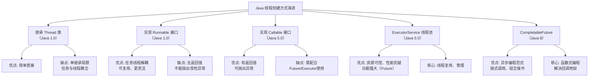

好的，针对你的面试经历和后续的深度技术考察要求，我将以你面试中涉及的**Redis**作为核心模块进行详细阐述。Redis作为美团闪购这类高并发、低延迟业务场景的核心组件，是面试官重点考察的技术点。

### 一、核心知识点图谱 (Redis)


---

### 二、Redis 详细讲解 (面向面试官)

面试官您好，接下来我重点阐述一下我对Redis的理解。在美团闪购这类**即时零售**业务中，Redis是保障高并发、低延迟和最终一致性的核心基础设施。

#### 1. 定义与角色定位
Redis (Remote Dictionary Server) 是一个基于内存的**键值数据库**。它提供了丰富的数据结构，支持持久化、事务、Pub/Sub等功能。在架构中，它通常作为：
- **缓存层 (Cache)**：加速热点数据访问，减轻后端数据库压力。
- **内存数据库 (In-Memory Database)**：存储临时或状态数据，如用户会话、购物车。
- **消息中间件 (Message Broker)**：利用List结构实现简单消息队列。

#### 2. 核心数据结构、工作原理及使用场景
Redis的价值很大程度上源于其丰富的数据结构，每种结构都对应着特定的业务场景。

| 数据结构 | 内部原理 | 美团闪购应用场景 | 注意事项 |
| :--- | :--- | :--- | :--- |
| **String** | 基于简单动态字符串(SDS)，可存文本、数字、二进制数据。 | 1. **商品库存**：`SET sku:1001:stock 100`<br>2. **分布式锁**：`SET lock:order NX EX 10`<br>3. **计数器**：`INCR user:1001:visits` | 1. 值过大时（>10KB）会浪费带宽和内存。<br>2. SETNX+EXPIRE非原子性，应用`SET key value NX EX seconds`。 |
| **Hash** | 底层是ziplist（元素少时）或hashtable。存储field-value对。 | 1. **商品信息缓存**：`HMSET sku:1001 name "iPhone" price 5999`<br>2. **用户属性会话**：`HSET user:1001 name "张三"` | 1. 不适合存储大量字段（如超过1000），因HGETALL会阻塞。<br>2. 可部分更新，节省网络开销。 |
| **List** | 底层是ziplist或linkedlist。双向链表，支持左右推送。 | 1. **秒杀排队**：`LPUSH seckill:queue user_id`<br>2. **消息队列**：`LPUSH task_queue, BRPOP task_queue 30`<br>3. **最新订单列表**：`LPUSH orders:1001 order_id` | 1. 生产者消费者模型需注意消息确认，避免消息丢失。<br>2. 大量元素时，LRANGE可能阻塞。 |
| **Sorted Set** | 底层是ziplist+skiplist。每个元素关联一个score用于排序。 | 1. **配送员距离排行榜**：`ZADD riders 1.2 "rider_a" 0.8 "rider_b"`<br>2. **热点商品TopN**：`ZINCRBY hot:goods 1 sku1001` | 1. 范围查询`ZRANGEBYSCORE`性能极高(O(logN))。<br>2. 注意ZSET的score是double类型，可能存在精度问题。 |

#### 3. 持久化机制：RDB与AOF
这是保证数据不丢失的关键。
- **RDB (快照)**：在指定时间间隔生成数据的二进制快照（dump.rdb）。
  - **工作原理**：fork一个子进程，子进程将数据写入临时RDB文件，写入完成后替换旧文件。
  - **优点**：文件紧凑，恢复速度快，适合灾难恢复。
  - **缺点**：会丢失最后一次快照后的所有数据。fork过程在数据量大时可能阻塞主线程。
  - **配置**：`save 900 1` # 900秒内至少1个key变化则触发保存。

- **AOF (追加日志)**：记录每一个写操作命令，重启时重新执行这些命令来恢复数据。
  - **工作原理**：将写命令追加到AOF缓冲区，根据策略（`appendfsync`）同步到磁盘。
    - `always`：每个命令都同步，数据最安全，性能最低。
    - `everysec`（**推荐**）：每秒同步一次，是性能和安全性的折衷。
    - `no`：由操作系统决定，性能最好，但可能丢失大量数据。
  - **优点**：数据安全性高，最多丢失1秒数据。
  - **缺点**：AOF文件通常比RDB大，恢复速度慢。

- **混合持久化 (Redis 4.0+)**：结合两者优点。在AOF重写时，先将当前数据以RDB格式写入AOF文件，再将重写缓冲区的增量命令以AOF格式追加。**重启时，先加载RDB内容，再重放增量AOF命令**，大幅提升了重启速度。这是目前的**最佳实践**。

#### 4. 高可用架构：主从、哨兵与集群
- **主从复制 (Replication)**：一个主节点(Master)，多个从节点(Slave)。主节点负责写，从节点负责读，实现读写分离和数据备份。
  - **工作原理**：从节点发送`PSYNC`命令进行全量或增量同步。全量同步使用RDB文件。
  - **问题**：主节点宕机需要手动切换，不具备自动故障转移能力。

- **哨兵模式 (Sentinel)**：在主从基础上，引入了**哨兵**进程来监控节点健康状态。当主节点宕机，哨兵会自动选举一个从节点提升为新的主节点，并通知客户端新的主节点地址。
  - **适用场景**：中小规模项目，需要自动容灾。
  - **最佳实践**：至少部署3个哨兵实例，形成集群，避免自身脑裂。

- **集群模式 (Cluster) (推荐)**：Redis官方提供的分布式方案。**数据分片**存储在多个节点上（默认16384个槽slot），每个节点负责一部分槽。支持节点的自动发现、故障转移和扩容缩容。
  - **美团闪购场景**：海量数据和高并发必须使用集群模式。例如，将不同商品ID哈希后分配到不同节点，实现负载均衡。
  - **优点**：无中心节点，性能和高可用性极佳。
  - **注意事项**：
    1.  key的事务操作仅限于同一slot的key，可使用`hash tag`（如`{order1001}.info`, `{order1001}.items`）来保证多个key分配到同一节点。
    2.  客户端需要支持集群协议（如JedisCluster）。

#### 5. 缓存经典问题及解决方案
1.  **缓存穿透**：**查询一个必定不存在的数据**（如不存在的商品ID），请求会穿透缓存直达DB。
    - **解决方案**：
        - **缓存空对象**：`SET null_key null 60`，设置一个较短的过期时间。
        - **布隆过滤器 (Bloom Filter)**：在缓存前加一层布隆过滤器，快速判断某个key是否**一定不存在**于数据库中。

2.  **缓存击穿**：**某个热点key过期瞬间**，大量并发请求这个key，击穿缓存，全部打到DB。
    - **解决方案**：
        - **互斥锁 (Mutex Lock)**：第一个请求发现缓存失效后，用`SETNX`获取一个分布式锁，然后去数据库加载数据，加载完毕后再写入缓存并释放锁；其他请求在此期间等待或重试。
        - **逻辑过期**：不给key设置TTL，而是在value中存储一个过期时间字段。业务线程发现逻辑时间过期时，获取锁并异步更新缓存，自己先返回旧数据。

3.  **缓存雪崩**：**同一时间大量key集中过期**或**缓存服务宕机**，导致所有请求涌向DB。
    - **解决方案**：
        - **差异化过期时间**：给key的TTL加上一个随机值（如`TTL + random(0, 300)`），避免同时过期。
        - **构建高可用集群**：采用Redis Cluster，避免单点故障。
        - **服务降级与熔断**：使用Hystrix等组件，当DB压力过大时，对非核心请求进行降级，直接返回默认值或错误页。

4.  **热Key与大Key**：
    - **热Key**：某个key访问量远超其他key，可能导致单个节点性能瓶颈。
        - **解决方案**：本地JVM缓存、使用`redis-cli --hotkeys`命令找出热key并将其复制到多个节点，通过客户端做负载。
    - **大Key**：一个key对应的value非常大（如超过500KB的Hash），会导致网络阻塞、内存不均、持久化困难。
        - **解决方案**：拆分（如一个大Hash拆成多个小Hash）、压缩、删除。使用`redis-cli --bigkeys`命令定期扫描。

### 三、算法题：二叉树中满足叶子节点到根距离=target的数量

**LeetCode类似题目**：这道题是 **LeetCode 437. 路径总和 III** 的一个变体。437题是求路径和等于target的路径数量，而本题是求**叶子节点**到根节点的**距离（即路径长度）**等于target的数量。它更接近于**LeetCode 112. 路径总和**的计数版，但关注点是路径长度（节点数）而非权重和。

#### 解题思路
1.  **问题分析**：我们需要从根节点走到每个叶子节点，并计算路径上的节点个数（距离）。如果这个距离等于给定的`target`，则计数+1。
2.  **关键点**：`距离 = 深度 + 1`。根节点的深度为0，距离为1。
3.  **算法选择**：**深度优先搜索 (DFS)** 是遍历所有路径最直接的方法。我们从根节点开始递归，记录当前节点的深度。当遇到一个叶子节点时，判断`当前深度 + 1`是否等于`target`。
4.  **复杂度分析**：
    - **时间复杂度**：O(N)，其中N是二叉树中的节点个数。每个节点我们只访问一次。
    - **空间复杂度**：O(H)，其中H是树的高度。空间复杂度主要取决于递归时栈空间的开销，最坏情况下（树退化为链表）为O(N)，平均情况下为O(logN)。

#### 完整Java代码（带详细注释）
```java
/**
 * Definition for a binary tree node.
 * public class TreeNode {
 *     int val;
 *     TreeNode left;
 *     TreeNode right;
 *     TreeNode() {}
 *     TreeNode(int val) { this.val = val; }
 *     TreeNode(int val, TreeNode left, TreeNode right) {
 *         this.val = val;
 *         this.left = left;
 *         this.right = right;
 *     }
 * }
 */
class Solution {
    private int count = 0; // 全局计数器，记录符合条件的叶子节点数量
    private int targetDistance; // 目标距离

    public int countLeafNodesWithTargetDistance(TreeNode root, int target) {
        if (root == null) {
            return 0;
        }
        this.targetDistance = target;
        dfs(root, 0); // 从根节点开始DFS，初始深度为0
        return count;
    }

    /**
     * 深度优先搜索遍历二叉树
     * @param node 当前节点
     * @param currentDepth 当前节点所处的深度（根节点的深度为0）
     */
    private void dfs(TreeNode node, int currentDepth) {
        if (node == null) {
            return;
        }

        // 检查当前节点是否为叶子节点（即左右子节点都为空）
        if (node.left == null && node.right == null) {
            // 计算该叶子节点到根节点的距离：距离 = 当前深度 + 1
            int distanceFromRoot = currentDepth + 1;
            // 如果距离等于目标值，则计数器加1
            if (distanceFromRoot == targetDistance) {
                count++;
            }
            // 无论是否匹配，到达叶子节点后都应返回，结束本条路径的递归
            return;
        }

        // 如果不是叶子节点，则继续递归遍历左右子树
        // 向下遍历时，深度需要增加1
        dfs(node.left, currentDepth + 1);
        dfs(node.right, currentDepth + 1);
    }
}
```

#### 边界情况处理
- **空树**：直接返回0。
- **只有根节点的树**：距离为1，若`target==1`则计数为1。
- **目标距离为0或负数**：根据题目定义，距离至少为1（根节点），可以在函数入口处添加判断，如果`target < 1`，直接返回0。

希望这份详细的解答能帮助你充分准备。Redis的深度和广度是面试中的富矿，结合美团闪购的业务场景来阐述，更能体现你的技术实力和业务洞察。祝你早日收到offer！

# Java 核心面试题深度解析

## 一、equals和hashCode

### 核心知识点图谱


### 详细讲解

**面试官您好，关于equals和hashCode，我从以下几个方面来阐述：**

**1. 定义与规范：**
- `equals()`方法用于比较两个对象的内容是否相等
- `hashCode()`方法返回对象的哈希码值，用于哈希表相关的数据结构
- Object类中的默认实现：
  - `equals()`使用`==`比较，即比较对象引用地址
  - `hashCode()`返回对象内存地址的哈希值

**2. 两者关系的重要约定：**
- 如果两个对象通过`equals()`比较是相等的，那么它们的`hashCode()`必须返回相同的值
- 如果两个对象通过`equals()`比较是不相等的，它们的`hashCode()`不一定不同（但不同可以提高哈希表性能）

**3. 为什么需要同时重写：**
```java
public class Person {
    private String name;
    private int age;
    
    // 构造方法省略
    
    @Override
    public boolean equals(Object obj) {
        if (this == obj) return true;
        if (obj == null || getClass() != obj.getClass()) return false;
        Person person = (Person) obj;
        return age == person.age && Objects.equals(name, person.name);
    }
    
    @Override
    public int hashCode() {
        // 使用Objects.hash确保相同属性值的对象有相同的哈希码
        return Objects.hash(name, age);
    }
}
```

**4. 使用场景与注意事项：**
- 当对象需要作为HashMap/HashSet的键时，必须正确重写这两个方法
- 不正确的实现会导致集合类无法正确工作（如重复元素、查找失败）
- 最佳实践：使用IDE自动生成或使用Objects工具类

## 二、TCP三次握手

### 核心知识点图谱


### 详细讲解

**面试官您好，TCP三次握手是建立可靠连接的基础过程：**

**1. 握手过程：**
- 第一次握手：客户端发送SYN包(seq=x)到服务器，进入SYN_SENT状态
- 第二次握手：服务器收到SYN包，回应SYN+ACK包(seq=y, ack=x+1)，进入SYN_RECV状态
- 第三次握手：客户端收到SYN+ACK包，回应ACK包(ack=y+1)，双方进入ESTABLISHED状态

**2. 为什么需要三次握手：**
- 确保双方都具有发送和接收能力
- 同步初始序列号(ISN)，为后续可靠传输做准备
- 防止已失效的连接请求报文突然传送到服务器，产生错误连接

**3. 相关问题：**
- 半连接队列：服务器在SYN_RECV状态维护的未完成握手连接队列
- SYN洪水攻击：恶意发送大量SYN包耗尽服务器资源，解决方案有SYN Cookie等

## 三、MySQL索引类型及失效场景

### 核心知识点图谱


### 详细讲解

**面试官您好，MySQL索引是数据库性能优化的核心：**

**1. 索引类型：**
- B-Tree索引：最常用，适用于全键值、键值范围或键前缀查找
- 哈希索引：基于哈希表，精确匹配非常快，但不支持范围查询
- 全文索引：用于文本内容的全文搜索
- 空间索引：用于地理数据存储
- 复合索引：多列组合索引，遵循最左前缀原则

**2. 索引失效常见场景：**
```sql
-- 1. 对索引列使用函数或表达式
SELECT * FROM users WHERE YEAR(create_time) = 2023;

-- 2. 隐式类型转换
SELECT * FROM users WHERE phone = 13800138000; -- phone是varchar类型

-- 3. OR条件使用不当
SELECT * FROM users WHERE name = 'John' OR age > 30; -- 如果age无索引，全表扫描

-- 4. 不符合最左前缀原则
-- 索引为(name, age)
SELECT * FROM users WHERE age = 25; -- 无法使用索引

-- 5. LIKE以通配符开头
SELECT * FROM users WHERE name LIKE '%John%';

-- 6. 数据量少时优化器可能选择全表扫描
```

**3. 索引优化建议：**
- 使用EXPLAIN分析查询执行计划
- 优先考虑高选择性的列作为索引
- 避免过度索引，索引会增加写操作开销
- 使用覆盖索引减少回表操作

## 四、线程等待与恢复

### 详细讲解

**面试官您好，关于主线程等待子线程执行完成再恢复，有几种常见实现方式：**

**1. 使用Thread.join()方法：**
```java
Thread childThread = new Thread(() -> {
    // 子线程执行的任务
    System.out.println("子线程执行中...");
    try {
        Thread.sleep(2000);
    } catch (InterruptedException e) {
        e.printStackTrace();
    }
    System.out.println("子线程执行完毕");
});

childThread.start(); // 启动子线程

try {
    System.out.println("主线程等待子线程...");
    childThread.join(); // 主线程等待子线程结束
    System.out.println("主线程继续执行");
} catch (InterruptedException e) {
    e.printStackTrace();
}
```

**2. 使用CountDownLatch（更灵活的同步工具）：**
```java
CountDownLatch latch = new CountDownLatch(1); // 计数器初始化为1

Thread childThread = new Thread(() -> {
    try {
        System.out.println("子线程执行中...");
        Thread.sleep(2000);
        System.out.println("子线程执行完毕");
    } finally {
        latch.countDown(); // 计数器减1
    }
});

childThread.start();

System.out.println("主线程等待子线程...");
latch.await(); // 主线程等待计数器归零
System.out.println("主线程继续执行");
```

**3. 使用Future和ExecutorService：**
```java
ExecutorService executor = Executors.newSingleThreadExecutor();
Future<?> future = executor.submit(() -> {
    System.out.println("子线程执行中...");
    Thread.sleep(2000);
    System.out.println("子线程执行完毕");
    return "执行结果";
});

System.out.println("主线程等待子线程...");
future.get(); // 阻塞直到获取结果
System.out.println("主线程继续执行");
executor.shutdown();
```

## 五、创建线程的方式

### 详细讲解

**面试官您好，Java中创建线程主要有以下几种方式：**

**1. 继承Thread类：**
```java
class MyThread extends Thread {
    @Override
    public void run() {
        System.out.println("线程执行: " + Thread.currentThread().getName());
    }
}

// 使用
MyThread thread = new MyThread();
thread.start();
```

**2. 实现Runnable接口（推荐）：**
```java
class MyRunnable implements Runnable {
    @Override
    public void run() {
        System.out.println("线程执行: " + Thread.currentThread().getName());
    }
}

// 使用
Thread thread = new Thread(new MyRunnable());
thread.start();
```

**3. 实现Callable接口（可返回结果）：**
```java
class MyCallable implements Callable<String> {
    @Override
    public String call() throws Exception {
        Thread.sleep(1000);
        return "执行结果";
    }
}

// 使用
ExecutorService executor = Executors.newSingleThreadExecutor();
Future<String> future = executor.submit(new MyCallable());
String result = future.get(); // 获取返回值
executor.shutdown();
```

**4. 使用线程池（生产环境推荐）：**
```java
// 创建固定大小的线程池
ExecutorService executor = Executors.newFixedThreadPool(5);

// 提交任务
for (int i = 0; i < 10; i++) {
    executor.execute(() -> {
        System.out.println("线程执行: " + Thread.currentThread().getName());
    });
}

// 关闭线程池
executor.shutdown();
```

**5. 基于CompletableFuture（Java8+）：**
```java
CompletableFuture.runAsync(() -> {
    System.out.println("异步执行: " + Thread.currentThread().getName());
});

CompletableFuture<String> future = CompletableFuture.supplyAsync(() -> {
    return "异步结果";
});

String result = future.join(); // 获取结果
```

## 六、StringBuffer和StringBuilder的区别

### 详细讲解

**面试官您好，StringBuffer和StringBuilder都用于字符串操作，主要区别如下：**

**1. 线程安全性：**
- StringBuffer：线程安全，所有公共方法都使用synchronized关键字修饰
- StringBuilder：非线程安全，没有同步开销，性能更高

**2. 性能比较：**
```java
// StringBuilder性能测试
long startTime = System.currentTimeMillis();
StringBuilder sb1 = new StringBuilder();
for (int i = 0; i < 100000; i++) {
    sb1.append(i);
}
long time1 = System.currentTimeMillis() - startTime;

// StringBuffer性能测试
startTime = System.currentTimeMillis();
StringBuffer sb2 = new StringBuffer();
for (int i = 0; i < 100000; i++) {
    sb2.append(i);
}
long time2 = System.currentTimeMillis() - startTime;

System.out.println("StringBuilder耗时: " + time1 + "ms");
System.out.println("StringBuffer耗时: " + time2 + "ms");
// 通常情况下，StringBuilder比StringBuffer快10%-15%
```

**3. 使用场景：**
- 单线程环境下使用StringBuilder，性能更优
- 多线程环境下且需要线程安全时使用StringBuffer
- 小规模字符串操作直接使用"+"连接符（编译器会优化为StringBuilder）
- 大规模字符串拼接使用StringBuilder/Buffer

**4. 最佳实践：**
```java
// 单线程环境 - 使用StringBuilder
StringBuilder sb = new StringBuilder();
sb.append("Hello").append(" ").append("World");
String result = sb.toString();

// 多线程环境 - 使用StringBuffer
StringBuffer sBuffer = new StringBuffer();
sBuffer.append("Hello").append(" ").append("World");
String threadSafeResult = sBuffer.toString();

// 简单的字符串连接可以直接使用+
String simple = "Hello" + " " + "World";
```

**5. 内部实现：**
- 两者都继承自AbstractStringBuilder
- 默认容量都是16字符，可自动扩容
- 扩容策略：新容量 = 原容量 * 2 + 2

希望以上详细的解答能够帮助您准备面试。这些知识点是Java开发岗位面试中的核心内容，理解其原理和使用场景对于实际开发工作也非常重要。


好的，面试官。关于Java中创建线程的几种方式，我非常乐意为您进行详细的阐述。这不仅包括基本用法，还会深入探讨其原理、适用场景以及最佳实践。

在开始前，我用一张图来梳理这几种方式的演进关系和核心特点，以便建立一个整体的认知框架：



---

### 1. 继承 `Thread` 类

这是最基础的方式，通过继承来创建自定义的线程类。

**如何使用：**
```java
// 1. 定义一个类，继承自 java.lang.Thread
class MyCustomThread extends Thread {
    private String taskName;
    
    // 可以通过构造方法传递参数
    public MyCustomThread(String taskName) {
        this.taskName = taskName;
    }
    
    // 2. 必须重写 run() 方法，run() 方法内的代码就是线程要执行的任务
    @Override
    public void run() {
        try {
            System.out.println(taskName + " 开始执行，线程ID: " + Thread.currentThread().getId());
            // 模拟任务执行耗时
            Thread.sleep(2000);
            System.out.println(taskName + " 执行完毕。");
        } catch (InterruptedException e) {
            System.err.println("线程被中断: " + e.getMessage());
            // 响应中断是一种良好实践
            Thread.currentThread().interrupt(); // 重新设置中断状态
        }
    }
}

// 在 main 方法或其它地方使用：
public class ThreadExample {
    public static void main(String[] args) {
        System.out.println("主线程开始: " + Thread.currentThread().getName());
        
        // 3. 创建线程对象实例
        MyCustomThread threadA = new MyCustomThread("任务A");
        MyCustomThread threadB = new MyCustomThread("任务B");
        
        // 4. 调用 start() 方法启动线程
        // 注意：绝对不能直接调用 run()，否则只是普通方法调用，不会异步执行
        threadA.start();
        threadB.start();
        
        // 主线程不会等待 threadA 和 threadB 结束，会继续往下执行
        System.out.println("主线程已启动所有子线程，继续自己的工作...");
        
        // 可以调用 join() 等待子线程结束
        try {
            threadA.join();
            threadB.join();
            System.out.println("所有子线程执行完毕，主线程结束。");
        } catch (InterruptedException e) {
            e.printStackTrace();
        }
    }
}
```

**关键点 & 面试深度：**
*   **`start()` vs `run()`**：这是常考的经典问题。调用 `start()` 会**异步地**启动一个新线程，并由JVM在新线程中调用 `run()` 方法。直接调用 `run()` 则等同于调用一个普通方法，会在**当前线程**中同步执行，失去了多线程的意义。
*   **单继承局限**：Java是单继承的，继承了 `Thread` 后就不能再继承其他类，这在设计上缺乏灵活性。
*   **适用场景**：简单demo或测试。**生产环境中不推荐**，因为它将“任务”和“执行线程”两个概念耦合在了一起。

---

### 2. 实现 `Runnable` 接口 (推荐方式)

这是更被推崇的方式，因为它将“任务”与“执行线程”的机制解耦，灵活性更高。

**如何使用：**
```java
// 1. 定义一个类，实现 java.lang.Runnable 接口
class MyTask implements Runnable {
    private String taskName;
    
    public MyTask(String taskName) {
        this.taskName = taskName;
    }
    
    // 2. 实现 run() 方法
    @Override
    public void run() {
        System.out.println("正在执行任务: " + taskName + "，线程: " + Thread.currentThread().getName());
    }
}

public class RunnableExample {
    public static void main(String[] args) {
        // 3. 创建任务对象 (这是一个任务，还不是线程)
        MyTask task1 = new MyTask("Runnable任务1");
        MyTask task2 = new MyTask("Runnable任务2");
        
        // 4. 创建线程对象，并将任务作为参数传递给线程的构造方法
        Thread thread1 = new Thread(task1);
        Thread thread2 = new Thread(task2);
        // 也可以使用匿名内部类或Lambda表达式，非常方便
        Thread thread3 = new Thread(() -> {
            System.out.println("这是Lambda表达式实现的Runnable，线程: " + Thread.currentThread().getName());
        });
        
        // 5. 启动线程
        thread1.start();
        thread2.start();
        thread3.start();
    }
}
```

**关键点 & 面试深度：**
*   **解耦**：`Runnable` 对象只代表一个可执行的任务，它可以被传递给 `Thread`，也可以被提交给**线程池（`ExecutorService`）** 执行，复用性极强。
*   **函数式接口**：`Runnable` 是一个**函数式接口**（只有一个抽象方法 `run()`），这使得它天然地与Java 8的Lambda表达式完美结合，书写简洁。
    ```java
    // Lambda写法，是生产环境中最常见的写法之一
    new Thread(() -> System.out.println("简洁的Lambda任务")).start();
    ```
*   **资源共享**：多个线程可以共享同一个 `Runnable` 实例（但需要注意线程安全问题）。

---

### 3. 实现 `Callable` 接口

`Runnable` 的 `run()` 方法没有返回值，也不能抛出受检异常。`Callable` 接口的出现就是为了解决这两个痛点。

**如何使用：**
```java
// 1. 定义一个类，实现 java.util.concurrent.Callable 接口
// 泛型 <String> 指定了 call() 方法返回值的类型
class MyCallableTask implements Callable<String> {
    private String taskName;
    
    public MyCallableTask(String taskName) {
        this.taskName = taskName;
    }
    
    // 2. 实现 call() 方法，注意它有返回值，并且可以抛出异常
    @Override
    public String call() throws Exception {
        System.out.println(taskName + " 开始计算...");
        Thread.sleep(1000); // 模拟耗时计算
        // 返回计算结果
        return taskName + " 的执行结果。线程: " + Thread.currentThread().getName();
    }
}

public class CallableExample {
    public static void main(String[] args) {
        // 3. 创建 Callable 任务对象
        MyCallableTask task = new MyCallableTask("重要计算");
        
        // 4. 需要借助 ExecutorService (线程池) 来执行并获取结果
        ExecutorService executor = Executors.newSingleThreadExecutor(); // 创建单线程线程池
        
        try {
            // 5. 提交任务，返回一个 Future 对象
            // Future 就像一张“提货单”，凭此在未来获取结果
            Future<String> future = executor.submit(task);
            
            System.out.println("主线程提交任务后，可以继续做其他事情...");
            
            // 6. 在需要结果时，调用 future.get() 获取。
            //    如果任务还没完成，get() 会阻塞当前线程直到任务完成。
            String result = future.get(); // 阻塞等待结果
            System.out.println("获取到结果: " + result);
            
        } catch (InterruptedException | ExecutionException e) {
            // InterruptedException: 线程被中断
            // ExecutionException: Callable的call()方法执行过程中抛出的异常会被包装在此
            e.printStackTrace();
        } finally {
            // 7. 关闭线程池（重要！）
            executor.shutdown();
        }
    }
}
```

**关键点 & 面试深度：**
*   **返回值与异常**：`Callable` 的 `call()` 方法有返回值，并且可以抛出受检异常，这是它与 `Runnable` 最核心的区别。
*   **Future 对象**：`submit` 方法会立即返回一个 `Future` 对象，但它本身是**非阻塞**的。`Future.get()` 才是阻塞方法，用于获取异步计算的结果。
*   **超时控制**：可以使用 `future.get(long timeout, TimeUnit unit)` 设置超时时间，避免无限期阻塞。
*   **执行载体**：`Callable` 不能直接传给 `Thread` 构造方法，**必须通过线程池 (`ExecutorService`) 来执行**。

---

### 4. 使用线程池 (`ExecutorService`)

直接创建线程（`new Thread()`）成本较高且难以管理。线程池是Java 5后提供的并发框架核心，用于统一管理线程资源，是**生产环境中的绝对标准做法**。

**如何使用：**
```java
public class ThreadPoolExample {
    public static void main(String[] args) {
        // 1. 创建线程池 (强烈不建议使用 Executors，这里仅为演示，后面解释)
        // FixedThreadPool: 固定大小的线程池
        ExecutorService fixedThreadPool = Executors.newFixedThreadPool(3);
        
        // 2. 提交任务
        // 提交 Runnable 任务
        fixedThreadPool.execute(() -> System.out.println("执行Runnable任务"));
        
        // 提交 Callable 任务
        Future<String> future = fixedThreadPool.submit(() -> {
            Thread.sleep(500);
            return "Callable任务结果";
        });
        
        // 提交一批任务
        List<Callable<String>> tasks = new ArrayList<>();
        for (int i = 0; i < 10; i++) {
            final int taskId = i;
            tasks.add(() -> "Task" + taskId + " executed by " + Thread.currentThread().getName());
        }
        
        // 3. 批量执行任务并获取所有结果的Future列表 (invokeAll会阻塞等待所有任务完成)
        try {
            List<Future<String>> futures = fixedThreadPool.invokeAll(tasks);
            for (Future<String> f : futures) {
                System.out.println(f.get());
            }
        } catch (InterruptedException | ExecutionException e) {
            e.printStackTrace();
        }
        
        // 4. 优雅关闭线程池 (非常重要！)
        fixedThreadPool.shutdown(); // 停止接收新任务，已提交的任务会继续执行
        try {
            // 等待所有任务执行完毕，或者超时后强制关闭
            if (!fixedThreadPool.awaitTermination(60, TimeUnit.SECONDS)) {
                fixedThreadPool.shutdownNow(); // 尝试取消所有正在执行的任务
            }
        } catch (InterruptedException e) {
            fixedThreadPool.shutdownNow();
        }
    }
}
```

**关键点 & 面试深度：**
*   **资源开销**：线程的创建和销毁成本很高。线程池**复用已创建的线程**，减小了系统开销。
*   **管理控制**：线程池可以管理线程的**数量、生命周期、任务队列**，防止无限制创建线程导致系统资源耗尽（OOM）。
*   **功能强大**：提供了提交任务(`execute`/`submit`)、批量执行(`invokeAll`)、优雅关闭(`shutdown`)等一系列强大功能。
*   **【重要】Executors 的陷阱**：`Executors` 工厂方法虽然方便，但隐藏了风险。
    *   `newFixedThreadPool` 和 `newSingleThreadExecutor`：使用**无界队列**，堆积的请求可能耗尽内存 (OOM)。
    *   `newCachedThreadPool` 和 `newScheduledThreadPool`：设置的**最大线程数是 Integer.MAX_VALUE**，可能会创建大量线程导致OOM。
*   **【最佳实践】**：**推荐直接使用 `ThreadPoolExecutor` 构造函数来创建线程池**，以便明确指定核心参数（核心线程数、最大线程数、队列类型、拒绝策略等），做到资源可控。
    ```java
    // 生产环境推荐写法
    ThreadPoolExecutor executor = new ThreadPoolExecutor(
        5, // corePoolSize: 核心线程数，即使空闲也会保留
        10, // maximumPoolSize: 最大线程数
        60L, TimeUnit.SECONDS, // keepAliveTime: 非核心线程空闲存活时间
        new ArrayBlockingQueue<>(100), // workQueue: 有界队列，防止OOM
        new ThreadPoolExecutor.CallerRunsPolicy() // rejectionPolicy: 拒绝策略
    );
    ```

---

### 5. 基于 `CompletableFuture` (Java 8+)

`CompletableFuture` 是更现代的异步编程工具，它实现了 `Future` 接口，但功能强大得多。它允许你以声明式的、函数式的方式编写复杂的异步任务流水线，解决“回调地狱”问题。

**如何使用：**
```java
public class CompletableFutureExample {
    public static void main(String[] args) throws Exception {
        // 1. 运行一个简单的无返回值的异步任务
        CompletableFuture<Void> future1 = CompletableFuture.runAsync(() -> {
            System.out.println("无返回值的异步任务: " + Thread.currentThread().getName());
        });

        // 2. 运行一个有返回值的异步任务 (默认使用 ForkJoinPool.commonPool())
        CompletableFuture<String> future2 = CompletableFuture.supplyAsync(() -> {
            try {
                Thread.sleep(1000);
            } catch (InterruptedException e) {
                throw new IllegalStateException(e);
            }
            return "【SupplyAsync的结果】";
        });

        // 3. thenApply(): 对上一个异步结果进行转换（同步继续执行）
        CompletableFuture<String> future3 = future2.thenApply(result -> {
            return result + " 然后被转换了";
        });

        // 4. thenAccept(): 消费结果，无返回值
        future3.thenAccept(result -> System.out.println("消费结果: " + result));

        // 5. thenCompose(): 组合两个Future，第一个的结果作为第二个的输入（扁平化，避免嵌套）
        CompletableFuture<String> future4 = future2.thenCompose(previousResult ->
            CompletableFuture.supplyAsync(() -> previousResult + " 【然后又被组合了】")
        );

        // 6. thenCombine(): 合并两个独立 CompletableFuture 的结果
        CompletableFuture<String> future5 = CompletableFuture.supplyAsync(() -> "Hello");
        CompletableFuture<String> future6 = CompletableFuture.supplyAsync(() -> " World");
        CompletableFuture<String> combinedFuture = future5.thenCombine(future6, (res1, res2) -> res1 + res2);
        combinedFuture.thenAccept(System.out::println); // 输出 "Hello World"

        // 7. allOf() / anyOf(): 等待所有/任意一个Future完成
        CompletableFuture<Void> allFutures = CompletableFuture.allOf(future2, future3, future4);
        allFutures.join(); // 阻塞直到所有都完成
        System.out.println("所有任务都完成了！");

        // 8. 异常处理 exceptionally()
        CompletableFuture<String> futureWithException = CompletableFuture.supplyAsync(() -> {
            if (true) { // 模拟出错
                throw new RuntimeException("发生了一个错误！");
            }
            return "成功结果";
        }).exceptionally(ex -> { // 异常回调，返回一个兜底值
            System.err.println("我们处理了异常: " + ex.getMessage());
            return "默认值";
        });
        System.out.println(futureWithException.get()); // 输出 "默认值"

        // 主线程等待，防止JVM提前退出
        Thread.sleep(3000);
    }
}
```

**关键点 & 面试深度：**
*   **函数式编程**：核心思想是链式调用，将一系列异步操作像流水线一样组合起来，代码清晰易读。
*   **强大的组合能力**：提供了 `thenApply`, `thenCompose`, `thenCombine`, `allOf`, `anyOf` 等方法，可以轻松构建复杂的异步任务流。
*   **异常处理**：提供了 `exceptionally`, `handle` 等方法，可以非常优雅地在链式调用中处理异常。
*   **执行器可定制**：`runAsync` 和 `supplyAsync` 方法可以接受第二个参数 `Executor`，让你指定任务在哪个线程池中运行，如果不指定，则使用默认的 `ForkJoinPool.commonPool()`。
*   **主动完成**：可以通过 `complete`, `completeExceptionally` 方法手动干预一个 `CompletableFuture` 的完成状态，这在测试和超时控制中非常有用。

**总结给面试官：**
“面试官，以上就是Java中创建和执行线程的几种主要方式。从最初的简单继承`Thread`，到推崇面向接口的`Runnable`，再到支持返回值的`Callable`与`Future`，最终发展到使用`ExecutorService`线程池进行资源管理，以及利用`CompletableFuture`进行声明式的异步编程。这是一个逐步抽象、功能不断增强、更加贴合生产实践的过程。在现代Java开发中，我们几乎总是优先选择线程池来执行任务，而对于复杂的异步流程编排，`CompletableFuture`是目前的最佳选择。”
