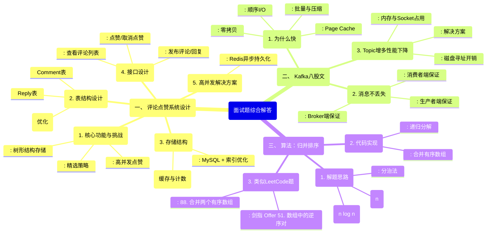

如何设计评论和点赞？考虑一个评论有多条回复，需要考虑根据最上层的评论进行精选，点赞需要能够抗住高并发的请求。如何设计表结构、存储结构、接口等等。

八股只问了kafka：

kafka为什么会快？

kafka如何保证消息不丢失？

kafka为什么topic增多之后性能显著下滑？

算法：

归并排序

好的，收到您的需求。作为一位资深Java开发工程师，我将为您系统性地梳理和解答这道融合了系统设计、消息中间件和算法的高频面试题。

首先，我们用一张Mermaid图来总览本题所涉及的核心知识点和解答框架。



接下来，我们逐一进行详细阐述。

---

### 一、 评论与点赞系统设计

#### 1. 核心功能与挑战
-   **树形结构**：评论与回复构成一棵树，顶层评论是根节点，回复是子节点。需要高效地存储和查询。
-   **精选评论**：运营或算法需要根据点赞数、回复数、内容质量等维度从顶层评论中筛选出精选评论，通常置顶展示。
-   **高并发点赞**：点赞是一种“写多读多”的高频操作，一个热点内容可能瞬间收到数十万次点赞请求，必须设计一个能抗住高并发的方案。

#### 2. 表结构设计

**a. 评论表 (`comment_table`)**
| 字段名 | 类型 | 说明 |
| :--- | :--- | :--- |
| `id` | `bigint` / `snowflake` | 主键，评论唯一ID |
| `entity_id` | `bigint` | 被评论的主体ID (如视频ID、文章ID) |
| `entity_type` | `tinyint` | 主体类型 (如1-视频，2-文章) |
| `user_id` | `bigint` | 评论发布者ID |
| `content` | `text` | 评论内容 |
| `root_id` | `bigint` | **顶层评论ID**：如果是回复，指向最顶层的评论ID；如果是顶层评论，则为0或`null` |
| `parent_id` | `bigint` | **直接父评论ID**：如果是回复，指向其直接父评论的ID；如果是顶层评论，则为0或`null` |
| `like_count` | `int` | 点赞总数 (异步更新) |
| `reply_count` | `int` | 回复总数 |
| `is_top` | `tinyint` | 是否为置顶评论 (管理员操作) |
| `is_elite` | `tinyint` | 是否为精选评论 (根据规则或运营) |
| `create_time` | `datetime` | 创建时间 |

*   **设计要点**：
    *   使用 `root_id` 和 `parent_id` 实现**无限层级嵌套**。查询一个主题下的所有顶层评论非常高效 (`WHERE entity_id=? AND entity_type=? AND root_id=0`)。
    *   查询某个顶层评论下的所有回复也很高效 (`WHERE root_id=?`)。`root_id` 和 `parent_id` 上都需要建立索引。
    *   通过 `is_elite` 和 `like_count` 等字段实现精选逻辑。

**b. 点赞表 (`like_table`) - 基础版（存在问题）**
| 字段名 | 类型 | 说明 |
| :--- | :--- | :--- |
| `id` | `bigint` | 主键 |
| `user_id` | `bigint` | 用户ID |
| `comment_id` | `bigint` | 被点赞的评论ID |
| `create_time` | `datetime` | 点赞时间 |

*   **问题**：在高并发场景下，直接对这张表进行 `INSERT` 和 `SELECT COUNT(...)` 操作，数据库压力巨大，极易成为性能瓶颈。

#### 3. 存储结构与高并发点赞解决方案

**a. MySQL + Redis 组合方案 (行业最佳实践)**
*   **MySQL**：作为**持久化存储**，存储评论、回复的元信息。保证数据的最终一致性和可靠性。
*   **Redis**：作为**高速缓存和计数器**，承担高并发的读写请求。
    *   **存储点赞状态**：使用 `Set` 或 `BitMap`。例如 `key = like:entity:{entity_type}:{entity_id}, value = Set(user_id)`。用于快速判断用户是否已点赞、实现点赞/取消点赞逻辑。
    *   **存储点赞计数**：使用 `String` 或 `Hash`。例如 `key = like_count:comment:{comment_id}, value = count`。用于快速获取点赞数。

**b. 高并发点赞流程 (抗高并发核心)**
1.  **用户点赞**：
    *   前端发起点赞请求，携带 `user_id`, `comment_id`。
    *   服务端首先在Redis中执行 `SADD like:comment:{comment_id} {user_id}`。
        *   如果返回1，表示点赞成功，则执行 `INCR like_count:comment:{comment_id}`。
        *   如果返回0，表示已点过赞，则可能是取消点赞，执行 `SREM` 和 `DECR`。
2.  **异步持久化**：
    *   使用一个异步任务（如Spring的`@Async`、消息队列），将Redis中的点赞数据（用户与评论的关系）批量同步到MySQL的 `like_table` 中。这个过程可以是定时（如每5分钟）或定量（如积累1000条）的。
3.  **异步更新计数**：
    *   同样使用异步任务，将Redis中的计数 (`like_count:comment:{comment_id}`) 更新到MySQL的 `comment_table` 的 `like_count` 字段。
4.  **读取点赞数和状态**：
    *   点赞数直接从Redis读取 (`GET like_count:comment:{comment_id}`)。
    *   判断用户是否点赞也从Redis读取 (`SISMEMBER like:comment:{comment_id} {user_id}`)。

*   **优势**：
    *   **高性能**：所有高频操作都在内存中进行，速度极快。
    *   **可扩展**：Redis可以方便地通过集群模式横向扩展。
    *   **最终一致**：通过异步任务保证MySQL与Redis的最终一致性，满足业务需求。

#### 4. 接口设计

*   **POST /comment/publish**：发布评论/回复
    *   参数：`entityId`, `entityType`, `content`, `parentId` (可选，不为空则是回复)
    *   逻辑：校验参数 -> 组装数据 (`root_id` 逻辑：如果 `parentId` 为空，则是顶层评论，`root_id=0`；否则，查询父评论的 `root_id`，如果父评论本身是顶层评论，则 `root_id=parentId`) -> 写入DB -> 返回成功。

*   **GET /comment/list**：获取评论列表
    *   参数：`entityId`, `entityType`, `page`, `size`
    *   逻辑：查询 `WHERE entity_id=? AND entity_type=? AND root_id=0` 的评论 -> 根据 `is_elite` 和 `like_count` 等规则排序 -> 分页 -> 循环查询每个顶层评论的回复 (`WHERE root_id=?`) -> 组装数据，返回给前端。

*   **POST /comment/like**：点赞/取消点赞
    *   参数：`commentId`, `userId`
    *   逻辑：在Redis中执行上述点赞逻辑 -> 立即返回操作结果 -> 异步记录日志或发送MQ消息用于后续持久化。

---

### 二、 Kafka 八股文

#### 1. Kafka为什么快？
*   **顺序读写 (Sequential I/O)**：Kafka将消息**追加**到分区日志文件的末尾，充分利用磁盘的顺序读写性能（甚至优于随机内存读写）。
*   **Page Cache**：Kafka大量使用操作系统页缓存，读写操作都在内存中进行，避免直接操作磁盘。通过操作系统本身的力量来 flush 数据到磁盘，效率极高。
*   **零拷贝 (Zero-Copy)**：使用 `sendfile` 系统调用，数据直接从页缓存通过DMA方式发送到网卡缓冲区，避免了在**应用程序内存**和**内核内存**之间的多次拷贝，极大减少了CPU开销和上下文切换。
*   **批量处理 (Batching)**：生产者和消费者都支持批量发送和拉取消息，将大量消息合并成一次网络请求或一次磁盘写入，显著提高了吞吐量。
*   **数据压缩**：生产者可将批量消息压缩后发送，减少网络传输和磁盘存储的压力，Broker和消费者端再解压。虽然消耗一些CPU，但在网络瓶颈场景下收益巨大。

#### 2. Kafka如何保证消息不丢失？
这是一个端到端的问题，需要从三个角色来看：
*   **生产者 (Producer) 端**：
    *   设置 `acks=all`（或 `-1`）。这意味着Leader和所有ISR Follower都确认收到消息，生产者才会认为发送成功。这是最强的持久化保证。
    *   设置 `retries` 为一个较大的值（如 `Integer.MAX_VALUE`），并启用重试，以应对网络抖动或Broker短暂不可用。
    *   同时，生产者自身也要处理好异常，例如在回调函数 `onSend` 和 `onAcknowledgement` 中记录日志或进行告警。
*   **Broker 端**：
    *   设置 `unclean.leader.election.enable = false`。防止非ISR中的副本（数据落后很多）被选为Leader，导致消息丢失。
    *   设置 `replication.factor >= 3`。保证每个分区有多个副本，提高可靠性。
    *   设置 `min.insync.replicas > 1`（通常为2）。这意味着至少需要多少个ISR副本写入成功，Leader才会认为生产者消息发送成功。与 `acks=all` 配合，构成了“至少成功写入N个副本”的强一致性保证。
*   **消费者 (Consumer) 端**：
    *   关闭**自动提交偏移量** (`enable.auto.commit = false`)。
    *   在业务逻辑**成功处理完消息后**，**手动提交偏移量** (`consumer.commitSync()`)。这样才能保证“至少消费一次”，避免消息处理失败但偏移量已提交导致的消息丢失。

#### 3. Kafka为什么Topic增多之后性能显著下滑？
*   **磁盘寻址开销**：每个Topic的每个分区在磁盘上都是独立的日志文件。虽然Kafka是顺序读写，但Topic和分区数量巨大时，Broker需要同时维护成千上万个文件的句柄。磁盘I/O会从顺序写退化为**随机寻址**，因为需要频繁在不同文件之间切换写入，性能急剧下降。
*   **内存与网络开销**：
    *   **页缓存污染**：海量的Topic和分区会占用大量的Page Cache，导致缓存命中率下降，性能抖动。
    *   **Socket连接激增**：生产者/消费者与Broker之间需要为每个TCP连接分配内存和CPU资源。Topic过多会导致客户端连接数暴增，Broker需要处理更多的网络连接和线程上下文切换，消耗大量系统资源。
*   **解决方案**：
    *   **合理规划Topic和分区数**：不是越多越好。根据业务吞吐量和消费者组数量进行规划。
    *   **使用集群模式**：通过增加Broker节点来分散压力，将不同的Topic分布到不同的Broker上。
    *   **监控与优化**：监控Broker的IOwait、网络流量、文件句柄数等指标，及时发现瓶颈。

---

### 三、 算法：归并排序

#### 1. 类似LeetCode题目
*   **归并排序本身**：虽然不是直接原题，但其思想是许多题目的基础。
*   **剑指 Offer 51. 数组中的逆序对**：本题正是利用归并排序的过程来统计逆序对的数量。
*   **88. 合并两个有序数组**：本题是归并排序中“合并”步骤的直接应用。

#### 2. 解题思路
*   **算法思想**：**分治法**。将一个大问题分解成多个小问题，递归解决，再将结果合并。
    1.  **分解**：将当前待排序数组递归地分成两半，直到每个子数组只剩下一个元素（自然有序）。
    2.  **解决**：递归地排序两个子数组。
    3.  **合并**：将两个已经排序好的子数组合并成一个新的有序数组。
*   **时间复杂度**：O(n log n)。每次分解是O(1)，合并是O(n)。递归树的高度是log n，因此总复杂度是O(n log n)。这是基于比较的排序算法的理论下限。
*   **空间复杂度**：O(n)。合并过程需要额外的临时数组空间。

#### 3. 完整Java代码
```java
public class MergeSort {

    public void mergeSort(int[] arr) {
        if (arr == null || arr.length < 2) {
            return; // 边界条件：数组为空或长度为1，无需排序
        }
        int[] temp = new int[arr.length]; // 创建一个大小的临时数组，避免递归中频繁创建销毁
        sort(arr, 0, arr.length - 1, temp);
    }

    /**
     * 递归排序函数
     * @param arr 原数组
     * @param left 当前子数组的左边界
     * @param right 当前子数组的右边界
     * @param temp 临时数组
     */
    private void sort(int[] arr, int left, int right, int[] temp) {
        if (left < right) { // 递归终止条件：子数组只剩一个元素时，left == right
            int mid = left + (right - left) / 2; // 计算中间位置，防止整数溢出
            sort(arr, left, mid, temp);      // 递归排序左半部分
            sort(arr, mid + 1, right, temp); // 递归排序右半部分
            merge(arr, left, mid, right, temp); // 合并两个有序子数组
        }
    }

    /**
     * 合并两个有序子数组 arr[left...mid] 和 arr[mid+1...right]
     */
    private void merge(int[] arr, int left, int mid, int right, int[] temp) {
        int i = left;    // 左子数组的起始指针
        int j = mid + 1; // 右子数组的起始指针
        int t = 0;       // 临时数组的指针

        // 1. 比较两个子数组的元素，依次将较小的放入temp中
        while (i <= mid && j <= right) {
            if (arr[i] <= arr[j]) {
                temp[t++] = arr[i++];
            } else {
                temp[t++] = arr[j++];
            }
        }

        // 2. 将左边剩余元素全部拷贝到temp中
        while (i <= mid) {
            temp[t++] = arr[i++];
        }

        // 3. 将右边剩余元素全部拷贝到temp中
        while (j <= right) {
            temp[t++] = arr[j++];
        }

        // 4. 将temp中的有序元素拷贝回原数组arr
        t = 0;
        while (left <= right) {
            arr[left++] = temp[t++];
        }
    }

    // 测试代码
    public static void main(String[] args) {
        int[] arr = {12, 11, 13, 5, 6, 7};
        MergeSort sorter = new MergeSort();
        sorter.mergeSort(arr);
        System.out.println("Sorted array:");
        for (int num : arr) {
            System.out.print(num + " ");
        }
    }
}
```

希望这份详尽的解答能帮助您充分准备面试。这些内容涵盖了系统设计、中间件原理和算法实现，是高级工程师面试的典型考察范围。祝您面试顺利！
