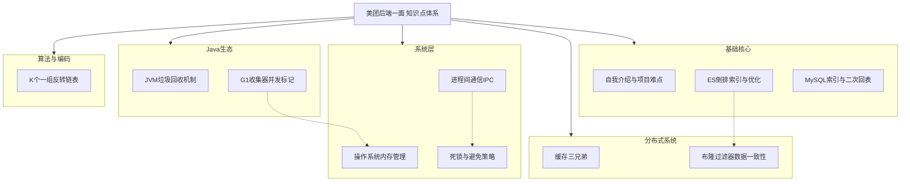

好的，同学。我是本次面试官，接下来我们将围绕你简历中提到的技术栈和项目经验，进行一次深入的技术考察。请你准备好，我们开始。

## 🌟 面试核心知识点框架

首先，我们来梳理一下本次面试所涉及的核心知识点及其内在联系，这有助于你构建系统性的知识体系。



上图展示了本次面试的知识图谱，它不仅是你本次面试的路线图，更是一个优秀后端工程师所需掌握的核心技术体系。接下来，我们逐一深入探讨每个环节。

---

## 一、自我介绍与项目难点

**面试官意图**：考察你的沟通表达、项目总结和难点抽象能力。

**应答思路**：
1.  **我是谁**：学校、专业、技术栈（Java基础、JVM、MySQL、Redis等）。
2.  **我做了什么**：简要介绍实习项目背景、你的角色、承担的核心职责。
3.  **难点与成长**：选择1-2个有代表性的技术难点，用**STAR原则**（Situation情境, Task任务, Action行动, Result结果）阐述。
    *   **示例**：“在项目S中，我负责T（例如：商品搜索性能优化）。当时面临A（难题：数据库Like查询慢，响应超时）。我调研了B（方案：引入Elasticsearch），并具体实施了C（行动：搭建ES集群、数据同步、分词策略调整）。最终取得了R（结果：查询延迟从2s降到200ms，QPS提升10倍）。”

---

## 二、Elasticsearch深度剖析

### 1. 为什么用ES？
*   **定义**：ES是基于Lucene的分布式、RESTful风格的搜索和分析引擎。
*   **场景**：解决传统关系型数据库（如MySQL）在**海量数据**下进行**模糊查询**、**全文检索**、**组合查询**时性能低下的问题。
*   **对比**：MySQL的`LIKE '%keyword%'`会导致全表扫描，性能极差。ES的**倒排索引**结构专为此类场景设计。

### 2. 倒排索引（Inverted Index）
*   **定义**：区别于正排索引（文档ID -> 文档内容），倒排索引是**关键词 -> 文档ID列表**的映射关系。
*   **工作原理**：
    1.  **分词（Analysis）**：将原始文档内容（如“Java工程师”）通过分词器（Analyzer）拆分成独立的词条（Term），如“java”、“工程师”。
    2.  **建立映射**：记录每个词条出现在哪些文档中，以及出现的位置和频率等信息。
*   **示例**：
    | 文档(Doc) | 内容(Content)         |
    | :-------- | :-------------------- |
    | Doc1      | I love Java           |
    | Doc2      | Java is the best language |

    **倒排索引列表**：
    | Term  | Doc Frequency | Posting List     |
    | :---- | :------------ | :--------------- |
    | I     | 1             | [Doc1]           |
    | love  | 1             | [Doc1]           |
    | Java  | 2             | [Doc1, Doc2]     |
    | is    | 1             | [Doc2]           |
    | ...   | ...           | ...              |

### 3. 拆分后的词条匹配
用户输入查询关键词后，ES会使用**相同的分词器**对查询内容进行分词。然后将拆分后的词条去倒排索引中查找，得到每个词条对应的文档ID列表（Posting List），最后根据查询逻辑（如`AND`/`OR`）合并这些列表，得到最终结果集并按相关性得分排序。

### 4. 索引优化
1.  **Mapping设计**：
    *   对不需要搜索的字段，使用`"index": false`。
    *   根据数据类型选对字段类型，如`keyword`（精确匹配）和`text`（全文检索）。
2.  **索引策略**：使用**别名（Alias）** 进行零停机索引重建（Reindex）。
3.  **查询优化**：
    *   避免深度分页，使用`scroll`或`search_after`。
    *   使用`filter`上下文利用查询缓存（Query Cache）。
4.  **硬件与配置**：基于SSD、合理设置分片数（Shards）和副本数（Replicas）。

---

## 三、MySQL索引与二次回表

### 二次回表
*   **定义**：当SQL查询的列超出了**普通二级索引**的覆盖范围时，MySQL需要**先通过二级索引找到主键ID，再回到聚簇索引（主键索引）中去查找完整行数据**的过程。
*   **示例**：表`t_user (id PK, name, age, sex)`，在`age`上建有索引`idx_age`。
    ```sql
    SELECT * FROM t_user WHERE age = 18; -- 需要回表
    SELECT id, age FROM t_user WHERE age = 18; -- 覆盖索引，避免回表
    ```
*   **优化**：使用**覆盖索引（Covering Index）**，即索引包含了查询所需的所有字段，从而避免回表。

---

## 四、操作系统核心

### 1. 内存管理
*   **定义**：操作系统对物理内存和虚拟内存的分配、回收、保护和管理。
*   **核心机制**：
    *   **虚拟内存**：为每个进程提供一致的、独立的虚拟地址空间，通过MMU（内存管理单元）映射到物理内存。
    *   **分页（Paging）**：将虚拟内存和物理内存划分为固定大小的页（如4KB），按需加载。
    *   **分段（Segmentation）**：按逻辑单元（代码段、数据段）划分内存空间。
*   **为什么需要**：进程隔离、提高内存利用率、支持运行比物理内存更大的程序。

### 2. 进程通信（IPC）
*   **方式**：管道、消息队列、信号量、共享内存、Socket等。
*   **管道（Pipe）示例**：
    ```bash
    # Shell中的管道，将ps的输出作为grep的输入
    ps -ef | grep java
    ```
    *   **原理**：管道本质上是内核中的一块**缓冲区**，采用**半双工**通信，数据只能单向流动。创建管道后，fork出子进程，父子进程一个关闭读端、一个关闭写端，即可进行通信。

---

## 五、缓存与分布式

### 缓存三兄弟
这是缓存应用中最经典的三个问题：
1.  **缓存穿透**：访问一个**不存在**的key，请求直击数据库。
    *   **解决**：**布隆过滤器（Bloom Filter）** + 缓存空值。
2.  **缓存击穿**：某个**热点key过期**的瞬间，大量请求击穿到数据库。
    *   **解决**：**互斥锁（Mutex Lock）**（如Redis的`SETNX`）或**逻辑过期**。
3.  **缓存雪崩**：**大量key同时过期**或**Redis宕机**，导致所有请求涌向数据库。
    *   **解决**：给过期时间添加随机值、Redis集群高可用、多级缓存。

### 布隆过滤器与DB一致性
**问题**：如何保证布隆过滤器说“存在”的key，在DB中一定存在？（因为BF有误判率）

**解决方案**：
1.  **核心原则**：**BF是DB的超集**。即DB里有的，BF里一定有；DB里没有的，BF里可能误判有。
2.  **操作流程**：
    *   **写操作**：**先写DB，再写BF（添加key）**。这个顺序至关重要，确保数据落库后BF才能感知。
    *   **删操作**：**不能简单删除BF中的key**！因为BF不支持删除，且其他key的hash可能重叠。常用方案：
        *   **计数布隆过滤器**：支持删除，但占用空间大。
        *   **延迟删除**：在DB中标记记录为“已删除”，BF不变。后续查询时，先查BF，若存在再查DB，发现是删除状态则返回空并异步清理BF（复杂）。
        *   **定期重构**：对于删除不频繁的场景，可以在低峰期定期全量重建BF。

---

## 六、并发与死锁

### 避免死锁
死锁四个必要条件：**互斥、占有且等待、不可剥夺、循环等待**。
*   **破坏“占有且等待”**：一次性申请所有所需资源（如`synchronized`嵌套改为`synchronized`申请多个资源）。
*   **破坏“不可剥夺”**：申请不到后续资源时，释放已占有的资源（尝试拿锁超时则回退，如`Lock.tryLock()`）。
*   **破坏“循环等待”**：给资源编号，按顺序申请（如总是先锁A再锁B）。

---

## 七、JVM垃圾回收机制

### 1. 什么算是垃圾？
没有任何**GC Roots**对象引用链可达的对象。GC Roots包括：
*   虚拟机栈（栈帧中的本地变量表）中引用的对象。
*   方法区中类静态属性引用的对象。
*   方法区中常量引用的对象。
*   本地方法栈中JNI（即Native方法）引用的对象。

### 2. G1如何并发标记？
G1的并发标记发生在**并发标记阶段（Concurrent Marking）**，它与用户线程并发执行。其核心是**三色标记算法**：
*   **白色**：未被访问到的对象（最终会被回收）。
*   **灰色**：自身已被访问，但其引用的对象还未被完全扫描。
*   **黑色**：自身和其引用链都已被扫描，是安全存活的。

**问题**：在并发标记过程中，用户线程可能修改引用关系（如：黑色对象A断开了对白色对象C的引用，而灰色对象B又引用了C），导致本应存活的C被误标为白色而回收。

**解决方案**：**SATB（Snapshot-At-The-Beginning）**。
*   G1在初始标记阶段为堆做一個“快照”。
*   在并发阶段，**当引用关系发生变化时（写屏障）**，JVM会通过**写屏障（Write Barrier）** 将即将被释放的引用（如上述例子中的C）记录到一个**日志缓冲区**中。
*   在最终标记阶段（Remark），会STW（Stop-The-World）地处理这些日志，重新扫描这些发生变动的引用。确保在快照那一刻存活的对象都不会被误回收。

---

## 八、算法题：K个一组反转链表

### 题目说明
这道题与 **LeetCode 25. Reverse Nodes in k-Group** 完全相同。

**题目描述**：给你一个链表，每 k 个节点一组进行翻转，请你返回翻转后的链表。k 是一个正整数，它的值小于或等于链表的长度。如果节点总数不是 k 的整数倍，请将最后剩余的节点保持原有顺序。

### 解题思路
1.  **递归思想**：将链表分为“已处理”、“待反转（k个）”、“未处理”三部分。
2.  **步骤**：
    a. **检查**：从头节点开始，检查剩余部分是否有k个节点。若无，则直接返回头节点。
    b. **反转**：反转这k个节点，得到一个反转后的新链表段。此时原头节点变为新尾节点（`tail`），原尾节点变为新头节点（`newHead`）。
    c. **链接**：将反转后的新链表段的尾部（`tail.next`）与**下一段递归处理后的结果**相连。
    d. **返回**：返回新的头节点`newHead`。
3.  **复杂度分析**：
    *   **时间复杂度**：O(n)。每个节点恰好被遍历和反转一次。
    *   **空间复杂度**：O(n/k)。递归栈的深度，最坏情况为 O(n)。

### 完整Java代码
```java
/**
 * Definition for singly-linked list.
 * public class ListNode {
 *     int val;
 *     ListNode next;
 *     ListNode() {}
 *     ListNode(int val) { this.val = val; }
 *     ListNode(int val, ListNode next) { this.val = val; this.next = next; }
 * }
 */
class Solution {
    public ListNode reverseKGroup(ListNode head, int k) {
        // 边界条件：如果k为1或链表为空，直接返回，无需反转
        if (k == 1 || head == null) {
            return head;
        }

        // 步骤1：检查剩余部分是否有k个节点
        ListNode checkNode = head;
        for (int i = 0; i < k; i++) {
            // 如果中途发现不足k个，直接返回当前头节点，不反转
            if (checkNode == null) {
                return head;
            }
            checkNode = checkNode.next;
        }

        // 步骤2：反转当前k个节点
        ListNode prev = null;
        ListNode curr = head;
        ListNode next = null;
        // 标准的头插法反转链表，循环k次
        for (int i = 0; i < k; i++) {
            next = curr.next;    // 保存下一个节点
            curr.next = prev;    // 当前节点指向前一个节点，实现反转
            prev = curr;         // prev指针后移
            curr = next;         // curr指针后移
        }
        // 循环结束后，prev指向反转后的新头节点，curr指向下一段的头节点
        // head此时变成了当前k个节点的尾节点（tail）

        // 步骤3：递归反转后续链表，并连接起来
        // head（现在的尾部）的next指针，指向下一段反转后的结果
        head.next = reverseKGroup(curr, k);

        // 步骤4：返回新的头节点，即prev
        return prev;
    }
}
```

---

## 九、反问环节

这是你展示思考深度和积极性的好机会，可以问1-2个有水平的问题：
*   “团队目前主要的业务方向和技术挑战是什么？”
*   “对于校招生，团队会有哪些培养机制或成长路径？”
*   “刚才面试中提到的[某个技术点]，在美团的实际业务中是如何应用的？”

希望这份详细的解答能帮助你充分准备。技术深度在于理解原理，广度在于知识串联。祝你面试顺利！
