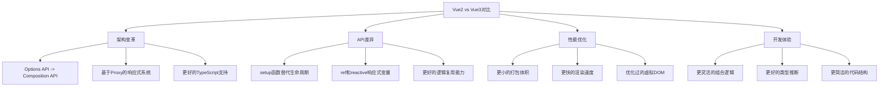
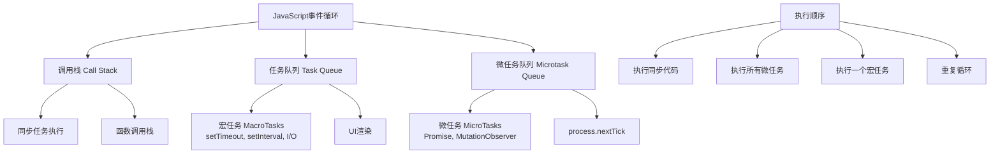
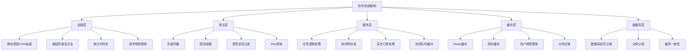

# Java面试题全面解答：三数之和问题

## 原题
**手撕算法题**：在一个列表中，返回所有不同的三个数相加等于0的组合。

## 1. 核心知识点梳理

```mermaid
flowchart TD
    A[三数之和问题] --> B[核心算法]
    A --> C[相关知识点]
    
    B --> B1[暴力法<br>O(n³)时间复杂度]
    B --> B2[排序+双指针法<br>O(n²)时间复杂度]
    B --> B3[哈希表法<br>O(n²)时间复杂度]
    
    C --> C1[数组排序]
    C --> C2[双指针技巧]
    C --> C3[去重处理]
    C --> C4[边界条件处理]
    
    B2 --> D[实现步骤]
    D --> D1[数组排序]
    D --> D2[固定一个元素]
    D --> D3[双指针寻找匹配对]
    D --> D4[跳过重复元素]
```

## 2. 详细知识点讲解

### 2.1 排序算法
- **定义**：将数组元素按特定顺序（升序/降序）排列
- **工作原理**：Java中Arrays.sort()使用改进的双轴快速排序，时间复杂度O(n log n)
- **使用场景**：有序数据能简化许多算法问题，如本题中排序后可以使用双指针技巧
- **注意事项**：排序会改变原始数组顺序，如有需要应先复制数组

### 2.2 双指针技巧
- **定义**：使用两个指针协同遍历数组的技术
- **工作原理**：一个指针从起始位置开始，另一个从末尾开始，根据条件相向移动
- **使用场景**：适用于有序数组的查找、配对等问题，能有效降低时间复杂度
- **注意事项**：需要确保指针移动逻辑正确，避免越界或死循环

### 2.3 去重处理
- **定义**：避免返回包含相同元素组合的重复解
- **工作原理**：当找到有效组合后，跳过所有相邻的相同元素
- **使用场景**：输入数组可能包含重复元素，但要求输出结果不重复
- **注意事项**：需要在多个层级进行去重（固定元素、左指针、右指针）

## 3. 算法题解答

### 3.1 类似LeetCode题目
这道题与**LeetCode第15题"三数之和"**完全相同。

### 3.2 解题思路
**最优解法**：排序 + 双指针法

1. **排序数组**：首先将数组排序，这样我们可以利用有序特性避免重复和高效查找
2. **遍历固定一个元素**：对于每个元素nums[i]，将其作为三个数中的第一个固定元素
3. **双指针查找**：使用左右指针在i+1到末尾的区间内查找两个数，使得三者之和为0
4. **去重处理**：在三个层级（固定元素、左指针、右指针）都需要跳过重复值

**时间复杂度分析**：
- 排序：O(n log n)
- 双指针遍历：O(n²)
- 总时间复杂度：O(n²)

**空间复杂度分析**：
- 除了存储结果的列表外，只使用了常数级别的额外空间
- 空间复杂度：O(1)或O(n)（取决于是否考虑输出占用的空间）

### 3.3 完整Java代码实现

```java
import java.util.ArrayList;
import java.util.Arrays;
import java.util.List;

public class ThreeSum {
    
    public List<List<Integer>> threeSum(int[] nums) {
        // 初始化结果列表
        List<List<Integer>> result = new ArrayList<>();
        
        // 边界情况处理：如果数组为null或长度小于3，直接返回空结果
        if (nums == null || nums.length < 3) {
            return result;
        }
        
        // 第一步：对数组进行排序，这是使用双指针法的前提
        Arrays.sort(nums);
        int n = nums.length;
        
        // 遍历数组，固定第一个元素
        for (int i = 0; i < n - 2; i++) {
            // 如果当前固定的元素已经大于0，由于数组已排序，后面的元素都更大，不可能找到和为0的组合
            if (nums[i] > 0) {
                break;
            }
            
            // 跳过重复的固定元素，避免产生重复解
            if (i > 0 && nums[i] == nums[i - 1]) {
                continue;
            }
            
            // 初始化左右指针
            int left = i + 1;    // 左指针从固定元素的下一个位置开始
            int right = n - 1;   // 右指针从数组末尾开始
            
            // 双指针相向遍历
            while (left < right) {
                int sum = nums[i] + nums[left] + nums[right];
                
                if (sum == 0) {
                    // 找到满足条件的三元组
                    result.add(Arrays.asList(nums[i], nums[left], nums[right]));
                    
                    // 跳过左侧的重复元素
                    while (left < right && nums[left] == nums[left + 1]) {
                        left++;
                    }
                    // 跳过右侧的重复元素
                    while (left < right && nums[right] == nums[right - 1]) {
                        right--;
                    }
                    // 移动指针继续寻找其他可能解
                    left++;
                    right--;
                } else if (sum < 0) {
                    // 和太小，需要增大，左指针右移
                    left++;
                } else {
                    // 和太大，需要减小，右指针左移
                    right--;
                }
            }
        }
        
        return result;
    }
    
    // 测试代码
    public static void main(String[] args) {
        ThreeSum solution = new ThreeSum();
        int[] nums = {-1, 0, 1, 2, -1, -4};
        List<List<Integer>> result = solution.threeSum(nums);
        
        // 输出结果
        System.out.println("三数之和为0的组合：");
        for (List<Integer> triplet : result) {
            System.out.println(triplet);
        }
        // 预期输出：[-1, -1, 2], [-1, 0, 1]
    }
}
```

### 3.4 边界情况处理
1. **输入数组为null或长度不足3**：直接返回空列表
2. **数组元素全为正数或全为负数**：不可能找到和为0的组合，提前终止循环
3. **包含大量重复元素**：通过跳过重复值的处理确保结果不重复
4. **整数溢出**：本题中整数范围在-10^5到10^5，三个数相加不会超过整数范围

## 4. 扩展内容

### 4.1 行业最佳实践
1. **代码可读性**：使用有意义的变量名，添加适当注释
2. **边界处理**：充分考虑各种边界情况，增强代码健壮性
3. **性能优化**：选择最优算法，避免不必要的计算
4. **测试覆盖**：编写测试用例覆盖正常情况和各种边界情况

### 4.2 常见问题及解决方案
1. **问题**：结果中出现重复组合
   - **解决方案**：在三个层级（固定元素、左指针、右指针）都进行去重处理

2. **问题**：算法性能不佳
   - **解决方案**：使用排序+双指针法替代暴力三重循环

3. **问题**：边界情况处理不完善
   - **解决方案**：考虑输入为空、长度不足、全正数、全负数等情况

### 4.3 类似问题变种
1. **最接近的三数之和**：找到三个数使其和最接近目标值
2. **四数之和**：扩展为四个数之和等于目标值
3. **较小三数之和**：计算所有满足三个数之和小于目标值的组合数量

## 5. 面试回答技巧

在面试中回答算法问题时，建议采用以下结构：
1. **理解问题**：澄清需求，确认输入输出格式及边界条件
2. **提出思路**：先提出暴力解法，再分析其不足，最后提出优化方案
3. **复杂度分析**：明确说明算法的时间和空间复杂度
4. **代码实现**：编写清晰、有注释的代码，边写边解释思路
5. **测试验证**：用示例测试代码，验证边界情况
6. **总结展望**：简要讨论算法的优缺点和可能的改进方向

这种结构化回答方式能展现你的思维全面性和专业素养，给面试官留下良好印象。

# 前端与全栈开发面试题全面解答

## 1. Vue/React使用经验

**回答示例**：
作为一名全栈开发者，我在多个项目中使用了Vue.js，特别是Vue 2和Vue 3。在XX项目中，我使用Vue 2开发了后台管理系统，实现了动态路由、权限控制和可视化数据展示。在YY项目中，我采用Vue 3 + TypeScript重构了前端架构，提升了代码维护性和开发体验。

## 2. Vue 2 vs Vue 3 区别



**详细对比**：

1. **响应式系统重构**
   - Vue 2：使用Object.defineProperty，无法检测对象属性的添加/删除，数组变化需要特殊处理
   - Vue 3：使用Proxy，支持全范围的响应式变化检测，性能更好

2. **Composition API**
   - Vue 2：Options API（data, methods, computed分开定义）
   - Vue 3：Composition API（按逻辑功能组织代码），更好的代码组织和复用

3. **性能优化**
   - Vue 3：打包体积减少41%，初始渲染快55%，更新快133%
   - 更好的Tree-shaking支持，只打包使用的功能

4. **TypeScript支持**
   - Vue 3：从头用TypeScript重写，提供更好的类型推断

5. **片段(Fragments)支持**
   - Vue 3：组件可以有多根节点

**示例代码对比**：
```javascript
// Vue 2 Options API
export default {
  data() {
    return {
      count: 0,
      message: 'Hello'
    }
  },
  methods: {
    increment() {
      this.count++
    }
  }
}

// Vue 3 Composition API
import { ref } from 'vue'
export default {
  setup() {
    const count = ref(0)
    const message = ref('Hello')
    
    const increment = () => {
      count.value++
    }
    
    return { count, message, increment }
  }
}
```

## 3. 同源策略及解决方法

**同源策略(Same-Origin Policy)**：
浏览器安全机制，限制来自不同源的文档或脚本如何与当前文档交互，防止恶意网站窃取数据。

**同源定义**：协议、域名、端口完全相同

**解决方法**：

1. **CORS(跨域资源共享)**
   - 服务端设置Access-Control-Allow-Origin响应头
   - 简单请求 vs 预检请求(preflight)

2. **JSONP**
   - 利用`<script>`标签无跨域限制的特性
   - 只支持GET请求，安全性较低

3. **代理服务器**
   - 前端请求同源代理服务器，代理转发到目标服务器
   - 开发环境常用webpack-dev-server代理

4. **WebSocket**
   - 不受同源策略限制

5. **postMessage API**
   - 窗口间跨域通信

**CORS示例**：
```java
// Spring Boot中配置CORS
@Configuration
public class CorsConfig implements WebMvcConfigurer {
    @Override
    public void addCorsMappings(CorsRegistry registry) {
        registry.addMapping("/api/**")
                .allowedOrigins("https://domain.com")
                .allowedMethods("GET", "POST", "PUT", "DELETE")
                .allowedHeaders("*")
                .allowCredentials(true);
    }
}
```

## 4. JS事件循环机制

**事件循环(Event Loop)**是JavaScript处理异步操作的机制，确保非阻塞执行。



**工作原理**：
1. 同步任务在主线程执行，形成执行栈
2. 异步任务被添加到任务队列（宏任务队列和微任务队列）
3. 执行栈清空后，检查微任务队列并执行所有微任务
4. 执行一个宏任务，然后再次检查微任务队列
5. 重复此过程

**执行顺序**：同步任务 → 所有微任务 → 一个宏任务 → 所有微任务 → ...

## 5. Promise详解

**Promise**是处理异步操作的对象，代表一个最终可能完成或失败的操作。

**三种状态**：
- pending: 初始状态
- fulfilled: 操作成功完成
- rejected: 操作失败

**创建Promise**：
```javascript
const promise = new Promise((resolve, reject) => {
  // 异步操作
  if (/* 成功 */) {
    resolve(value); // 状态变为fulfilled
  } else {
    reject(error); // 状态变为rejected
  }
});
```

**常用方法**：
1. **then()** - 添加fulfilled和rejected状态的回调
2. **catch()** - 添加rejected状态的回调
3. **finally()** - 无论成功失败都会执行
4. **Promise.all()** - 所有promise都成功时返回结果数组
5. **Promise.race()** - 第一个解决或拒绝的promise的结果
6. **Promise.allSettled()** - 所有promise都完成后返回结果数组

**async/await**：
基于Promise的语法糖，使异步代码看起来像同步代码
```javascript
async function fetchData() {
  try {
    const response = await fetch('/api/data');
    const data = await response.json();
    return data;
  } catch (error) {
    console.error('Error:', error);
  }
}
```

## 6. 秒杀系统设计（全栈角度）

### 系统架构设计



### 详细设计方案

**前端优化**：
1. 静态资源（JS/CSS/图片）使用CDN加速
2. 按钮防重复点击和倒计时同步
3. 请求频率限制和验证码机制
4. 页面静态化，减少后端请求

**网关层**：
1. Nginx负载均衡和限流
2. 恶意请求识别和过滤
3. SSL终端减轻后端压力

**服务层**：
1. 微服务架构，秒杀服务独立部署
2. 库存预扣减：Redis原子操作保证一致性
3. 异步处理：消息队列缓冲高并发请求
4. 分布式锁防止超卖

**缓存层**：
1. Redis缓存商品信息和库存
2. 使用Redis原子操作保证数据一致性
3. 缓存用户购买记录，防止重复购买

**数据库层**：
1. 数据库读写分离
2. 分库分表降低单表压力
3. 最终一致性替代强一致性

**Java代码示例 - 库存扣减**：
```java
@Service
public class SeckillService {
    
    @Autowired
    private RedisTemplate<String, Object> redisTemplate;
    
    @Autowired
    private RedissonClient redissonClient;
    
    /**
     * 秒杀商品处理
     */
    public boolean seckillProduct(long productId, long userId) {
        String lockKey = "seckill:lock:" + productId;
        RLock lock = redissonClient.getLock(lockKey);
        
        try {
            // 获取分布式锁，防止超卖
            if (lock.tryLock(1, 10, TimeUnit.SECONDS)) {
                // 检查库存
                String stockKey = "seckill:stock:" + productId;
                Integer stock = (Integer) redisTemplate.opsForValue().get(stockKey);
                
                if (stock != null && stock > 0) {
                    // 扣减库存
                    redisTemplate.opsForValue().decrement(stockKey);
                    
                    // 记录用户购买信息
                    String userKey = "seckill:user:" + productId;
                    redisTemplate.opsForSet().add(userKey, userId);
                    
                    // 发送消息到MQ，异步创建订单
                    sendOrderMessage(productId, userId);
                    
                    return true;
                }
            }
        } catch (InterruptedException e) {
            Thread.currentThread().interrupt();
        } finally {
            if (lock.isHeldByCurrentThread()) {
                lock.unlock();
            }
        }
        
        return false;
    }
    
    /**
     * 初始化商品库存
     */
    public void initProductStock(long productId, int stock) {
        String stockKey = "seckill:stock:" + productId;
        redisTemplate.opsForValue().set(stockKey, stock);
    }
}
```

### 容错与降级方案

1. **服务降级**：高峰期关闭非核心功能
2. **限流策略**：令牌桶或漏桶算法控制流量
3. **熔断机制**：服务异常时快速失败
4. **监控预警**：实时监控系统状态

## 7. 面试回答技巧

对于全栈开发岗位，面试时应突出：

1. **技术广度**：展示前后端全面技术栈理解
2. **系统思维**：从整体架构角度思考问题
3. **实战经验**：结合具体项目经验讲解
4. **解决问题能力**：展示分析问题和提出解决方案的能力
5. **学习能力**：体现对新技术的学习和掌握能力

在回答时采用STAR法则（Situation, Task, Action, Result）结构化回答，既能展示技术深度，又能体现解决问题的能力。
