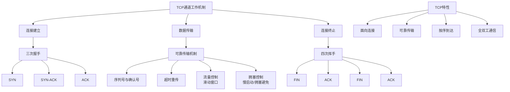
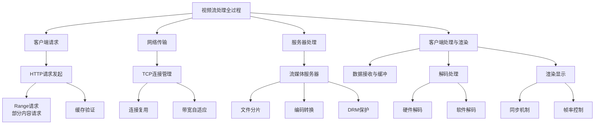
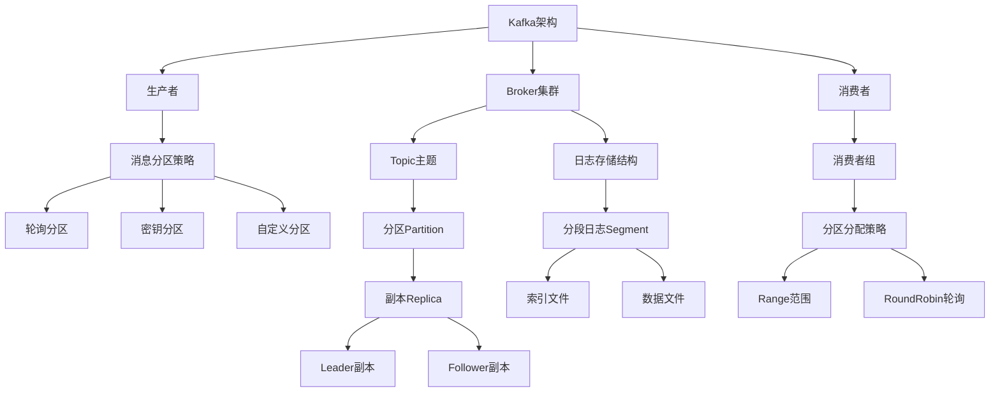

美团全栈二面 9.11

很好的一次面试体验，很喜欢面试官

拷打项目，实习

问了一个推流安保系统的全过程

什么是 tcp 通道

讲讲一个视频流从 http 请求到显示在屏幕上的全过程，越细越好

讲讲对于 springboot 的理解，哪里好哪里不好

讲讲 kafka 的原理，越深越好，后面都讲到文件系统了

还有一些简单的忘了

最后讲了 20 分钟的美团业务


作者：coollias
链接：https://www.nowcoder.com/feed/main/detail/d5ccc3ea8fe64998a63f324a965dfe52?sourceSSR=search
来源：牛客网

# 美团全栈二面面试题全面解答

## 1. TCP通道详解

**TCP（传输控制协议）通道**是建立在TCP协议之上的端到端通信链路，提供可靠的、面向连接的字节流传输服务。



**TCP通道关键特性**：

1. **可靠性保障**
   - 序列号和确认机制：每个字节都有唯一序列号，接收方发送ACK确认
   - 超时重传：未收到ACK时重传数据包
   - 校验和：检测数据传输中的错误

2. **流量控制**
   - 滑动窗口协议：接收方通过窗口大小告知发送方可接收数据量
   - 防止发送方过快发送导致接收方缓冲区溢出

3. **拥塞控制**
   - 慢启动：初始阶段指数增长拥塞窗口
   - 拥塞避免：达到阈值后线性增长
   - 快速重传和快速恢复：针对丢包情况的优化

4. **连接管理**
   - 三次握手建立连接：SYN → SYN-ACK → ACK
   - 四次挥手终止连接：FIN → ACK → FIN → ACK

**Java中的TCP编程示例**：
```java
// 服务器端
public class TcpServer {
    public static void main(String[] args) throws IOException {
        ServerSocket serverSocket = new ServerSocket(8080);
        System.out.println("服务器启动，监听端口8080...");
        
        while (true) {
            Socket clientSocket = serverSocket.accept(); // 等待客户端连接
            new ClientHandler(clientSocket).start(); // 创建新线程处理客户端
        }
    }
}

// 客户端处理线程
class ClientHandler extends Thread {
    private Socket clientSocket;
    
    public ClientHandler(Socket socket) {
        this.clientSocket = socket;
    }
    
    public void run() {
        try (InputStream input = clientSocket.getInputStream();
             OutputStream output = clientSocket.getOutputStream()) {
            
            // 处理TCP数据流
            byte[] buffer = new byte[1024];
            int bytesRead;
            while ((bytesRead = input.read(buffer)) != -1) {
                String received = new String(buffer, 0, bytesRead);
                System.out.println("收到消息: " + received);
                
                // 响应客户端
                String response = "服务器响应: " + received.toUpperCase();
                output.write(response.getBytes());
                output.flush();
            }
        } catch (IOException e) {
            System.out.println("客户端连接异常: " + e.getMessage());
        }
    }
}
```

## 2. 视频流从HTTP请求到显示的全过程



**详细处理流程**：

1. **HTTP请求发起**
   ```javascript
   // 浏览器中视频请求示例
   // <video src="https://example.com/video.mp4" controls></video>
   
   // 实际发生的HTTP请求头
   GET /video.mp4 HTTP/1.1
   Host: example.com
   Range: bytes=0-1023  // 范围请求，支持断点续传
   Accept: video/mp4,video/*
   ```

2. **服务器处理与响应**
   ```java
   // Spring Boot中处理视频范围请求的示例
   @GetMapping("/video/{id}")
   public ResponseEntity<Resource> streamVideo(
           @PathVariable String id, 
           @RequestHeader HttpHeaders headers) throws IOException {
       
       Resource videoResource = videoService.getVideoResource(id);
       long contentLength = videoResource.contentLength();
       
       // 处理范围请求
       Range range = headers.getRange().isEmpty() ? null : headers.getRange().get(0);
       if (range != null) {
           long start = range.getRangeStart(contentLength);
           long end = range.getRangeEnd(contentLength);
           long rangeLength = end - start + 1;
           
           // 设置部分内容响应
           return ResponseEntity.status(HttpStatus.PARTIAL_CONTENT)
                   .header("Content-Type", "video/mp4")
                   .header("Content-Length", String.valueOf(rangeLength))
                   .header("Content-Range", "bytes " + start + "-" + end + "/" + contentLength)
                   .body(new InputStreamResource(
                           new LimitedInputStream(videoResource.getInputStream(), start, rangeLength)));
       }
       
       // 完整内容响应
       return ResponseEntity.ok()
               .header("Content-Type", "video/mp4")
               .header("Content-Length", String.valueOf(contentLength))
               .body(videoResource);
   }
   ```

3. **客户端接收与处理**
   - **网络层**：TCP保证数据有序可靠到达
   - **缓冲机制**：预先加载部分视频数据避免卡顿
   - **解码处理**：
     - 硬件解码：使用GPU加速，功耗低
     - 软件解码：CPU处理，兼容性好
   - **渲染显示**：
     - 同步音视频流
     - 帧率自适应调整

4. **性能优化技术**
   - **自适应码率流**：根据网络条件动态调整视频质量
   - **CDN加速**：边缘节点缓存减少延迟
   - **预加载与缓冲**：平滑播放体验
   - **压缩与编码优化**：HEVC/H.265等高效编码格式

## 3. Spring Boot深度解析

### 3.1 Spring Boot的优势

**核心优势**：
1. **快速开发**：简化配置，内嵌服务器，开箱即用
2. **自动配置**：基于类路径自动配置Bean
3. **生产就绪**：提供监控、健康检查等生产特性
4. **微服务支持**：轻松构建分布式系统
5. **丰富的starter**：简化依赖管理

**自动配置原理**：
```java
// Spring Boot自动配置核心机制
@SpringBootApplication
// 等同于以下三个注解的组合
@SpringBootConfiguration    // 标识为配置类
@ComponentScan              // 组件扫描
@EnableAutoConfiguration    // 启用自动配置

// 自动配置内部机制
public @interface EnableAutoConfiguration {
    // 通过META-INF/spring.factories定义自动配置类
    // 条件注解控制配置生效条件
}

// 条件注解示例
@Configuration
@ConditionalOnClass({DataSource.class, EmbeddedDatabaseType.class}) // 类路径条件
@ConditionalOnProperty(prefix = "spring.datasource", name = "url") // 属性条件
@AutoConfigureAfter(DataSourceAutoConfiguration.class)            // 顺序条件
public class MyBatisAutoConfiguration {
    // 自动配置逻辑
}
```

### 3.2 Spring Boot的不足与应对

**局限性**：
1. **启动性能**：大型应用启动较慢
   - 解决方案：使用Spring Boot 2.4+的惰性初始化，GraalVM原生镜像

2. **内存占用**：相对较高
   - 解决方案：合理配置JVM参数，使用Profile优化

3. **配置复杂性**：自动化可能掩盖底层细节
   - 解决方案：理解自动配置原理，必要时自定义配置

4. **监控与调试**：自动化配置增加调试难度
   - 解决方案：使用Actuator端点，条件注解报告

**最佳实践**：
```yaml
# application.yml 配置示例
spring:
  application:
    name: video-service
  profiles:
    active: @activatedProperties@  # Maven/Gradle属性替换
  main:
    lazy-initialization: true  # 惰性初始化提升启动速度
    
management:
  endpoints:
    web:
      exposure:
        include: health,info,metrics  # 监控端点
  endpoint:
    health:
      show-details: when_authorized

server:
  compression:
    enabled: true  # 响应压缩
    mime-types: text/html,text/xml,text/css,application/json,application/javascript,video/mp4
```

## 4. Kafka原理深度解析

### 4.1 Kafka核心架构



### 4.2 文件系统与存储机制

**Kafka存储架构**：

1. **分区日志结构**
   ```
   topic-name/
   ├── partition-0/
   │   ├── 00000000000000000000.index    # 偏移量索引
   │   ├── 00000000000000000000.log      # 数据文件
   │   ├── 00000000000000000000.timeindex # 时间戳索引
   │   └── ...
   ├── partition-1/
   └── ...
   ```

2. **高效读写机制**
   - **顺序写入**：磁盘顺序写入性能极高
   - **零拷贝技术**：使用sendfile系统调用减少内核态到用户态数据拷贝
   - **页缓存**：利用操作系统页缓存提高读取性能

3. **索引优化**
   - 稀疏索引：减少索引文件大小
   - 二分查找：快速定位消息位置

**Java生产者示例**：
```java
@Configuration
public class KafkaProducerConfig {
    
    @Value("${spring.kafka.bootstrap-servers}")
    private String bootstrapServers;
    
    @Bean
    public ProducerFactory<String, String> producerFactory() {
        Map<String, Object> configProps = new HashMap<>();
        configProps.put(ProducerConfig.BOOTSTRAP_SERVERS_CONFIG, bootstrapServers);
        configProps.put(ProducerConfig.KEY_SERIALIZER_CLASS_CONFIG, StringSerializer.class);
        configProps.put(ProducerConfig.VALUE_SERIALIZER_CLASS_CONFIG, StringSerializer.class);
        
        // 高性能配置
        configProps.put(ProducerConfig.LINGER_MS_CONFIG, 20);      // 批量发送延迟
        configProps.put(ProducerConfig.BATCH_SIZE_CONFIG, 16384);  // 批量大小16KB
        configProps.put(ProducerConfig.COMPRESSION_TYPE_CONFIG, "lz4"); // 压缩减少网络传输
        
        return new DefaultKafkaProducerFactory<>(configProps);
    }
    
    @Bean
    public KafkaTemplate<String, String> kafkaTemplate() {
        return new KafkaTemplate<>(producerFactory());
    }
}

@Service
public class VideoEventProducer {
    
    @Autowired
    private KafkaTemplate<String, String> kafkaTemplate;
    
    public void sendVideoEvent(String videoId, String eventType) {
        String topic = "video-events";
        String key = videoId; // 相同videoId的消息发送到同一分区
        
        VideoEvent event = new VideoEvent(videoId, eventType, System.currentTimeMillis());
        String value = objectMapper.writeValueAsString(event);
        
        // 发送消息
        kafkaTemplate.send(topic, key, value).addCallback(
            result -> {
                RecordMetadata metadata = result.getRecordMetadata();
                log.info("消息发送成功: topic={}, partition={}, offset={}",
                         metadata.topic(), metadata.partition(), metadata.offset());
            },
            ex -> log.error("消息发送失败", ex)
        );
    }
}
```

### 4.3 高级特性与优化

1. **副本机制**
   - ISR（In-Sync Replicas）：同步副本集合
   - 水位标记（High Watermark）：定义已提交消息边界

2. **精确一次语义（Exactly-Once）**
   - 幂等生产者：避免消息重复发送
   - 事务支持：跨分区原子性写入

3. **消费者组再平衡**
   - 分区分配策略优化
   - 增量再平衡减少暂停时间

## 5. 推流安保系统设计

**推流安保系统架构**：

1. **输入验证层**
   - 身份认证：OAuth2.0/JWT令牌验证
   - 权限检查：基于角色的访问控制
   - 输入清洗：防止注入攻击

2. **内容安全层**
   - 实时内容审核：图像识别、音频分析
   - 水印技术：版权保护和溯源
   - DRM保护：数字版权管理

3. **网络安全层**
   - TLS加密：传输层安全
   - DDoS防护：流量清洗和限流
   - 防火墙规则：网络访问控制

4. **监控预警层**
   - 实时监控：系统性能和业务指标
   - 异常检测：机器学习异常行为识别
   - 审计日志：完整操作记录

**Java实现示例**：
```java
@Component
public class StreamSecurityInterceptor implements HandlerInterceptor {
    
    @Autowired
    private ContentModerationService contentModerationService;
    
    @Autowired
    private RateLimitService rateLimitService;
    
    @Override
    public boolean preHandle(HttpServletRequest request, HttpServletResponse response, Object handler) {
        // 1. 身份认证
        String token = request.getHeader("Authorization");
        User user = authService.authenticate(token);
        if (user == null) {
            response.setStatus(HttpStatus.UNAUTHORIZED.value());
            return false;
        }
        
        // 2. 速率限制
        String clientIp = getClientIp(request);
        if (!rateLimitService.tryAcquire(user.getId(), clientIp)) {
            response.setStatus(HttpStatus.TOO_MANY_REQUESTS.value());
            return false;
        }
        
        // 3. 权限检查
        if (!user.hasPermission("stream.push")) {
            response.setStatus(HttpStatus.FORBIDDEN.value());
            return false;
        }
        
        request.setAttribute("currentUser", user);
        return true;
    }
    
    @Override
    public void afterCompletion(HttpServletRequest request, HttpServletResponse response, 
                               Object handler, Exception ex) {
        // 清理资源
        rateLimitService.release(getClientIp(request));
    }
}

@Service
public class ContentModerationService {
    
    public boolean moderateVideoFrame(BufferedImage frame, String streamId) {
        // 1. 暴力内容检测
        if (violenceDetector.detect(frame)) {
            log.warn("检测到暴力内容: {}", streamId);
            return false;
        }
        
        // 2. 色情内容检测
        if (pornographyDetector.detect(frame)) {
            log.warn("检测到色情内容: {}", streamId);
            return false;
        }
        
        // 3. 水印添加
        addWatermark(frame, streamId);
        
        return true;
    }
    
    private void addWatermark(BufferedImage image, String streamId) {
        Graphics2D g2d = image.createGraphics();
        g2d.setComposite(AlphaComposite.getInstance(AlphaComposite.SRC_OVER, 0.3f));
        g2d.setColor(Color.WHITE);
        g2d.setFont(new Font("Arial", Font.BOLD, 20));
        g2d.drawString("StreamID: " + streamId, 10, image.getHeight() - 10);
        g2d.dispose();
    }
}
```

## 6. 面试总结与建议

**技术深度展示**：
1. 深入理解TCP/IP协议栈和网络编程
2. 掌握流媒体技术全栈知识
3. 精通Spring Boot内部机制和最佳实践
4. 深入理解Kafka架构设计和性能优化

**业务理解能力**：
1. 结合美团业务特点（高并发、分布式、实时性）
2. 展示系统设计能力和问题解决思路
3. 体现对安全性和可靠性的重视

**面试技巧**：
1. 采用分层方式讲解复杂系统
2. 结合具体代码示例说明理论
3. 展示对技术选型的思考过程
4. 主动讨论技术方案的优缺点

通过这样全面而深入的准备，你能够在美团全栈面试中展现出扎实的技术功底和系统的架构思维，大大提高通过面试的机会。
