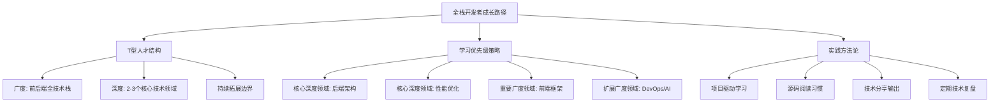

# 美团二面面试题全面解答

## 一、面试问题深度解答

### 1. 全栈开发中深度与广度的平衡

**平衡策略**：


**具体实施计划**：
1. **深度建设**：
   - 选择2-3个核心领域深入钻研（如：分布式系统、数据库优化、高并发架构）
   - 每季度完成一个深度技术专题研究
   - 参与开源项目或自研中间件

2. **广度拓展**：
   - 保持对前后端新技术的好奇心和学习
   - 每月投入固定时间学习跨界知识
   - 通过实际项目实践新技术

3. **时间分配**：
   - 70%时间用于深度技术钻研
   - 20%时间用于广度技术学习  
   - 10%时间用于技术视野拓展

### 2. 大型项目配置管理解决方案

**问题背景**：避免if-else配置硬编码，实现可扩展的配置管理系统

**解决方案架构**：
```java
// 1. 配置中心抽象层
public interface ConfigCenter {
    String getConfig(String key);
    void addListener(String key, ConfigChangeListener listener);
}

// 2. 配置解析工厂
@Component
public class ConfigFactory {
    @Autowired
    private ConfigCenter configCenter;
    
    @Autowired
    private List<ConfigParser> parsers;
    
    private Map<String, ConfigParser> parserMap = new ConcurrentHashMap<>();
    
    @PostConstruct
    public void init() {
        for (ConfigParser parser : parsers) {
            parserMap.put(parser.getFormat(), parser);
        }
    }
    
    public <T> T getConfig(String key, Class<T> clazz) {
        String configContent = configCenter.getConfig(key);
        String format = determineFormat(key);
        ConfigParser parser = parserMap.get(format);
        
        if (parser == null) {
            throw new IllegalArgumentException("Unsupported config format: " + format);
        }
        
        return parser.parse(configContent, clazz);
    }
    
    private String determineFormat(String key) {
        if (key.endsWith(".json")) return "json";
        if (key.endsWith(".yaml") || key.endsWith(".yml")) return "yaml";
        if (key.endsWith(".xml")) return "xml";
        return "properties";
    }
}

// 3. 动态配置更新机制
@Service
public class DynamicConfigService {
    @Autowired
    private ConfigCenter configCenter;
    
    private Map<String, Object> configCache = new ConcurrentHashMap<>();
    
    @PostConstruct
    public void setupConfigListeners() {
        // 监听配置变化
        configCenter.addListener("app.*", (key, newValue) -> {
            refreshConfig(key);
            publishConfigChangeEvent(key);
        });
    }
    
    public <T> T getDynamicConfig(String key, Class<T> clazz) {
        return clazz.cast(configCache.computeIfAbsent(key, k -> {
            String configValue = configCenter.getConfig(k);
            return parseConfig(configValue, clazz);
        }));
    }
}
```

**配置管理最佳实践**：
1. **配置分层**：
   - 环境配置（dev/test/prod）
   - 应用配置
   - 业务配置
   - 特性开关

2. **版本控制**：所有配置纳入版本管理
3. **权限控制**：不同环境配置访问权限分离
4. **监控审计**：配置变更记录和审计日志

### 3. 地图集成性能优化方案

**常见性能问题及解决方案**：

1. **过多标记点导致渲染性能下降**
   ```javascript
   // 优化前：直接添加大量标记
   markers.forEach(marker => {
       new mapboxgl.Marker()
           .setLngLat([marker.lng, marker.lat])
           .addTo(map);
   });

   // 优化后：使用聚类和分页
   const clusterMarkers = () => {
       const clusterSource = {
           type: 'geojson',
           data: {
               type: 'FeatureCollection',
               features: markers.slice(0, 1000).map(marker => ({
                   type: 'Feature',
                   geometry: {
                       type: 'Point',
                       coordinates: [marker.lng, marker.lat]
                   },
                   properties: marker
               }))
           },
           cluster: true,
           clusterMaxZoom: 14,
           clusterRadius: 50
       };

       map.addSource('markers', clusterSource);
   };
   ```

2. **内存泄漏问题解决**
   ```javascript
   // 正确清理地图资源
   class MapManager {
       constructor() {
           this.markers = [];
           this.popups = [];
           this.sources = [];
       }
       
       addMarker(marker) {
           this.markers.push(marker);
       }
       
       cleanup() {
           // 清理所有资源
           this.markers.forEach(marker => marker.remove());
           this.popups.forEach(popup => popup.remove());
           this.sources.forEach(source => map.removeSource(source));
           
           this.markers = [];
           this.popups = [];
           this.sources = [];
       }
   }
   ```

3. **视图渲染优化**
   ```javascript
   // 使用Web Worker处理大量地理数据计算
   const geoDataWorker = new Worker('geo-data-processor.js');

   geoDataWorker.onmessage = function(event) {
       const processedData = event.data;
       updateMapWithData(processedData);
   };

   // 只在视图范围内渲染
   map.on('moveend', () => {
       const bounds = map.getBounds();
       filterAndRenderMarkersInBounds(bounds);
   });
   ```

### 4. AI在开发中的应用场景

**AI编程工具实践**：

| 场景 | 工具 | 最佳实践 |
|------|------|----------|
| **代码生成** | Cursor, GitHub Copilot | 用于模板代码、单元测试、API文档 |
| **代码审查** | CodeRabbit, DeepCode | 自动化代码质量检查和安全漏洞检测 |
| **调试辅助** | AI Debugger | 异常分析、性能问题诊断 |
| **技术方案设计** | Claude, ChatGPT | 架构设计咨询、技术选型建议 |

**Cursor使用场景**：
1. **快速原型开发**：生成基础代码结构
2. **代码解释**：理解复杂算法或遗留代码
3. **测试用例生成**：自动生成单元测试
4. **文档编写**：自动生成API文档和注释

## 二、手撕代码 - 有效的括号（LeetCode 20）

### 解题思路

**算法选择**：使用栈数据结构进行匹配检查

**时间复杂度**：O(n)，其中n是字符串长度
**空间复杂度**：O(n)，最坏情况下需要存储所有左括号

### 完整代码实现

```java
import java.util.Stack;

public class ValidParentheses {
    
    /**
     * 检查括号字符串是否有效
     * @param s 输入字符串，只包含 '(', ')', '{', '}', '[', ']'
     * @return 如果括号匹配正确返回true，否则返回false
     */
    public boolean isValid(String s) {
        // 边界情况处理：空字符串或长度为奇数字符串直接返回false
        if (s == null || s.length() % 2 != 0) {
            return false;
        }
        
        Stack<Character> stack = new Stack<>();
        
        // 遍历字符串中的每个字符
        for (int i = 0; i < s.length(); i++) {
            char c = s.charAt(i);
            
            // 如果是左括号，压入栈中
            if (c == '(' || c == '{' || c == '[') {
                stack.push(c);
            } 
            // 如果是右括号
            else {
                // 如果栈为空，说明没有匹配的左括号
                if (stack.isEmpty()) {
                    return false;
                }
                
                // 弹出栈顶元素并检查是否匹配
                char top = stack.pop();
                if (!isMatchingPair(top, c)) {
                    return false;
                }
            }
        }
        
        // 最后栈应该为空，否则有未匹配的左括号
        return stack.isEmpty();
    }
    
    /**
     * 检查左右括号是否匹配
     * @param left 左括号
     * @param right 右括号
     * @return 如果匹配返回true，否则返回false
     */
    private boolean isMatchingPair(char left, char right) {
        return (left == '(' && right == ')') ||
               (left == '{' && right == '}') ||
               (left == '[' && right == ']');
    }
    
    // 测试用例
    public static void main(String[] args) {
        ValidParentheses solution = new ValidParentheses();
        
        // 测试用例
        String[] testCases = {
            "()",        // true
            "()[]{}",    // true  
            "(]",        // false
            "([)]",      // false
            "{[]}",      // true
            "(",         // false
            ")",         // false
            "",          // true
        };
        
        for (String testCase : testCases) {
            boolean result = solution.isValid(testCase);
            System.out.println("Input: \"" + testCase + "\" -> Output: " + result);
        }
    }
}
```

### 边界情况处理

1. **空字符串**：应该返回true
2. **长度为奇数的字符串**：直接返回false，无法完全匹配
3. **只有左括号或只有右括号**：栈最终不为空或提前为空
4. **嵌套但不匹配的括号**：如"([)]"应该返回false

### 算法优化点

1. **使用数组模拟栈**：对于固定大小的输入，可以使用数组而不是Stack类
2. **提前终止**：遇到不匹配立即返回false
3. **大小检查优化**：首先检查字符串长度是否为偶数

## 三、面试技巧与总结

### 面试官关注点分析

1. **技术深度**：不仅要知道怎么做，还要知道为什么
2. **解决问题能力**：面对复杂问题的分析和解决思路
3. **代码质量**：简洁、可读、健壮的代码实现
4. **沟通表达**：清晰表达技术方案和决策理由

### 面试应答策略

1. **STAR法则**：
   - Situation：项目背景和挑战
   - Task：你的任务和责任
   - Action：采取的具体行动和技术方案
   - Result：达成的成果和量化价值

2. **技术问题回答结构**：
   - 先给出直接答案
   - 解释背后的原理和考量
   - 提供实际案例或代码示例
   - 讨论优缺点和替代方案

3. **手撕代码环节**：
   - 先澄清需求和边界条件
   - 解释算法思路和复杂度
   - 编写整洁的代码并添加注释
   - 测试边界情况并讨论优化

### 职业规划建议

**短期目标（0-1年）**：
- 深入理解美团技术栈和业务领域
- 在前端或后端选择一个方向建立深度
- 参与核心业务开发，积累实战经验

**中期目标（1-3年）**：
- 成为全栈开发专家，能够独立负责模块
- 培养系统设计能力和技术领导力
- 参与技术决策和架构设计

**长期目标（3-5年）**：
- 成为技术专家或技术管理者
- 在特定领域形成技术影响力
- 推动技术创新和团队成长

通过这样全面而深入的准备，你能够在美团面试中展现出扎实的技术功底、清晰的职业规划和对业务的深刻理解，大大提高获得offer的机会。
