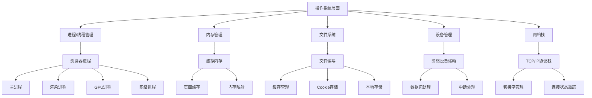
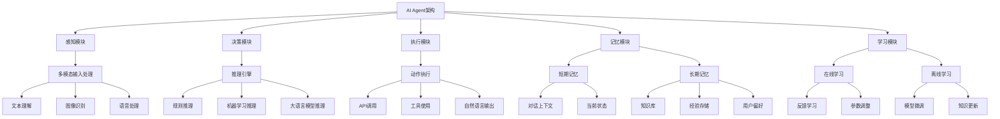

# 美团二面面试题全面解答

## 1. 算法题：合并两个大数

### 问题分析
由于JavaScript和Java等语言的数字类型有精度限制，对于非常大的数字（超过Number.MAX_SAFE_INTEGER），需要将其作为字符串处理，按位相加。

### 解题思路
1. 将两个数字字符串转换为字符数组
2. 从右向左逐位相加，处理进位
3. 使用StringBuilder构建结果字符串
4. 注意处理最终进位和前导零

### 代码实现
```java
public class BigNumberAddition {
    
    /**
     * 合并两个大数字符串
     * @param num1 第一个大数字符串
     * @param num2 第二个大数字符串
     * @return 两个大数相加的结果字符串
     */
    public static String addBigNumbers(String num1, String num2) {
        // 边界情况处理
        if (num1 == null || num1.isEmpty()) return num2;
        if (num2 == null || num2.isEmpty()) return num1;
        
        // 使用StringBuilder提高字符串操作效率
        StringBuilder result = new StringBuilder();
        
        int i = num1.length() - 1; // num1的索引，从最后一位开始
        int j = num2.length() - 1; // num2的索引，从最后一位开始
        int carry = 0; // 进位值
        
        // 从右向左逐位相加
        while (i >= 0 || j >= 0 || carry > 0) {
            // 获取当前位的数字，如果已遍历完则用0补齐
            int digit1 = (i >= 0) ? num1.charAt(i--) - '0' : 0;
            int digit2 = (j >= 0) ? num2.charAt(j--) - '0' : 0;
            
            // 当前位的和加上进位
            int sum = digit1 + digit2 + carry;
            
            // 计算新的进位和当前位的结果
            carry = sum / 10;
            int currentDigit = sum % 10;
            
            // 将当前位的结果添加到结果中
            result.append(currentDigit);
        }
        
        // 反转字符串得到正确顺序的结果
        return result.reverse().toString();
    }
    
    /**
     * 优化版本：处理前导零和特殊情况
     */
    public static String addBigNumbersOptimized(String num1, String num2) {
        // 处理空值或空字符串
        if (num1 == null || num1.isEmpty()) return num2 == null ? "0" : num2;
        if (num2 == null || num2.isEmpty()) return num1 == null ? "0" : num1;
        
        // 移除可能的前导零（可选，取决于输入是否规范）
        num1 = removeLeadingZeros(num1);
        num2 = removeLeadingZeros(num2);
        
        // 如果两个数都是0
        if (num1.equals("0") && num2.equals("0")) return "0";
        
        StringBuilder sb = new StringBuilder();
        int i = num1.length() - 1, j = num2.length() - 1;
        int carry = 0;
        
        while (i >= 0 || j >= 0 || carry != 0) {
            int x = i >= 0 ? num1.charAt(i--) - '0' : 0;
            int y = j >= 0 ? num2.charAt(j--) - '0' : 0;
            int sum = x + y + carry;
            
            sb.append(sum % 10);
            carry = sum / 10;
        }
        
        String result = sb.reverse().toString();
        return result.isEmpty() ? "0" : result;
    }
    
    /**
     * 移除字符串中的前导零
     */
    private static String removeLeadingZeros(String num) {
        int i = 0;
        while (i < num.length() - 1 && num.charAt(i) == '0') {
            i++;
        }
        return num.substring(i);
    }
    
    // 测试代码
    public static void main(String[] args) {
        // 测试用例
        String[][] testCases = {
            {"123", "456"}, // 579
            {"999", "1"},   // 1000
            {"0", "0"},     // 0
            {"12345678901234567890", "98765432109876543210"},
            {"99999999999999999999", "1"}
        };
        
        for (String[] testCase : testCases) {
            String result = addBigNumbersOptimized(testCase[0], testCase[1]);
            System.out.println(testCase[0] + " + " + testCase[1] + " = " + result);
        }
    }
}
```

### 复杂度分析
- **时间复杂度**：O(max(m, n))，其中m和n分别是两个输入字符串的长度
- **空间复杂度**：O(max(m, n))，用于存储结果字符串

## 2. 算法题：合并线段数组和权重

### 问题分析
假设我们有一组线段，每个线段有起始点、结束点和权重，需要合并重叠的线段，并计算合并后的权重。

### 解题思路
1. 按起始点对线段进行排序
2. 遍历排序后的线段，合并重叠的线段
3. 对于重叠的线段，权重可以采用某种策略合并（如求和、取最大值等）

### 代码实现
```java
import java.util.*;

public class SegmentMerge {
    
    /**
     * 线段类
     */
    static class Segment {
        int start;
        int end;
        int weight;
        
        public Segment(int start, int end, int weight) {
            this.start = start;
            this.end = end;
            this.weight = weight;
        }
        
        @Override
        public String toString() {
            return "[" + start + ", " + end + "] : " + weight;
        }
    }
    
    /**
     * 合并重叠线段并求和权重
     * @param segments 线段列表
     * @return 合并后的线段列表
     */
    public static List<Segment> mergeSegments(List<Segment> segments) {
        if (segments == null || segments.isEmpty()) {
            return new ArrayList<>();
        }
        
        // 1. 按起始点排序
        segments.sort((a, b) -> Integer.compare(a.start, b.start));
        
        List<Segment> merged = new ArrayList<>();
        Segment current = segments.get(0);
        
        for (int i = 1; i < segments.size(); i++) {
            Segment next = segments.get(i);
            
            // 2. 检查是否重叠
            if (current.end >= next.start) {
                // 合并线段，结束点取最大值，权重求和
                current.end = Math.max(current.end, next.end);
                current.weight += next.weight;
            } else {
                // 不重叠，添加当前线段到结果，更新当前线段
                merged.add(current);
                current = next;
            }
        }
        
        // 添加最后一个线段
        merged.add(current);
        
        return merged;
    }
    
    /**
     * 更复杂的合并策略：根据重叠程度计算权重
     */
    public static List<Segment> mergeSegmentsWithComplexWeight(List<Segment> segments) {
        if (segments == null || segments.isEmpty()) {
            return new ArrayList<>();
        }
        
        // 按起始点排序
        segments.sort((a, b) -> Integer.compare(a.start, b.start));
        
        List<Segment> merged = new ArrayList<>();
        PriorityQueue<Segment> activeSegments = new PriorityQueue<>((a, b) -> Integer.compare(b.end, a.end));
        
        for (Segment segment : segments) {
            int currentStart = segment.start;
            
            // 处理所有在当前线段开始前结束的活动线段
            while (!activeSegments.isEmpty() && activeSegments.peek().end < currentStart) {
                merged.add(activeSegments.poll());
            }
            
            // 检查与当前活动线段的交集并合并
            if (!activeSegments.isEmpty()) {
                Segment lastActive = activeSegments.peek();
                if (lastActive.end >= segment.start) {
                    // 有重叠，合并线段
                    int newEnd = Math.max(lastActive.end, segment.end);
                    int newWeight = lastActive.weight + segment.weight;
                    activeSegments.poll();
                    activeSegments.add(new Segment(lastActive.start, newEnd, newWeight));
                    continue;
                }
            }
            
            // 没有重叠，直接添加为新的活动线段
            activeSegments.add(segment);
        }
        
        // 添加所有剩余的活动线段
        while (!activeSegments.isEmpty()) {
            merged.add(activeSegments.poll());
        }
        
        return merged;
    }
    
    // 测试代码
    public static void main(String[] args) {
        List<Segment> segments = Arrays.asList(
            new Segment(1, 3, 5),
            new Segment(2, 4, 3),
            new Segment(5, 7, 2),
            new Segment(6, 8, 4),
            new Segment(10, 12, 1)
        );
        
        System.out.println("原始线段:");
        segments.forEach(System.out::println);
        
        System.out.println("\n合并后的线段:");
        List<Segment> merged = mergeSegments(segments);
        merged.forEach(System.out::println);
    }
}
```

## 3. URL到页面显示的全过程

### 网络层面

```mermaid
flowchart TD
    A[输入URL到页面显示过程] --> B[网络层面]
    A --> C[操作系统层面]
    
    B --> B1[URL解析]
    B1 --> B1_1[协议分析]
    B1 --> B1_2[域名提取]
    
    B --> B2[DNS解析]
    B2 --> B2_1[浏览器缓存]
    B2 --> B2_2[系统缓存]
    B2 --> B2_3[路由器缓存]
    B2 --> B2_4[ISP DNS缓存]
    B2 --> B2_5[递归/迭代查询]
    
    B --> B3[TCP连接]
    B3 --> B3_1[三次握手]
    B3 --> B3_2[SSL/TLS握手<br>HTTPS]
    
    B --> B4[HTTP请求]
    B4 --> B4_1[请求行]
    B4 --> B4_2[请求头]
    B4 --> B4_3[请求体]
    
    B --> B5[服务器处理]
    B5 --> B5_1[应用服务器]
    B5 --> B5_2[业务逻辑]
    B5 --> B5_3[数据库查询]
    
    B --> B6[HTTP响应]
    B6 --> B6_1[状态行]
    B6 --> B6_2[响应头]
    B6 --> B6_3[响应体]
    
    B --> B7[浏览器解析]
    B7 --> B7_1[HTML解析]
    B7 --> B7_2[CSS解析]
    B7 --> B7_3[JS解析执行]
    B7 --> B7_4[构建DOM树]
    B7 --> B7_5[构建CSSOM树]
    B7 --> B7_6[构建渲染树]
    B7 --> B7_7[布局Layout]
    B7 --> B7_8[绘制Painting]
```


### 操作系统层面


## 4. DNS解析IP的详细过程

**DNS解析流程**：
1. **浏览器缓存检查**：检查是否有缓存的DNS记录
2. **系统缓存检查**：检查hosts文件和系统DNS缓存
3. **路由器缓存检查**：检查路由器的DNS缓存
4. **ISP DNS服务器查询**：向ISP的DNS服务器发起递归查询
5. **根域名服务器查询**：如果没有记录，向根域名服务器查询
6. **TLD服务器查询**：向顶级域名服务器查询
7. **权威域名服务器查询**：向权威域名服务器查询最终IP地址
8. **缓存结果**：将结果缓存到各级缓存中

**DNS记录类型**：
- A记录：IPv4地址
- AAAA记录：IPv6地址
- CNAME记录：别名记录
- MX记录：邮件服务器记录
- NS记录：域名服务器记录

## 5. TCP断开需要四次挥手的原因

**四次挥手过程**：
1. **FIN**：客户端发送FIN报文，表示客户端没有数据要发送了
2. **ACK**：服务器发送ACK确认客户端的FIN
3. **FIN**：服务器发送FIN报文，表示服务器也没有数据要发送了
4. **ACK**：客户端发送ACK确认服务器的FIN

**为什么需要四次**：
- TCP是全双工协议，每个方向都需要单独关闭
- 收到第一个FIN只表示一个方向的数据流结束
- 另一个方向可能还有数据要传输，需要等待其完成
- 确保双方都确认连接关闭，避免数据丢失

## 6. TCP vs UDP对比

| 特性 | TCP | UDP |
|------|-----|-----|
| **连接性** | 面向连接 | 无连接 |
| **可靠性** | 可靠传输，有确认机制 | 不可靠传输，无确认 |
| **顺序性** | 保证数据顺序 | 不保证顺序 |
| **速度** | 较慢，有拥塞控制 | 较快，无控制 |
| **头部大小** | 20-60字节 | 8字节 |
| **适用场景** | 文件传输、网页浏览、邮件 | 视频流、语音通话、DNS |

## 7. TCP和UDP可以共用一个端口吗？

**答案**：是的，TCP和UDP可以绑定到同一个端口号。

**原因**：
1. TCP和UDP是不同的传输层协议
2. 操作系统使用五元组（协议、源IP、源端口、目标IP、目标端口）来区分连接
3. TCP连接和UDP数据包虽然端口相同，但协议字段不同

**数据同时到达不会冲突**：
- 操作系统根据协议类型将数据分发到不同的socket
- TCP数据交给TCP socket处理
- UDP数据交给UDP socket处理
- 两者互不干扰

## 8. Redis高可用高性能原因

**高性能原因**：
1. **内存存储**：数据存储在内存中，读写速度快
2. **单线程模型**：避免上下文切换和锁竞争
3. **非阻塞I/O**：使用I/O多路复用处理大量连接
4. **高效数据结构**：专门优化的数据结构和编码方式
5. **管道技术**：批量执行命令减少网络往返

**高可用方案**：
1. **主从复制**：数据冗余和读写分离
2. **哨兵模式**：自动故障检测和转移
3. **集群模式**：数据分片和自动故障转移
4. **持久化机制**：RDB快照和AOF日志保证数据安全

## 9. AI Agent架构

**AI Agent基本架构**：


**核心组件**：
1. **规划模块**：制定目标和分解任务
2. **工具使用**：调用外部API和工具
3. **反思机制**：评估行动结果并调整策略
4. **多Agent协作**：多个Agent协同完成复杂任务

## 10. 全栈开发的理解

**全栈开发定义**：能够独立完成前端、后端、数据库、部署等整个软件开发流程的开发人员。

**技术栈要求**：
- **前端**：HTML/CSS/JavaScript，主流框架（React/Vue/Angular）
- **后端**：服务器语言（Java/Python/Go等），Web框架
- **数据库**：关系型数据库（MySQL/PostgreSQL）和NoSQL（MongoDB/Redis）
- **DevOps**：容器化（Docker），编排（Kubernetes），CI/CD
- **架构设计**：系统设计，微服务，分布式系统

**优势**：
1. **端到端理解**：全面把握项目生命周期
2. **快速原型**：独立完成MVP开发
3. **问题定位**：快速定位系统各层问题
4. **团队协作**：更好理解各角色工作

**挑战**：
1. **技术广度与深度平衡**：需要持续学习多个领域
2. **技术更新快**：需要跟进前后端技术发展
3. **项目复杂度**：大型项目需要专业化分工

**接受全栈开发的理由**：
1. 喜欢解决复杂问题和学习新技术
2. 享受从概念到产品的完整创造过程
3. 能够更好地理解用户需求和系统整体
4. 在快速变化的行业中保持竞争力

通过全面掌握这些知识点，你能够在美团面试中展现出扎实的技术基础、系统思维能力和对全栈开发的深刻理解，大大提高获得offer的机会。
