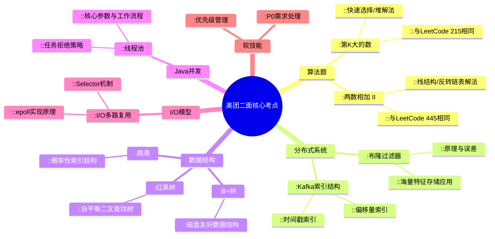

好的，收到你的面试复盘。作为资深Java开发，我来为你系统梳理这场二面的考察点，并提供一份兼具深度与广度的标准答案。

## 🌳 一、核心知识点框架梳理



## 🧮 二、算法题详解

### 1. 两数相加 II（LeetCode 445）

**解题思路**：此题与LeetCode 445完全相同。由于输入链表最高位在前，而加法需要从低位开始，有两种主流解法：
1. **栈反转法**：利用栈的LIFO特性反转数字顺序
2. **链表反转法**：先反转链表，再按两数相加I的方式处理

**时间复杂度**：O(max(m, n))  
**空间复杂度**：O(m + n)（栈空间）

```java
/**
 * 栈解法 - 避免修改原链表
 */
class Solution {
    public ListNode addTwoNumbers(ListNode l1, ListNode l2) {
        // 使用两个栈来反转数字顺序
        Stack<Integer> s1 = new Stack<>();
        Stack<Integer> s2 = new Stack<>();
        
        // 将链表节点值压入栈中
        while (l1 != null) {
            s1.push(l1.val);
            l1 = l1.next;
        }
        while (l2 != null) {
            s2.push(l2.val);
            l2 = l2.next;
        }
        
        int carry = 0; // 进位值
        ListNode dummy = null; // 结果链表的虚拟头节点
        
        // 当还有数字需要处理时继续循环
        while (!s1.isEmpty() || !s2.isEmpty() || carry != 0) {
            int sum = carry; // 当前位的和，初始为进位值
            
            // 从栈中弹出数字相加
            if (!s1.isEmpty()) sum += s1.pop();
            if (!s2.isEmpty()) sum += s2.pop();
            
            carry = sum / 10; // 计算新的进位值
            ListNode newNode = new ListNode(sum % 10); // 创建新节点存储当前位结果
            
            // 将新节点插入到结果链表头部
            newNode.next = dummy;
            dummy = newNode;
        }
        
        return dummy;
    }
}
```

### 2. 第K大的数（LeetCode 215）

**解题思路**：此题与LeetCode 215完全相同。有三种常见解法：
1. **快速选择算法**：基于快排分区的变种，平均O(n)但最坏O(n²)
2. **堆解法**：使用最小堆维护前K大元素，O(n logk)更稳定
3. **排序法**：直接排序后取第k大，O(n logn)

**推荐堆解法**（更稳定且适合海量数据）：

```java
class Solution {
    public int findKthLargest(int[] nums, int k) {
        // 创建最小堆，维护前k大的元素
        PriorityQueue<Integer> minHeap = new PriorityQueue<>();
        
        for (int num : nums) {
            if (minHeap.size() < k) {
                // 堆未满，直接添加
                minHeap.offer(num);
            } else if (num > minHeap.peek()) {
                // 当前数大于堆顶，替换堆顶元素
                minHeap.poll();
                minHeap.offer(num);
            }
        }
        
        return minHeap.peek(); // 堆顶即为第k大元素
    }
}
```

## 🎯 三、技术问题深度解答

### 1. 布隆过滤器原理与问题

**原理**：布隆过滤器是一种概率型数据结构，用于快速判断元素是否**可能存在于集合**中。它使用一个位数组和多个哈希函数：
- 添加元素时，用多个哈希函数计算位数组位置并置为1
- 查询元素时，检查所有哈希位置是否都为1（全为1→可能存在，有0→肯定不存在）

**特点与问题**：
- **假阳性**：可能误判不存在的元素为存在（但不会假阴性）
- **不可删除**：传统布隆过滤器不支持删除操作（可通过计数布隆过滤器变通）
- **哈希函数数量**需要权衡：过多会导致计算效率低，过少会增加误判率

**最佳实践**：在美团这类互联网公司中，常用于：
- 缓存穿透防护：先查布隆过滤器，不存在直接返回
- 推荐系统去重：快速判断用户是否看过某内容
- 分布式系统：判断数据是否在某个节点上

### 2. 十亿特征存储方案

**存储介质选择**：
- **内存**：Redis集群（性能最佳但成本高）
- **SSD**：RocksDB/LevelDB（性价比平衡）
- **HDD**：HBase/HDFS（成本最低但延迟高）

**具体方案**：
```java
// 示例：基于Redis Cluster的存储方案
public class FeatureStore {
    private JedisCluster jedisCluster;
    
    // 使用哈希存储，减少网络IO
    public void storeFeature(String userId, Map<String, String> features) {
        jedisCluster.hmset("user:features:" + userId, features);
    }
    
    // 分片策略：基于用户ID哈希分片
    private String getShardKey(String userId) {
        int shard = Math.abs(userId.hashCode()) % 1024;
        return "feature_shard:" + shard;
    }
}
```

**优化策略**：
- 数据压缩：使用Protobuf/Thrift替代JSON
- 冷热分离：热数据存内存，冷数据存SSD/HDD
- 批量操作：减少网络往返次数

### 3. Kafka索引结构

Kafka使用**稀疏索引**提高查询效率：
- **偏移量索引**：`.index文件`，存储offset到物理位置的映射
- **时间戳索引**：`.timeindex文件`，存储时间戳到offset的映射

**索引特点**：
- 不每消息都索引，而是每1KB数据建一个索引项
- 索引文件内存映射，查询时二分查找定位大致位置，再顺序扫描
- 索引文件与数据文件分离但同步更新

### 4. 数据结构对比

| 结构 | 特点 | 使用场景 |
|------|------|----------|
| **红黑树** | 自平衡BST，严格O(log n) | Java TreeMap、Linux进程调度 |
| **跳表** | 概率平衡，多级索引 | Redis ZSET、LevelDB |
| **B+树** | 多路平衡，磁盘友好 | 数据库索引（MySQL InnoDB） |

**选择原则**：
- 内存操作：红黑树/跳表
- 磁盘存储：B+树（减少IO次数）
- 并发需求：跳表（更容易实现无锁并发）

### 5. 线程池执行流程与配置

**执行流程**：
1. 提交任务 → 核心线程未满？创建新线程 ：进入队列
2. 队列未满？入队等待 ：最大线程未满？创建临时线程 ：执行拒绝策略

**关键配置参数**：
```java
ThreadPoolExecutor executor = new ThreadPoolExecutor(
    5, // corePoolSize: 长期维持的线程数
    10, // maximumPoolSize: 最大线程数
    60L, TimeUnit.SECONDS, // keepAliveTime: 空闲线程存活时间
    new LinkedBlockingQueue<>(100), // 工作队列
    new NamedThreadFactory("business-pool"), // 线程工厂
    new ThreadPoolExecutor.CallerRunsPolicy() // 拒绝策略
);
```

**拒绝策略选择**：
- `AbortPolicy`：直接抛出异常（默认）
- `CallerRunsPolicy`：回调给提交线程执行
- `DiscardPolicy`：静默丢弃任务
- `DiscardOldestPolicy`：丢弃队列最老任务

### 6. I/O多路复用原理

**核心概念**：单个线程监听多个I/O通道状态，当通道就绪时才进行实际操作。

**Java实现**：
```java
// Selector示例
Selector selector = Selector.open();
ServerSocketChannel serverChannel = ServerSocketChannel.open();
serverChannel.configureBlocking(false);
serverChannel.register(selector, SelectionKey.OP_ACCEPT);

while (true) {
    int readyChannels = selector.select(); // 阻塞直到有通道就绪
    Set<SelectionKey> selectedKeys = selector.selectedKeys();
    // 处理就绪的通道...
}
```

**底层机制**：
- **select/poll**：线性扫描所有fd，O(n)复杂度
- **epoll**（Linux）：回调机制，O(1)复杂度，支持大量连接

## 🤝 四、软技能应答策略

### 1. 事情做不完怎么办

**应答框架**：展示你的优先级管理能力和沟通技巧

"首先我会进行**任务评估和优先级划分**，使用四象限法则区分重要紧急程度。对于确实无法按时完成的工作，我会：
1. **提前沟通**：及时向主管反馈进度风险，避免最后时刻暴露问题
2. **寻求支持**：协商资源调配或任务分解，看是否能获得同事协助
3. **交付最小可行产品**：优先保证核心功能上线，迭代优化细节
4. **复盘优化**：事后分析原因，优化工作方法或推进流程改进"

### 2. P0需求排期内解决

"对于P0级别需求，我会采取**敏捷响应模式**：
1. **立即评估**：快速理解需求背景和业务价值
2. **协调资源**：申请优先级支持，暂停非关键任务
3. **并行开发**：拆分子任务，多线程并行推进
4. **每日同步**：保持高频沟通，确保各方信息对齐
5. **灰度发布**：快速上线最小功能，逐步扩大验证范围

关键在于**平衡速度与质量**，在保证核心功能可用的前提下，通过后续迭代不断完善。"

## 💡 五、面试总结建议

这场二面考察了算法、分布式系统、Java核心和软技能，是典型的高级工程师面试结构。面试官最后提到"希望尽快实习"是一个积极信号，表明：
1. 技术层面基本达标
2. 关注你的团队适应能力和学习速度
3. 确实有转正机会，但需要提前考察

建议后续重点关注：
- 分布式系统深度（特别是美团大量使用的Redis、Kafka）
- 项目中的技术权衡和决策过程
- 团队协作和沟通能力体现

希望这份梳理对你有所帮助，祝你顺利拿到offer！
