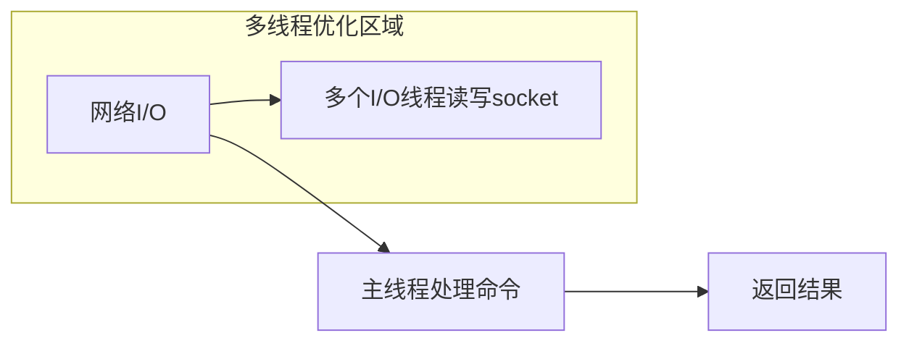

恭喜你拿到秋招第一个意向！美团到店团购C端流量场景是非常核心的业务部门，这个offer含金量很高。我为你系统梳理这场面试的考察点，提供一份专业级的应答指南。

## 🌳 一、核心知识点框架梳理

```mermaid
mindmap
  root((美团一面技术考察体系))
    
    HTTP协议
      :Get vs Post区别
        ::安全性/幂等性/缓存
      :幂等性本质
        ::数学概念与业务实现

    网络协议
      :TCP三次握手
        ::SYN/ACK序列与状态流转
      :TCP四次挥手
        ::FIN等待与TIME_WAIT意义
      :握手挥手变体
        ::两次握手问题
        ::四次握手可行性

    Redis深度
      :ZSet实现
        ::跳表结构原理
        ::压缩列表转换阈值
      :SDS设计优势
        ::O(1)长度获取与二进制安全
      :Hash底层结构
        ::ziplist与hashtable转换
      :单线程模型
        ::I/O多路复用机制
        ::6.0多线程优化

    算法考核
      :字符串转数字
        ::LeetCode 8相似性
        ::边界处理与状态机
      :K个一组反转链表
        ::LeetCode 25原题
        ::递归与迭代双解法
```

## 📊 二、技术问题深度解答

### 1. GET vs POST区别与幂等性

**本质区别**：
```mermaid
tabular
    HTTP方法,数据位置,安全性,幂等性,缓存,数据长度
    GET,URL查询参数,相对安全,✅是,✅可缓存,受限(2-8KB)
    POST,请求体,相对不安全,❌否,❌不可缓存,理论上无限制
```

**幂等性详解**：
- **数学定义**：f(f(x)) = f(x)，多次执行结果相同
- **业务场景**：
  - GET、PUT、DELETE是幂等的
  - POST是非幂等的（创建资源）
- **实现保障**：
  - 令牌机制防止重复提交
  - 唯一约束保证数据一致性

### 2. TCP三次握手/四次挥手

**三次握手过程**：
```
Client → Server: SYN=1, seq=x
Server → Client: SYN=1, ACK=1, seq=y, ack=x+1  
Client → Server: ACK=1, seq=x+1, ack=y+1
```

**为什么不能两次握手**：
- 防止**已失效的连接请求**到达服务器导致资源浪费
- 确保双方收发能力都正常（双向通道验证）

**四次挥手关键点**：
- TIME_WAIT状态持续2MSL（报文最大生存时间）
  - 保证ACK可靠到达（重传最后ACK）
  - 让旧连接报文在网络中消散（避免混淆）

### 3. Redis底层数据结构

**ZSet实现原理**：
- **跳表（SkipList）**：多层索引结构，查询O(log n)
  ```java
  typedef struct zskiplistNode {
      robj *obj;                      // 成员对象
      double score;                   // 分值
      struct zskiplistNode *backward; // 后退指针
      struct zskiplistLevel {
          struct zskiplistNode *forward;  // 前进指针
          unsigned int span;              // 跨度
      } level[];
  } zskiplistNode;
  ```
- **压缩列表（ziplist）**：小规模时使用，内存紧凑

**SDS设计优势**：
- O(1)时间复杂度获取字符串长度
- 二进制安全（可存储任意数据）
- 自动扩容机制（减少内存重分配）

**Hash底层转换**：
- 默认使用ziplist：元素数≤512且所有值大小≤64字节
- 超过阈值转换为hashtable

### 4. Redis单线程 vs 多线程

**单线程优势**：
- 避免上下文切换和锁竞争开销
- 瓶颈主要在内存和网络I/O，而非CPU
- 原子操作天然支持线程安全

**6.0多线程改进**：

- **网络I/O多线程化**：处理大量连接请求
- **核心命令执行仍单线程**：保持原子性特性

## 🧮 三、算法题详解

### 1. 字符串转数字（LeetCode 8）

**解题思路**：
1. 去除前导空格
2. 检查正负号
3. 逐位转换，处理溢出
4. 遇到非数字字符停止

**复杂度分析**：
- 时间复杂度：O(n)
- 空间复杂度：O(1)

```java
class Solution {
    public int myAtoi(String s) {
        if (s == null || s.length() == 0) return 0;
        
        int index = 0, sign = 1, total = 0;
        int n = s.length();
        
        // 1. 去除前导空格
        while (index < n && s.charAt(index) == ' ') {
            index++;
        }
        if (index == n) return 0;
        
        // 2. 处理正负号
        if (s.charAt(index) == '+' || s.charAt(index) == '-') {
            sign = s.charAt(index) == '+' ? 1 : -1;
            index++;
        }
        
        // 3. 转换数字并处理溢出
        while (index < n) {
            int digit = s.charAt(index) - '0';
            if (digit < 0 || digit > 9) break;
            
            // 检查溢出
            if (Integer.MAX_VALUE / 10 < total || 
                (Integer.MAX_VALUE / 10 == total && Integer.MAX_VALUE % 10 < digit)) {
                return sign == 1 ? Integer.MAX_VALUE : Integer.MIN_VALUE;
            }
            
            total = total * 10 + digit;
            index++;
        }
        
        return total * sign;
    }
}
```

### 2. K个一组反转链表（LeetCode 25）

**解题思路**：
- **迭代法**：定位每组头尾节点，反转后重新连接
- **递归法**：递归反转后续分组，处理当前分组

**复杂度分析**：
- 时间复杂度：O(n)
- 空间复杂度：O(n/k)（递归栈）或 O(1)（迭代）

```java
/**
 * 迭代解法 - 空间复杂度O(1)
 */
class Solution {
    public ListNode reverseKGroup(ListNode head, int k) {
        ListNode dummy = new ListNode(0);
        dummy.next = head;
        ListNode pre = dummy;
        ListNode end = dummy;
        
        while (end.next != null) {
            // 定位当前组的结束节点
            for (int i = 0; i < k && end != null; i++) {
                end = end.next;
            }
            if (end == null) break;
            
            // 记录下一组的起始节点
            ListNode nextGroupStart = end.next;
            ListNode groupStart = pre.next;
            
            // 断开当前组与后续连接
            end.next = null;
            
            // 反转当前组并重新连接
            pre.next = reverseList(groupStart);
            groupStart.next = nextGroupStart;
            
            // 移动指针到下一组
            pre = groupStart;
            end = pre;
        }
        
        return dummy.next;
    }
    
    // 辅助方法：反转链表
    private ListNode reverseList(ListNode head) {
        ListNode prev = null;
        ListNode curr = head;
        while (curr != null) {
            ListNode nextTemp = curr.next;
            curr.next = prev;
            prev = curr;
            curr = nextTemp;
        }
        return prev;
    }
}
```

## 💡 四、面试技巧与深度扩展

### 本地生活 vs 电商商品模型差异

**核心区别**：
1. **履约方式**：
   - 电商：物理商品，需要物流配送
   - 本地生活：虚拟券码/服务，线下核销

2. **库存管理**：
   - 电商：物理库存，需要锁库存
   - 本地生活：虚拟库存，动态分配

3. **价值时效**：
   - 电商商品长期有效
   - 本地生活券码有严格有效期

**美团最佳实践**：
```java
// 本地生活商品模型示例
public class LocalLifeProduct {
    private String productId;      // 商品ID
    private String merchantId;     // 商户ID
    private String couponCode;     // 券码模板
    private Date validFrom;        // 有效期开始
    private Date validTo;          // 有效期结束
    private Integer dailyStock;    // 日库存
    private Integer soldCount;     // 当日已售
    private Boolean needReservation; // 是否需要预约
}
```

### Redis在美团的最佳实践

**大规模集群管理**：
- 分区策略：基于业务key前缀分片
- 热key处理：本地缓存+随机过期时间
- 大value监控：自动告警与拆分

**典型问题解决方案**：
1. **缓存穿透**：布隆过滤器+空值缓存
2. **缓存雪崩**：随机过期时间+熔断机制
3. **数据一致性**：双删策略+binlog同步

## 🎯 五、面试总结建议

这场一面体现了美团面试的典型特点：
1. **基础深度**：TCP/HTTP协议问到实现层面细节
2. **Redis精通**：不仅会用还要懂底层实现
3. **算法实用**：都是工作中常见的字符串和链表处理

你的成功经验值得借鉴：
- **扎实的基础知识**是通过面试的关键
- **真诚的沟通态度**（如调整面试时间）获得好感
- **算法准备全面**包括简单和中等难度题目

建议后续继续深入：
- 分布式系统设计（美团大量使用分布式技术）
- 高并发场景处理（C端流量场景的典型需求）
- 项目深度总结（提炼自己的技术亮点）

祝你后续面试顺利，职业生涯开启美好篇章！
