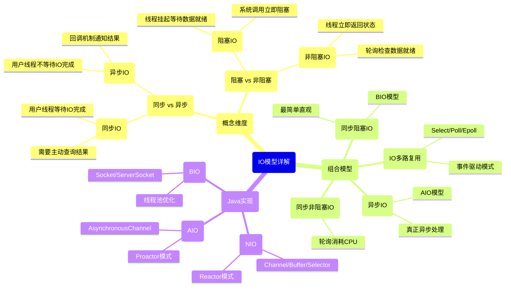

好的，针对PDD二面的后续问题，我将为你提供一份专业、深入的解答。

## 📊 一、同步/异步与阻塞/非阻塞IO详解

### 1. 核心概念框架



### 2. 详细区别与联系

**两组概念的不同维度：**

- **阻塞 vs 非阻塞**：关注的是**线程状态**
  - 阻塞：线程被挂起，等待操作完成
  - 非阻塞：线程立即返回，不被挂起

- **同步 vs 异步**：关注的是**消息通信机制**
  - 同步：主动等待或轮询结果
  - 异步：被动接收通知或回调

**四种组合模型：**

| 模型 | 特点 | 应用场景 | Java实现 |
|------|------|----------|----------|
| **同步阻塞** | 简单直观，线程资源浪费 | 连接数少的传统应用 | `Socket`, `ServerSocket` |
| **同步非阻塞** | 轮询消耗CPU，响应及时 | 实时性要求高的场景 | `SocketChannel.configureBlocking(false)` |
| **IO多路复用** | 单线程处理多连接，高效 | 高并发网络应用 | `Selector`, `Epoll` |
| **异步IO** | 真正异步，性能最高 | 高性能服务器 | `AsynchronousSocketChannel` |

### 3. Unix五种IO模型对比

1. **阻塞IO**：进程阻塞直到数据就绪和数据拷贝完成
2. **非阻塞IO**：立即返回，轮询检查状态
3. **IO多路复用**：select/poll/epoll，同时监控多个fd
4. **信号驱动IO**：内核数据就绪时发送信号通知
5. **异步IO**：内核完成所有操作后通知进程

**关键区别：**
- 前4种都是**同步IO**（数据拷贝阶段阻塞）
- 只有第5种是真正的**异步IO**

## 💼 二、工作看法相关问题回答建议

### 1. 工作地点看法
**回答思路**：表达灵活性+职业发展优先
"我认为工作地点是重要因素但不是决定性因素。我更关注岗位的发展前景和团队的技术氛围。对于PDD这样的一线互联网公司，我愿意根据业务需要选择合适的工作地点，毕竟优秀的平台和团队对个人成长更为重要。"

### 2. 加班态度
**回答思路**：理性看待+效率优先+任务导向
"我对加班的看法是比较理性的。首先，我认同在关键项目节点或紧急任务时，必要的加班是确保项目成功的责任体现。但我更注重工作效率和时间管理，争取在正常工作时间内完成高质量产出。

同时，我认为持续的长期加班可能影响创造力和工作热情，因此更支持目标导向和弹性工作制，在保证工作质量的前提下灵活安排时间。"

### 3. 职业发展期望
**回答思路**：技术深度+业务价值+长期成长
"我期望的工作是能够深入技术底层，解决有挑战性的问题，并创造实际业务价值。希望能在技术上不断深耕，同时培养业务洞察力，最终成为既懂技术又懂业务的综合型人才。"

## 🌳 三、二叉树节点最短边数算法题

### 题目分析
**类似LeetCode题目**：
- 二叉树的最近公共祖先（LCA）（第236题）
- 两个节点之间的路径（变形题）

### 算法思路

**方法一：先找LCA再计算距离（推荐）**
1. 找到两个节点的最近公共祖先（LCA）
2. 分别计算LCA到两个节点的距离
3. 将两个距离相加即为最短边数

**方法二：使用DFS同时查找两个节点**
1. 深度优先遍历二叉树
2. 记录从根节点到两个节点的路径
3. 找到路径的分叉点，计算总边数

### 复杂度分析
- **时间复杂度**：O(n)，n为节点数
- **空间复杂度**：O(h)，h为树高（递归栈空间）

### 完整代码实现

```java
/**
 * 二叉树节点定义
 */
class TreeNode {
    int val;
    TreeNode left;
    TreeNode right;
    TreeNode(int x) { val = x; }
}

public class BinaryTreeShortestPath {
    
    /**
     * 计算两个节点之间的最短边数
     * @param root 二叉树根节点
     * @param p 第一个节点
     * @param q 第二个节点
     * @return 两个节点之间的最短边数
     */
    public int shortestPathLength(TreeNode root, TreeNode p, TreeNode q) {
        // 找到最近公共祖先
        TreeNode lca = findLCA(root, p, q);
        
        // 计算LCA到两个节点的距离
        int distance1 = distanceFromNode(lca, p, 0);
        int distance2 = distanceFromNode(lca, q, 0);
        
        // 返回两个距离之和
        return distance1 + distance2;
    }
    
    /**
     * 查找最近公共祖先（LCA）
     * @param root 当前节点
     * @param p 节点1
     * @param q 节点2
     * @return 最近公共祖先节点
     */
    private TreeNode findLCA(TreeNode root, TreeNode p, TreeNode q) {
        if (root == null || root == p || root == q) {
            return root;
        }
        
        // 在左子树中查找
        TreeNode left = findLCA(root.left, p, q);
        // 在右子树中查找
        TreeNode right = findLCA(root.right, p, q);
        
        // 如果左右子树都找到，当前节点就是LCA
        if (left != null && right != null) {
            return root;
        }
        
        // 否则返回非空的那个子树的结果
        return left != null ? left : right;
    }
    
    /**
     * 计算从当前节点到目标节点的距离
     * @param current 当前节点
     * @param target 目标节点
     * @param currentDistance 当前距离
     * @return 到达目标节点的距离，如果未找到返回-1
     */
    private int distanceFromNode(TreeNode current, TreeNode target, int currentDistance) {
        if (current == null) {
            return -1; // 未找到目标节点
        }
        
        if (current == target) {
            return currentDistance; // 找到目标节点
        }
        
        // 在左子树中查找
        int leftDistance = distanceFromNode(current.left, target, currentDistance + 1);
        if (leftDistance != -1) {
            return leftDistance;
        }
        
        // 在右子树中查找
        int rightDistance = distanceFromNode(current.right, target, currentDistance + 1);
        return rightDistance;
    }
    
    /**
     * 测试用例
     */
    public static void main(String[] args) {
        // 构建测试二叉树
        //       1
        //      / \
        //     2   3
        //    / \   \
        //   4   5   6
        //        \
        //         7
        TreeNode root = new TreeNode(1);
        root.left = new TreeNode(2);
        root.right = new TreeNode(3);
        root.left.left = new TreeNode(4);
        root.left.right = new TreeNode(5);
        root.right.right = new TreeNode(6);
        root.left.right.right = new TreeNode(7);
        
        BinaryTreeShortestPath solution = new BinaryTreeShortestPath();
        
        // 测试用例1：节点4和节点7，预期结果：3 (2->5->7)
        int result1 = solution.shortestPathLength(root, root.left.left, root.left.right.right);
        System.out.println("Distance between 4 and 7: " + result1);
        
        // 测试用例2：节点2和节点6，预期结果：3 (2->1->3->6)
        int result2 = solution.shortestPathLength(root, root.left, root.right.right);
        System.out.println("Distance between 2 and 6: " + result2);
        
        // 测试用例3：节点5和节点7，预期结果：1 (5->7)
        int result3 = solution.shortestPathLength(root, root.left.right, root.left.right.right);
        System.out.println("Distance between 5 and 7: " + result3);
    }
}
```

### 边界情况处理

1. **空树或空节点**：直接返回0或-1
2. **相同节点**：距离为0
3. **节点不存在**：返回-1或抛出异常
4. **一个节点是另一个节点的祖先**：直接计算距离

### 优化版本（减少遍历次数）

```java
/**
 * 优化版：一次遍历同时计算距离
 */
class OptimizedSolution {
    private int shortestPath = -1;
    
    public int shortestPathLength(TreeNode root, TreeNode p, TreeNode q) {
        if (p == q) return 0;
        dfs(root, p, q);
        return shortestPath;
    }
    
    private int[] dfs(TreeNode node, TreeNode p, TreeNode q) {
        if (node == null) return new int[]{-1, -1};
        
        int[] left = dfs(node.left, p, q);
        int[] right = dfs(node.right, p, q);
        
        // 检查当前节点是否匹配
        int foundP = (node == p) ? 0 : -1;
        int foundQ = (node == q) ? 0 : -1;
        
        // 合并左右子树结果
        int currentP = Math.max(left[0], Math.max(right[0], foundP));
        int currentQ = Math.max(left[1], Math.max(right[1], foundQ));
        
        // 如果同时找到p和q，更新最短路径
        if (currentP != -1 && currentQ != -1 && 
            (shortestPath == -1 || currentP + currentQ < shortestPath)) {
            shortestPath = currentP + currentQ;
        }
        
        // 返回当前状态：返回找到的节点和距离
        return new int[]{
            currentP != -1 ? currentP + 1 : -1,
            currentQ != -1 ? currentQ + 1 : -1
        };
    }
}
```

## 🎯 四、面试总结与建议

### 应对技术难题的策略
1. **先理解问题**：确认题目要求和输入输出
2. **举例说明**：用具体例子验证思路
3. **分步解决**：先解决子问题再组合
4. **考虑边界**：处理特殊情况
5. **复杂度分析**：说明时间空间复杂度

### 本次面试表现分析
虽然只回答了30%，但这在高级技术面试中很常见。关键是要展现：
- 基础知识体系的完整性
- 解决问题的思维过程
- 学习能力和技术热情

### 后续学习建议
1. **深入操作系统原理**：特别是IO模型和内存管理
2. **刷题策略**：按专题分类练习，注重思路而非死记
3. **系统设计**：学习大规模系统设计模式
4. **源码阅读**：阅读Java核心库和流行框架源码

记住，技术面试是双向选择的过程，既要展示自己的能力，也要了解团队的技术氛围和发展机会。祝你后续面试顺利！
