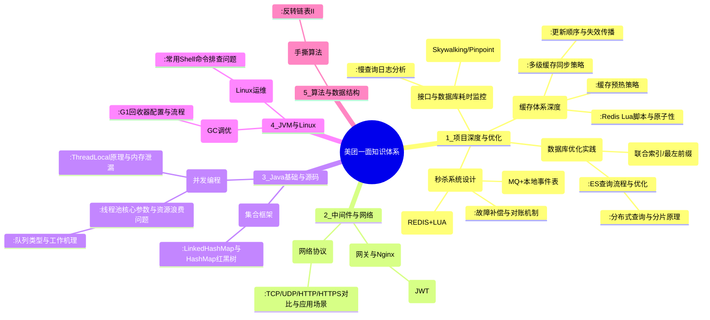

好的，这是一份非常典型且高质量的美团一面凉经，问题覆盖极广且有一定深度。作为资深Java开发工程师，我将为你提供一份**超越面试官预期的详尽解答**，不仅回答问题，更帮你梳理出背后的知识体系和优化思路。

## 🌲 一、核心知识框架 (Mermaid Mindmap)



接下来，我将对关键问题进行深度剖析，并提供“高手级”回答思路。

---

## 💡 二、项目深度与优化问题解答

### 3. 接口/数据库耗时监控与优化
**高手回答**：“我们有一套完整的可观测性体系。接口层面，我们集成**SkyWalking**进行全链路监控，可以清晰看到每个接口的耗时、QPS以及链路上各个组件的耗时（DB、Redis、RPC）。数据库层面，我们开启了MySQL的**慢查询日志**，并配置`long_query_time`为0.1s，所有超过100ms的SQL都会被记录。我们会定期使用**pt-query-digest**工具分析慢日志，找出TOP N的慢SQL进行优化。”

### 4. 数据库索引优化实战
**高手回答**：“以商品搜索为例，查询条件包括`品牌(brand_id)`、`价格(price)`、`分类(category_id)`和`商品名称(title)`。我的优化思路是：
1.  **避免全表扫描**：为`brand_id`, `category_id`这类区分度高的字段创建单列索引。
2.  **联合索引**：对于常组合查询的字段，如`(category_id, brand_id, price)`，建立联合索引，利用**最左前缀原则**加速查询。
3.  **全文索引**：对于`title`的模糊查询（如`LIKE '%手机%'`），单列索引是无效的。我们使用**ES**来承担复杂的搜索任务，通过`ik分词器`建立倒排索引，支持高性能的全文检索。
4.  **索引覆盖**：如果查询的字段全部在某个联合索引中，可以避免回表，极大提升性能。例如`SELECT id, name FROM products WHERE category_id = 1 AND price > 1000`，如果索引是`(category_id, price, name)`，则可以直接从索引中获取数据。”

### 5. ES分布式查询流程
**高手回答**：“ES查询分为**Query**和**Fetch**两个阶段：
1.  **Query Phase**：
    *   客户端请求发送到某个**Coordinating Node**（协调节点）。
    *   协调节点将查询广播到所有相关分片（Primary或Replica）。
    *   每个分片在本地执行查询，对自己的结果进行排序，然后返回一个**文档ID和排序值**的列表给协调节点。
    *   协调节点合并所有分片的结果，得到一个全局排序的列表。
2.  **Fetch Phase**：
    *   协调节点根据全局排序结果，向相关分片发送`GET`请求，获取文档的详细内容（`_source`）。
    *   各个分片返回文档详情，协调节点组装最终结果返回给客户端。
**优化点**：如果只关心排序和聚合，不关心具体内容，可以使用`size: 0`或`_source filtering`来减少Fetch阶段的开销。”

### 9. 缓存预热
**高手回答**：“我们的缓存预热是**多策略结合**的：
1.  **定时任务预热**：在流量低谷期（如凌晨），通过定时任务扫描DB中的热点数据（如近期销量高的商品），批量加载到Redis中。
2.  **上线时预热**：在应用发布重启时，通过一个初始化加载程序（`ApplicationRunner`）预先加载核心数据。
3.  **本地缓存预热**：对于极热的数据（如配置信息），应用启动时直接加载到JVM内存（如Caffeine）中，实现零级缓存，应对Redis抖动。
**关键**：预热要有**降级方案**，不能因为预热失败阻塞应用启动。同时要控制预热的数据量和频率，避免打满数据库。”

### 10. 多级缓存同步
**高手回答**：“我们采用**两级缓存**：本地缓存（Caffeine, L1） + 分布式缓存（Redis, L2）。
同步策略是：
*   **写操作**：采用`Cache-Aside`模式。先更新DB，再**删除Redis中的key**（而非更新），最后**广播一个消息**（如通过Redis Pub/Sub或MQ）通知所有节点**失效**对应的本地缓存。
*   **读操作**：先读L1，未命中则读L2，再未命中则读DB，然后回写到L2和L1。

**回答第11/12问**：更新时，**先更新DB，再删除L2（Redis），最后通过消息失效L1**。L1的更新是**惰性**的，即在下次读请求未命中时，才会从L2/DB加载新数据到L1。这样保证了数据源的一致性，也避免了复杂的主动更新逻辑。

**回答第13问**：容量肯定**不一样大**。L1（本地缓存）容量较小，只存放**极热**数据（如Top 1%），每个节点的数据可能不同。L2（Redis）容量很大，存放**全量**热点数据（如Top 20%）。这是一种典型的内存分层设计，用有限的L1内存获得最高的访问性能，用大容量的L2来保护DB。”

### 15. 秒杀防超卖 & 16. Redis Lua原子性
**高手回答**：“防超卖的核心是**库存扣减的原子性**。我们在Redis中预存库存，使用**Lua脚本**执行扣减。Lua脚本在执行时是原子性的，不会被其他命令打断。
```lua
local stock = tonumber(redis.call('GET', KEYS[1]))
if stock and stock > 0 then
    redis.call('DECR', KEYS[1])
    return 1 -- 扣减成功
else
    return 0 -- 库存不足
end
```
**回答第16问**：**Lua脚本要么全部执行，要么全部不执行**。如果第三条命令失败，脚本会抛出错误，**整个脚本都会回滚，后面的命令不会执行**。这是使用Lua脚本相比`MULTI/EXEC`事务的一个巨大优势，它避免了事务中某条命令失败后继续执行其他命令的问题。”

### 17. & 18. & 19. 缓存与DB最终一致性
**高手回答**：“我们采用**异步消息**保证最终一致性。流程是：
1.  Lua脚本扣减Redis库存成功。
2.  向RocketMQ发送一个**事务消息**，内容为`[userId, skuId]`。此时消息对消费者是不可见的。
3.  执行本地事务：写入订单表（状态为`生成中`）和扣减DB库存（`where stock > 0`）。
4.  根据本地事务执行结果（成功/失败），回调MQ的`commit`或`rollback`。`commit`后消息才对消费者可见，`rollback`则消息丢弃。
5.  消费者消费消息，将订单状态更新为`已创建`。

**应对MQ发送失败/Server挂掉**：
*   **第18问**：发送消息失败，整个本地事务（扣DB）会回滚，并**人工介入**检查Redis库存是否需要回滚（补偿）。这是一种**弱一致性**场景，需要补偿。
*   **第19问**：这是**最大努力通知**的场景。如果MQ宕机，消息发不出去，本地事务会回滚，但Redis已扣减。此时：
    1.  必须有**后台对账任务**，定期比对Redis库存与DB库存。发现不一致时，以DB为准，**回滚Redis库存**（增加回去）并补偿用户。
    2.  或者，在Redis中记录一个`pending`集合，存放已扣减但未落DB的订单ID。MQ恢复后，根据这个集合进行补偿。这是一个**强一致性**方案，更复杂但更可靠。”

---

## ⚙️ 三、Java基础与源码深度

### 27. & 28. & 29. HashMap红黑树
**高手回答**：“`LinkedHashMap`在`HashMap`的基础上维护了一个**双向链表**，用来记录插入顺序或访问顺序，从而实现有序迭代。
HashMap在链表长度超过8时转为红黑树，主要是为了**防止哈希碰撞攻击**，将查询时间复杂度从O(n)降为O(log n)。
**为什么是红黑树而不是其他树（如AVL树）？**
因为红黑树是**一种近似平衡的BST**，它在插入和删除节点时，所需的**旋转操作比AVL树少**。虽然查询效率AVL树最高（O(log n)的严格平衡），但HashMap是一个读写都很频繁的数据结构，选择红黑树是在**读写性能上取得了更好的平衡**，整体性能更优。
**红黑树五大特性**：1. 节点是红或黑。2. 根节点是黑。3. 叶子节点（NIL）是黑。4. 红色节点的子节点必须是黑。5. 从任一节点到其每个叶子节点的路径包含相同数目的黑节点。”

### 31. & 32. ThreadLocal原理
**高手回答**：“`ThreadLocal`提供了线程隔离的变量副本。其核心在于每个`Thread`对象内部都有一个`ThreadLocalMap`类型的变量`threadLocals`。
*   **存储结构**：`ThreadLocalMap`的key是**弱引用**的`ThreadLocal`对象本身，value是我们设置的值。
*   **源码精髓**：`set(T value)`时，先拿到当前线程的`ThreadLocalMap`，然后以`this`（当前ThreadLocal对象）为key进行存储。`get()`时同理。
*   **内存泄漏风险**：如果key（ThreadLocal对象）被GC回收了，但value是强引用，就会导致`key=null`的Entry无法被访问，造成内存泄漏。所以**必须在使用完后调用`remove()`方法**。”

### 33. 线程池资源浪费问题
**高手回答**：“面试官描述的场景确实会发生，这也是线程池配置需要精细化的原因。
*   **核心线程不会主动回收**：即使核心线程空闲，默认也会一直存活，这确实可能造成资源闲置。但这是**用空间换时间**的策略，目的是避免频繁创建销毁线程的开销，以应对突发流量。
*   **解决方案**：
    1.  允许核心线程超时：设置`allowCoreThreadTimeOut(true)`，让核心线程在空闲`keepAliveTime`后也被回收。
    2.  合理配置参数：根据业务特性调整。对于**突发流量大、任务执行时间长**的场景，可以**适当调小核心线程数，调大队列容量**，让任务先堆积在队列中，而不是盲目创建大量线程，从而稳定系统资源使用。我们的目标是让系统负载尽可能平稳，而不是追求极致的CPU利用率。”

### 40. Spring循环依赖
**高手回答**：“Spring通过**三级缓存**解决单例Bean的Setter注入循环依赖。
*   **一级缓存** `singletonObjects`：存放完整的Bean。
*   **二级缓存** `earlySingletonObjects`：存放提前曝光的**半成品Bean**（已实例化，未填充属性）。
*   **三级缓存** `singletonFactories`：存放Bean的**工厂对象**，用于生成提前曝光的代理对象（解决AOP循环依赖）。
**流程**：A创建时，将自己（一个ObjectFactory）放入三级缓存，然后开始填充属性B。B创建时又需要A，于是从三级缓存拿到A的工厂，生成一个提前曝光的A（可能是代理对象）放入二级缓存，并注入给B。B完成初始化后放入一级缓存。A接着注入完整的B，完成自己的初始化，然后删除二三级缓存，将自己放入一级缓存。”

---

## 🔧 四、JVM与Linux

### 41. & 42. G1垃圾回收器
**高手回答**：“我们线上环境配置G1，堆大小8G~16G。主要参数：`-XX:+UseG1GC -Xmx16g -Xms16g -XX:MaxGCPauseMillis=200`。
G1的回收过程分为：
*   **Young GC**：当Eden区满时触发，采用**复制算法**将存活对象拷贝到Survivor区或Old区。
*   **Mixed GC**：当老年代占用超过阈值（`InitiatingHeapOccupancyPercent`，默认45%）时触发。它会回收**所有Young区**和**部分Old区**（根据`MaxGCPauseMillis`目标选择收益最高的Region回收）。这是G1的核心。”

### 43. & 44. Shell命令
```bash
# 查看占用80端口的进程ID
lsof -i:80 | grep LISTEN | awk '{print $2}'
# 或
netstat -tlnp | grep :80 | awk '{print $7}' | cut -d'/' -f1

# 查看名为`java`的进程ID
pgrep java
# 或
ps -ef | grep java | grep -v grep | awk '{print $2}'
```

---

## ⚡ 五、手撕算法：反转链表 II

这道题与 **LeetCode 92. Reverse Linked List II** 相同。

**思路**：
1.  找到需要反转部分的前一个节点`pre`。
2.  将反转部分的下一个节点`next`。
3.  反转`left`到`right`之间的链表。
4.  将`pre.next`指向反转后的新头，将反转后的新尾指向`next`。

**Java代码**：
```java
/**
 * Definition for singly-linked list.
 * public class ListNode {
 *     int val;
 *     ListNode next;
 *     ListNode() {}
 *     ListNode(int val) { this.val = val; }
 *     ListNode(int val, ListNode next) { this.val = val; this.next = next; }
 * }
 */
class Solution {
    public ListNode reverseBetween(ListNode head, int left, int right) {
        // 创建一个虚拟头节点，简化头节点变化的处理
        ListNode dummy = new ListNode(-1);
        dummy.next = head;
        
        // Step 1: 找到left的前一个节点pre
        ListNode pre = dummy;
        for (int i = 0; i < left - 1; i++) {
            pre = pre.next;
        }
        
        // Step 2: 找到right节点
        ListNode rightNode = pre;
        for (int i = 0; i < right - left + 1; i++) {
            rightNode = rightNode.next;
        }
        
        // 截取子链表
        ListNode leftNode = pre.next;
        ListNode succ = rightNode.next;
        
        // 切断连接，便于反转
        pre.next = null;
        rightNode.next = null;
        
        // Step 3: 反转子链表
        reverseLinkedList(leftNode);
        
        // Step 4: 接回原链表
        pre.next = rightNode; // 反转后，rightNode成为新头
        leftNode.next = succ; // 反转后，leftNode成为新尾
        
        return dummy.next;
    }
    
    private void reverseLinkedList(ListNode head) {
        ListNode pre = null;
        ListNode cur = head;
        while (cur != null) {
            ListNode next = cur.next;
            cur.next = pre;
            pre = cur;
            cur = next;
        }
    }
}
// 时间复杂度：O(N)，空间复杂度：O(1)
```

**总结**：这次面试涉及面极广。挂掉的原因可能在于对某些“优化”和“深水区”问题（如一致性补偿、线程池资源调配）的理解停留在表面，未能结合工业级实践给出有深度的方案。建议后续学习时，多思考“为什么这么做”和“如果失败了怎么办”，而不仅仅是“怎么做”。加油！
