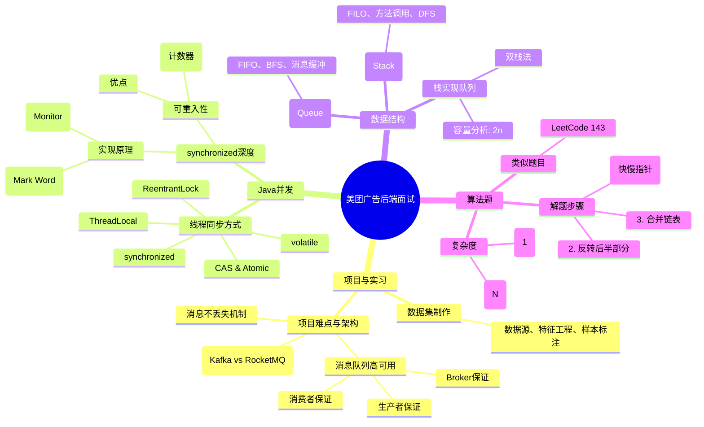

美团一面广告后端
1、自我介绍
2、实习+实验室项目。广告平台对算法调用比较多，细问了我数据集的制作。然后就是挑一个实习项目的难点介绍。中间主要穿插一些选型的询问，kafka or rocketmq，以及消息队列的高可用，保证消息的不丢失等问题。
3、八股：
a、讲讲java里面线程同步有哪几种方式
b、java的synchronized是如何实现的，是不是可重入的，如何实现可重入
c、你对栈和队列的理解
d、如何用栈实现队列，实现一个容量为n的队列，至少需要的栈大小为多少。

4、算法：
lc上应该有，但我记不得是啥了
描述是：给一个链表，将其后一半进行反转，然后需要将翻转后的后半段和前半段依次合并。

作者：在写总结的鲸鱼很爱吃
链接：https://www.nowcoder.com/?type=11002_0
来源：牛客网

好的，没问题。作为一位资深Java开发工程师，我将为您系统性地梳理和解答这套美团广告后端一面的面试题。

### 一、核心知识点总览

首先，我们用一张Mermaid思维导图来梳理本次面试所考察的核心知识点体系，它清晰地展示了后端工程师，特别是广告这类高并发、高可用系统方向所需的知识框架。



上图涵盖了从项目经验到底层原理的完整知识链。接下来，我将对每个模块进行深度解析。

---

### 二、项目与实习经验深度剖析

面试官询问项目和实习，核心目的是考察你的**工程实践能力、技术选型思考深度和解决问题的能力**，而不仅仅是做了什么。

#### 1. 数据集制作
这是一个将算法（机器学习/深度学习）与工程相结合的问题。
-   **定义**：数据集是模型训练的“燃料”，通常由（特征，标签）对组成。
-   **制作流程**：
    1.  **数据采集**：从广告业务系统（如点击日志、曝光日志、用户画像库、广告库）通过埋点、日志收集工具（Flume）、数据管道（Kafka）汇聚到数据平台（HDFS、数据仓库Hive）。
    2.  **数据清洗与预处理**：处理缺失值、异常值、去重、归一化等。例如，剔除明显无效的曝光或点击（如持续时间过短）。
    3.  **特征工程**（**重中之重**）：
        -   **特征提取**：将原始数据转化为模型可用的特征。例如，用户历史点击率、广告位特征、时间特征（小时、星期几）、上下文特征等。
        -   **特征编码**：对类别型特征（如城市、广告类别）进行One-Hot编码或Label Encoding。
        -   **特征交叉**：人工构造组合特征，以捕捉更复杂的模式。
    4.  **样本组装与标注**：将特征与标签（如是否点击`click=1/0`）关联起来，形成最终的样本集。
    5.  **样本存储**：通常存储为TFRecord、Parquet或ORC等列式存储格式，便于高效读取。
-   **注意事项**：
    -   **数据一致性**：确保日志数据不丢失、不重复，涉及端到端的数据管道可靠性。
    -   **样本偏差**：例如，曝光的样本远多于点击的样本，需要进行**负采样**或设计**损失函数**的权重来处理样本不均衡问题。
    -   **数据时效性**：广告模型需要快速捕捉用户兴趣变化，因此可能需要使用近实时（Near Real-Time）的数据流进行特征更新和模型训练。

#### 2. 技术选型：Kafka vs RocketMQ & 高可用保障
这是消息队列领域的经典问题，考察你对中间件的理解深度。

| 特性 | Apache Kafka | Apache RocketMQ | **选型思考（广告场景）** |
| :--- | :--- | :--- | :--- |
| **设计初衷** | 高吞吐的日志流处理 | 金融级的交易消息 | **广告日志**追求极致的**吞吐量**，Kafka是天然首选。 |
| **吞吐量** | **极高**（顺序I/O，Zero-Copy） | 高 |  |
| **延迟** | 毫秒~秒级（批处理） | **毫秒级**（更稳定） | 若需实时特征计算，RocketMQ的低延迟有优势。 |
| **事务消息** | 支持（但API较重） | **支持良好**（原生） | 普通日志不需要；扣费、预算消耗等场景需要。 |
| **消息可靠性** | 高（副本机制） | **非常高**（同步刷盘、多副本） | 两者都能满足要求。 |
| **社区生态** | 极丰富（Streaming、Connector） | 丰富（Ali生态） | Kafka与大数据生态（Flink, Spark）结合更紧密。 |

**如何保证消息不丢失？** 这是一个“端到端”的保证，需要生产者、Broker、消费者三方协同。
1.  **生产者端（Send and Forget -> 可靠发送）**：
    -   **同步发送**：调用`send()`方法后，等待Broker的ACK确认。
    -   **异步发送**：在回调（Callback）中检查发送结果，处理异常。
    -   **配置**：设置`acks=all`（Kafka）或发送策略为`SYNC_MASTER`（RocketMQ）。这意味着需要所有ISR（In-Sync Replica）副本都成功写入，生产者才会收到成功响应。这是**可靠性最重要的配置**。
    -   **重试**：合理配置重试次数（如`retries=3`）以应对网络抖动。

2.  **Broker端（Persistence）**：
    -   **副本机制（Replication）**：将每个分区的数据复制到多个Broker上。即使主节点（Leader）宕机，系统也能自动从副本（Follower）中选举新的Leader，继续提供服务。这是**高可用的核心**。
    -   **刷盘策略（Flush）**：
        -   **异步刷盘**：消息先写入Page Cache，由操作系统异步刷盘。**性能高，但有极低概率丢失消息**（机器断电）。
        -   **同步刷盘**：消息写入Page Cache后，立刻刷盘完成后才返回成功。**可靠性极高，性能有损耗**。广告日志通常采用**异步刷盘+多副本**，在性能和可靠性间取得平衡。

3.  **消费者端（Process After Commit）**：
    -   **手动提交偏移量（Commit Offset）**：禁止自动提交（`enable.auto.commit=false`），在处理完**业务逻辑后**，再手动提交偏移量。
    -   **保证幂等性**：网络重试可能导致消息重复消费，消费者逻辑需要保证多次处理同一消息的结果与一次相同（例如，使用数据库唯一键或Redis幂等令牌）。

**最佳实践**：对于广告点击/曝光日志，采用 **Kafka（多副本+异步刷盘）+ 生产者`acks=all` + 消费者手动提交** 的组合，是实现高吞吐、高可靠性的经典方案。

---

### 三、Java八股文深度解答

#### a. Java线程同步的几种方式
1.  **`synchronized` 关键字**：
    -   **定义**：JVM内置锁，用于修饰方法或代码块。
    -   **原理**：基于Monitor对象实现（`monitorenter`/`monitorexit`指令）。
    -   **特点**：自动加锁、解锁；可重入；非公平锁。
2.  **`java.util.concurrent.locks.ReentrantLock`**：
    -   **定义**：JDK提供的API层面的锁。
    -   **特点**：可重入；可设置为公平锁；提供`tryLock()`非阻塞获取锁；可中断；可绑定多个条件变量（Condition）。
    -   ** vs `synchronized`**：功能更丰富，但需要手动`lock()`和`unlock()`。
3.  **`volatile` 关键字**：
    -   **定义**：保证变量的**可见性**和**禁止指令重排序**。
    -   **注意**：它**不保证原子性**（如`i++`操作依然不安全）。适用于一写多读的标志位场景。
4.  **原子类（AtomicInteger等）**：
    -   **定义**：基于CAS（Compare-And-Swap）操作，保证单个变量的原子性。
    -   **原理**：底层调用Unsafe类的CAS方法，CPU硬件指令支持。
    -   **场景**：计数器、累加器等。
5.  **`ThreadLocal`**：
    -   **定义**：线程局部变量。为每个线程创建变量的独立副本，从根本上避免共享。
    -   **场景**：存储用户会话信息、数据库连接等需要线程隔离的数据。
    -   **注意**：使用不当会导致**内存泄漏**，必须在使用后调用`remove()`方法。

#### b. `synchronized`的实现与可重入性
-   **实现原理**：
    -   **Java对象头**：每个对象都有一个Mark Word字段，其中一部分用于存储锁信息（锁状态、偏向线程ID等）。
    -   **Monitor**：每个Java对象都与一个Monitor关联。当线程进入`synchronized`块时，会尝试获取该对象的Monitor的所有权。
    -   **锁升级**：为了优化性能，JVM引入了**偏向锁**（Biased Locking）、**轻量级锁**（自旋锁）、**重量级锁**的概念。锁会根据竞争情况逐步升级，这个过程是不可逆的。
-   **可重入性（Reentrant）**：
    -   **定义**：同一个线程在外层方法获取锁后，在进入内层方法时会自动获取该锁。
    -   **实现机制**：JVM会为每个锁关联一个**计数器**（也在对象头中记录）和一个**持有者线程**。当线程首次获取锁时，计数器变为1，线程成为持有者。每次重入，计数器+1。解锁时，计数器-1。直到计数器为0，锁才被真正释放。
    -   **优点**：避免线程死锁自己，简化了并发编程（递归调用不会自锁）。

#### c. & d. 栈与队列及实现
-   **栈 (Stack)**：**后进先出 (LIFO)** 结构。类比一摞盘子。核心操作：`push`（入栈）, `pop`（出栈）, `peek`（查看栈顶）。
    -   **应用场景**：JVM方法调用栈、括号匹配、DFS深度优先搜索、表达式求值。
-   **队列 (Queue)**：**先进先出 (FIFO)** 结构。类比排队。核心操作：`offer`/`add`（入队）, `poll`/`remove`（出队）, `peek`/`element`（查看队首）。
    -   **应用场景**：BFS广度优先搜索、线程池任务队列、消息队列、缓冲。
-   **用栈实现队列**：
    -   **方法（双栈法）**：使用两个栈，一个`inStack`专门处理入队操作，一个`outStack`专门处理出队操作。
        -   **入队**：直接`push`到`inStack`。
        -   **出队**：如果`outStack`为空，则将`inStack`中的所有元素依次`pop`并`push`到`outStack`中。此时元素顺序被反转，再从`outStack`中`pop`，即实现了FIFO。
    -   **容量分析**：**最坏情况下，需要至少 `2n` 的栈空间**。
        -   **解释**：当所有元素都从`inStack`转移到`outStack`时，`inStack`占用了`n`个空间，`outStack`也占用了`n`个空间，总计`2n`。这是空间复杂度的上界。

---

### 四、算法题详解

这道题是 **LeetCode 143. 重排链表 (Reorder List)** 的变种或完全相同。

#### 解题思路
1.  **找中点**：使用**快慢指针法**找到链表的中间节点。慢指针每次走一步，快指针每次走两步。当快指针走到末尾时，慢指针正好在后半段的开头（或前半段的结尾，根据链表奇偶长度略有不同）。**时间复杂度：O(N)**。
2.  **反转后半部分**：从慢指针指向的节点开始，反转后面的链表。**时间复杂度：O(N)**。
3.  **合并链表**：将前半部分链表和反转后的后半部分链表**交替合并**。**时间复杂度：O(N)**。

**总时间复杂度**：O(N)。  
**总空间复杂度**：O(1)（仅使用几个指针变量）。

#### Java代码实现（带详细注释）

```java
/**
 * Definition for singly-linked list.
 * public class ListNode {
 *     int val;
 *     ListNode next;
 *     ListNode() {}
 *     ListNode(int val) { this.val = val; }
 *     ListNode(int val, ListNode next) { this.val = val; this.next = next; }
 * }
 */
class Solution {
    public void reorderList(ListNode head) {
        if (head == null || head.next == null) {
            return;
        }

        // 1. 使用快慢指针找到链表中点
        ListNode slow = head;
        ListNode fast = head;
        while (fast.next != null && fast.next.next != null) {
            slow = slow.next;
            fast = fast.next.next;
        }
        // 循环结束后，slow.next 即为后半部分的起点
        // 对于偶数个节点：1->2->3->4->null, slow 指向 2
        // 对于奇数个节点：1->2->3->null, slow 指向 2

        // 2. 反转后半部分链表
        ListNode prev = null;
        ListNode curr = slow.next; // 后半部分的头节点
        slow.next = null; // 重要：将前后两部分链表断开，否则会成环
        ListNode nextTemp;
        while (curr != null) {
            nextTemp = curr.next; // 保存下一个节点
            curr.next = prev;     // 当前节点指向前一个节点，完成反转
            prev = curr;          // prev 指针后移
            curr = nextTemp;      // curr 指针后移
        }
        // 循环结束后，prev 是反转后的新头节点

        // 3. 合并两个链表：前半部分 head 和 反转后的后半部分 prev
        ListNode first = head;
        ListNode second = prev;
        ListNode temp1, temp2;
        while (second != null) { // 后半部分可能比前半部分短1（奇数情况）
            temp1 = first.next;
            temp2 = second.next;

            // 插入操作
            first.next = second; // first -> second
            second.next = temp1; // second -> first's original next

            // 移动指针
            first = temp1;
            second = temp2;
        }
        // 合并完成
    }
}
```

**边界情况处理**：
-   链表为空或只有一个节点：直接返回。
-   断开前后链表（`slow.next = null`）至关重要，否则合并后的链表会形成环。
-   合并时，后半部分链表长度 <= 前半部分（最多短一个），所以循环条件以`second`是否为空来判断。

希望这份详尽的解答能帮助你充分准备面试。祝你面试顺利！
