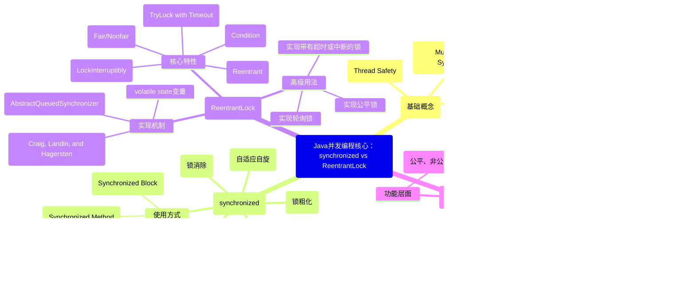

好的，收到您的需求。作为一名资深Java开发工程师，我将为您系统性地梳理和解答这道经典的字节跳动面试题。

## 一、核心知识点框架梳理 (Mermaid)

首先，我们用一张思维导图来总览本题所涉及的核心知识体系，这有助于我们构建系统性的认知。



---

## 二、详细知识点讲解

### 1. `synchronized`：JVM内置锁

**定义与工作原理：**
`synchronized` 是 Java 语言提供的一个内置的互斥同步锁机制。它的实现完全由 JVM 负责。
- **实现机制**：它基于进入和退出 **Monitor 对象**（管程）来实现方法同步和代码块同步。每个 Java 对象都可以作为一个隐式的 Monitor。
- **字节码层面**：编译后，同步代码块前后会生成 `monitorenter` 和 `monitorexit` 指令。同步方法则由方法常量池中的 `ACC_SYNCHRONIZED` 标志来标识，JVM 通过该标志来识别这是一个同步方法。
- **锁的升级与优化**：为了减少获得锁和释放锁带来的性能开销，HotSpot VM 实现了**锁升级**机制，该机制使得锁的状态会随着竞争情况发生变化：
  - **无锁 (No Lock)**： new出来的对象，无任何线程竞争。
  - **偏向锁 (Biased Locking)**： 适用于只有一个线程访问同步块的场景。Mark Word 中会记录该线程的 ID，以后该线程进入和退出同步块时，无需进行 CAS 操作来加锁和解锁，性能极高。
  - **轻量级锁 (Lightweight Locking)**： 当有第二个线程尝试获取锁时，偏向锁会升级为轻量级锁。通过 **CAS 操作**和**自旋**来尝试获取锁，避免线程直接进入阻塞，适用于锁占用时间很短、竞争不激烈的场景。
  - **重量级锁 (Heavyweight Locking)**： 轻量级锁自旋失败后，会升级为重量级锁。此时，未获取到锁的线程会**阻塞 (Park)**，等待操作系统调度，性能开销最大。

**使用场景与注意事项：**
- **场景**：适用于大多数简单的、竞争不激烈的同步场景。代码简洁，由 JVM 自动管理锁的获取和释放，不会出现遗忘释放锁而导致死锁的问题。
- **注意事项**：
  - 锁的粒度要尽可能小，以减少线程等待时间。
  - 要避免在同步块中执行耗时操作（如 IO）或调用可能阻塞的方法，以免成为系统性能瓶颈。
  - 锁的是**对象**，而不是代码。要明确锁的对象是什么（`this`、`class`对象、或其他实例对象）。

### 2. `ReentrantLock`：API 式可重入锁

**定义与工作原理：**
`ReentrantLock` 是 JDK 1.5 后在 `java.util.concurrent.locks` 包下提供的一个显式锁实现。它实现了 `Lock` 接口，提供了比 `synchronized` 更灵活的同步控制。

- **实现机制**：其核心是 **AQS (AbstractQueuedSynchronizer)**，一个用于构建锁和同步器的框架。AQS 使用一个整型的 `volatile` 变量（`state`）来表示同步状态，并通过一个内置的 **FIFO 双向队列（CLH变体）** 来管理获取锁失败的线程。
  - **`state`**： 为 0 表示锁未被占用。为 1（或更大）表示被占用，数值代表重入次数。
  - **CAS**： 所有对 `state` 的修改都使用 CAS 操作，保证原子性。
  - **队列**： 未获取到锁的线程会被封装成 Node 节点，加入到队列中排队等待。

**核心特性（相较于 `synchronized` 的优势）：**
1.  **尝试非阻塞获取锁**： `tryLock()` 方法可以立即返回获取锁的结果，避免线程空等。
2.  **可中断的锁获取**： `lockInterruptibly()` 方法允许在等待锁的过程中响应中断。
3.  **超时获取锁**： `tryLock(long time, TimeUnit unit)` 方法可以在指定时间内尝试获取锁，超时后返回。
4.  **公平性选择**： 构造函数可以传入 `boolean` 值指定是**公平锁（FairLock）** 还是**非公平锁（NonfairLock）**。
    - **公平锁**： 严格按照线程在队列中的排队顺序来获取锁，先到先得。保证了公平性，但性能较低，因为需要频繁的上下文切换。
    - **非公平锁**： 允许“插队”，一个新来的线程可以直接尝试获取锁，如果获取失败再排队。吞吐量高，但可能导致线程饥饿。

**使用场景与注意事项：**
- **场景**：当需要上述高级功能（如可中断、超时、公平性）时；或者需要在 `try-catch` 块中执行锁的释放操作以实现更复杂的逻辑时。
- **注意事项**：
  - **必须显式释放锁**！必须在 `finally` 块中调用 `unlock()` 方法，否则可能导致死锁。
  - 使用 `ReentrantLock` 的代码可读性不如 `synchronized`。

---

## 三、扩展内容与最佳实践

### 1. 对比总结

| 特性 | `synchronized` | `ReentrantLock` |
| :--- | :--- | :--- |
| **实现层面** | JVM 层面，关键字 | JDK 层面，API |
| **锁的释放** | 自动释放（代码块/方法结束） | **必须手动调用 `unlock()`** |
| **灵活性** | 基本，不支持中断、超时 | 高，支持尝试、中断、超时、公平性 |
| **公平锁** | **只支持非公平锁** | 支持公平锁和非公平锁 |
| **性能** | 低竞争下，JVM 优化后很好 | 高竞争、需要高级功能时更好 |
| **条件变量** | 通过 `wait()/notify()` 与一个对象监视器绑定 | 通过 `newCondition()` 可创建**多个** `Condition` |
| **调试** | 信息较少 | 可查看锁的状态、是否有线程在等待 |

### 2. 选型原则（最佳实践）

- **优先使用 `synchronized`**：
  - 对于大多数简单的、无特殊需求的同步场景，`synchronized` 是首选。因为它写法简单，由 JVM 自动管理，不容易出错，且随着 JVM 的优化（如锁消除、锁粗化、自适应自旋），其性能已经非常优秀。
- **升级到 `ReentrantLock`**：
  - 当你需要 `synchronized` 所不具备的特性时，才考虑使用 `ReentrantLock`。例如：
    - 需要**可中断的锁获取**能力来应对死锁问题。
    - 需要**超时获取锁**，防止线程长时间阻塞。
    - 需要**公平锁**以保证等待时间最长的线程优先获取锁。
    - 需要**非块状结构的锁**（例如，在一个方法中加锁，在另一个方法中解锁）。
    - 需要**多个条件变量**（`Condition`）对线程进行更精细的等待/唤醒控制（例如，实现一个阻塞队列）。

### 3. 常见问题与解决方案

- **死锁 (Deadlock)**：
  - **问题**：两个或多个线程互相持有对方所需的锁，导致所有线程都无法继续执行。
  - **解决方案**：
    1.  **顺序加锁**： 所有线程都按照一个全局固定的顺序去获取锁。
    2.  **使用 `tryLock`**： 使用 `ReentrantLock.tryLock()` 并指定超时时间，获取锁失败后**释放自己已持有的锁**，进行回退和重试。

- **活锁 (Livelock)**：
  - **问题**： 线程没有阻塞，但在不断重试相同的操作（例如，两个线程同时回退并重试），始终无法取得进展。
  - **解决方案**： 引入一定的随机性到重试机制中（如随机等待一个很短的时间），避免多个线程同时重试。

- **饥饿 (Starvation)**：
  - **问题**： 某些线程因为优先级低或锁竞争策略问题，始终无法获取到锁。
  - **解决方案**： 使用**公平锁**（但会牺牲一部分性能）。

---

## 四、算法题：力扣 279. 完全平方数

这道题与 **LeetCode 279. Perfect Squares** 完全相同。

### 1. 解题思路

这是一个典型的**动态规划**问题。

- **定义状态**： `dp[i]` 表示和为 `i` 的完全平方数的最少数量。
- **初始化状态**：
  - `dp[0] = 0`（和为0需要0个平方数）
  - 对于其他 `i`，可以初始化为一个最大值（如 `i`，因为最坏情况是用 `i` 个 `1` 相加）。
- **状态转移方程**：
  - 对于每一个数字 `i`（从 `1` 到 `n`），我们遍历所有比它小的完全平方数 `j*j`（其中 `j*j <= i`）。
  - `i` 可以由 `(i - j*j)` 加上一个平方数 `j*j` 构成。
  - 因此，我们需要在所有的 `j` 中，找到一个使得 `dp[i - j*j] + 1` 最小的那个。
  - 方程： `dp[i] = min(dp[i], dp[i - j*j] + 1)`
- **复杂度分析**：
  - **时间复杂度**： O(n * √n)。外层循环遍历 `n` 次，内层循环遍历 `√n` 次（因为 `j` 最大为 `√i`）。
  - **空间复杂度**： O(n)。需要长度为 `n+1` 的 `dp` 数组。

### 2. 完整 Java 代码

```java
class Solution {
    public int numSquares(int n) {
        // 1. 创建dp数组，dp[i]表示和为i所需的最少完全平方数的个数
        int[] dp = new int[n + 1];
        
        // 2. 初始化dp数组
        // dp[0] = 0 是基础情况
        // 对于其他位置，我们先初始化为一个最大值（最坏情况是全部由1组成，即i本身）
        for (int i = 1; i <= n; i++) {
            dp[i] = i; // 初始化为最大值i（即1+1+...+1，共i个1）
        }
        
        // 3. 动态规划填表
        // 从1开始计算，一直计算到n
        for (int i = 1; i <= n; i++) {
            // 遍历所有可能的完全平方数 j*j，它必须小于等于当前数i
            for (int j = 1; j * j <= i; j++) {
                // 状态转移：比较【当前值】和【减去一个平方数j*j后的状态值 + 1】哪个更小
                // dp[i - j*j] + 1 表示：先凑出 i - j*j 这个数所需的最少个数，再加上j*j这一个数
                dp[i] = Math.min(dp[i], dp[i - j * j] + 1);
            }
        }
        
        // 4. 返回结果dp[n]
        return dp[n];
    }
}
```

### 3. 边界情况处理

- 代码已经处理了 `n = 0` 的情况（返回 0）。
- 当 `n` 本身就是一个完全平方数时，内层循环当 `j*j == i` 时，`dp[i - j*j]` 即 `dp[0] = 0`，所以 `dp[i] = 1`，结果正确。

希望这份详尽的分析和解答能帮助您充分准备面试。祝您面试顺利！
