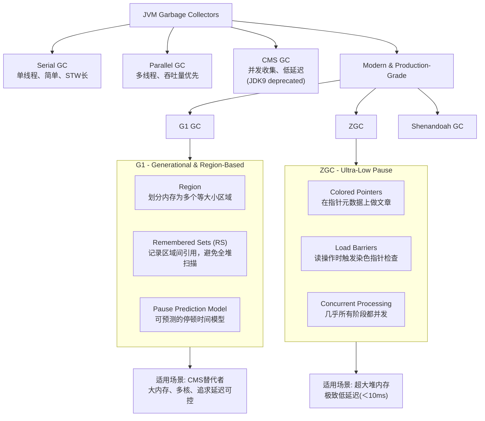

好的，作为一名资深Java开发工程师，我将为您系统性地解答这些高频且深入的面试题。我们将按照知识体系逐一剖析，兼顾深度与广度。

---

## 二、JVM垃圾回收：G1 vs ZGC

首先，我们用一张图来梳理现代JVM垃圾回收器的演进和核心设计理念。

**G1 (Garbage-First)**
- **工作原理**： 将堆内存划分为多个固定大小（1M-32M）的 Region。不再是物理分代，而是逻辑分代（Eden, Survivor, Old Region）。其核心是通过 **Remembered Set (RSet)** 和 **Collection Set (CSet)** 来避免全堆扫描。G1 通过跟踪各个 Region 的垃圾价值（回收所能释放的空间大小以及所需时间），优先回收价值最大的 Region（Garbage-First 名字由来）。
- **适用场景**： 面向服务端应用，堆内存较大（6GB-8GB以上），追求**延迟可控**（可配置最大停顿时间 `-XX:MaxGCPauseMillis`）的场景。是 JDK 9 及以后的默认 GC。
- **优点**： 停顿时间可控；整体上采用**标记-整理**算法，避免内存碎片。
- **缺点**： 内存占用较高（RSet）；写屏障（维护 RSet）带来额外开销；最坏情况下停顿时间仍可能较长。

**ZGC (The Z Garbage Collector)**
- **工作原理**： 其核心是**染色指针**和**读屏障**。
    - **染色指针**： 将少量元数据信息存储在指针本身的高位地址中。这使得 GC 状态与对象解耦，与内存位置无关，从而可以实现大部分阶段都是并发的。
    - **读屏障**： 在应用程序线程从堆中加载引用时触发的一个操作，用于检查引用的元数据（颜色），并根据需要执行一些动作（如对象重定位）。
- **适用场景**： **超大堆内存**（TB级别）且要求**极致低停顿**（<10ms）的应用，如金融交易、大数据平台。
- **优点**： 停顿时间极短，且几乎不随堆大小增长而增加；吞吐量损失小。
- **缺点**： JDK 15 才正式生产可用；相对更消耗 CPU 资源来换取低延迟；JDK 16 才支持 macOS，JDK 17 才支持 Windows。

---

## 三、Spring Bean的生命周期

Spring Bean 的生命周期核心可以概括为：**实例化 -> 属性赋值 -> 初始化 -> 使用 -> 销毁**。其中提供了大量的扩展点供开发者干预。

**主要阶段及扩展点：**
1.  **实例化**： 通过反射调用构造函数创建 Bean 实例。
    - **干预点**： 自定义 `InstantiationAwareBeanPostProcessor#postProcessBeforeInstantiation`（可返回代理对象，阻止默认实例化）。
2.  **属性赋值**： 为 Bean 的属性注入值（`@Value`）或依赖（`@Autowired`）。
    - **干预点**：
        - `InstantiationAwareBeanPostProcessor#postProcessAfterInstantiation`（可在属性填充前进行自定义操作，返回 `false` 可阻止属性填充）。
        - `InstantiationAwareBeanPostProcessor#postProcessProperties`（可对即将注入的属性进行修改）。
3.  **Aware接口回调**： 如果 Bean 实现了各种 `Aware` 接口，Spring 会回调相关方法，注入相关基础设施对象。
    - `BeanNameAware` -> `setBeanName`
    - `BeanFactoryAware` -> `setBeanFactory`
    - `ApplicationContextAware` -> `setApplicationContext`（**这是一个重要扩展点**，可用于获取 Spring 容器）
4.  **初始化前**：
    - **干预点**： `BeanPostProcessor#postProcessBeforeInitialization`（**极其重要的扩展点**，AOP 代理、`@PostConstruct` 的处理都在这里）。
5.  **初始化**：
    - 执行 `@PostConstruct` 注解的方法。
    - 执行 `InitializingBean#afterPropertiesSet` 方法。
    - 执行自定义的 `init-method` 方法。
6.  **初始化后**：
    - **干预点**： `BeanPostProcessor#postProcessAfterInitialization`（**另一个极其重要的扩展点**，AOP 的代理包装最终在这里完成）。
7.  **使用**： Bean 完全准备就绪，存在于应用上下文中，可供使用。
8.  **销毁**：
    - 执行 `@PreDestroy` 注解的方法。
    - 执行 `DisposableBean#destroy` 方法。
    - 执行自定义的 `destroy-method` 方法。

**最佳实践**： 优先使用 `@PostConstruct` 和 `@PreDestroy` 注解，而非接口方式，以减少对 Spring API 的耦合。`BeanPostProcessor` 是实现插件化功能的利器。

---

## 四、MySQL索引：B+树 vs B树 vs 哈希表

| 索引类型 | 原理 | 优点 | 缺点 | 适用场景 |
| :--- | :--- | :--- | :--- | :--- |
| **B+树** | 多路平衡搜索树，**所有数据存储在叶子节点**，叶子节点间形成有序链表。 | 1. **支持范围查询和排序**（链表结构）。 2. 查询性能稳定（每次查询都要到叶子节点，路径长度相同）。 3. 磁盘读写友好（节点大小设置为页的整数倍，充分利用预读特性）。 | 结构相对哈希更复杂。 | **绝大多数场景**，特别是范围查询、排序、模糊查询（`LIKE 'prefix%'`）。 |
| **B树** | 多路平衡搜索树，**所有节点都存储数据**。 | 1. 在查询单个键时，可能比 B+ 树更快（不需要到叶子节点）。 | 1. **范围查询性能差**（节点间没有指针）。 2. 每个节点存储数据，导致一页能存放的键更少，树更高。 | 数据库系统内部使用（如 SQLite），文件系统。 |
| **哈希表** | 通过哈希函数将键映射到桶中。 | 1. **等值查询极快**，O(1) 复杂度。 | 1. **完全不支持范围查询和排序**。 2. **不支持部分索引键查询**（最左前缀匹配）。 3. 哈希冲突影响性能。 | **仅适用于等值查询**的场景，如 Memcached、Redis 的字典。 |

**结论**： MySQL 的 InnoDB 引擎需要适应复杂的业务查询（大量范围查询、排序、分组），因此选择 B+ 树作为默认索引结构是最优解。Memory 引擎支持哈希索引。

---

## 五、Redis缓存问题：穿透、雪崩、击穿

| 问题 | 描述 | **解决方案** |
| :--- | :--- | :--- |
| **缓存穿透** | 查询一个**根本不存在**的数据（如不存在的用户ID），缓存不命中，请求直达数据库。 | 1. **缓存空对象**： 即使查不到，也缓存一个 `null` 或特殊值，并设置一个较短的过期时间。 2. **布隆过滤器**： 在缓存之前加一层布隆过滤器，快速判断 key 是否**一定不存在**于数据库中。 |
| **缓存雪崩** | **大量缓存key在同一时间过期**，导致所有请求都打到数据库，引起数据库压力激增甚至宕机。 | 1. **设置随机过期时间**： 让 key 的过期时间分散开，避免同时失效。 2. **集群部署**： Redis 高可用（主从、哨兵、集群），防止单点故障。 3. **永不过期/后台更新**： 对极热点数据，可设置为逻辑过期，由后台线程异步更新缓存。 |
| **缓存击穿** | 某个**极热点的key过期**的瞬间，大量并发请求这个 key，请求全部打到数据库。 | 1. **互斥锁**： 只有一个请求能拿到锁去数据库加载数据，其他请求等待或返回默认值。 2. **永不过期**： 同上，不设置物理过期时间，而是设置逻辑过期字段，由后台线程更新。 |

---

## 六、RPC框架：Dubbo vs gRPC

**RPC (Remote Procedure Call)**： 远程过程调用，让调用远程服务像调用本地方法一样简单。核心是**代理**和**网络通信**。

| 方面 | **Dubbo** | **gRPC** |
| :--- | :--- | :--- |
| **设计理念** | **服务治理为核心**的 RPC **框架**。提供完整的微服务解决方案。 | **高性能、跨语言**的 RPC **协议/工具**。专注于通信本身。 |
| **协议** | 默认使用 **Dubbo 协议**（TCP长连接、NIO、二进制序列化），也支持 HTTP、REST 等。 | 基于 **HTTP/2** 和 **Protocol Buffers (Protobuf)**。 |
| **核心功能** | **服务自动注册与发现**（集成 ZooKeeper、Nacos等）、**负载均衡**、**容错机制**、**服务降级**、**可视化治理**。 | 强大的 **IDL**（接口定义语言）、**流式调用**（Streaming）、**超时控制**、**认证**。 |
| **跨语言** | 主要服务于 Java 生态，对其他语言支持较弱（通过多协议实现）。 | **原生多语言支持**（C++, Java, Python, Go, 等），是云原生时代的通用通信协议。 |
| **适用场景** | 构建于 Java 技术栈的**大型分布式系统**，对服务治理有强烈需求。 | **多语言混合架构**、**云原生环境**（Kubernetes + Istio）、对性能有极致要求的内部服务调用。 |

**总结**： Dubbo 是一个“大而全”的微服务框架，gRPC 是一个“小而美”的通信协议。两者并不完全冲突，Dubbo 3.0 已经支持 gRPC 协议，可以结合使用。

---

## 七、Kafka的消息顺序性与可靠性

### **如何保证顺序性？**
- **问题**： Kafka 同一个 Partition 内消息是有序的，但多个 Partition 并行消费会乱序。
- **解决方案**： 若要保证**全局顺序**，只能设置 1 个 Partition（不推荐，牺牲扩展性）。通常保证**局部顺序**即可。
    - **发送端**： 指定 **Key**。相同 Key 的消息会被发送到同一个 Partition。
    - **消费端**： 一个 Partition 只能被一个 Consumer（在同一 Consumer Group 内）消费。**禁用多线程消费一个 Partition**。

### **如何保证可靠性（不丢消息）？**
这是一个“端到端”的保证，需要发送端、Broker、消费端三方协作。
1.  **发送端不丢**：
    - 设置 `acks=all`（或 `-1`）。这意味着 leader 必须等待所有 ISR（In-Sync Replicas）的 follower 都确认收到消息后才返回成功。
    - 设置 `retries` 为一个较大的值，并启用重试。
2.  **Broker不丢**：
    - 设置 `replication.factor >= 3`，保证每个分区有多个副本。
    - 设置 `min.insync.replicas > 1`（通常为 2）。这意味着至少需要多少个 ISR 副本存活，生产者才能成功写入。防止 leader 挂掉后数据丢失。
3.  **消费端不丢**：
    - **关闭自动提交偏移量**（`enable.auto.commit=false`）。
    - 在**业务逻辑处理完成后，手动提交偏移量**。这样才能保证“至少一次”语义。要处理幂等性。

---

## 八、分布式ID生成方案 & 雪花算法

**常见方案：**
1.  **UUID**： 简单，但无序，作为数据库主键性能差。
2.  **数据库自增ID**： 利用数据库的 `auto_increment`，通过设置不同步长来实现多库。**强依赖DB，有性能瓶颈和单点风险**。
3.  **Redis INCR**： 利用 Redis 的单线程原子操作生成递增ID。**需维护Redis高可用**。
4.  **号段模式**： 从数据库批量获取一个号段（如 1~1000），用完后再次获取。降低数据库压力。**美团的Leaf-segment** 基于此。
5.  **雪花算法**： **最流行的方案**。

**雪花算法实现原理：**
生成一个 64 bit 的 Long 型 ID：`1bit（符号位，恒为0） + 41bit（时间戳） + 10bit（工作机器ID） + 12bit（序列号）`
- **时间戳**： 毫秒级时间，可使用 `(当前时间 - 自定义起始时间)`，可用约 69 年。
- **工作机器ID**： 可拆分为 `5bit datacenterId + 5bit workerId`，最多支持 1024 个节点。
- **序列号**： 同一毫秒、同一节点产生的序列号，支持每毫秒生成 4096 个 ID。

**优点**： 趋势递增、**本地生成**（高性能、无网络开销）、ID 中包含时间信息。
**缺陷**：
1.  **时钟回拨问题**： 如果服务器系统时间发生回调，可能导致生成重复 ID。
    - **解决方案**： 关闭 NTP 同步（不推荐）；在内存中记录最近一次生成 ID 的时间戳，如果发现当前时间小于它，则抛出异常并等待时钟追上来；或者使用扩展的算法（如美团 Leaf-snowflake、百度 UidGenerator）来解决。
2.  **工作机器ID需要配置**： 需要手动或通过外部系统（如 ZooKeeper）为每个节点分配唯一的 `workerId`。

---

## 九、高性能延迟任务系统

**延迟任务**： 需要在一定时间点之后才被执行的任务，如定时订单取消、消息重试。

**实现方案：**
1.  **数据库轮询**： 用一个表存任务和执行时间，定时线程扫描。**简单但低效**，对数据库压力大。
2.  **JDK DelayQueue**： 无界阻塞队列，元素按延迟时间排序。**单机、内存型**，宕机数据丢失。
3.  **时间轮算法**： **Netty & Kafka 采用的高效算法**。
    - **原理**： 像一个钟表，分为多个槽（bucket），每个槽代表一个时间间隔。一个指针按固定频率跳动。将任务放到对应的槽中。当指针跳到该槽时，执行其中的任务。
    - **优点**： **O(1) 的插入和删除性能**，非常高效。
4.  **Redis ZSet**： 用 `score` 存储任务的执行时间戳，起一个线程轮询 `zrangebyscore` 获取到期任务。**方案简单，利用Redis高性能**。
5.  **MQ 延迟消息**： **RocketMQ 支持**。发送消息时设置一个延迟级别，Broker 会延迟投递。**开箱即用，可靠**，但延迟级别固定。

**最佳实践**： 对于海量延迟任务，**时间轮**是单机最优解。需要分布式和高可用，则采用 **Redis ZSet** 或 **RocketMQ 延迟消息**。

---

## 十、Service Mesh & Istio

**Service Mesh**： 服务网格，是处理**服务间通信**的基础设施层。其核心思想是将**微服务中的通信、容错、观测、安全等通用功能**从业务代码中剥离出来，下沉到一个独立的**边车代理**中。

**Istio 工作原理：**
Istio 服务网格逻辑上分为**数据平面**和**控制平面**。
1.  **数据平面**： 由一组以**边车模式**部署的智能代理（**Envoy**）组成。所有流入流出服务的流量都被 Envoy 代理拦截和控制。
2.  **控制平面**： 负责管理和配置数据平面中的代理。
    - **Pilot**： 核心组件，将高级路由规则、流量管理策略（如金丝雀发布、故障注入）转换为 Envoy 能理解的配置，并**下发**给所有 Envoy  sidecar。
    - **Citadel**： 负责服务间的身份认证和证书管理。
    - **Galley**： 负责配置的验证、摄取和处理。

**工作流程**： 开发者通过 Kubernetes YAML 或 Istio API 向控制平面声明期望的流量规则 -> Pilot 将其转换为 Envoy 配置 -> Envoy 动态加载新配置，并据此对通过它的流量进行**路由、熔断、限流、收集指标**等操作。

**价值**： 让业务开发者更专注于业务逻辑，使基础设施与业务解耦，实现了对网络层的统一治理。

---

## 十一、ThreadLocal原理与内存泄漏

**原理**： `ThreadLocal` 提供了线程局部变量。每个线程 `Thread` 内部都有一个 `ThreadLocalMap` 类型的变量 `threadLocals`。这个 Map 的 **Key 是 `ThreadLocal` 变量本身（弱引用）**，Value 是线程局部变量的值。
`ThreadLocal#set(value)` 的本质是 `Thread.currentThread().threadLocals.set(this, value)`。

**内存泄漏问题：**
- **根源**： `ThreadLocalMap` 的 Key 是弱引用指向 `ThreadLocal` 对象。当外部强引用消失后（例如，设置 `threadLocalVariable = null`），下次 GC 时，Key 会被回收，但 **Value 是强引用，会一直存在**。这就导致了一条 `Current Thread Ref -> Thread -> ThreadLocalMap -> Entry (key=null, value=Object)` 的强引用链，Value 无法被回收，造成内存泄漏。
- **解决方案**：
    1.  **每次使用完 `ThreadLocal` 后，必须调用 `remove()` 方法**！这是最根本的解决办法。它会将当前线程中 `ThreadLocalMap` 的对应 Entry 完全移除。
    2.  将 `ThreadLocal` 变量声明为 `private static`，使其生命周期与类相同，而不是与实例相同，这样可以避免频繁创建和销毁 `ThreadLocal` 实例，但也意味着需要更加谨慎地在合适的地方调用 `remove()`。

---

## 十二、分库分表后的跨库查询与分布式事务

### **跨库查询**
- **全局表**： 数据基本不变的表（如字典表），在每个库都冗余一份。
- **字段冗余**： 将需要查询的字段冗余到主表中，避免关联查询（空间换时间）。
- **ER分片**： 将关联关系紧密的表（如订单和订单明细）按相同分片键（如 `order_id`）分片，使关联数据落在同一库内。
- **二次查询**： 无法避免时，先查出一个库的结果，再拿着结果去其他库查询，最后在应用层聚合。**性能较差**。
- **使用中间件**： 采用 **ShardingSphere** 这类中间件，它支持**绑定表**、**广播表**等特性，并能解析 SQL，将查询改写和路由到正确的节点，并对结果进行归并。

### **分布式事务**
1.  **最终一致性（柔性事务）**：
    - **可靠消息最终一致性**： 通过**消息队列**实现。业务处理与消息发送放在一个本地事务中，通过**事务消息**或**本地事务表+定时任务**来保证消息一定能发出去。消费方保证幂等消费。
    - **TCC 补偿型事务**： Try/Confirm/Cancel。业务代码需要实现三个接口，由事务协调器管理。**对代码侵入性强**，但性能好。
2.  **强一致性**：
    - **XA 协议/两阶段提交**： 由数据库和事务管理器提供支持。**性能差**（同步阻塞、长时间锁资源），在互联网高并发场景中较少使用。

**最佳实践**： 优先考虑**最终一致性**方案，通过业务设计（如状态机、对账）来弥补中间状态，避免使用强一致性分布式事务带来的性能瓶颈。

---

## 十三、最终一致性与消息队列

**最终一致性**： 是分布式系统中保证数据一致性的一种较弱但性能很高的模型。它不保证数据的实时一致，但保证经过一个**时间窗口**后，数据最终会达到一致状态。

**如何通过消息队列实现（以订单支付后通知积分系统为例）：**
1.  **业务处理与消息发送的原子性**：
    - **方案A（事务消息）**： RocketMQ 支持。先发送一个 `Half Message` 到
