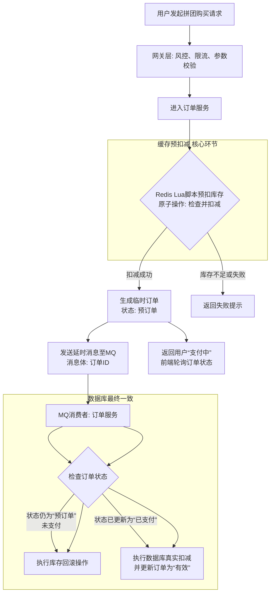
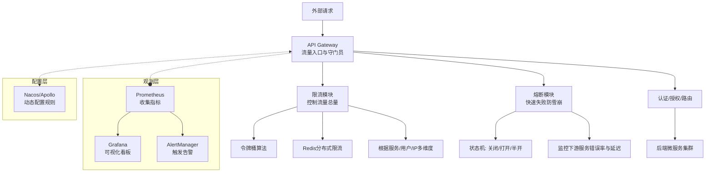

好的，作为资深Java开发工程师，我将针对这两个非常具有代表性的项目问题进行深度剖析和解答。这类问题考察的是如何将理论知识应用于复杂的实际业务场景。

---

## 一、仿拼多多拼团项目

### 1. 如何保证分布式环境下库存扣减的强一致性？

这是一个典型的“高并发读 & 高并发写”场景，绝对不能使用简单的 `update stock set stock = stock - 1 where product_id = xx and stock > 0`，因为在超高并发下，会大量超卖。

**解决方案：采用“缓存预减 + 异步落库 + 最终一致性”的柔性事务方案，而非强一致性方案。**

#### **核心架构与流程**



**详细步骤解析：**

1.  **预扣库存 (Cache Layer, 高性能)**
    - **动作**： 在用户下单时，首先在 **Redis** 中执行库存扣减。拼团商品的初始库存会在活动开始前从 DB 加载到 Redis。
    - **技术关键**： 使用 **Redis Lua 脚本**执行原子操作。脚本逻辑包括：`判断库存是否大于0` -> `扣减库存` -> `记录扣减日志`。这保证了“判断+扣减”的原子性，避免并发超卖。
    - **结果**： 预扣成功，才允许用户进入支付流程；否则直接返回“库存不足”。

2.  **生成临时订单 (DB Layer)**
    - **动作**： 预扣成功后，在数据库中创建一个状态为 `预订单` 或 `待支付` 的订单记录。**此时库存数据（Redis）和订单数据（DB）是暂时不一致的**。

3.  **支付成功后的最终确认**
    - **动作**： 支付系统回调订单服务。回调逻辑：
        - 校验订单状态是否为 `预订单`。
        - 再次检查 Redis 中预扣库存是否成功（防篡改）。
        - 将订单状态更新为 `已支付`。
        - **此时可以异步通知库存服务，在DB中进行真实库存扣减**。因为Redis已扛住并发，DB压力减小，可以排队执行。

4.  **支付超时的补偿回滚 (最终一致性的保障)**
    - **动作**： 这是最关键的一步。在创建 `预订单` 后，向消息队列（如 RocketMQ）发送一条**延迟消息**（延迟时间例如15分钟，即支付超时时间）。
    - **消费端逻辑**： 延迟消息被消费时，检查订单状态。
        - 若订单仍是 `预订单`（未支付），则执行 **回滚库存** 操作：再次用 Lua 脚本将 Redis 中预扣的库存加回去。
        - 若订单已是 `已支付`，则忽略此消息。
    - **优点**： 通过MQ的可靠性保证了“最终要么扣减，要么回滚”，实现了数据的最终一致性。

**为什么这是最优解？**
- **性能**： 99% 的并发压力由 Redis 承担，数据库安然无恙。
- **一致性**： 通过 Lua 脚本保证原子扣减，通过延迟消息保证异常情况下的数据补偿，实现了高效的最终一致性。在电商场景中，只要保证最终不超卖，并且用户体验流畅（快速响应），这种柔性事务是比分布式事务（如XA/Seata）更优的选择。

---

### 2. 针对瞬时高并发流量，系统做了哪些限流或降级措施？

这是一个关于系统防护和可用性的问题。

**1. 限流措施：**
- **网关层限流**： 在 API 网关（如 Spring Cloud Gateway + Redis）上针对 `创建订单`、`查询商品` 等核心接口配置**全局分布式限流**。采用**令牌桶算法**，根据压测结果设置合理的 QPS 阈值，超出阈值的请求直接快速失败，返回“活动太火爆，请稍后再试”。
- **业务层限流**： 针对“库存查询”接口，可以使用 **Guava RateLimiter** 做单机限流，防止某个服务实例被压垮。
- **前端/客户端限流**：
    - **答题/验证码**： 在下单前弹出滑块验证或简单数学题，拉长用户操作时间，平滑请求曲线。这是拼多多、淘宝等公司的标配。
    - **按钮禁用**： 提交订单后，前端按钮立即变为禁用，防止用户重复提交。

**2. 降级措施：**
- **读服务降级**：
    - **核心读服务**： 如商品详情页服务，如果依赖的推荐服务、评论服务出现故障或高延迟，可以**熔断**这些非核心依赖，直接返回缓存数据或静态数据，保证主体流程可用。
    - **多级缓存**： 商品数据、库存数据在 Redis 中有备份。即使 DB 压力大，读服务依然可以对外提供有损服务。
- **写服务降级**：
    - **同步转异步**： 在极限压力下，可以将一些写操作（如记录日志、更新积分）异步化，先发到 MQ，后续再慢慢消费，确保核心下单链路畅通。
- **手动降级**： 在运维层面，准备**降级开关**（配置在 Apollo/Nacos 上）。在系统即将扛不住时，手动降级一些非核心功能，如关闭推荐、关闭排行榜更新等。

---

## 二、AI Agent项目

### 1. 在多轮对话场景中，如何管理Agent的上下文状态？

多轮对话的核心是**上下文管理**，即让Agent记住之前说过什么。

**解决方案：采用“Session管理 + 上下文窗口裁剪”的策略。**

1.  **Session会话管理**：
    - 为每个用户或每个对话线程创建一个唯一的 `SessionId`。
    - 将所有对话数据（`user_query`, `agent_response`, `timestamp`）以结构化的形式（例如，一个消息列表）持久化到外部存储中。**首选 Redis**，因为读写速度快，支持设置过期时间（TTL），可以自动清理过期会话。

2.  **上下文构建与传递**：
    - 当新的用户输入到来时，通过 `SessionId` 从 Redis 中获取最近 N 轮的对话历史。
    - 将这些历史对话信息，按照大模型（LLM）要求的**提示词模板**进行组装。例如：
        ```
        System: You are a helpful assistant.
        User: What's the weather like today?
        Assistant: It's sunny and warm.
        User: Should I bring an umbrella? <!-- 当前问题 -->
        ```
    - 将组装好的完整 Prompt 发送给 LLM，这样 LLM 就拥有了上下文信息来回答当前问题。

3.  **上下文窗口裁剪与总结**：
    - **问题**： LLM 的 Token 长度有限制（上下文窗口），无法容纳无限长的历史记录。
    - **解决方案**：
        - **滑动窗口**： 只保留最近 K 轮对话（例如，最近10轮），丢弃更早的记录。这是最简单有效的方法。
        - **增量总结**： 一种更高级的策略。当对话轮次很长时，可以启动一个后台任务，将超出窗口的**早期对话**内容用另一个 LLM 调用进行**总结提炼**，然后用一句总结性的话（如“用户之前咨询了关于编程语言选择的问题，并倾向于Python”）作为新的系统提示词，加入到上下文窗口的头部。这样既保留了长期记忆，又节省了 Token。

---

### 2. 如果Agent任务执行超时或失败，如何设计重试和补偿机制？

AI Agent 任务通常是**耗时且昂贵**的（LLM API调用费钱费时），设计健壮的重试与补偿机制至关重要。

**1. 重试机制：**
- **退避重试策略**： 对于因网络抖动、LLM服务端限流等导致的瞬时失败，必须采用**带指数退避的重试**。
    - 例如：第一次失败后等待 1s 重试，第二次失败后等待 2s，第三次等待 4s，以此类推，并设置最大重试次数（如3次）。
    - **目的**： 避免在服务端恢复时，瞬间又被大量重试请求打垮。
- **选择性重试**： **并非所有失败都值得重试**。需要根据错误类型决定：
    - **可重试错误**： 超时、5xx错误、速率限制（429）。
    - **不可重试错误**： 4xx错误（如认证失败、无效请求）、业务逻辑错误（如内容过滤驳回）。这些错误重试多少次都不会成功，应直接失败并记录日志告警。

**2. 补偿与后续处理机制：**
- **持久化与状态跟踪**： 所有发起的Agent任务都应在DB中有记录，并包含状态（`执行中`、`成功`、`失败`）。
- **异步任务队列**： 将Agent任务提交到**消息队列**（如RabbitMQ、RocketMQ）或专门的**异步任务框架**（如Celery）中执行。这是实现重试和补偿的基础。
- **失败回调与降级响应**：
    - 如果重试多次后依然失败，应将任务状态标记为`失败`。
    - 执行预设的**降级方案**。例如：
        - 回复一个默认话术：“服务有点忙，请稍后再试。”
        - 切换到一个更轻量、更稳定的备用模型（如从 GPT-4 降级到 GPT-3.5）。
        - 从缓存中返回一个历史相似问题的答案。
- **人工干预与告警**： 对于关键任务流程，记录详细的错误日志，并触发告警（钉钉、短信），通知开发或运维人员及时排查问题。

好的，作为资深Java开发工程师，我将对这两个问题进行深度解析，这不仅涉及技术实现，更关乎架构思想和底层原理。

---

## 一、微服务架构中，API网关的限流与熔断策略设计

在微服务架构中，API网关是所有流量的入口，是系统的“守门员”。在这里实施限流和熔断，是保证系统高可用的**第一道也是最重要的一道防线**。

### 核心策略设计

首先，我们通过一张图来全局理解网关如何协同其他组件构建全方位的防护体系：



**上图为整个防护体系的蓝图，下面我们深入限流与熔断的细节。**

### **1. 限流设计**

**目标**：控制每秒通过的请求数量（QPS/TPS），防止后端服务被突发流量打垮。

| 维度 | 具体策略与实现 |
| :--- | :--- |
| **全局维度** | **目的**：保护系统整体不被拖垮。<br/>- **实现**：在网关层配置全局限流，如整个网关集群每秒最多处理10万个请求。 |
| **服务维度** | **目的**：保护特定后端服务（如订单服务）。<br/>- **实现**：根据路由配置，对指向 `/order-service/**` 的路径进行限流。 |
| **用户维度** | **目的**：防止单一用户过度消耗资源（防刷API）。<br/>- **实现**：提取请求中的用户ID或Token，对其设置个人限流额度（如每秒5次）。 |
| **IP维度** | **目的**：防止恶意IP攻击。<br/>- **实现**：对来源IP进行限流，常用于防止爬虫或CC攻击。 |
| **并发维度** | **目的**：控制同一时间的并发请求数，防止服务线程池耗尽。<br/>- **实现**：使用信号量（Semaphore）机制。 |

**技术选型**：
- **算法**： **令牌桶算法**（允许一定程度的突发流量）或**漏桶算法**（平滑流量）。
- **单机限流**： **Google Guava 的 RateLimiter**（基于令牌桶）。
- **分布式限流**： **Redis + Lua 脚本**。利用Redis的高性能和Lua的原子性，在分布式环境下精确控制全局流量。这是生产环境最常用的方案。
- **网关集成**： 
    - **Spring Cloud Gateway**： 内置基于Redis的RequestRateLimiter过滤器。
    - **Nginx**： 通过 `ngx_http_limit_req_module` 模块实现漏桶算法限流。

### **2. 熔断设计**

**目标**：当某个下游服务响应缓慢或失败率过高时，自动切断对其的调用，直接快速失败，防止线程阻塞和故障蔓延（雪崩效应）。熔断器是一种状态机。

**三种状态**：
1.  **Closed（关闭状态）**： 请求正常转发到下游服务。同时，网关会持续**监控**下游的响应情况（错误率、响应时间）。
2.  **Open（打开状态）**： 当错误率超过阈值（如50%），或响应时间过长，熔断器**跳闸**，进入打开状态。所有针对该服务的请求，在网关层就直接被拦截并返回错误，不再向下游发送。**会设置一个睡眠期**。
3.  **Half-Open（半开状态）**： 睡眠期过后，熔断器进入半开状态。允许**少量试探请求**通过。如果这些请求成功，则认为下游服务已恢复，熔断器关闭；如果仍然失败，则熔断器再次打开，进入一个新的睡眠期。

**技术选型**：
- **Spring Cloud Gateway**： 可集成 **Resilience4j** 熔断器（比Hystrix更轻量、功能更全）。
- **Sentinel**： 阿里巴巴开源的流量控制组件，**同时提供了限流、熔断、系统自适应保护等功能**，与网关整合非常方便，是当前非常主流的选择。

### **最佳实践总结**
1.  **分层防御**： 网关做**全局**限流和熔断，各个微服务自身也**必须**具备限流和熔断能力（用于保护自己的下游依赖），形成多层次防护。
2.  **动态配置**： 将所有限流（阈值、桶大小）和熔断（错误率、睡眠时间）的规则配置在Nacos或Apollo中，**支持动态生效**，无需重启网关。
3.  **监控告警**： 任何限流和熔断事件都必须有清晰的日志和监控（Prometheus + Grafana），并触发告警（钉钉、短信），通知运维人员。
4.  **友好降级**： 触发限流或熔断后，应给客户端返回友好的提示信息（如“系统繁忙，请稍后重试”），而不是生硬的错误代码。

---

## 二、Java类加载机制与双亲委派模型破坏

### **1. Java类加载机制**

JVM把类的加载过程分为“加载”、“链接”、“初始化”三个阶段。

| 阶段 | 核心工作 |
| :--- | :--- |
| **加载** | 1. 通过类的全限定名获取其定义的**二进制字节流**。<br>2. 将这个字节流所代表的静态存储结构转换为**方法区的运行时数据结构**。<br>3. 在堆中生成一个代表这个类的 `java.lang.Class` 对象，作为方法区这些数据的访问入口。 |
| **链接** | **验证**： 确保字节流符合JVM规范，保证安全。<br>**准备**： 为**类变量**分配内存并设置初始零值（0, false, null等）。<br>**解析**： 将常量池内的符号引用转换为直接引用。 |
| **初始化** | 执行类构造器 `<clinit>()` 方法的过程，真正为**类变量**赋代码中设定的值，并执行静态代码块。 |

**类加载器层次结构**：
- **Bootstrap ClassLoader**： 加载 `JAVA_HOME/lib` 下的核心库（如rt.jar），由C++实现，是JVM的一部分。
- **Extension ClassLoader**： 加载 `JAVA_HOME/lib/ext` 目录下的扩展库。
- **Application ClassLoader**： 加载用户类路径（ClassPath）上的类库。是程序中默认的类加载器。
- **Custom ClassLoader**： 用户自定义的类加载器。

### **2. 双亲委派模型**

**工作流程**：
1.  一个类加载器收到类加载请求。
2.  它首先不会自己去尝试加载，而是将这个请求**委派给父类加载器**去完成。
3.  每一层次的类加载器都是如此，因此所有的加载请求最终都应该传送到顶层的启动类加载器。
4.  只有当**父加载器反馈自己无法完成**这个加载请求（它的搜索范围中没有找到所需的类）时，子加载器才会尝试自己去加载。

**优势**：
1.  **安全性**： 防止核心Java API被随意篡改。比如，用户自定义一个 `java.lang.String` 类，双亲委派机制会最终由Bootstrap加载器去加载核心的 `String`类，而不会加载用户自定义的，从而保证了安全。
2.  **避免重复加载**： 保证了类的全局唯一性。当一个类被父加载器加载过后，子加载器就没有必要也没有机会再加载一次。

### **3. 破坏双亲委派模型的场景**

双亲委派模型并非强制约束，而是Java设计者推荐的一种模式。历史上出现过几次必要的“破坏”：

1.  **SPI机制（JDBC等）**： 
    - **问题**： Java核心库（如JDBC API）在 `rt.jar` 中由Bootstrap加载器加载，但其实现（如mysql-connector.jar）在ClassPath下，应由App加载器加载。但Bootstrap加载器无法“看见”也无法加载App加载器中的类，这就导致了API无法找到实现。
    - **破坏**： 引入了**线程上下文类加载器**。父加载器（Bootstrap）可以请求子加载器（App）去完成类加载动作，这是一种**逆向的委托**。`ServiceLoader.load(Driver.class)` 就是用当前线程的上下文类加载器（默认为AppClassLoader）去加载实现类的。

2.  **热部署、热替换、OSGi**：
    - **问题**： 像OSGi这样的模块化框架，每个模块（Bundle）都需要有自己的类加载器。它希望实现的是：**同一个库的不同版本可以共存**；**可以动态地安装、卸载模块**。
    - **破坏**： OSGi实现了一套**网状的类加载器结构**，而不是严格的父子层次结构。当需要一个类时，OSGi会按规则（导入导出定义、Bundle依赖关系）去寻找哪个类加载器来加载它，而不仅仅是委派给父加载器。这完全颠覆了双亲委派模型。

3.  **Tomcat等Web应用服务器**：
    - **问题**： Tomcat需要部署多个Web应用（WAR包），这些应用可能依赖**同一个库的不同版本**（如Spring 4和Spring 5）。必须保证它们之间的类库隔离且互不影响。
    - **破坏**：
        - Tomcat为每个Web应用创建一个独立的 **WebAppClassLoader**。
        - 加载顺序上，它**首先尝试自己加载**（优先加载 `/WEB-INF/` 下的类），如果加载不到，再委派给父加载器（SharedClassLoader）。**这恰恰是双亲委派的反方向**。
        - 这样设计，不同应用的同名类库就可以由各自的类加载器加载，实现了应用级别的隔离。

**总结**： 破坏双亲委派模型，本质上都是为了解决一些**逆向的类加载需求**（父加载器需要委托子加载器）或**复杂的隔离需求**（版本隔离、应用隔离）。它体现了设计原则与实际问题之间的权衡。
