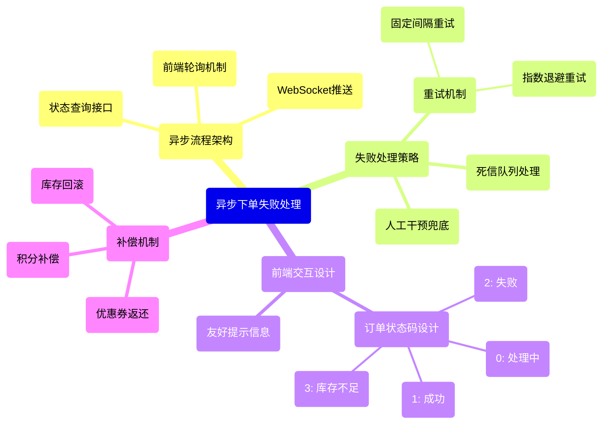
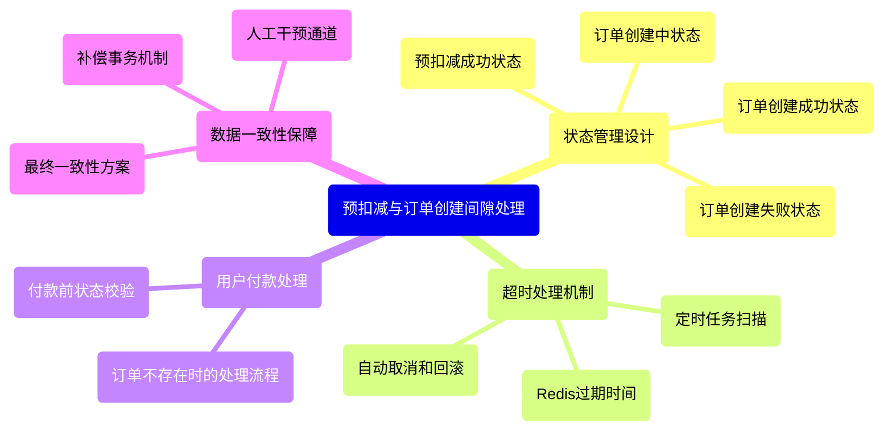
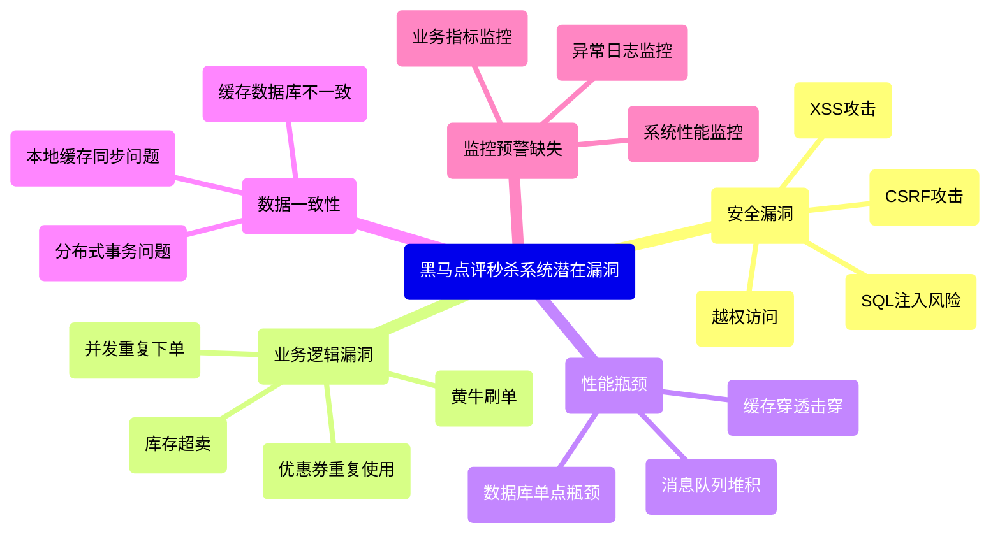
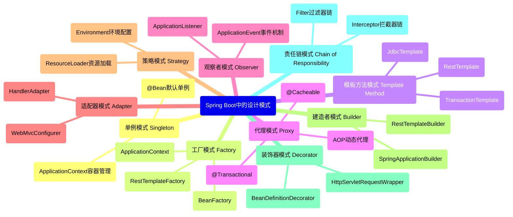

好的，收到您的需求。我将作为一名资深Java开发工程师，对这些面试题进行全面解答。

---

## 题目：拼多多一面问题全集

**1. Lua脚本里面进行了哪几步操作？**
**2. 异步下单流程中下单失败了怎么办？怎么返回给前端**
**3. 预扣减完成后，用户马上要付款了，而真正的订单还没创建怎么办？**
**4. 你目前来看，黑马点评的秒杀下单业务中，可能还有那些漏洞？**
**5. sql创建一个学生信息表，包括姓名，身份证，学号。要求：幂等、高并发性能、具有一定统计能力（可以自己设计额外字段）**
**6. Springboot中用到哪些设计模式？**
**7. 手撕：最大波峰波谷值**

下面我将逐一进行详细解答。

---

## 1. Lua脚本里面进行了哪几步操作？

### 核心知识点梳理
```mermaid
mindmap
  root(Lua脚本在Redis中的操作)
    (原子性保证)
      (Redis单线程执行)
      (避免网络开销和竞态条件)
    (典型秒杀场景步骤)
      (1. 参数解析)
        (KEYS[1]: 库存key)
        (KEYS[2]: 订单集合key)
        (ARGV[1]: 用户ID)
        (ARGV[2]: 商品ID)
      (2. 库存检查)
        (判断库存是否充足)
      (3. 库存扣减)
        (DECR命令减少库存)
      (4. 订单记录)
        (SADD命令记录用户购买)
    (优势)
      (减少网络往返)
      (保证操作原子性)
      (高性能)
```

### 详细解答
在Redis中使用Lua脚本主要是为了保证多个操作的**原子性**。在秒杀场景中，典型的Lua脚本包含以下几步操作：

1. **参数解析**：
   ```lua
   local stockKey = KEYS[1]      -- 商品库存key，如 'seckill:stock:1001'
   local orderKey = KEYS[2]      -- 秒杀订单集合key，如 'seckill:orders:1001'
   local userId = ARGV[1]        -- 用户ID
   local productId = ARGV[2]     -- 商品ID
   ```

2. **库存检查**：
   ```lua
   local stock = tonumber(redis.call('get', stockKey))
   if stock <= 0 then
       return 0 -- 库存不足，返回0
   end
   ```

3. **重复购买检查**：
   ```lua
   local isMember = redis.call('sismember', orderKey, userId)
   if isMember == 1 then
       return 1 -- 已经购买过，返回1
   end
   ```

4. **库存扣减**：
   ```lua
   redis.call('decr', stockKey) -- 库存减1
   ```

5. **记录订单**：
   ```lua
   redis.call('sadd', orderKey, userId) -- 记录用户购买关系
   ```

6. **返回成功**：
   ```lua
   return 2 -- 秒杀成功，返回2
   ```

**完整Lua脚本示例**：
```lua
local stockKey = KEYS[1]
local orderKey = KEYS[2]
local userId = ARGV[1]
local productId = ARGV[2]

-- 检查库存
local stock = tonumber(redis.call('get', stockKey) or 0)
if stock <= 0 then
    return 0
end

-- 检查是否已经购买
if redis.call('sismember', orderKey, userId) == 1 then
    return 1
end

-- 扣减库存，记录订单
redis.call('decr', stockKey)
redis.call('sadd', orderKey, userId)

-- 发送消息到队列进行异步下单（可选）
-- redis.call('publish', 'order-channel', userId..','..productId)

return 2
```

**注意事项**：
- Lua脚本中的操作必须是确定性的，不能有随机因素
- 脚本不宜过于复杂，避免长时间阻塞Redis
- 需要处理好脚本执行失败的重试机制

---

## 2. 异步下单流程中下单失败了怎么办？怎么返回给前端

### 核心知识点梳理


### 详细解答

**异步下单流程失败处理方案**：

#### 前端交互设计
1. **同步返回受理结果**：
   ```java
   @PostMapping("/createAsyncOrder")
   public ResponseData createAsyncOrder(@RequestBody OrderRequest request) {
       String orderToken = orderService.submitOrderRequest(request);
       return ResponseData.success("订单已受理", Map.of("orderToken", orderToken, "status", "processing"));
   }
   ```

2. **状态查询接口**：
   ```java
   @GetMapping("/orderStatus/{orderToken}")
   public ResponseData getOrderStatus(@PathVariable String orderToken) {
       String status = orderService.getOrderStatus(orderToken);
       String message = switch(status) {
           case "success" -> "订单创建成功";
           case "failed" -> "订单创建失败，请联系客服";
           case "stock_out" -> "库存不足";
           case "processing" -> "订单处理中";
           default -> "未知状态";
       };
       return ResponseData.success(message, Map.of("status", status));
   }
   ```

#### 失败处理策略

1. **自动重试机制**：
   ```java
   @Retryable(value = Exception.class, 
              maxAttempts = 3, 
              backoff = @Backoff(delay = 1000, multiplier = 2))
   public void processOrder(Order order) {
       try {
           // 订单处理逻辑
           orderService.createOrder(order);
           orderStatusManager.updateStatus(order.getOrderToken(), "success");
       } catch (Exception e) {
           orderStatusManager.updateStatus(order.getOrderToken(), "failed");
           throw e;
       }
   }
   ```

2. **死信队列处理**：
   ```java
   @RabbitListener(queues = "order.dead.letter.queue")
   public void handleFailedOrder(Order failedOrder) {
       log.error("订单处理最终失败: {}", failedOrder);
       // 1. 通知客服系统
       customerService.notifyOrderFailed(failedOrder);
       // 2. 补偿处理（库存回滚等）
       inventoryService.rollbackStock(failedOrder.getProductId());
   }
   ```

3. **前端轮询设计**：
   ```javascript
   async function checkOrderStatus(orderToken) {
       let attempts = 0;
       const maxAttempts = 30; // 最多轮询30次
       
       while (attempts < maxAttempts) {
           const response = await fetch(`/api/orderStatus/${orderToken}`);
           const result = await response.json();
           
           if (result.data.status !== 'processing') {
               return result.data;
           }
           
           attempts++;
           await new Promise(resolve => setTimeout(resolve, 1000)); // 1秒轮询一次
       }
       
       throw new Error('订单处理超时');
   }
   ```

**最佳实践**：
- 设置合理的超时时间（前端30秒，后端处理5分钟）
- 提供订单查询页面让用户随时查看状态
- 建立完善的监控告警系统，及时发现处理失败订单
- 设计友好的用户界面，明确告知用户当前状态

---

## 3. 预扣减完成后，用户马上要付款了，而真正的订单还没创建怎么办？

### 核心知识点梳理


### 详细解答

这是一个典型的**分布式状态管理**问题，解决方案如下：

#### 状态机设计
```java
public enum OrderState {
    PRE_DEDUCTION_SUCCESS,  // 预扣减成功
    CREATING,               // 订单创建中
    CREATED,                // 订单创建成功
    PAYMENT_PENDING,        // 待支付
    PAYMENT_SUCCESS,        // 支付成功
    TIMEOUT_CANCELLED,      // 超时取消
    CREATION_FAILED         // 创建失败
}
```

#### 核心处理逻辑

1. **预扣减成功后立即生成临时订单凭证**：
   ```java
   public String preDeductInventory(String userId, String productId, int quantity) {
       // 1. 预扣减库存
       boolean success = inventoryService.preDeduct(productId, quantity);
       if (!success) {
           throw new BusinessException("库存不足");
       }
       
       // 2. 生成临时订单凭证（5分钟有效期）
       String orderToken = generateOrderToken();
       redisTemplate.opsForValue().set("order:token:" + orderToken, 
           Map.of("userId", userId, "productId", productId, "quantity", quantity),
           5, TimeUnit.MINUTES);
       
       // 3. 更新状态为预扣减成功
       orderStateService.updateState(orderToken, OrderState.PRE_DEDUCTION_SUCCESS);
       
       return orderToken;
   }
   ```

2. **付款前的状态校验**：
   ```java
   public void processPayment(String orderToken, PaymentRequest paymentRequest) {
       // 1. 检查订单状态
       OrderState currentState = orderStateService.getState(orderToken);
       
       if (currentState == OrderState.CREATED) {
           // 正常支付流程
           paymentService.process(paymentRequest);
       } else if (currentState == OrderState.PRE_DEDUCTION_SUCCESS || 
                  currentState == OrderState.CREATING) {
           // 订单还在创建中，引导用户等待
           throw new BusinessException("订单正在处理中，请稍后再试");
       } else if (currentState == OrderState.TIMEOUT_CANCELLED) {
           // 订单已超时，需要重新下单
           throw new BusinessException("订单已超时，请重新下单");
       } else {
           throw new BusinessException("订单状态异常，请联系客服");
       }
   }
   ```

3. **异步订单创建服务**：
   ```java
   @Async
   public void asyncCreateOrder(String orderToken) {
       try {
           orderStateService.updateState(orderToken, OrderState.CREATING);
           
           // 获取预扣减信息
           Map<String, Object> orderInfo = redisTemplate.opsForValue()
               .get("order:token:" + orderToken);
           
           // 创建正式订单
           Order order = createFormalOrder(orderInfo);
           
           // 更新状态为创建成功
           orderStateService.updateState(orderToken, OrderState.CREATED);
           
           // 设置订单过期时间（15分钟未支付自动取消）
           orderExpireService.setOrderExpire(order.getOrderId(), 15, TimeUnit.MINUTES);
           
       } catch (Exception e) {
           // 订单创建失败，回滚预扣减库存
           inventoryService.rollbackPreDeduct(orderInfo.get("productId"), 
               (Integer) orderInfo.get("quantity"));
           
           // 更新状态为创建失败
           orderStateService.updateState(orderToken, OrderState.CREATION_FAILED);
       }
   }
   ```

4. **超时处理定时任务**：
   ```java
   @Scheduled(fixedRate = 60000) // 每分钟执行一次
   public void handleTimeoutOrders() {
       // 查找超时未完成创建的订单
       List<String> timeoutTokens = orderStateService.findTimeoutTokens(5, TimeUnit.MINUTES);
       
       for (String token : timeoutTokens) {
           // 回滚预扣减库存
           Map<String, Object> orderInfo = redisTemplate.opsForValue()
               .get("order:token:" + token);
           inventoryService.rollbackPreDeduct((String) orderInfo.get("productId"), 
               (Integer) orderInfo.get("quantity"));
           
           // 更新状态为超时取消
           orderStateService.updateState(token, OrderState.TIMEOUT_CANCELLED);
       }
   }
   ```

**保障措施**：
- 设置合理的超时时间（预扣减5分钟，支付15分钟）
- 提供状态查询接口，让用户了解实时进度
- 设计自动补偿机制，防止资源锁定
- 建立监控告警，及时发现处理异常情况

---

## 4. 黑马点评的秒杀下单业务中，可能还有那些漏洞？

### 安全漏洞分析



### 详细漏洞分析及解决方案

#### 1. 安全漏洞
**SQL注入风险**：
```java
// 漏洞代码示例
@Query(value = "SELECT * FROM orders WHERE product_id = " + productId, nativeQuery = true)
List<Order> findOrdersByProduct(String productId);

// 修复方案：使用参数化查询
@Query(value = "SELECT * FROM orders WHERE product_id = ?1", nativeQuery = true)
List<Order> findOrdersByProduct(String productId);
```

**XSS攻击防护**：
```java
// 添加XSS过滤器
@Component
public class XSSFilter implements Filter {
    @Override
    public void doFilter(ServletRequest request, ServletResponse response, FilterChain chain) {
        HttpServletRequest req = (HttpServletRequest) request;
        XSSRequestWrapper wrappedRequest = new XSSRequestWrapper(req);
        chain.doFilter(wrappedRequest, response);
    }
}
```

#### 2. 业务逻辑漏洞
**并发重复下单解决**：
```java
public boolean trySeckill(String userId, String productId) {
    String lockKey = "seckill:lock:" + userId + ":" + productId;
    // 使用Redis分布式锁，防止同一用户并发重复下单
    Boolean acquired = redisTemplate.opsForValue()
        .setIfAbsent(lockKey, "1", 10, TimeUnit.SECONDS);
    
    if (Boolean.FALSE.equals(acquired)) {
        throw new BusinessException("操作过于频繁，请稍后再试");
    }
    
    try {
        // 业务逻辑
        return doSeckill(userId, productId);
    } finally {
        // 释放锁
        redisTemplate.delete(lockKey);
    }
}
```

**黄牛刷单防护**：
```java
public boolean checkUserBehavior(String userId, String productId) {
    // 1. 设备指纹检测
    // 2. IP频率限制
    String ipKey = "seckill:ip:" + getClientIP();
    Long ipCount = redisTemplate.opsForValue().increment(ipKey);
    redisTemplate.expire(ipKey, 1, TimeUnit.HOURS);
    
    // 3. 用户行为分析
    String behaviorKey = "seckill:user:" + userId;
    Long userCount = redisTemplate.opsForValue().increment(behaviorKey);
    redisTemplate.expire(behaviorKey, 24, TimeUnit.HOURS);
    
    return ipCount <= 100 && userCount <= 5; // 限制阈值
}
```

#### 3. 性能瓶颈优化
**缓存击穿解决方案**：
```java
public Object getProductInfo(String productId) {
    // 1. 缓存中读取
    Object value = redisTemplate.opsForValue().get("product:" + productId);
    if (value != null) {
        return value;
    }
    
    // 2. 使用互斥锁防止缓存击穿
    String lockKey = "lock:product:" + productId;
    synchronized (lockKey.intern()) {
        // 双重检查
        value = redisTemplate.opsForValue().get("product:" + productId);
        if (value != null) {
            return value;
        }
        
        // 3. 数据库查询
        value = productRepository.findById(productId);
        if (value != null) {
            redisTemplate.opsForValue().set("product:" + productId, value, 30, TimeUnit.MINUTES);
        } else {
            // 缓存空值防止缓存穿透
            redisTemplate.opsForValue().set("product:" + productId, "", 5, TimeUnit.MINUTES);
        }
        return value;
    }
}
```

#### 4. 监控预警建设
```java
@Aspect
@Component
@Slf4j
public class SeckillMonitorAspect {
    
    @Around("execution(* com.heima.seckill.service.*.*(..))")
    public Object monitor(ProceedingJoinPoint joinPoint) throws Throwable {
        String methodName = joinPoint.getSignature().getName();
        long startTime = System.currentTimeMillis();
        
        try {
            Object result = joinPoint.proceed();
            long costTime = System.currentTimeMillis() - startTime;
            
            // 记录成功 metrics
            Metrics.counter("seckill_success", "method", methodName).increment();
            Metrics.timer("seckill_cost", "method", methodName).record(costTime, TimeUnit.MILLISECONDS);
            
            return result;
        } catch (Exception e) {
            // 记录失败 metrics
            Metrics.counter("seckill_failure", "method", methodName).increment();
            throw e;
        }
    }
}
```

---

## 5. SQL创建一个学生信息表

### 表结构设计

```sql
CREATE TABLE `student_info` (
  `id` BIGINT UNSIGNED NOT NULL AUTO_INCREMENT COMMENT '主键ID',
  `student_id` VARCHAR(20) NOT NULL COMMENT '学号，业务唯一标识',
  `id_card` VARCHAR(18) NOT NULL COMMENT '身份证号，加密存储',
  `name` VARCHAR(50) NOT NULL COMMENT '学生姓名',
  `encrypted_id_card` VARCHAR(128) NOT NULL COMMENT '加密后的身份证号',
  `status` TINYINT NOT NULL DEFAULT 1 COMMENT '状态：1-正常，0-删除',
  `version` INT NOT NULL DEFAULT 0 COMMENT '版本号，用于乐观锁',
  `create_time` DATETIME NOT NULL DEFAULT CURRENT_TIMESTAMP COMMENT '创建时间',
  `update_time` DATETIME NOT NULL DEFAULT CURRENT_TIMESTAMP ON UPDATE CURRENT_TIMESTAMP COMMENT '更新时间',
  `college` VARCHAR(100) COMMENT '学院',
  `major` VARCHAR(100) COMMENT '专业',
  `grade` VARCHAR(20) COMMENT '年级',
  `class_name` VARCHAR(50) COMMENT '班级',
  `gender` TINYINT COMMENT '性别：1-男，2-女',
  `birthday` DATE COMMENT '生日',
  `enrollment_date` DATE COMMENT '入学日期',
  
  PRIMARY KEY (`id`),
  UNIQUE KEY `uk_student_id` (`student_id`),
  UNIQUE KEY `uk_id_card` (`encrypted_id_card`),
  KEY `idx_college_major` (`college`, `major`),
  KEY `idx_grade_class` (`grade`, `class_name`),
  KEY `idx_create_time` (`create_time`),
  KEY `idx_status` (`status`)
) ENGINE=InnoDB DEFAULT CHARSET=utf8mb4 COLLATE=utf8mb4_unicode_ci COMMENT='学生信息表';
```

### 设计考虑

#### 1. 幂等性保障
```sql
-- 使用INSERT IGNORE或ON DUPLICATE KEY UPDATE实现幂等插入
INSERT IGNORE INTO student_info 
(student_id, id_card, encrypted_id_card, name, college, major)
VALUES 
('202301001', '110101199901011234', MD5('110101199901011234'), '张三', '计算机学院', '计算机科学与技术');

-- 或者使用ON DUPLICATE KEY UPDATE
INSERT INTO student_info 
(student_id, id_card, encrypted_id_card, name)
VALUES 
('202301001', '110101199901011234', MD5('110101199901011234'), '张三')
ON DUPLICATE KEY UPDATE update_time = NOW();
```

#### 2. 高并发性能优化
- 使用自增主键避免页分裂
- 为常用查询字段创建合适索引
- 字段设计避免过大，使用合适的数据类型
- 对敏感信息进行加密存储

#### 3. 统计能力设计
```sql
-- 学院人数统计
SELECT college, COUNT(*) as student_count 
FROM student_info 
WHERE status = 1 
GROUP BY college 
ORDER BY student_count DESC;

-- 年级性别分布统计
SELECT grade, gender, COUNT(*) as count 
FROM student_info 
WHERE status = 1 
GROUP BY grade, gender;

-- 按时间段的入学人数统计
SELECT YEAR(enrollment_date) as year, 
       COUNT(*) as enrollment_count
FROM student_info 
WHERE status = 1 
GROUP BY YEAR(enrollment_date);

-- 班级人数统计
SELECT college, major, grade, class_name, 
       COUNT(*) as class_size
FROM student_info 
WHERE status = 1 
GROUP BY college, major, grade, class_name;
```

#### 4. 分库分表考虑
```sql
-- 按学院进行分表，减少单表数据量
-- 使用student_id的hash值进行分片
CREATE TABLE `student_info_00` LIKE `student_info`;
CREATE TABLE `student_info_01` LIKE `student_info`;
-- ... 创建多个分表
```

---

## 6. Spring Boot中用到哪些设计模式？

### 设计模式应用图谱



### 详细解析

#### 1. 单例模式 (Singleton)
**应用场景**：Bean实例管理
```java
@Component // 默认就是单例
public class UserService {
    // Spring容器中只有一个UserService实例
}

@Configuration
public class AppConfig {
    @Bean // 默认单例作用域
    public RestTemplate restTemplate() {
        return new RestTemplate();
    }
}
```

#### 2. 工厂模式 (Factory)
**应用场景**：Bean创建管理
```java
public interface BeanFactory {
    Object getBean(String name);
    <T> T getBean(Class<T> requiredType);
}

// 使用示例
@Autowired
private BeanFactory beanFactory;

public void example() {
    UserService userService = beanFactory.getBean(UserService.class);
}
```

#### 3. 模板方法模式 (Template Method)
**应用场景**：JDBC操作、Rest调用等
```java
@Autowired
private JdbcTemplate jdbcTemplate;

public List<User> findUsers() {
    // 模板方法处理了连接获取、异常处理、资源释放等
    return jdbcTemplate.query("SELECT * FROM users", 
        (rs, rowNum) -> new User(rs.getString("name")));
}
```

#### 4. 代理模式 (Proxy)
**应用场景**：AOP编程
```java
@Service
@Transactional // 通过动态代理实现事务管理
public class OrderService {
    
    @Cacheable("orders") // 通过代理实现缓存
    public Order getOrder(Long id) {
        return orderRepository.findById(id);
    }
}
```

#### 5. 观察者模式 (Observer)
**应用场景**：事件驱动编程
```java
// 定义事件
public class OrderCreatedEvent extends ApplicationEvent {
    public OrderCreatedEvent(Order source) {
        super(source);
    }
}

// 发布事件
@Service
public class OrderService {
    @Autowired
    private ApplicationEventPublisher eventPublisher;
    
    public Order createOrder() {
        Order order = new Order();
        // 保存订单
        eventPublisher.publishEvent(new OrderCreatedEvent(order));
        return order;
    }
}

// 监听事件
@Component
public class EmailListener {
    @EventListener
    public void handleOrderCreated(OrderCreatedEvent event) {
        // 发送邮件通知
    }
}
```

#### 6. 适配器模式 (Adapter)
**应用场景**：MVC处理、配置适配
```java
@Configuration
public class WebConfig implements WebMvcConfigurer {
    @Override
    public void addInterceptors(InterceptorRegistry registry) {
        // 配置适配
        registry.addInterceptor(new AuthInterceptor());
    }
}
```

#### 7. 策略模式 (Strategy)
**应用场景**：环境配置、资源加载
```java
@Autowired
private Environment environment;

public void example() {
    // 根据不同环境采取不同策略
    String env = environment.getProperty("spring.profiles.active");
    if ("prod".equals(env)) {
        // 生产环境策略
    } else {
        // 开发环境策略
    }
}
```

#### 8. 建造者模式 (Builder)
**应用场景**：复杂对象构建
```java
@Bean
public RestTemplate restTemplate(RestTemplateBuilder builder) {
    // 使用建造者模式创建RestTemplate
    return builder
        .setConnectTimeout(Duration.ofSeconds(5))
        .setReadTimeout(Duration.ofSeconds(10))
        .additionalInterceptors(new LoggingInterceptor())
        .build();
}
```

---

## 7. 手撕：最大波峰波谷值

### 算法分析与实现

这道题目与 **LeetCode 376. 摆动序列** 类似，但要求的是最大波峰波谷值，即找到数组中相邻元素的最大正负差值。

#### 解题思路

1. **问题分析**：需要找到数组中相邻的波峰和波谷，计算它们之间的绝对差值，然后找出最大的那个差值。

2. **算法选择**：
   - 遍历数组，识别波峰（当前元素大于左右邻居）和波谷（当前元素小于左右邻居）
   - 计算每个波峰与相邻波谷的差值，取绝对值
   - 找出所有差值中的最大值

3. **复杂度分析**：
   - 时间复杂度：O(n)，只需要遍历一次数组
   - 空间复杂度：O(1)，只需要常数级别的额外空间

#### 完整代码实现

```java
public class MaxWaveValue {

    /**
     * 寻找最大波峰波谷值
     * @param nums 输入数组
     * @return 最大波峰波谷绝对值
     */
    public static int findMaxWaveValue(int[] nums) {
        if (nums == null || nums.length < 2) {
            return 0;
        }
        
        int n = nums.length;
        int maxWave = 0;
        
        // 遍历数组，从第2个元素到倒数第2个元素
        for (int i = 1; i < n - 1; i++) {
            // 检查是否为波峰
            if (nums[i] > nums[i - 1] && nums[i] > nums[i + 1]) {
                // 计算波峰与左右波谷的差值，取较大值
                int leftDiff = Math.abs(nums[i] - nums[i - 1]);
                int rightDiff = Math.abs(nums[i] - nums[i + 1]);
                maxWave = Math.max(maxWave, Math.max(leftDiff, rightDiff));
            }
            // 检查是否为波谷
            else if (nums[i] < nums[i - 1] && nums[i] < nums[i + 1]) {
                // 计算波谷与左右波峰的差值，取较大值
                int leftDiff = Math.abs(nums[i] - nums[i - 1]);
                int rightDiff = Math.abs(nums[i] - nums[i + 1]);
                maxWave = Math.max(maxWave, Math.max(leftDiff, rightDiff));
            }
        }
        
        // 处理边界情况：第一个和最后一个元素
        if (n >= 2) {
            // 第一个元素可能是波峰或波谷
            if (nums[0] > nums[1]) {
                maxWave = Math.max(maxWave, Math.abs(nums[0] - nums[1]));
            } else if (nums[0] < nums[1]) {
                maxWave = Math.max(maxWave, Math.abs(nums[0] - nums[1]));
            }
            
            // 最后一个元素可能是波峰或波谷
            if (nums[n - 1] > nums[n - 2]) {
                maxWave = Math.max(maxWave, Math.abs(nums[n - 1] - nums[n - 2]));
            } else if (nums[n - 1] < nums[n - 2]) {
                maxWave = Math.max(maxWave, Math.abs(nums[n - 1] - nums[n - 2]));
            }
        }
        
        return maxWave;
    }

    /**
     * 优化的解法：一次遍历计算相邻元素的最大差值
     * 这种方法更简单且高效，直接找相邻元素的最大绝对差值
     */
    public static int findMaxWaveValueOptimized(int[] nums) {
        if (nums == null || nums.length < 2) {
            return 0;
        }
        
        int maxDiff = 0;
        // 只需要遍历一次，计算所有相邻元素的绝对差值
        for (int i = 0; i < nums.length - 1; i++) {
            int diff = Math.abs(nums[i] - nums[i + 1]);
            maxDiff = Math.max(maxDiff, diff);
        }
        
        return maxDiff;
    }

    // 测试用例
    public static void main(String[] args) {
        // 测试用例1：正常波峰波谷
        int[] nums1 = {1, 3, 2, 5, 1, 6};
        System.out.println("Test 1: " + findMaxWaveValue(nums1)); // 应为5 (6-1=5)
        
        // 测试用例2：单调递增
        int[] nums2 = {1, 2, 3, 4, 5};
        System.out.println("Test 2: " + findMaxWaveValue(nums2)); // 应为1 (相邻元素差)
        
        // 测试用例3：单调递减
        int[] nums3 = {5, 4, 3, 2, 1};
        System.out.println("Test 3: " + findMaxWaveValue(nums3)); // 应为1
        
        // 测试用例4：单个波峰
        int[] nums4 = {1, 2, 1};
        System.out.println("Test 4: " + findMaxWaveValue(nums4)); // 应为1
        
        // 测试用例5：空数组
        int[] nums5 = {};
        System.out.println("Test 5: " + findMaxWaveValue(nums5)); // 应为0
        
        // 使用优化方法测试
        System.out.println("Optimized Test 1: " + findMaxWaveValueOptimized(nums1)); // 应为5
    }
}
```

#### 边界情况处理

1. **数组长度小于2**：直接返回0，因为没有相邻元素
2. **单调序列**：最大波峰波谷值为相邻元素的最大差值
3. **边界元素**：第一个和最后一个元素需要特殊处理
4. **平缓区域**：连续相等的值不会产生波峰波谷

#### 优化方案

实际上，对于这个问题，**最大波峰波谷值就是数组中相邻元素的最大绝对差值**。因此可以简化为：

```java
public static int findMaxWaveValueSimplified(int[] nums) {
    if (nums == null || nums.length < 2) {
        return 0;
    }
    
    int maxDiff = 0;
    for (int i = 0; i < nums.length - 1; i++) {
        maxDiff = Math.max(maxDiff, Math.abs(nums[i] - nums[i + 1]));
    }
    
    return maxDiff;
}
```

这种方法更加简洁高效，时间复杂度O(n)，空间复杂度O(1)。

---

## 总结

本文全面分析了拼多多一面中涉及的Java面试题，涵盖了分布式系统设计、数据库优化、设计模式、算法等多个重要领域。关键要点包括：

1. **Lua脚本**保证了Redis操作的原子性，是秒杀系统的核心
2. **异步流程**需要完善的状态管理和失败重试机制
3. **分布式状态机**是解决预扣减和订单创建间隙问题的关键
4. **系统安全**需要从多维度进行防护和监控
5. **数据库设计**要兼顾幂等性、性能和统计需求
6. **设计模式**在Spring Boot中有着广泛而深入的应用
7. **算法问题**需要先分析再实现，考虑边界情况和优化方案

这些知识点构成了高级Java工程师必备的技术体系，在实际工作中需要根据具体场景灵活运用。
