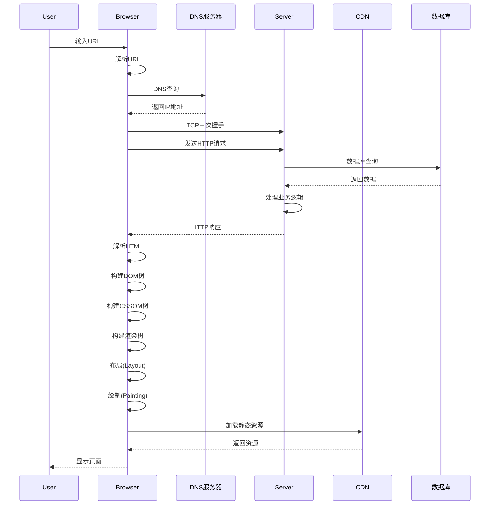
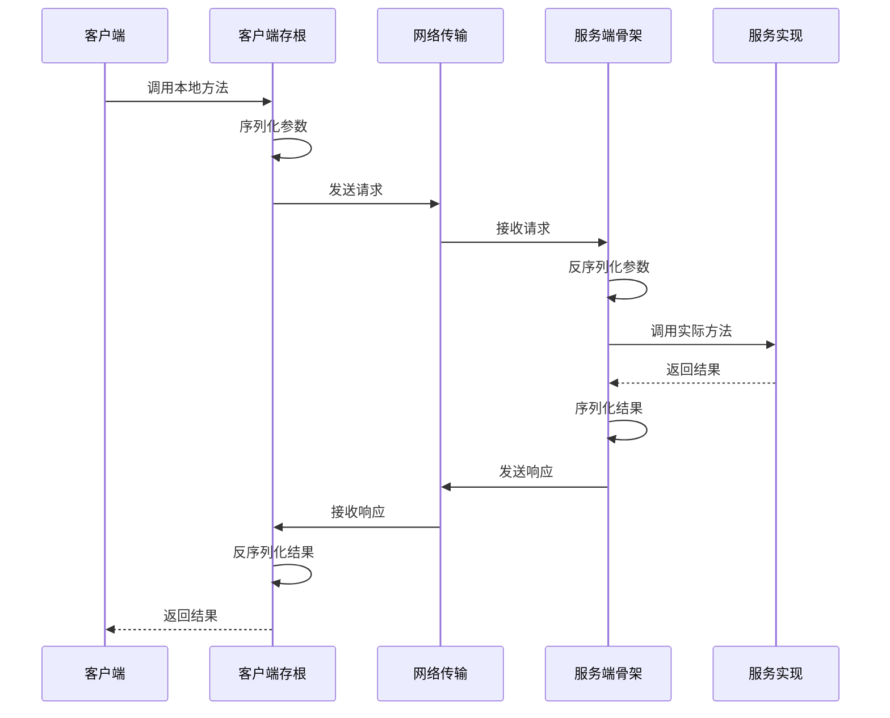
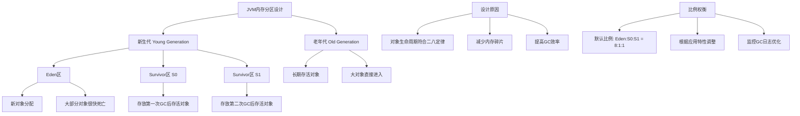

可以这么理解这个问题👇

---

### 1️⃣ 先搞清楚命令怎么启动的

启动一个 `jar` 包通常是这样的命令：

```bash
java -jar myapp.jar --spring.profiles.active=prod >app.log 2>&1 &
```

这个命令在 **执行时会创建一个新的进程**，进程的程序是 `java`，命令行里包含 `-jar myapp.jar`。

> 也就是说：**jar 是由 Java 进程运行的**，不再属于调用它的那个 shell。

---

### 2️⃣ 如何找出它是从哪里启动的

如果你只看到命令文本，但不知道是谁执行的，可以从以下角度排查：

| 方法                                | 说明                                                                  |                               |
| --------------------------------- | ------------------------------------------------------------------- | ----------------------------- |
| \`ps -ef                          | grep java\`                                                         | 查找所有正在运行的 java 进程，确认 PID 和命令行 |
| `pstree -ap <PID>`                | 查看该 PID 的父进程树，能看到它是被哪个进程启动的（常见是 `bash` / `sh` / `systemd` / `cron`） |                               |
| `cat /proc/<PID>/cmdline`         | 查看进程的完整启动命令                                                         |                               |
| `cat /proc/<PID>/status` 或 `stat` | 看父进程号（PPid）                                                         |                               |
| `lsof -p <PID>`                   | 看看打开了哪些文件，有助判断是谁拉起来的（比如 systemd 的 unit 文件）                          |                               |
| 查看服务配置                            | 如果是守护方式启动，可能是 `systemd service`、`supervisord`、`crontab`、`nohup` 等工具 |                               |

---

### 3️⃣ 总结流程

1. 先确认 jar 对应的 Java 进程 PID：

   ```bash
   ps -ef | grep 'myapp.jar'
   ```
2. 拿到 PID 后看父进程：

   ```bash
   pstree -ap <PID>
   ```
3. 如果父进程是 `systemd`，说明是作为 systemd 服务启动；如果是 `bash`，可能是手动执行或通过脚本执行；如果是 `cron`，就是定时任务。

---

💡 **结论**
`jar` 本身不会“包含”在 shell 里运行，它始终是独立的 Java 进程。要回答“在哪个进程里启动的”，就是要找 **该 Java 进程的父进程是谁**，用 `ps` / `pstree` / `/proc/<PID>` 信息就能看出来。

---

要不要把你手头那段完整的命令贴出来？这样我可以更具体地帮你分析它可能是通过什么方式启动的。


# 美团二面、三面面试题全面解答

## 二面问题解答

### 2. 输入网址到页面显示全过程



**详细过程**：
1. **DNS解析**：将域名解析为IP地址
2. **TCP连接**：三次握手建立TCP连接
3. **发送HTTP请求**：浏览器发送请求报文
4. **服务器处理**：服务器处理请求并返回响应
5. **浏览器渲染**：解析HTML、CSS，构建渲染树
6. **加载静态资源**：加载JS、图片等资源
7. **页面交互**：执行JavaScript，处理用户交互

### 3. Cookie vs Session

| 特性 | Cookie | Session |
|------|--------|---------|
| **存储位置** | 客户端浏览器 | 服务器端 |
| **安全性** | 较低，可被篡改 | 较高，服务器控制 |
| **存储容量** | 较小(4KB左右) | 较大(取决于服务器) |
| **生命周期** | 可设置过期时间 | 通常随会话结束 |
| **性能影响** | 每次请求自动携带 | 需要服务器查找 |

**Java中的Session实现**：
```java
@RestController
public class SessionController {
    
    // 设置Session
    @PostMapping("/login")
    public String login(HttpServletRequest request, @RequestBody LoginRequest loginRequest) {
        HttpSession session = request.getSession();
        session.setAttribute("userId", loginRequest.getUserId());
        session.setAttribute("username", loginRequest.getUsername());
        session.setMaxInactiveInterval(30 * 60); // 30分钟过期
        return "Login successful";
    }
    
    // 获取Session
    @GetMapping("/profile")
    public UserProfile getProfile(HttpServletRequest request) {
        HttpSession session = request.getSession(false);
        if (session == null) {
            throw new UnauthorizedException("请先登录");
        }
        
        String userId = (String) session.getAttribute("userId");
        String username = (String) session.getAttribute("username");
        
        return new UserProfile(userId, username);
    }
    
    // 销毁Session
    @PostMapping("/logout")
    public String logout(HttpServletRequest request) {
        HttpSession session = request.getSession(false);
        if (session != null) {
            session.invalidate();
        }
        return "Logout successful";
    }
}
```

### 4. final关键字作用域

**final的不同作用域**：

```java
public class FinalExample {
    // 1. final类：不能被继承
    public final class ImmutableClass {
        private final int value;
        
        public ImmutableClass(int value) {
            this.value = value;
        }
        
        public int getValue() {
            return value;
        }
    }
    
    // 2. final方法：不能被子类重写
    public class BaseClass {
        public final void finalMethod() {
            System.out.println("This method cannot be overridden");
        }
    }
    
    // 3. final变量：基本类型值不可变，引用类型引用不可变
    public void finalVariables() {
        // final基本类型变量
        final int immutableInt = 10;
        // immutableInt = 20; // 编译错误
        
        // final引用类型变量
        final List<String> immutableList = new ArrayList<>();
        immutableList.add("item1"); // 可以修改内容
        // immutableList = new ArrayList<>(); // 编译错误，引用不可变
        
        // final方法参数
        final String finalParam = "cannot change";
        processFinalParam(finalParam);
    }
    
    private void processFinalParam(final String param) {
        // param = "new value"; // 编译错误
        System.out.println(param);
    }
    
    // 4. final字段：必须在构造函数结束前初始化
    public class FinalFieldClass {
        private final String name;
        private final int count;
        
        public FinalFieldClass(String name, int count) {
            this.name = name; // 必须初始化
            this.count = count; // 必须初始化
        }
    }
}
```

### 5. RPC调用原理

**RPC调用流程**：


**Java RPC实现示例**：
```java
// 1. 定义服务接口
public interface UserService {
    User getUserById(int id);
    List<User> getUsersByDepartment(String department);
}

// 2. 客户端代理
public class UserServiceProxy implements UserService {
    private final String serviceUrl;
    
    public UserServiceProxy(String serviceUrl) {
        this.serviceUrl = serviceUrl;
    }
    
    @Override
    public User getUserById(int id) {
        // 序列化参数
        String requestData = serializeRequest("getUserById", new Object[]{id});
        
        // 发送网络请求
        String response = sendRequest(serviceUrl, requestData);
        
        // 反序列化结果
        return deserializeResponse(response, User.class);
    }
    
    private String serializeRequest(String method, Object[] params) {
        // 使用JSON序列化
        Map<String, Object> request = new HashMap<>();
        request.put("method", method);
        request.put("params", params);
        return new Gson().toJson(request);
    }
    
    private String sendRequest(String url, String data) {
        // 使用HTTP客户端发送请求
        // 实现略...
        return null;
    }
    
    private <T> T deserializeResponse(String response, Class<T> clazz) {
        return new Gson().fromJson(response, clazz);
    }
}

// 3. 服务端实现
@WebService
public class UserServiceImpl implements UserService {
    
    @Override
    public User getUserById(int id) {
        // 实际数据库查询
        return userRepository.findById(id);
    }
    
    @Override
    public List<User> getUsersByDepartment(String department) {
        return userRepository.findByDepartment(department);
    }
}
```

### 6. 找出出现次数最多的元素

**算法实现**：
```java
import java.util.*;

public class MostFrequentElement {
    
    /**
     * 找出数组中出现次数最多的元素
     * 时间复杂度: O(n)
     * 空间复杂度: O(n)
     */
    public static <T> T findMostFrequent(T[] array) {
        if (array == null || array.length == 0) {
            throw new IllegalArgumentException("Array cannot be null or empty");
        }
        
        Map<T, Integer> frequencyMap = new HashMap<>();
        T mostFrequent = array[0];
        int maxCount = 0;
        
        for (T element : array) {
            // 更新频率计数
            int count = frequencyMap.getOrDefault(element, 0) + 1;
            frequencyMap.put(element, count);
            
            // 更新最大频率元素
            if (count > maxCount) {
                maxCount = count;
                mostFrequent = element;
            }
        }
        
        return mostFrequent;
    }
    
    /**
     * 使用Stream API的版本
     */
    public static <T> T findMostFrequentStream(T[] array) {
        return Arrays.stream(array)
                .collect(Collectors.groupingBy(
                    Function.identity(), 
                    Collectors.counting()
                ))
                .entrySet()
                .stream()
                .max(Map.Entry.comparingByValue())
                .map(Map.Entry::getKey)
                .orElseThrow(() -> new IllegalArgumentException("Array is empty"));
    }
    
    /**
     * 处理多个元素出现次数相同的情况
     */
    public static <T> List<T> findMostFrequentElements(T[] array) {
        Map<T, Integer> frequencyMap = new HashMap<>();
        int maxCount = 0;
        
        // 第一次遍历：统计频率并找到最大次数
        for (T element : array) {
            int count = frequencyMap.getOrDefault(element, 0) + 1;
            frequencyMap.put(element, count);
            maxCount = Math.max(maxCount, count);
        }
        
        // 第二次遍历：收集所有出现maxCount次的元素
        List<T> result = new ArrayList<>();
        for (Map.Entry<T, Integer> entry : frequencyMap.entrySet()) {
            if (entry.getValue() == maxCount) {
                result.add(entry.getKey());
            }
        }
        
        return result;
    }
    
    // 测试代码
    public static void main(String[] args) {
        Integer[] numbers = {1, 2, 3, 2, 4, 2, 5, 2, 3, 3};
        String[] words = {"apple", "banana", "apple", "orange", "banana", "apple"};
        
        System.out.println("Most frequent number: " + findMostFrequent(numbers));
        System.out.println("Most frequent word: " + findMostFrequent(words));
        
        System.out.println("All most frequent numbers: " + findMostFrequentElements(numbers));
        System.out.println("All most frequent words: " + findMostFrequentElements(words));
    }
}
```

## 三面问题解答

### 1. JVM内存分区设计

**Eden区设计原理**：


**为什么不直接使用S0/S1**：
1. **对象生命周期特性**：大部分对象很快死亡，Eden区集中分配提高效率
2. **内存利用率**：Eden区较大，减少频繁GC
3. **复制算法优化**：Eden→Survivor的复制比Survivor之间的复制更高效
4. **空间局部性**：新对象在一起分配，提高缓存命中率

### 2. MySQL MVCC机制

**MVCC多版本并发控制**：

```java
// MVCC实现原理模拟
public class MVCCSimulation {
    // 行记录结构
    static class RowRecord {
        int id;
        String data;
        int createVersion;  // 创建时的事务版本号
        int deleteVersion;  // 删除时的事务版本号
        
        public RowRecord(int id, String data, int version) {
            this.id = id;
            this.data = data;
            this.createVersion = version;
            this.deleteVersion = 0; // 0表示未删除
        }
        
        public boolean isVisible(int currentVersion) {
            // 记录在当前事务开始时已经存在，且未被删除
            return createVersion <= currentVersion && 
                  (deleteVersion == 0 || deleteVersion > currentVersion);
        }
    }
    
    // 事务管理器
    static class Transaction {
        int version;
        boolean isReadOnly;
        
        public Transaction(int version, boolean isReadOnly) {
            this.version = version;
            this.isReadOnly = isReadOnly;
        }
        
        public String readData(RowRecord record) {
            if (record.isVisible(this.version)) {
                return record.data;
            }
            return null; // 记录对当前事务不可见
        }
        
        public void updateData(RowRecord record, String newData, int newVersion) {
            // 标记旧记录为删除
            record.deleteVersion = newVersion;
            // 创建新版本记录（实际实现中会创建新行）
        }
    }
    
    // ReadView实现（简化版）
    static class ReadView {
        int lowLimitId;    // 当前活跃事务的最小ID
        int upLimitId;     // 下一个将要分配的事务ID
        Set<Integer> activeTransactions; // 活跃事务集合
        
        public boolean isVisible(int trxId) {
            if (trxId < lowLimitId) {
                // 事务在ReadView创建前已提交
                return true;
            } else if (trxId >= upLimitId) {
                // 事务在ReadView创建后开始
                return false;
            } else {
                // 事务在活跃列表中不可见
                return !activeTransactions.contains(trxId);
            }
        }
    }
}
```

**MVCC核心特性**：
1. **非阻塞读**：读操作不会阻塞写操作
2. **版本链**：每行数据有多个版本
3. **ReadView**：事务可见性判断
4. **undo log**：存储旧版本数据

### 3. 链表随机节点算法

**水库抽样算法实现**：

```java
import java.util.Random;

public class LinkedListRandomNode {
    
    static class ListNode {
        int val;
        ListNode next;
        ListNode(int x) { val = x; }
    }
    
    private ListNode head;
    private Random random;
    
    public LinkedListRandomNode(ListNode head) {
        this.head = head;
        this.random = new Random();
    }
    
    /**
     * 水库抽样算法 - 随机返回一个节点
     * 时间复杂度: O(n)
     * 空间复杂度: O(1)
     */
    public int getRandom() {
        ListNode current = head;
        int result = current.val;
        int count = 1;
        
        while (current != null) {
            // 以1/count的概率选择当前节点
            if (random.nextInt(count) == 0) {
                result = current.val;
            }
            count++;
            current = current.next;
        }
        
        return result;
    }
    
    /**
     * 扩展：随机返回k个节点
     */
    public int[] getRandomK(int k) {
        if (head == null || k <= 0) {
            return new int[0];
        }
        
        int[] result = new int[k];
        ListNode current = head;
        
        // 前k个节点先放入结果
        for (int i = 0; i < k && current != null; i++) {
            result[i] = current.val;
            current = current.next;
        }
        
        int count = k;
        Random random = new Random();
        
        // 处理剩余节点
        while (current != null) {
            count++;
            // 以k/count的概率替换结果中的某个元素
            int randomIndex = random.nextInt(count);
            if (randomIndex < k) {
                result[randomIndex] = current.val;
            }
            current = current.next;
        }
        
        return result;
    }
    
    /**
     * 另一种解法：先获取长度再随机选择
     */
    public int getRandomByLength() {
        int length = getLength();
        if (length == 0) {
            throw new IllegalStateException("List is empty");
        }
        
        int randomIndex = random.nextInt(length);
        ListNode current = head;
        
        for (int i = 0; i < randomIndex; i++) {
            current = current.next;
        }
        
        return current.val;
    }
    
    private int getLength() {
        int length = 0;
        ListNode current = head;
        while (current != null) {
            length++;
            current = current.next;
        }
        return length;
    }
    
    // 测试代码
    public static void main(String[] args) {
        // 创建链表: 1->2->3->4->5
        ListNode head = new ListNode(1);
        head.next = new ListNode(2);
        head.next.next = new ListNode(3);
        head.next.next.next = new ListNode(4);
        head.next.next.next.next = new ListNode(5);
        
        LinkedListRandomNode solution = new LinkedListRandomNode(head);
        
        // 测试多次获取随机值
        Map<Integer, Integer> frequency = new HashMap<>();
        for (int i = 0; i < 10000; i++) {
            int randomValue = solution.getRandom();
            frequency.put(randomValue, frequency.getOrDefault(randomValue, 0) + 1);
        }
        
        System.out.println("随机值分布: " + frequency);
    }
}
```

**算法分析**：
1. **水库抽样**：适合不知道链表长度的情况，一次遍历完成
2. **先获取长度**：需要两次遍历，但实现简单
3. **空间复杂度**：都是O(1)，不需要额外空间
4. **时间复杂度**：水库抽样O(n)，先获取长度也是O(n)

这些解答涵盖了美团面试中常见的深度技术问题，展示了扎实的计算机基础知识和算法能力。
