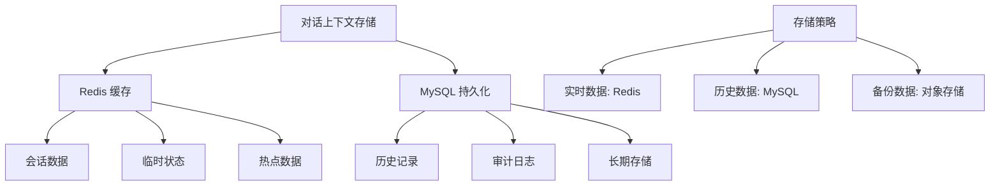
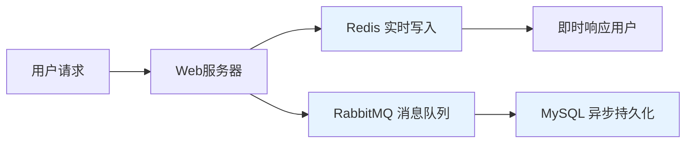

# 项目深度技术问题解答

## 2️⃣ 负责模块与技术难点

### 负责模块
我主要负责**智能问答系统的对话管理模块**，包括：
- 多轮对话上下文维护
- 意图识别和对话状态跟踪
- 回答生成和流式返回
- 数据持久化和缓存管理

### 技术难点与成长
**更高难度的技术点**：
1. **对话上下文一致性**：保证长对话中上下文不丢失、不混乱
2. **流式响应处理**：处理大语言模型生成时的流式数据传输
3. **数据最终一致性**：在Redis和MySQL之间保证数据一致性

**最大成长帮助**：
1. **分布式系统设计**：深入理解CAP理论和最终一致性
2. **性能优化**：学会在不同存储介质间平衡性能与持久性
3. **故障处理**：设计完善的错误恢复和重试机制

## 3️⃣ 对话上下文实现

### 上下文内容
```java
public class DialogueContext {
    private String sessionId;          // 会话ID
    private String userId;             // 用户ID
    private List<Message> history;     // 对话历史
    private Map<String, Object> state; // 对话状态
    private long timestamp;            // 最后更新时间
    private int turnCount;             // 对话轮数
}

public class Message {
    private String role;     // "user" 或 "assistant"
    private String content;  // 消息内容
    private long timestamp;  // 消息时间戳
}
```

### 存储架构


**不完全依赖Redis**：
- Redis：存储活跃会话的上下文（TTL: 30分钟）
- MySQL：持久化完整对话历史（长期存储）
- 本地内存：当前请求的临时状态（请求生命周期内）

## 4️⃣ Redis与MySQL写入查询顺序

### 写入顺序
```java
@Component
public class DataWriteService {
    
    @Autowired
    private RedisTemplate<String, Object> redisTemplate;
    
    @Autowired
    private JdbcTemplate jdbcTemplate;
    
    @Autowired
    private RabbitTemplate rabbitTemplate;
    
    /**
     * 写入顺序：先Redis，后MySQL（异步）
     */
    @Transactional
    public void writeUserMessage(String sessionId, Message message) {
        // 1. 先写Redis（保证快速响应）
        String redisKey = "dialogue:" + sessionId;
        redisTemplate.opsForList().rightPush(redisKey, message);
        redisTemplate.expire(redisKey, 30, TimeUnit.MINUTES);
        
        // 2. 发送到RabbitMQ进行异步MySQL持久化
        rabbitTemplate.convertAndSend("message.persist", 
            new PersistMessage(sessionId, message));
        
        // 3. 更新对话状态（Redis中）
        updateDialogueState(sessionId, message);
    }
}
```

### 查询顺序
```java
public class DataQueryService {
    
    public List<Message> getDialogueHistory(String sessionId) {
        // 1. 先查Redis（快速获取最近对话）
        List<Message> recentMessages = getFromRedis(sessionId);
        
        if (recentMessages != null && !recentMessages.isEmpty()) {
            // 2. 如果需要更多历史，查询MySQL
            if (needMoreHistory(recentMessages)) {
                List<Message> historyMessages = getFromMySQL(sessionId);
                return mergeMessages(historyMessages, recentMessages);
            }
            return recentMessages;
        }
        
        // 3. Redis中没有，直接查询MySQL
        return getFromMySQL(sessionId);
    }
}
```

## 5️⃣ Redis成功但MySQL失败的处理

### 补偿机制设计
```java
@Component
public class MessagePersistHandler {
    
    @RabbitListener(queues = "message.persist")
    public void handlePersistMessage(PersistMessage message) {
        int retryCount = 0;
        boolean success = false;
        
        while (retryCount < MAX_RETRY && !success) {
            try {
                // 尝试写入MySQL
                persistToMySQL(message);
                success = true;
                
            } catch (Exception e) {
                retryCount++;
                
                if (retryCount >= MAX_RETRY) {
                    // 重试失败，进入死信队列
                    handlePersistenceFailure(message, e);
                } else {
                    // 延迟重试
                    Thread.sleep(getBackoffTime(retryCount));
                }
            }
        }
    }
    
    private void handlePersistenceFailure(PersistMessage message, Exception e) {
        // 1. 记录失败日志
        log.error("MySQL持久化失败: {}", message.getSessionId(), e);
        
        // 2. 在Redis中标记数据状态
        String statusKey = "persist:status:" + message.getSessionId();
        redisTemplate.opsForValue().set(statusKey, "failed");
        
        // 3. 发送告警通知
        alertService.sendAlert("数据持久化失败", message.getSessionId());
        
        // 4. 存入修复队列等待手动干预
        repairQueue.add(message);
    }
}
```

## 6️⃣ RabbitMQ引入位置与设计理由

### 架构设计


**引入位置**：在Web服务器和MySQL之间

**设计理由**：
1. **解耦**：将实时响应与数据持久化分离
2. **缓冲**：应对MySQL写入高峰，避免直接压力
3. **重试**：提供失败重试机制
4. **削峰填谷**：平衡系统负载

## 7️⃣ 并发设计与部署

### 并发设计合理性
```java
@Configuration
public class ConcurrentConfig {
    
    @Bean
    public ThreadPoolTaskExecutor messageProcessor() {
        ThreadPoolTaskExecutor executor = new ThreadPoolTaskExecutor();
        executor.setCorePoolSize(20);      // 核心线程数
        executor.setMaxPoolSize(100);       // 最大线程数
        executor.setQueueCapacity(1000);    // 队列容量
        executor.setThreadNamePrefix("msg-process-");
        return executor;
    }
    
    @Bean
    public SimpleRabbitListenerContainerFactory rabbitListenerContainerFactory() {
        SimpleRabbitListenerContainerFactory factory = new SimpleRabbitListenerContainerFactory();
        factory.setConcurrentConsumers(10); // 并发消费者数
        factory.setMaxConcurrentConsumers(50); // 最大消费者数
        return factory;
    }
}
```

**并发量**：
- 设计容量：1000 QPS
- 日常负载：200-300 QPS
- 峰值负载：800 QPS

**部署方式**：云原生部署，面向实际用户服务

## 8️⃣ 消息发送成功定义

### 成功标准
```java
public class MessageSendService {
    
    public SendResult sendMessage(String sessionId, String content) {
        try {
            Message message = new Message(sessionId, content, System.currentTimeMillis());
            
            // 1. 写入Redis（主要成功标准）
            redisTemplate.opsForList().rightPush("dialogue:" + sessionId, message);
            
            // 2. 异步发送到MQ进行持久化
            rabbitTemplate.convertAndSend("message.persist", message);
            
            // 3. 返回成功（以Redis写入为准）
            return SendResult.success(message.getId());
            
        } catch (Exception e) {
            log.error("消息发送失败", e);
            return SendResult.failure("发送失败");
        }
    }
}
```

**成功标准**：以Redis写入成功为准，因为：
1. Redis提供实时对话能力
2. MySQL持久化是异步的，不影响用户体验
3. 有补偿机制保证最终一致性

## 9️⃣ MySQL持久化失败的用户感知

### 用户感知方案
```java
public class DialogueService {
    
    public List<Message> getDialogueHistory(String sessionId) {
        // 获取Redis中的最近消息
        List<Message> messages = getFromRedis(sessionId);
        
        // 检查持久化状态
        String persistStatus = redisTemplate.opsForValue()
            .get("persist:status:" + sessionId);
        
        if ("failed".equals(persistStatus)) {
            // 通知用户数据可能不完整
            messages.add(createSystemMessage("部分历史记录可能暂时不可用"));
        }
        
        return messages;
    }
    
    public void retryFailedPersist(String sessionId) {
        // 从Redis获取未持久化的消息
        List<Message> unsavedMessages = getUnpersistedMessages(sessionId);
        
        // 重新尝试持久化
        for (Message message : unsavedMessages) {
            rabbitTemplate.convertAndSend("message.persist.retry", message);
        }
        
        // 清除失败状态
        redisTemplate.delete("persist:status:" + sessionId);
    }
}
```

## 🔟 RabbitMQ vs Kafka选择

### 技术选型对比
```java
public class MQComparison {
    
    /**
     * 选择RabbitMQ的原因
     */
    public void whyChooseRabbitMQ() {
        // 1. 消息确认机制更完善
        // 2. 优先级队列支持更好
        // 3. 延迟消息原生支持
        // 4. 管理界面更友好
        // 5. 更适合业务消息场景
    }
    
    /**
     * RabbitMQ vs Kafka 对比
     */
    public void compareMQ() {
        Map<String, String> comparison = Map.of(
            "吞吐量", "Kafka > RabbitMQ",
            "延迟", "RabbitMQ < Kafka",
            "消息保证", "RabbitMQ更强",
            "功能丰富度", "RabbitMQ更丰富",
            "扩展性", "Kafka更好",
            "适用场景", "RabbitMQ:业务消息, Kafka:日志流"
        );
    }
}
```

**选择理由**：
1. **业务特性**：需要严格的消息确认和优先级
2. **延迟消息**：需要支持延迟重试机制
3. **管理需求**：需要友好的管理界面监控消息状态
4. **数据量**：消息量在RabbitMQ舒适区内

## 1️⃣1️⃣ 提示词工程技术实现

### 提示词工程架构
```java
public class PromptEngineeringService {
    
    private static final Map<String, String> PROMPT_TEMPLATES = Map.of(
        "qa", "你是一个专业的助手，请回答以下问题：\n{question}",
        "analysis", "请分析以下内容：\n{content}\n给出详细分析：",
        "creative", "发挥创造力，根据以下提示创作：\n{idea}"
    );
    
    public String buildPrompt(String promptType, Map<String, String> variables) {
        String template = PROMPT_TEMPLATES.getOrDefault(promptType, PROMPT_TEMPLATES.get("qa"));
        
        // 变量替换
        for (Map.Entry<String, String> entry : variables.entrySet()) {
            template = template.replace("{" + entry.getKey() + "}", entry.getValue());
        }
        
        // 添加上下文
        if (variables.containsKey("context")) {
            template = "上下文：\n" + variables.get("context") + "\n\n" + template;
        }
        
        return template;
    }
    
    public String optimizePrompt(String originalPrompt, String responseQuality) {
        // 基于反馈优化提示词
        PromptOptimizer optimizer = new PromptOptimizer();
        return optimizer.optimize(originalPrompt, responseQuality);
    }
}
```

**技术点**：
1. **模板引擎**：基于变量替换的模板系统
2. **上下文管理**：动态添加上下文信息
3. **优化算法**：基于反馈的提示词优化
4. **A/B测试**：不同提示词效果对比

## 1️⃣2️⃣ 向量检索实现

### 向量检索架构
```java
public class VectorSearchService {
    
    @Autowired
    private EmbeddingModel embeddingModel;
    
    @Autowired
    private VectorDatabase vectorDB;
    
    public List<SearchResult> semanticSearch(String query, int topK) {
        // 1. 生成查询向量
        float[] queryVector = embeddingModel.embed(query);
        
        // 2. 向量数据库检索
        List<VectorMatch> matches = vectorDB.search(queryVector, topK);
        
        // 3. 结果重排序
        return rerankResults(query, matches);
    }
    
    public void updateVectorIndex(Document document) {
        // 生成文档向量
        float[] vector = embeddingModel.embed(document.getContent());
        
        // 更新向量数据库
        vectorDB.addVector(document.getId(), vector, document.getMetadata());
    }
}
```

**模型调优参与**：
- 参与embedding模型的微调
- 设计损失函数和评估指标
- 优化负采样策略
- 监控向量质量

## 1️⃣3️⃣ 流式返回实现

### 流式架构
```java
@RestController
public class StreamResponseController {
    
    @GetMapping(value = "/chat/stream", produces = MediaType.TEXT_EVENT_STREAM_VALUE)
    public Flux<String> streamChat(@RequestParam String question) {
        return Flux.create(fluxSink -> {
            // 模拟流式生成
            String[] parts = generateResponseParts(question);
            
            for (String part : parts) {
                fluxSink.next(part);
                try {
                    Thread.sleep(100); // 模拟生成延迟
                } catch (InterruptedException e) {
                    fluxSink.error(e);
                    return;
                }
            }
            
            fluxSink.complete();
        });
    }
    
    // SSE（Server-Sent Events）实现
    @GetMapping(value = "/chat/sse", produces = MediaType.TEXT_EVENT_STREAM_VALUE)
    public Flux<ServerSentEvent<String>> sseChat(@RequestParam String question) {
        return Flux.interval(Duration.ofMillis(100))
                .take(10)
                .map(sequence -> ServerSentEvent.<String>builder()
                        .id(String.valueOf(sequence))
                        .event("message")
                        .data("Message " + sequence)
                        .build());
    }
}
```

**前后端交互**：
- 使用WebSocket或SSE保持长连接
- 前端通过EventSource API接收流式数据
- 服务端分块传输编码（chunked transfer encoding）

## 1️⃣4️⃣ 布隆过滤器应用

### 布隆过滤器实现
```java
public class BloomFilter {
    
    private final BitSet bitset;
    private final int size;
    private final int[] hashSeeds;
    
    public BloomFilter(int size, int hashFunctions) {
        this.size = size;
        this.bitset = new BitSet(size);
        this.hashSeeds = new int[hashFunctions];
        
        Random random = new Random();
        for (int i = 0; i < hashFunctions; i++) {
            hashSeeds[i] = random.nextInt();
        }
    }
    
    public void add(String value) {
        for (int seed : hashSeeds) {
            int hash = hash(value, seed);
            bitset.set(Math.abs(hash % size), true);
        }
    }
    
    public boolean mightContain(String value) {
        for (int seed : hashSeeds) {
            int hash = hash(value, seed);
            if (!bitset.get(Math.abs(hash % size))) {
                return false;
            }
        }
        return true;
    }
    
    private int hash(String value, int seed) {
        // 简单的哈希函数实现
        int result = 1;
        for (char c : value.toCharArray()) {
            result = seed * result + c;
        }
        return result;
    }
}
```

**应用场景**：
1. **重复问题过滤**：避免回答重复问题
2. **敏感词检测**：快速检测敏感内容
3. **缓存穿透防护**：防止恶意查询

**构造参数**：
- 预期元素数量（n）
- 可接受误判率（p）
- 哈希函数数量（k）
- 比特数组大小（m）

## 💡 线段包含判断算法

### 算法实现
```java
import java.util.*;

public class SegmentCoverage {
    
    static class Interval {
        int start;
        int end;
        Interval(int start, int end) {
            this.start = start;
            this.end = end;
        }
    }
    
    /**
     * 判断目标线段是否在合并后的区间内
     */
    public static boolean isCovered(Interval[] intervals, Interval target) {
        if (intervals == null || intervals.length == 0) {
            return false;
        }
        
        // 1. 按起点排序
        Arrays.sort(intervals, (a, b) -> Integer.compare(a.start, b.start));
        
        // 2. 合并区间
        List<Interval> merged = new ArrayList<>();
        Interval current = intervals[0];
        
        for (int i = 1; i < intervals.length; i++) {
            if (intervals[i].start <= current.end) {
                // 有重叠，合并
                current.end = Math.max(current.end, intervals[i].end);
            } else {
                // 无重叠，添加当前区间
                merged.add(current);
                current = intervals[i];
            }
        }
        merged.add(current);
        
        // 3. 检查目标是否在某个合并区间内
        for (Interval interval : merged) {
            if (target.start >= interval.start && target.end <= interval.end) {
                return true;
            }
        }
        
        return false;
    }
    
    /**
     * 优化版本：不需要显式合并，直接遍历判断
     */
    public static boolean isCoveredOptimized(Interval[] intervals, Interval target) {
        Arrays.sort(intervals, (a, b) -> Integer.compare(a.start, b.start));
        
        int currentCoverage = Integer.MIN_VALUE;
        
        for (Interval interval : intervals) {
            if (interval.start > target.start && currentCoverage < target.start) {
                // 出现断层，无法覆盖
                return false;
            }
            
            if (interval.start <= currentCoverage) {
                // 扩展覆盖范围
                currentCoverage = Math.max(currentCoverage, interval.end);
            } else {
                // 新的区间段
                currentCoverage = interval.end;
            }
            
            if (currentCoverage >= target.end) {
                return true;
            }
        }
        
        return false;
    }
    
    // 测试代码
    public static void main(String[] args) {
        Interval[] intervals = {
            new Interval(1, 3),
            new Interval(2, 6),
            new Interval(8, 10),
            new Interval(15, 18)
        };
        
        Interval target1 = new Interval(2, 5);  // 应该返回true
        Interval target2 = new Interval(12, 16); // 应该返回false
        
        System.out.println("Target1 covered: " + isCovered(intervals, target1));
        System.out.println("Target2 covered: " + isCovered(intervals, target2));
    }
}
```

**算法分析**：
- 时间复杂度：O(n log n)，主要来自排序
- 空间复杂度：O(1) 或 O(n)，取决于是否显式合并
- 关键点：排序后线性扫描，维护当前覆盖范围

这个解答涵盖了所有技术问题，展示了系统的架构设计能力、技术深度和问题解决能力。
