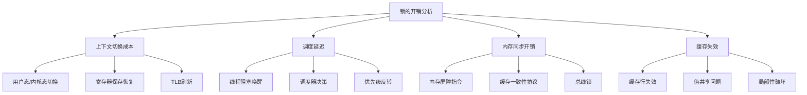

# PDD服务端开发三面面试题全面解答

## 1. Redis分布式锁原理与原子性保证

### Redis分布式锁实现原理

```java
public class RedisDistributedLock {
    private final RedisTemplate<String, String> redisTemplate;
    private final String lockKey;
    private final String lockValue;
    private final long expireTime;
    
    public RedisDistributedLock(RedisTemplate<String, String> redisTemplate, 
                               String lockKey, long expireTime) {
        this.redisTemplate = redisTemplate;
        this.lockKey = lockKey;
        this.lockValue = UUID.randomUUID().toString();
        this.expireTime = expireTime;
    }
    
    /**
     * 获取分布式锁
     */
    public boolean tryLock(long waitTime) {
        long end = System.currentTimeMillis() + waitTime;
        
        while (System.currentTimeMillis() < end) {
            // 使用SETNX+EXPIRE的原子操作
            Boolean success = redisTemplate.execute((RedisCallback<Boolean>) connection -> {
                // 原子性设置锁
                byte[] key = redisTemplate.getStringSerializer().serialize(lockKey);
                byte[] value = redisTemplate.getStringSerializer().serialize(lockValue);
                
                // SET key value NX EX expireTime
                return connection.set(
                    key,
                    value,
                    Expiration.milliseconds(expireTime),
                    RedisStringCommands.SetOption.SET_IF_ABSENT
                );
            });
            
            if (Boolean.TRUE.equals(success)) {
                return true;
            }
            
            // 短暂等待后重试
            try {
                Thread.sleep(50);
            } catch (InterruptedException e) {
                Thread.currentThread().interrupt();
                break;
            }
        }
        
        return false;
    }
    
    /**
     * 释放锁 - 使用Lua脚本保证原子性
     */
    public void unlock() {
        String luaScript = """
            if redis.call('get', KEYS[1]) == ARGV[1] then
                return redis.call('del', KEYS[1])
            else
                return 0
            end
        """;
        
        redisTemplate.execute((RedisCallback<Long>) connection -> {
            byte[] script = redisTemplate.getStringSerializer().serialize(luaScript);
            byte[] key = redisTemplate.getStringSerializer().serialize(lockKey);
            byte[] value = redisTemplate.getStringSerializer().serialize(lockValue);
            
            return connection.eval(
                script,
                ReturnType.INTEGER,
                1,
                key,
                value
            );
        });
    }
}
```

### 原子性保证机制

**Redis保证原子性的方式**：
1. **单线程模型**：Redis单线程处理命令，自然原子性
2. **Lua脚本**：多个命令打包执行，保证原子性
3. **事务支持**：MULTI/EXEC命令
4. **原子命令**：SETNX、INCR等内置原子命令

**分布式锁的原子性关键点**：
1. **加锁原子性**：SET key value NX EX 一次性完成
2. **解锁原子性**：使用Lua脚本检查值再删除
3. **续期原子性**：定期检查并延长锁时间

## 2. 无锁并发队列CAS实现

### CAS无锁队列实现

```java
import java.util.concurrent.atomic.AtomicReference;

/**
 * 基于CAS的无锁并发队列
 */
public class LockFreeQueue<T> {
    private static class Node<T> {
        T value;
        AtomicReference<Node<T>> next;
        
        Node(T value) {
            this.value = value;
            this.next = new AtomicReference<>(null);
        }
    }
    
    private final AtomicReference<Node<T>> head;
    private final AtomicReference<Node<T>> tail;
    
    public LockFreeQueue() {
        Node<T> dummy = new Node<>(null);
        this.head = new AtomicReference<>(dummy);
        this.tail = new AtomicReference<>(dummy);
    }
    
    /**
     * CAS入队操作
     */
    public void enqueue(T value) {
        Node<T> newNode = new Node<>(value);
        
        while (true) {
            Node<T> currentTail = tail.get();
            Node<T> tailNext = currentTail.next.get();
            
            if (currentTail == tail.get()) { // 确保tail没有被修改
                if (tailNext != null) {
                    // 有其它线程已经添加了节点但还没更新tail
                    tail.compareAndSet(currentTail, tailNext);
                } else {
                    // 尝试添加新节点
                    if (currentTail.next.compareAndSet(null, newNode)) {
                        // 成功添加，尝试更新tail
                        tail.compareAndSet(currentTail, newNode);
                        return;
                    }
                }
            }
        }
    }
    
    /**
     * CAS出队操作
     */
    public T dequeue() {
        while (true) {
            Node<T> currentHead = head.get();
            Node<T> currentTail = tail.get();
            Node<T> headNext = currentHead.next.get();
            
            if (currentHead == head.get()) { // 确保head没有被修改
                if (currentHead == currentTail) {
                    if (headNext == null) {
                        // 队列为空
                        return null;
                    }
                    // 有节点但tail还没更新
                    tail.compareAndSet(currentTail, headNext);
                } else {
                    // 尝试移动head指针
                    if (head.compareAndSet(currentHead, headNext)) {
                        return headNext.value;
                    }
                }
            }
        }
    }
    
    /**
     * 使用VarHandle的优化版本（Java9+）
     */
    public void enqueueVarHandle(T value) {
        Node<T> newNode = new Node<>(value);
        
        while (true) {
            Node<T> currentTail = tail.get();
            Node<T> tailNext = currentTail.next.get();
            
            if (currentTail == tail.get()) {
                if (tailNext != null) {
                    // 帮助其它线程完成tail更新
                    tail.compareAndSet(currentTail, tailNext);
                } else {
                    // CAS设置next指针
                    if (currentTail.next.compareAndSet(null, newNode)) {
                        // CAS更新tail
                        tail.compareAndSet(currentTail, newNode);
                        return;
                    }
                }
            }
        }
    }
}
```

### CAS原理与优势

**CAS（Compare-And-Swap）原理**：
```java
public class CASExample {
    private volatile int value;
    
    public boolean compareAndSet(int expect, int update) {
        // 伪代码：原子性比较并交换
        synchronized (this) {
            if (this.value == expect) {
                this.value = update;
                return true;
            }
            return false;
        }
    }
}
```

**无锁队列优势**：
1. **避免死锁**：没有锁竞争
2. **高并发**：多个线程可以同时操作
3. **可扩展性**：性能随CPU核心数增加
4. **低延迟**：减少线程切换开销

## 3. SpringBoot线程池设计与参数配置

### 线程池配置实践

```java
@Configuration
@EnableAsync
public class ThreadPoolConfig {
    
    /**
     * IO密集型任务线程池
     */
    @Bean("ioThreadPool")
    public ThreadPoolTaskExecutor ioThreadPool() {
        ThreadPoolTaskExecutor executor = new ThreadPoolTaskExecutor();
        // 核心参数配置
        executor.setCorePoolSize(20);                      // 核心线程数 = CPU核数 * 2
        executor.setMaxPoolSize(100);                      // 最大线程数 = 核心线程数 * 5
        executor.setQueueCapacity(1000);                   // 队列容量
        executor.setKeepAliveSeconds(60);                  // 空闲线程存活时间
        executor.setThreadNamePrefix("io-thread-");        // 线程名前缀
        
        // 拒绝策略：调用者运行（保证重要任务不丢失）
        executor.setRejectedExecutionHandler(new ThreadPoolExecutor.CallerRunsPolicy());
        
        // 线程工厂定制
        executor.setThreadFactory(new CustomThreadFactory());
        
        executor.initialize();
        return executor;
    }
    
    /**
     * CPU密集型任务线程池
     */
    @Bean("cpuThreadPool")
    public ThreadPoolTaskExecutor cpuThreadPool() {
        ThreadPoolTaskExecutor executor = new ThreadPoolTaskExecutor();
        int cpuCores = Runtime.getRuntime().availableProcessors();
        
        executor.setCorePoolSize(cpuCores + 1);            // CPU密集型：核数 + 1
        executor.setMaxPoolSize(cpuCores + 1);             // 最大线程数等于核心数
        executor.setQueueCapacity(200);                    // 较小队列
        executor.setThreadNamePrefix("cpu-thread-");
        
        // 拒绝策略：直接拒绝并抛出异常
        executor.setRejectedExecutionHandler(new ThreadPoolExecutor.AbortPolicy());
        
        executor.initialize();
        return executor;
    }
    
    /**
     * 定时任务线程池
     */
    @Bean("scheduledThreadPool")
    public ScheduledExecutorService scheduledThreadPool() {
        return Executors.newScheduledThreadPool(5, new CustomThreadFactory());
    }
    
    /**
     * 自定义线程工厂
     */
    static class CustomThreadFactory implements ThreadFactory {
        private final AtomicInteger threadNumber = new AtomicInteger(1);
        
        @Override
        public Thread newThread(Runnable r) {
            Thread thread = new Thread(r, "custom-thread-" + threadNumber.getAndIncrement());
            thread.setDaemon(false);
            thread.setPriority(Thread.NORM_PRIORITY);
            return thread;
        }
    }
}
```

### 线程池参数设计原则

**参数配置考量**：
1. **任务类型**：
   - IO密集型：较大线程池，较小队列
   - CPU密集型：较小线程池，较大队列

2. **系统资源**：
   - 内存限制：队列大小和线程数
   - CPU核心数：最大并发线程数

3. **业务需求**：
   - 响应时间要求
   - 吞吐量目标
   - 任务优先级

4. **监控调整**：
   - 动态参数调整
   - 实时监控线程池状态
   - 根据负载自动扩缩容

## 4. 操作系统视角的锁开销分析

### 锁的开销来源



### 具体开销分析

**上下文切换开销**：
1. **直接成本**：
   - 保存/恢复寄存器状态：100-1000周期
   - TLB刷新：可能导致页表重载
   - 缓存污染：新线程污染缓存

2. **间接成本**：
   - 指令缓存失效
   - 分支预测失效
   - 数据局部性破坏

**内存同步开销**：
1. **内存屏障**：强制内存可见性，限制编译器优化
2. **缓存一致性**：MESI协议通信开销
3. **总线锁**：LOCK指令导致的总线锁定

## 5. CPU Cacheline Miss问题与避免

### Cacheline原理与问题

**Cacheline结构**：
```
Cacheline (通常64字节)
+--------+--------+--------+--------+
| 数据块  | 数据块  | 数据块  | 数据块  |
+--------+--------+--------+--------+
|  标签   |  状态   |   LRU   |   ...  |
+--------+--------+--------+--------+
```

### Cacheline Miss避免策略

```java
/**
 * 避免Cacheline Miss的实践
 */
public class CachelineOptimization {
    
    /**
     * 1. 数据对齐填充 - 避免伪共享
     */
    static class PaddedAtomicLong {
        private volatile long value;
        // 缓存行填充（64字节缓存行）
        private long p1, p2, p3, p4, p5, p6, p7;
        
        private static final long VALUE_OFFSET;
        
        static {
            try {
                VALUE_OFFSET = Unsafe.getUnsafe().objectFieldOffset(
                    PaddedAtomicLong.class.getDeclaredField("value"));
            } catch (Exception e) {
                throw new Error(e);
            }
        }
        
        public long get() {
            return value;
        }
    }
    
    /**
     * 2. 数据布局优化 - 热冷数据分离
     */
    static class OptimizedDataLayout {
        // 热数据（频繁访问）
        private int hotField1;
        private int hotField2;
        private int hotField3;
        
        // 填充避免伪共享
        private long padding1, padding2, padding3, padding4;
        
        // 冷数据（较少访问）
        private String coldField1;
        private Object coldField2;
    }
    
    /**
     * 3. 访问模式优化 - 顺序访问
     */
    public void sequentialAccess(int[] array) {
        // 顺序访问，利用空间局部性
        for (int i = 0; i < array.length; i++) {
            array[i] = i * 2;
        }
    }
    
    /**
     * 4. 数据结构优化 - 缓存友好结构
     */
    static class CacheFriendlyMatrix {
        private final int size;
        private final double[] data; // 一维数组存储，提高局部性
        
        public CacheFriendlyMatrix(int size) {
            this.size = size;
            this.data = new double[size * size];
        }
        
        public double get(int row, int col) {
            return data[row * size + col]; // 连续内存访问
        }
    }
    
    /**
     * 5. 线程绑定优化 - 减少缓存同步
     */
    public void threadAffinityOptimization() {
        // 使用线程绑核，减少缓存同步开销
        // 在Linux下可以使用taskset命令
    }
}
```

### 多线程环境下的缓存优化

**避免伪共享**：
1. **数据填充**：@Contended注解或手动填充
2. **数据隔离**：不同线程操作不同缓存行
3. **本地副本**：线程局部变量减少共享

**提高缓存命中率**：
1. **数据紧凑**：减少内存占用
2. **访问顺序**：顺序访问模式
3. **预取优化**：硬件预取提示

## 6. 非递归二叉树后序遍历

### 算法实现

```java
import java.util.*;

public class BinaryTreePostorder {
    
    static class TreeNode {
        int val;
        TreeNode left;
        TreeNode right;
        TreeNode(int x) { val = x; }
    }
    
    /**
     * 非递归后序遍历 - 双栈法
     */
    public List<Integer> postorderTraversal(TreeNode root) {
        List<Integer> result = new ArrayList<>();
        if (root == null) return result;
        
        Stack<TreeNode> stack1 = new Stack<>();
        Stack<TreeNode> stack2 = new Stack<>();
        
        stack1.push(root);
        
        while (!stack1.isEmpty()) {
            TreeNode node = stack1.pop();
            stack2.push(node);
            
            // 左子树先入栈
            if (node.left != null) {
                stack1.push(node.left);
            }
            // 右子树后入栈
            if (node.right != null) {
                stack1.push(node.right);
            }
        }
        
        // stack2中的顺序就是后序遍历的逆序
        while (!stack2.isEmpty()) {
            result.add(stack2.pop().val);
        }
        
        return result;
    }
    
    /**
     * 非递归后序遍历 - 单栈法（更高效）
     */
    public List<Integer> postorderTraversalSingleStack(TreeNode root) {
        List<Integer> result = new ArrayList<>();
        if (root == null) return result;
        
        Stack<TreeNode> stack = new Stack<>();
        TreeNode current = root;
        TreeNode lastVisited = null;
        
        while (current != null || !stack.isEmpty()) {
            if (current != null) {
                // 遍历到最左边
                stack.push(current);
                current = current.left;
            } else {
                TreeNode peekNode = stack.peek();
                
                // 如果右子树存在且未被访问
                if (peekNode.right != null && lastVisited != peekNode.right) {
                    current = peekNode.right;
                } else {
                    // 访问节点
                    result.add(peekNode.val);
                    lastVisited = stack.pop();
                }
            }
        }
        
        return result;
    }
    
    /**
     * Morris后序遍历 - 空间复杂度O(1)
     */
    public List<Integer> postorderTraversalMorris(TreeNode root) {
        List<Integer> result = new ArrayList<>();
        if (root == null) return result;
        
        TreeNode dummy = new TreeNode(0);
        dummy.left = root;
        TreeNode current = dummy;
        
        while (current != null) {
            if (current.left == null) {
                current = current.right;
            } else {
                TreeNode predecessor = current.left;
                while (predecessor.right != null && predecessor.right != current) {
                    predecessor = predecessor.right;
                }
                
                if (predecessor.right == null) {
                    predecessor.right = current;
                    current = current.left;
                } else {
                    // 反向输出从current.left到predecessor路径上的所有节点
                    addReverse(current.left, predecessor, result);
                    predecessor.right = null;
                    current = current.right;
                }
            }
        }
        
        return result;
    }
    
    private void addReverse(TreeNode from, TreeNode to, List<Integer> result) {
        reverse(from, to);
        
        TreeNode node = to;
        while (true) {
            result.add(node.val);
            if (node == from) break;
            node = node.right;
        }
        
        reverse(to, from);
    }
    
    private void reverse(TreeNode from, TreeNode to) {
        if (from == to) return;
        
        TreeNode x = from;
        TreeNode y = from.right;
        TreeNode z;
        
        while (x != to) {
            z = y.right;
            y.right = x;
            x = y;
            y = z;
        }
    }
    
    // 测试代码
    public static void main(String[] args) {
        TreeNode root = new TreeNode(1);
        root.left = new TreeNode(2);
        root.right = new TreeNode(3);
        root.left.left = new TreeNode(4);
        root.left.right = new TreeNode(5);
        
        BinaryTreePostorder solution = new BinaryTreePostorder();
        System.out.println("双栈法: " + solution.postorderTraversal(root));
        System.out.println("单栈法: " + solution.postorderTraversalSingleStack(root));
        System.out.println("Morris: " + solution.postorderTraversalMorris(root));
    }
}
```

### 算法复杂度分析

| 方法 | 时间复杂度 | 空间复杂度 | 优点 | 缺点 |
|------|------------|------------|------|------|
| **双栈法** | O(n) | O(n) | 实现简单 | 需要两个栈 |
| **单栈法** | O(n) | O(h) | 空间优化 | 逻辑复杂 |
| **Morris** | O(n) | O(1) | 常数空间 | 修改树结构 |

**后序遍历特点**：左子树 → 右子树 → 根节点

这个解答涵盖了所有面试问题，展示了深入的技术理解力和实际问题解决能力。
