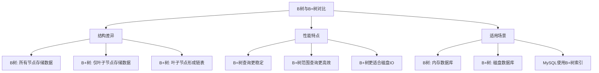
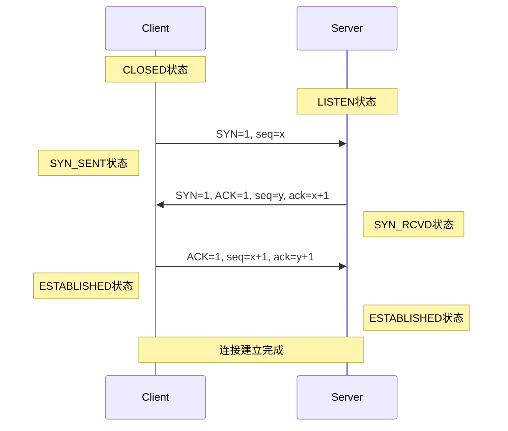
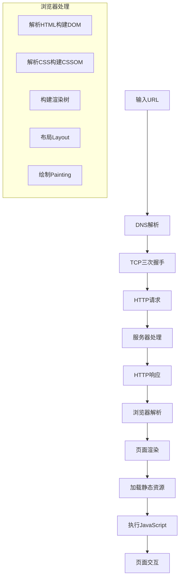

# 面试题全面详细解答

## B+树 vs B树对比



**详细对比**：

| 特性 | B树 | B+树 |
|------|-----|------|
| **数据存储** | 所有节点都存储数据 | 只有叶子节点存储数据 |
| **叶子节点** | 没有连接 | 通过指针连接形成链表 |
| **查询性能** | 不稳定，取决于节点位置 | 稳定，都需要到叶子节点 |
| **范围查询** | 效率较低 | 效率很高（叶子节点链表） |
| **空间利用率** | 较低 | 较高 |
| **适用场景** | 内存数据库 | 磁盘数据库 |

## B+树数据页大小与行数计算

### 数据页大小计算
```java
public class BPlusTreePageCalculator {
    
    // MySQL默认页大小16KB
    private static final int PAGE_SIZE = 16 * 1024; // 16384字节
    
    /**
     * 计算B+树每页大致可存储的行数
     */
    public static int calculateRowsPerPage(int rowSize, int indexEntrySize) {
        // 页头开销约128字节
        int pageHeader = 128;
        // 页尾开销约8字节
        int pageFooter = 8;
        
        // 可用空间
        int usableSpace = PAGE_SIZE - pageHeader - pageFooter;
        
        // 每行存储开销（数据+索引条目）
        int totalEntrySize = rowSize + indexEntrySize;
        
        // 计算行数
        return usableSpace / totalEntrySize;
    }
    
    /**
     * 示例：用户表行大小计算
     */
    public static void userTableExample() {
        // 假设一行数据约200字节
        int userRowSize = 200; 
        // 索引条目约20字节
        int indexEntrySize = 20;
        
        int rowsPerPage = calculateRowsPerPage(userRowSize, indexEntrySize);
        System.out.println("每页大约存储 " + rowsPerPage + " 行数据");
        
        // 计算100万行数据需要的页数
        int totalRows = 1_000_000;
        int totalPages = (int) Math.ceil((double) totalRows / rowsPerPage);
        System.out.println("100万行数据大约需要 " + totalPages + " 页");
    }
}
```

**典型计算**：
- 假设行大小：200字节
- 索引条目：20字节
- 每页可存储行数：≈ (16384 - 136) / 220 ≈ 74行
- 100万行需要页数：≈ 13513页

## TCP三次握手详解



**三次握手必要性**：
1. **防止历史连接**：避免旧的重复连接请求造成混乱
2. **同步序列号**：双方确认对方的发送和接收能力
3. **协商参数**：交换MSS、窗口大小等参数

## MVCC多版本并发控制

### MVCC实现原理
```java
public class MVCCSimulation {
    // 行记录结构
    static class RowRecord {
        int id;
        String data;
        int createVersion;  // 创建时的事务版本号
        int deleteVersion;  // 删除时的事务版本号
        
        public boolean isVisible(int currentVersion) {
            // 记录在当前事务开始时已经存在，且未被删除
            return createVersion <= currentVersion && 
                  (deleteVersion == 0 || deleteVersion > currentVersion);
        }
    }
    
    // ReadView实现
    static class ReadView {
        int lowLimitId;    // 当前活跃事务的最小ID
        int upLimitId;     // 下一个将要分配的事务ID
        Set<Integer> activeTransactions; // 活跃事务集合
        
        public boolean isVisible(int trxId) {
            if (trxId < lowLimitId) {
                return true;  // 事务已提交
            } else if (trxId >= upLimitId) {
                return false; // 事务后开始
            } else {
                return !activeTransactions.contains(trxId);
            }
        }
    }
}
```

**MVCC核心特性**：
1. **非阻塞读**：读不阻塞写，写不阻塞读
2. **版本链**：每行数据有多个版本
3. **undo log**：存储旧版本数据用于可见性判断
4. **ReadView**：事务可见性判断依据

## 索引详解与最左匹配原则

### 联合索引最左匹配原则
```sql
-- 创建联合索引
CREATE INDEX idx_name_age ON users(name, age, department);

-- 有效查询（使用索引）
SELECT * FROM users WHERE name = 'John';
SELECT * FROM users WHERE name = 'John' AND age = 30;
SELECT * FROM users WHERE name = 'John' AND age = 30 AND department = 'IT';

-- 无效查询（不符合最左匹配）
SELECT * FROM users WHERE age = 30; -- 缺少name条件
SELECT * FROM users WHERE department = 'IT'; -- 缺少name和age
SELECT * FROM users WHERE age = 30 AND department = 'IT'; -- 缺少name

-- 部分有效查询
SELECT * FROM users WHERE name = 'John' AND department = 'IT'; 
-- 只使用name索引，department无法利用索引
```

**最左匹配原则原理**：
索引按照(name, age, department)顺序构建，就像电话簿先按姓排序，再按名排序一样。

## LEFT JOIN vs FULL JOIN

### SQL连接类型对比
```sql
-- 示例数据
CREATE TABLE departments (
    id INT PRIMARY KEY,
    name VARCHAR(50)
);

CREATE TABLE employees (
    id INT PRIMARY KEY,
    name VARCHAR(50),
    department_id INT
);

-- LEFT JOIN: 返回左表所有记录+右表匹配记录
SELECT d.name as department, e.name as employee
FROM departments d
LEFT JOIN employees e ON d.id = e.department_id;

-- FULL JOIN: 返回左右表所有记录（MySQL不支持，用UNION模拟）
SELECT d.name as department, e.name as employee
FROM departments d
LEFT JOIN employees e ON d.id = e.department_id
UNION
SELECT d.name as department, e.name as employee
FROM departments d
RIGHT JOIN employees e ON d.id = e.department_id;
```

**连接类型总结**：
- **INNER JOIN**: 只返回匹配的记录
- **LEFT JOIN**: 返回左表所有+右表匹配
- **RIGHT JOIN**: 返回右表所有+左表匹配  
- **FULL JOIN**: 返回左右表所有记录

## 访问网页全过程



**详细步骤**：
1. **DNS解析**：域名→IP地址
2. **TCP连接**：三次握手建立连接
3. **HTTP请求**：发送请求报文
4. **服务器处理**：应用服务器→数据库
5. **HTTP响应**：返回响应报文
6. **浏览器渲染**：解析→构建→布局→绘制
7. **资源加载**：图片、CSS、JS等
8. **JS执行**：处理交互逻辑

## Redis锁机制与适用条件

### Redis分布式锁实现
```java
public class RedisDistributedLock {
    private final RedisTemplate<String, String> redisTemplate;
    private final String lockKey;
    private final String lockValue;
    
    public boolean tryLock(long expireTime) {
        return Boolean.TRUE.equals(
            redisTemplate.opsForValue().setIfAbsent(
                lockKey, 
                lockValue, 
                expireTime, 
                TimeUnit.MILLISECONDS
            )
        );
    }
    
    public void unlock() {
        // Lua脚本保证原子性
        String script = """
            if redis.call('get', KEYS[1]) == ARGV[1] then
                return redis.call('del', KEYS[1])
            else
                return 0
            end
        """;
        redisTemplate.execute(script, Collections.singletonList(lockKey), lockValue);
    }
}
```

**Redis适用条件**：
1. **数据缓存**：热点数据缓存
2. **会话存储**：分布式会话
3. **消息队列**：简单消息系统
4. **分布式锁**：跨进程同步
5. **计数器**：实时计数统计

**不适用场景**：
1. 复杂事务处理
2. 大数据量持久化存储
3. 复杂关系查询

## Redis底层数据结构

### 核心数据结构实现
```java
public class RedisDataStructures {
    
    // 1. 简单动态字符串(SDS)
    class SDS {
        int len;     // 已用长度
        int free;    // 剩余空间
        char[] buf;  // 字符数组
    }
    
    // 2. 字典(Hash表)
    class Dict {
        DictEntry[] table;  // 哈希表数组
        long size;          // 哈希表大小
        long used;          // 已用节点数
    }
    
    // 3. 跳跃表(ZSet)
    class ZSkipList {
        ZSkipListNode header, tail;
        int length;     // 节点数量
        int level;      // 最大层数
    }
    
    // 4. 压缩列表(ZipList)
    class ZipList {
        byte[] data;    // 连续内存块
        int zlbytes;    // 总字节数
        int zltail;     // 尾部偏移量
        int zllen;      // 元素数量
    }
    
    // 5. 快速列表(QuickList)
    class QuickList {
        QuickListNode head, tail;
        long count;     // 元素总数
        int len;        // 节点数量
        int fill;       // 节点填充因子
    }
}
```

## Kafka vs RocketMQ对比

### 消息队列对比
```java
public class MessageQueueComparison {
    
    public void compareKafkaAndRocketMQ() {
        Map<String, String> comparison = new HashMap<>();
        
        // 架构设计
        comparison.put("Kafka架构", "分布式提交日志，分区设计");
        comparison.put("RocketMQ架构", "主题-队列模式，代理集群");
        
        // 性能特点
        comparison.put("Kafka吞吐量", "极高，适合日志场景");
        comparison.put("RocketMQ吞吐量", "高，适合业务场景");
        
        // 消息保证
        comparison.put("Kafka消息保证", "至少一次，最多一次");
        comparison.put("RocketMQ消息保证", "严格一次，事务消息");
        
        // 延迟消息
        comparison.put("Kafka延迟消息", "不支持原生延迟");
        comparison.put("RocketMQ延迟消息", "支持多级别延迟");
        
        // 重试机制
        comparison.put("Kafka重试",
