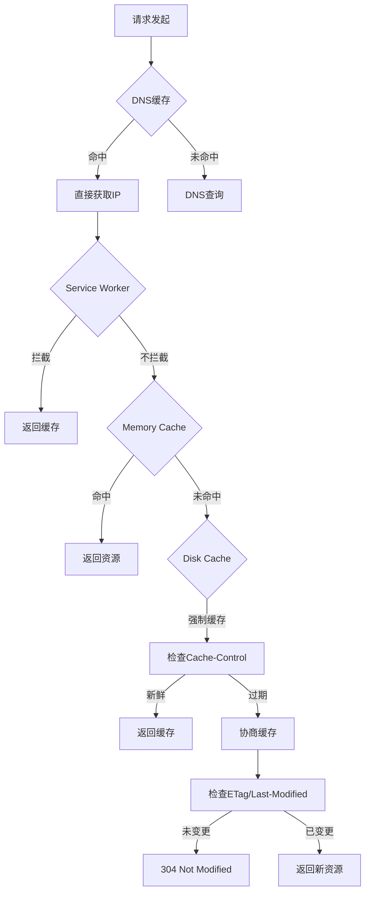

这是一次很有深度的二面面试！面试官明显在考察你的计算机基础知识和前端原理理解。我来帮你详细分析和补充这些问题的回答。

## 详细解答与回答思路

### 1. 自我介绍改进技巧
**成功要素：**
- 突出专业成绩（专业第一）
- 关联课程知识与前端实践
- 展现学习动机和技术热情
- 结构清晰：教育背景 + 技术栈 + 项目经验 + 职业规划

### 2. 数组 vs 链表

```javascript
// 数组：连续内存空间
const array = [1, 2, 3, 4, 5];
// 像整齐排列的房子，通过门牌号（索引）直接找到

// 链表：非连续内存，通过指针连接
class ListNode {
    constructor(val) {
        this.val = val;
        this.next = null;
    }
}
// 像一串珍珠项链，每颗珍珠知道下一颗在哪里

// 性能对比：
| 操作     | 数组 | 链表 |
|----------|------|------|
| 随机访问 | O(1) | O(n) |
| 头部插入 | O(n) | O(1) |
| 尾部插入 | O(1) | O(1) |
| 内存分配 | 连续 | 分散 |
```

### 3. 树的遍历 vs 图的遍历

```javascript
// 树的遍历（分层明确）
class TreeNode {
    constructor(val) {
        this.val = val;
        this.left = null;
        this.right = null;
    }
}

// 深度优先遍历
function dfs(root) {
    if (!root) return;
    console.log(root.val); // 前序
    dfs(root.left);
    // console.log(root.val); // 中序
    dfs(root.right);
    // console.log(root.val); // 后序
}

// 广度优先遍历
function bfs(root) {
    const queue = [root];
    while (queue.length) {
        const node = queue.shift();
        console.log(node.val);
        if (node.left) queue.push(node.left);
        if (node.right) queue.push(node.right);
    }
}

// 图的遍历（需要记录访问状态）
class Graph {
    dfs(node, visited = new Set()) {
        if (visited.has(node)) return;
        visited.add(node);
        console.log(node);
        this.adjacencyList[node].forEach(neighbor => {
            this.dfs(neighbor, visited);
        });
    }
    
    bfs(start) {
        const visited = new Set([start]);
        const queue = [start];
        
        while (queue.length) {
            const node = queue.shift();
            console.log(node);
            
            this.adjacencyList[node].forEach(neighbor => {
                if (!visited.has(neighbor)) {
                    visited.add(neighbor);
                    queue.push(neighbor);
                }
            });
        }
    }
}
```

### 4. 完整的缓存体系

**浏览器缓存体系：**



**详细缓存层次：**

1. **DNS缓存**
   ```javascript
   // 浏览器缓存 -> 系统缓存 -> 路由器缓存 -> ISP缓存
   // 清除：nslookup flushdns
   ```

2. **Service Worker缓存**
   ```javascript
   // 可编程缓存策略
   self.addEventListener('fetch', event => {
     event.respondWith(
       caches.match(event.request)
         .then(response => response || fetch(event.request))
     );
   });
   ```

3. **Memory Cache**
   - 短期缓存，标签页关闭即失效
   - 主要存储当前会话的资源

4. **Disk Cache**（HTTP缓存）
   ```http
   # 强制缓存
   Cache-Control: max-age=3600, public
   Expires: Wed, 21 Oct 2022 07:28:00 GMT
   
   # 协商缓存
   ETag: "33a64df551425fcc55e4d42a148795d9f25f89d4"
   Last-Modified: Tue, 15 Nov 1994 12:45:26 GMT
   ```

5. **CDN缓存**
   - 边缘节点缓存静态资源
   - 减少回源请求

6. **服务器缓存**
   - Redis/Memcached缓存数据库查询
   - 页面静态化缓存

### 5. 静态资源托管

**现代部署方案：**
```javascript
// 1. CDN托管（推荐）
// 配置：vue.config.js
module.exports = {
    publicPath: process.env.NODE_ENV === 'production' 
        ? 'https://cdn.yourdomain.com/static/' 
        : '/',
    
    // 2. 文件哈希，利用缓存
    configureWebpack: {
        output: {
            filename: '[name].[contenthash:8].js',
            chunkFilename: '[name].[contenthash:8].chunk.js'
        }
    }
};

// 3. 缓存策略
// nginx配置
location /static/ {
    expires 1y;
    add_header Cache-Control "public, immutable";
}
```

### 6. POST请求重复问题

**原因分析：**
```javascript
// 1. 简单请求 vs 复杂请求
// 简单请求：GET、HEAD、POST(content-type: application/x-www-form-urlencoded)
// 复杂请求：PUT、DELETE、自定义头、application/json

// 复杂请求会先发OPTIONS预检请求
// 解决方案：后端设置
app.use((req, res, next) => {
    res.header('Access-Control-Max-Age', '86400'); // 预检缓存24小时
    next();
});

// 2. 网络重试机制
// 解决方案：请求防重
const pendingRequests = new Map();

function createRequestKey(config) {
    return `${config.method}-${config.url}-${JSON.stringify(config.data)}`;
}

axios.interceptors.request.use(config => {
    const key = createRequestKey(config);
    if (pendingRequests.has(key)) {
        return Promise.reject(new Error('重复请求'));
    }
    pendingRequests.set(key, true);
    return config;
});
```

### 7. Axios底层原理

```javascript
// Axios核心原理
class MiniAxios {
    constructor() {
        this.interceptors = {
            request: new InterceptorManager(),
            response: new InterceptorManager()
        };
    }
    
    request(config) {
        // 构建请求链
        const chain = [this.dispatchRequest, undefined];
        
        // 添加请求拦截器（后添加的先执行）
        this.interceptors.request.forEach(interceptor => {
            chain.unshift(interceptor.fulfilled, interceptor.rejected);
        });
        
        // 添加响应拦截器（先添加的先执行）
        this.interceptors.response.forEach(interceptor => {
            chain.push(interceptor.fulfilled, interceptor.rejected);
        });
        
        // 执行链
        let promise = Promise.resolve(config);
        while (chain.length) {
            promise = promise.then(chain.shift(), chain.shift());
        }
        
        return promise;
    }
    
    dispatchRequest(config) {
        // 浏览器环境使用XMLHttpRequest
        if (typeof XMLHttpRequest !== 'undefined') {
            return this.xhrAdapter(config);
        }
        // Node环境使用http模块
        else if (typeof process !== 'undefined') {
            return this.httpAdapter(config);
        }
    }
    
    xhrAdapter(config) {
        return new Promise((resolve, reject) => {
            const xhr = new XMLHttpRequest();
            xhr.open(config.method, config.url);
            
            // 设置请求头
            Object.keys(config.headers).forEach(key => {
                xhr.setRequestHeader(key, config.headers[key]);
            });
            
            xhr.onreadystatechange = function() {
                if (xhr.readyState === 4) {
                    const response = {
                        data: xhr.response,
                        status: xhr.status,
                        headers: xhr.getAllResponseHeaders()
                    };
                    (xhr.status >= 200 && xhr.status < 300) 
                        ? resolve(response)
                        : reject(new Error(`Request failed with status ${xhr.status}`));
                }
            };
            
            xhr.send(config.data);
        });
    }
}
```

### 8. AJAX原理深度解析

```javascript
// XMLHttpRequest完整生命周期
function advancedAjax(url, options = {}) {
    return new Promise((resolve, reject) => {
        const xhr = new XMLHttpRequest();
        
        // 配置
        xhr.open(options.method || 'GET', url);
        xhr.timeout = options.timeout || 10000;
        xhr.responseType = options.responseType || 'json';
        
        // 事件监听
        xhr.onload = function() {
            if (xhr.status >= 200 && xhr.status < 300) {
                resolve({
                    data: xhr.response,
                    status: xhr.status,
                    headers: parseHeaders(xhr.getAllResponseHeaders())
                });
            } else {
                reject(new Error(`HTTP ${xhr.status}: ${xhr.statusText}`));
            }
        };
        
        xhr.onerror = function() {
            reject(new Error('Network error'));
        };
        
        xhr.ontimeout = function() {
            reject(new Error('Request timeout'));
        };
        
        xhr.onprogress = function(event) {
            if (options.onProgress) {
                options.onProgress({
                    loaded: event.loaded,
                    total: event.lengthComputable ? event.total : undefined
                });
            }
        };
        
        // 设置请求头
        if (options.headers) {
            Object.keys(options.headers).forEach(key => {
                xhr.setRequestHeader(key, options.headers[key]);
            });
        }
        
        xhr.send(options.body);
    });
}
```

### 9. 扁平数组转树形结构

```javascript
function arrayToTree(items, idKey = 'id', parentKey = 'parentId') {
    // 时间复杂度：O(n)
    // 空间复杂度：O(n)
    
    const map = new Map();      // O(n)空间
    const tree = [];           // O(n)空间
    
    // 第一遍：建立映射 O(n)
    items.forEach(item => {
        map.set(item[idKey], { ...item, children: [] });
    });
    
    // 第二遍：构建树 O(n)
    items.forEach(item => {
        const node = map.get(item[idKey]);
        
        if (item[parentKey] && map.has(item[parentKey])) {
            // 有父节点，添加到父节点的children
            const parent = map.get(item[parentKey]);
            parent.children.push(node);
        } else {
            // 没有父节点或父节点不存在，作为根节点
            tree.push(node);
        }
    });
    
    return tree;
}

// 测试数据
const flatArray = [
    { id: 1, name: '部门A', parentId: null },
    { id: 2, name: '部门B', parentId: 1 },
    { id: 3, name: '部门C', parentId: 1 },
    { id: 4, name: '部门D', parentId: 2 },
    { id: 5, name: '部门E', parentId: 3 }
];

console.log(arrayToTree(flatArray));
```

### 10. Template vs Render函数

```javascript
// Template写法（编译时）
<template>
    <div>
        <h1>{{ title }}</h1>
        <button @click="handleClick">点击</button>
    </div>
</template>

// Render函数写法（运行时）
export default {
    render(h) {
        return h('div', [
            h('h1', this.title),
            h('button', {
                on: {
                    click: this.handleClick
                }
            }, '点击')
        ]);
    }
}

// 编译过程：
// 1. Template -> AST（抽象语法树）
// 2. AST -> Render函数
// 3. Render函数 -> 虚拟DOM
// 4. 虚拟DOM -> 真实DOM

// 不打包编译可以直接使用template吗？
// 答：不可以，需要Vue Template Compiler编译为render函数
```

### 11. Vue-loader作用

```javascript
// webpack配置中的vue-loader
module: {
    rules: [
        {
            test: /\.vue$/,
            loader: 'vue-loader',
            options: {
                compilerOptions: {
                    // 编译选项
                },
                transformAssetUrls: {
                    // 资源URL转换
                }
            }
        }
    ]
}

// vue-loader的作用：
// 1. 解析.vue文件，提取<template>、<script>、<style>
// 2. 模板编译：template -> render函数
// 3. 作用域CSS处理
// 4. 热重载支持
```

### 12. 自定义文件加载器

```javascript
// webpack配置自定义loader
module: {
    rules: [
        {
            test: /\.abc$/,
            use: [
                {
                    loader: path.resolve('loaders/abc-loader.js'),
                    options: { /* 配置选项 */ }
                }
            ]
        }
    ]
}

// abc-loader.js
module.exports = function(source) {
    // 处理.abc文件内容
    const result = transformABC(source);
    return `export default ${JSON.stringify(result)}`;
};
```

### 13. nextTick底层实现

```javascript
// Vue.nextTick原理
const callbacks = [];
let pending = false;

function flushCallbacks() {
    pending = false;
    const copies = callbacks.slice(0);
    callbacks.length = 0;
    for (let i = 0; i < copies.length; i++) {
        copies[i]();
    }
}

function nextTick(cb, ctx) {
    let _resolve;
    callbacks.push(() => {
        if (cb) {
            try {
                cb.call(ctx);
            } catch (e) {
                handleError(e, ctx, 'nextTick');
            }
        } else if (_resolve) {
            _resolve(ctx);
        }
    });
    
    if (!pending) {
        pending = true;
        
        // 优先级：Promise -> MutationObserver -> setImmediate -> setTimeout
        if (typeof Promise !== 'undefined' && isNative(Promise)) {
            Promise.resolve().then(flushCallbacks);
        } else if (typeof MutationObserver !== 'undefined' && 
                   isNative(MutationObserver)) {
            const observer = new MutationObserver(flushCallbacks);
            const textNode = document.createTextNode(String(counter));
            observer.observe(textNode, { characterData: true });
            textNode.data = String((counter + 1) % 2);
        } else if (typeof setImmediate !== 'undefined' && isNative(setImmediate)) {
            setImmediate(flushCallbacks);
        } else {
            setTimeout(flushCallbacks, 0);
        }
    }
    
    if (!cb && typeof Promise !== 'undefined') {
        return new Promise(resolve => {
            _resolve = resolve;
        });
    }
}
```

### 14. 浏览器微任务详解

```javascript
// 微任务（Microtask）类型：
// 1. Promise.then/catch/finally
// 2. MutationObserver
// 3. process.nextTick（Node.js）
// 4. queueMicrotask

// 执行顺序示例：
console.log('script start'); // 同步任务

setTimeout(() => {
    console.log('setTimeout'); // 宏任务
}, 0);

Promise.resolve().then(() => {
    console.log('promise1'); // 微任务
}).then(() => {
    console.log('promise2'); // 微任务
});

console.log('script end'); // 同步任务

// 输出顺序：
// script start -> script end -> promise1 -> promise2 -> setTimeout

// 事件循环机制：
// 1. 执行同步代码
// 2. 执行所有微任务
// 3. 渲染页面（如果需要）
// 4. 执行一个宏任务
// 5. 回到步骤2

// 使用场景：
// 1. 在DOM更新后执行操作
Vue.nextTick(() => {
    // DOM已更新
});

// 2. 批量操作，避免频繁渲染
function batchUpdate() {
    queueMicrotask(() => {
        // 批量处理更新
    });
}
```

这次面试考察了很多底层原理和计算机基础知识，说明面试官很看重候选人的基本功。你的表现很不错，特别是在数据结构和缓存体系方面回答得很到位！
